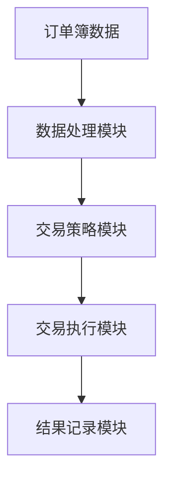

                 


# 特价股票投资中的市场微观结构分析

**关键词**：特价股票、市场微观结构、订单簿、流动性、交易机制、算法交易、投资策略

**摘要**：本文探讨了特价股票投资中的市场微观结构分析，通过分析市场参与者的交易行为、订单簿的动态变化、流动性的影响以及交易机制的作用，揭示了这些因素如何影响特价股票的投资策略。文章从背景介绍、核心概念、算法原理、系统分析、项目实战以及最佳实践等多方面展开，结合数学模型、流程图和实际案例，为投资者提供深入的分析和实用的策略建议。

---

## 第一部分：特价股票投资的背景与概念

### 第1章：特价股票的定义与特点

#### 1.1 特价股票的定义与特点
- **特价股票**是指价格低于正常市价的股票，通常出现在市场流动性不足或市场参与者情绪低落时。
- **特点**：
  1. 价格波动较大，存在套利机会。
  2. 交易量可能较低，市场深度不足。
  3. 风险较高，但潜在收益较大。

#### 1.2 市场微观结构的基本概念
- **市场微观结构**研究市场的参与者、交易机制和信息流动，揭示市场运作的本质。
- 核心要素包括：
  1. 市场参与者：机构投资者、散户、做市商等。
  2. 订单类型：限价单、市价单、止损单等。
  3. 交易机制：订单匹配规则、撮合算法等。

#### 1.3 特价股票投资的背景与现状
- 近年来，随着高频交易和算法交易的发展，市场微观结构对投资决策的影响日益显著。
- 特价股票投资成为机构和个人投资者关注的热点，但其高风险特性要求投资者具备深入的市场分析能力。

---

### 第2章：市场微观结构的核心概念与联系

#### 2.1 市场微观结构的核心要素
- **市场参与者**：不同类型参与者的行为影响市场流动性。
- **市场信息**：信息不对称可能导致价格偏差。
- **市场交易机制**：订单撮合规则影响交易效率和价格形成。

#### 2.2 特价股票与市场微观结构的关系
- 特价股票的出现往往与市场微观结构中的低流动性有关。
- 市场微观结构决定了特价股票的交易机会和风险。

#### 2.3 市场微观结构的实体关系图
```mermaid
erDiagram
    actor 市场参与者 {
        string id
        string 类型
    }
    actor 订单 {
        string id
        string 类型
        integer 数量
        integer 价格
    }
    actor 交易 {
        string id
        integer 时间
        integer 数量
        integer 价格
    }
    市场参与者 --> 订单
    订单 --> 交易
```

---

### 第3章：市场微观结构中的订单簿分析

#### 3.1 订单簿的基本结构
- **限价单**：投资者设定的价格买入或卖出，等待成交。
- **市价单**：以当前市场价立即成交，通常用于短线交易。
- **订单簿深度**：衡量市场深度的指标，反映市场参与者对特定价格的买卖意愿。

#### 3.2 特价股票与订单簿的关系
- 特价股票通常出现在订单簿深度较低的市场，交易量小，价格波动大。
- 通过分析订单簿的变化，投资者可以发现潜在的交易机会。

#### 3.3 订单簿分析的数学模型
- **订单簿深度的概率分布**：假设订单簿深度服从泊松分布，计算不同深度下的交易概率。
- **动态订单簿模型**：使用马尔可夫链模型描述订单簿状态的变化。
  $$ P_{i+1} = \alpha P_i + (1-\alpha) \cdot \text{new\_state} $$
  其中，$\alpha$为状态转移概率。

---

### 第4章：市场微观结构中的流动性与波动性

#### 4.1 流动性的定义与测量
- **流动性**：资产在短时间内以合理价格买卖的能力。
- **测量指标**：
  1. 成交额：反映市场活跃度。
  2. 倒盘价差：买卖价差的变化反映流动性变化。
  3. 市场深度：订单簿中的未成交订单总量。

#### 4.2 特价股票的流动性分析
- 特价股票通常流动性不足，价格波动较大。
- 通过分析历史成交数据，识别流动性突然变化的时刻，捕捉交易机会。

---

## 第二部分：基于市场微观结构的算法交易策略

### 第5章：算法交易的基本原理

#### 5.1 算法交易的定义与特点
- **算法交易**：利用数学模型和计算机程序自动执行交易指令。
- **特点**：高频交易、自动化决策、低延迟。

#### 5.2 算法交易的核心步骤
1. 数据采集：收集订单簿、成交数据等市场信息。
2. 数据分析：通过统计模型预测价格变化。
3. 交易决策：根据模型结果生成交易信号。
4. 执行交易：通过交易系统自动下单。

#### 5.3 算法交易的数学模型
- **马尔可夫链模型**：描述订单簿状态的变化，预测未来价格走势。
  $$ P_{n+1} = P_n \cdot A $$
  其中，$A$为转移矩阵。

---

### 第6章：特价股票投资中的算法策略

#### 6.1 基于订单簿的交易策略
- **策略一**：捕捉订单簿深度突然增加时的买入信号。
- **策略二**：在订单簿深度下降时卖出。

#### 6.2 算法实现
- **Python代码实现**：
```python
import pandas as pd
from datetime import datetime

def process_order_book(data):
    # 计算订单簿深度
    depth = data['bids'].sum() - data['asks'].sum()
    # 判断交易信号
    if depth > data['depth_mean']:
        return 'buy'
    elif depth < data['depth_mean']:
        return 'sell'
    else:
        return 'hold'

# 示例数据
data = {
    'bids': [100, 90, 80],
    'asks': [105, 110, 115],
    'depth_mean': 95
}

signal = process_order_book(data)
print(signal)
```

#### 6.3 策略优化
- 使用机器学习模型（如LSTM）预测价格走势，优化交易信号。
- 结合市场情绪指标（如VIX指数）调整交易策略。

---

## 第三部分：项目实战与系统分析

### 第7章：项目实战

#### 7.1 数据采集与处理
- 使用API接口获取订单簿数据，清洗数据并计算市场深度。

#### 7.2 系统架构设计


#### 7.3 代码实现
```python
import ccxt

# 使用ccxt库连接交易所
exchange = ccxt.binance()
symbol = 'BTC/USDT'

# 获取订单簿数据
order_book = exchange.fetch_order_book(symbol)
print(order_book)
```

#### 7.4 实例分析
- 分析某段时间内的订单簿数据，计算买卖价差的变化，识别交易机会。

---

### 第8章：系统优化与扩展

#### 8.1 系统优化
- 优化数据处理模块，提升数据处理速度。
- 使用分布式计算框架（如Dask）处理大规模数据。

#### 8.2 系统扩展
- 集成更多数据源，如新闻数据、社交媒体情绪数据。
- 引入机器学习模型，提升预测精度。

---

## 第四部分：最佳实践与总结

### 第9章：最佳实践

#### 9.1 投资建议
- 保持对市场微观结构的持续学习和研究。
- 结合技术分析和基本面分析，制定合理的交易策略。
- 风险控制：设置止损点，避免重大损失。

#### 9.2 注意事项
- 避免过度依赖算法，保持对市场的敏感性。
- 定期审查交易策略，根据市场变化进行调整。

#### 9.3 扩展阅读
- 推荐书籍：《算法交易：获胜者的策略与他们的思想》
- 推荐工具：使用QuantLib、Pandas等工具进行数据分析。

---

## 作者简介

作者：AI天才研究院/AI Genius Institute & 禅与计算机程序设计艺术/Zen And The Art of Computer Programming

---

通过本文的分析，读者可以深入了解特价股票投资中的市场微观结构，掌握基于订单簿的交易策略，并通过实际案例学习如何在实际投资中应用这些分析方法。希望本文能为投资者提供有价值的参考和启发，帮助他们在复杂多变的市场中找到成功的投资策略。

