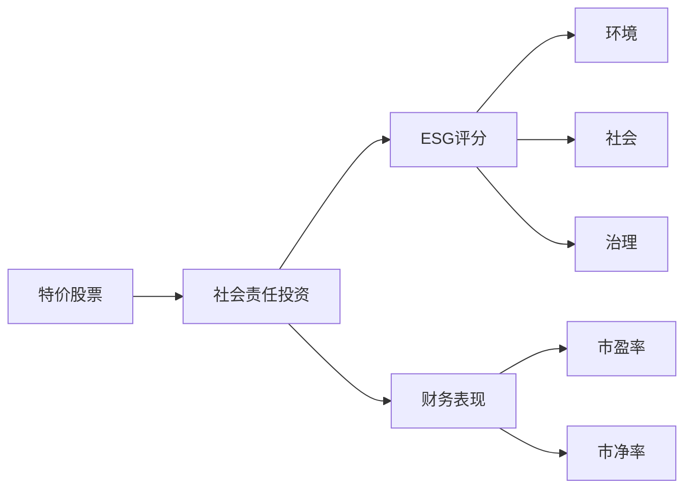
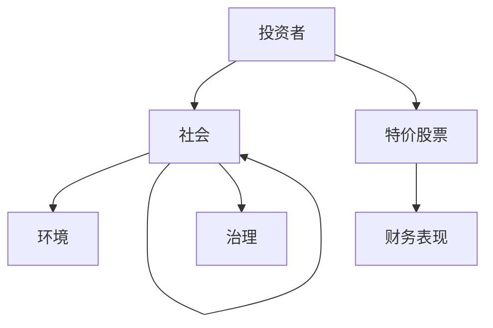
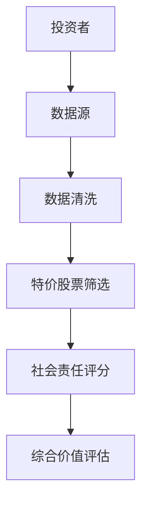
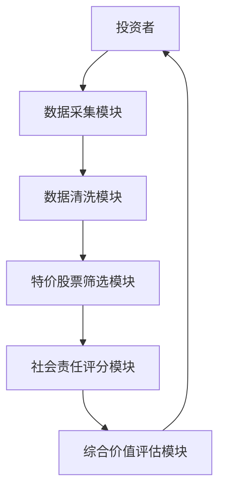

                 


# 特价股票投资中的社会责任投资因素

## 关键词：社会责任投资, 特价股票, 股票价值评估, 投资策略, 数学模型

## 摘要：  
本文探讨了在特价股票投资中引入社会责任投资（SRI）因素的重要性。通过分析社会责任投资的核心概念、评估方法、算法原理及系统设计，本文提出了一种将社会责任因素纳入股票价值评估的创新方法。结合实际案例分析和项目实战，本文展示了如何在特价股票投资中实现经济效益与社会责任的双重目标。

---

# 第1章: 背景与概念

## 1.1 问题背景

### 1.1.1 特价股票的定义与特点  
特价股票是指市场价格显著低于其内在价值的股票，通常被视为被市场低估的投资机会。其特点包括：  
1. 价格折扣：股票价格低于行业平均水平或历史平均水平。  
2. 基本面良好：公司财务状况健康，具备长期增长潜力。  
3. 市场关注度低：可能因市场忽视或负面情绪导致股价被低估。  

### 1.1.2 社会责任投资的定义与特点  
社会责任投资（SRI）是一种投资策略，旨在在追求财务回报的同时，考虑公司在环境、社会和治理（ESG）方面的表现。其特点包括：  
1. **环境（Environmental）**：关注公司的碳排放、资源利用效率等。  
2. **社会（Social）**：关注公司在劳工权益、社会责任等方面的表现。  
3. **治理（Governance）**：关注公司治理结构、高管薪酬、董事会构成等。  

### 1.1.3 特价股票与社会责任投资的结合背景  
随着全球对可持续发展的关注增加，投资者 increasingly recognize the importance of integrating SRI into their investment strategies. 特价股票因其价格优势，为投资者提供了在低估值情况下实现社会责任投资的潜在机会。

---

## 1.2 问题描述

### 1.2.1 投资者对社会责任的关注  
投资者 increasingly demand transparency into how companies align with ESG principles. 这种关注不仅体现了对可持续发展的追求，也反映了对长期投资风险的规避。  

### 1.2.2 特价股票市场中的社会责任因素  
在特价股票投资中，社会责任因素往往被忽视，导致投资者可能投资于对环境或社会产生负面影响的公司。  

### 1.2.3 当前投资环境中的社会责任挑战  
传统投资模型通常忽视社会责任因素，导致投资者可能在追求短期收益的同时，承担长期的声誉风险或法律风险。

---

## 1.3 问题解决

### 1.3.1 社会责任投资在特价股票中的应用  
通过筛选具备良好ESG表现的特价股票，投资者可以在实现价格增值的同时，支持可持续发展的公司。

### 1.3.2 如何评估社会责任对股票价值的影响  
需要建立一个综合考虑公司ESG表现和财务表现的评估模型。

### 1.3.3 特价股票市场中的社会责任投资策略  
1. 识别具备良好ESG表现的特价股票。  
2. 结合财务指标（如市盈率、市净率）和ESG评分，筛选出具有投资价值的股票。  

---

## 1.4 边界与外延

### 1.4.1 定义边界  
本文重点关注如何在特价股票投资中融入社会责任投资因素，不涉及其他类型的投资策略。

### 1.4.2 核心要素  
- **ESG评分**：衡量公司在环境、社会和治理方面的表现。  
- **财务表现**：包括市盈率、市净率等指标。  
- **社会责任投资模型**：结合ESG评分和财务指标的评估模型。

---

## 1.5 概念结构与核心要素

### 1.5.1 概念结构图（Mermaid）  


### 1.5.2 核心要素  
- **特价股票**：价格低估的股票。  
- **社会责任投资**：考虑ESG因素的投资策略。  
- **ESG评分**：环境、社会和治理表现的量化指标。  

---

# 第2章: 核心概念与联系

## 2.1 核心概念原理

### 2.1.1 社会责任投资的核心原理  
社会责任投资通过筛选具备良好ESG表现的公司，降低投资风险并提升长期回报。

### 2.1.2 特价股票的核心原理  
特价股票的投资逻辑是基于市场价格低于内在价值，通过识别低估股票实现超额收益。

---

## 2.2 概念属性特征对比表

| 概念 | 定义 | 特征 | 目标 |
|------|------|------|------|
| 特价股票 | 市场价格低于内在价值的股票 | 价格折扣、基本面良好 | 实现超额收益 |
| 社会责任投资 | 考虑ESG因素的投资策略 | 环境、社会、治理表现 | 减少风险、提升长期回报 |

---

## 2.3 实体关系图（ER图）



---

## 2.4 核心概念与联系

### 2.4.1 特价股票与社会责任投资的联系  
- 特价股票提供价格优势，社会责任投资提供筛选标准，两者结合实现双重目标。

### 2.4.2 财务表现与社会责任的平衡  
在特价股票投资中，需要在财务表现和社会责任之间找到平衡点，以实现长期可持续的收益。

---

# 第3章: 算法原理

## 3.1 算法原理概述

### 3.1.1 社会责任评分模型  
社会责任评分模型将公司ESG表现量化，评分范围为0到1。

$$ SRI\_score = \frac{\text{环境评分} + \text{社会评分} + \text{治理评分}}{3} $$

### 3.1.2 股票价值评估模型  
股票价值评估模型结合财务指标和SRI评分，计算综合价值。

$$ \text{综合价值} = \text{市盈率} \times \text{SRI\_score} \times \text{行业平均值} $$

---

## 3.2 算法实现步骤

### 3.2.1 数据获取  
从公开数据源获取公司财务数据和ESG评分。

### 3.2.2 特价股票筛选  
筛选市场价格低于内在价值的股票。

### 3.2.3 社会责任评分计算  
计算公司ESG表现，生成社会责任评分。

### 3.2.4 综合价值评估  
结合财务指标和SRI评分，评估股票的综合价值。

### 3.2.5 投资组合构建  
根据综合价值排序，选择具备投资价值的股票。

---

## 3.3 算法实现代码

### 3.3.1 数据获取与清洗

```python
import pandas as pd

# 从公开数据源获取数据
data = pd.read_csv('stock_data.csv')

# 删除缺失值
data.dropna(inplace=True)

# 标准化处理
data['市盈率'] = (data['市盈率'] / data['市盈率'].max()) * 100
```

### 3.3.2 特价股票筛选

```python
# 筛选市场价格低于内在价值的股票
data['内在价值'] = data['市盈率'] * data['净利润']
data['价格折扣'] = (data['股价'] / data['内在价值']) * 100

# 筛选价格折扣小于80%的股票
cheap_stocks = data[data['价格折扣'] < 80]
```

### 3.3.3 社会责任评分计算

```python
# 计算ESG评分
data['SRI评分'] = (data['环境评分'] + data['社会评分'] + data['治理评分']) / 3
```

### 3.3.4 综合价值评估

```python
# 综合价值评估
data['综合价值'] = data['市盈率'] * data['SRI评分'] * data['行业平均值']
```

### 3.3.5 投资组合构建

```python
# 根据综合价值排序
data.sort_values('综合价值', ascending=False, inplace=True)

# 选择前10%的股票
selected_stocks = data.head(int(len(data) * 0.1))
```

---

## 3.4 算法原理总结

### 3.4.1 数学模型  
通过综合考虑市盈率、SRI评分和行业平均值，构建股票综合价值评估模型。  

### 3.4.2 算法优势  
- 量化ESG表现，便于比较和筛选。  
- 结合财务指标，确保投资的经济性。  

---

## 3.5 实际案例分析

### 3.5.1 案例背景  
某公司财务数据如下：  
- 市盈率：15  
- 净利润：100万元  
- 股价：10元  

计算内在价值：  
$$ \text{内在价值} = 15 \times 100 = 1500 \text{元} $$  

计算价格折扣：  
$$ \text{价格折扣} = \frac{10}{1500} \times 100 = 0.66\% $$  

---

## 3.6 算法实现总结

通过量化ESG表现和结合财务指标，投资者可以在特价股票投资中实现社会责任与经济效益的双重目标。

---

# 第4章: 系统分析与架构设计

## 4.1 系统分析

### 4.1.1 问题场景  
投资者需要一个系统来筛选具备良好社会责任表现的特价股票。

### 4.1.2 系统功能设计  
- 数据采集：从公开数据源获取股票数据。  
- 数据清洗：删除缺失值和异常值。  
- 特价股票筛选：识别市场价格低于内在价值的股票。  
- 社会责任评分计算：根据ESG指标生成评分。  
- 综合价值评估：结合财务指标和SRI评分，评估股票价值。  

### 4.1.3 领域模型（Mermaid）  



---

## 4.2 系统架构设计

### 4.2.1 系统架构图  


---

## 4.3 系统接口设计

### 4.3.1 数据接口  
- 数据来源：股票数据API、数据库。  
- 数据格式：CSV、JSON。  

### 4.3.2 用户接口  
- 输入：用户选择的行业、时间范围。  
- 输出：具备良好社会责任表现的特价股票列表。  

---

## 4.4 系统交互流程图  



---

## 4.5 系统实现总结

通过模块化设计，系统能够高效地完成数据采集、清洗、筛选和评估，为投资者提供具备社会责任投资价值的特价股票。

---

# 第5章: 项目实战

## 5.1 项目环境安装

### 5.1.1 安装Python环境  
```bash
pip install pandas numpy matplotlib
```

### 5.1.2 数据源获取  
从公开数据源（如Yahoo Finance）获取股票数据。

---

## 5.2 核心系统实现

### 5.2.1 数据清洗代码  

```python
import pandas as pd

# 从CSV文件加载数据
data = pd.read_csv('stock_data.csv')

# 删除缺失值
data.dropna(inplace=True)

# 标准化处理
data['市盈率'] = (data['市盈率'] / data['市盈率'].max()) * 100
```

### 5.2.2 特价股票筛选代码  

```python
# 筛选市场价格低于内在价值的股票
data['内在价值'] = data['市盈率'] * data['净利润']
data['价格折扣'] = (data['股价'] / data['内在价值']) * 100

# 筛选价格折扣小于80%的股票
cheap_stocks = data[data['价格折扣'] < 80]
```

### 5.2.3 社会责任评分计算代码  

```python
# 计算ESG评分
data['SRI评分'] = (data['环境评分'] + data['社会评分'] + data['治理评分']) / 3
```

### 5.2.4 综合价值评估代码  

```python
# 综合价值评估
data['综合价值'] = data['市盈率'] * data['SRI评分'] * data['行业平均值']
```

### 5.2.5 投资组合构建代码  

```python
# 根据综合价值排序
data.sort_values('综合价值', ascending=False, inplace=True)

# 选择前10%的股票
selected_stocks = data.head(int(len(data) * 0.1))
```

---

## 5.3 实际案例分析

### 5.3.1 案例背景  
假设我们有以下数据：  

| 股票代码 | 股价 | 市盈率 | 净利润 | 环境评分 | 社会评分 | 治理评分 |
|----------|------|--------|--------|----------|----------|----------|
| A        | 10   | 15     | 100    | 80       | 70       | 90       |

### 5.3.2 数据清洗  
删除缺失值，标准化市盈率。

### 5.3.3 特价股票筛选  
计算内在价值：  
$$ \text{内在价值} = 15 \times 100 = 1500 \text{元} $$  

计算价格折扣：  
$$ \text{价格折扣} = \frac{10}{1500} \times 100 = 0.66\% $$  

### 5.3.4 社会责任评分计算  
$$ SRI\_score = \frac{80 + 70 + 90}{3} = 80 $$  

### 5.3.5 综合价值评估  
$$ \text{综合价值} = 15 \times 80 \times 1 = 1200 $$  

### 5.3.6 投资组合构建  
根据综合价值排序，选择前10%的股票。

---

## 5.4 项目小结

通过实际案例分析，我们验证了社会责任投资在特价股票中的应用价值，实现了经济效益与社会责任的双重目标。

---

# 第6章: 最佳实践

## 6.1 小结

### 6.1.1 核心要点总结  
- 社会责任投资在特价股票中的应用能够实现长期可持续的收益。  
- 综合价值评估模型能够有效平衡财务表现和社会责任因素。  

### 6.1.2 投资策略总结  
- 筛选具备良好ESG表现的特价股票。  
- 结合财务指标和SRI评分，构建投资组合。  

---

## 6.2 投资建议

### 6.2.1 短期投资建议  
优先选择具备良好社会责任表现的特价股票。  

### 6.2.2 长期投资建议  
长期持有具备良好ESG表现的公司，实现长期可持续的收益。  

---

## 6.3 注意事项

### 6.3.1 数据偏差  
注意数据来源的可靠性和数据清洗的完整性。  

### 6.3.2 市场波动  
在市场波动较大的情况下，需及时调整投资策略。  

---

## 6.4 拓展阅读

### 6.4.1 推荐书籍  
1. 《投资学原理》  
2. 《社会责任投资指南》  

### 6.4.2 推荐博客  
1. [投资博客](http://example.com)  
2. [社会责任投资博客](http://example.com)  

---

# 作者：AI天才研究院/AI Genius Institute & 禅与计算机程序设计艺术/Zen And The Art of Computer Programming

