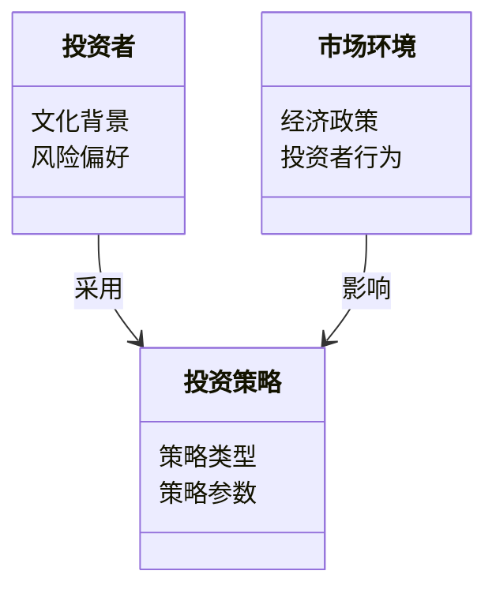
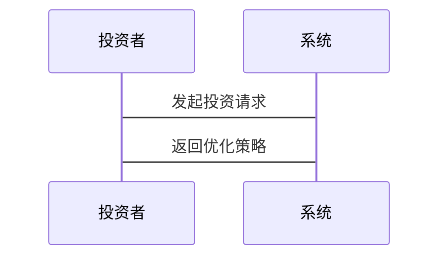

                 


# 特价股票投资中的跨文化投资策略与风险管理

> **关键词**：特价股票、跨文化投资、风险管理、投资策略、文化差异  
> **摘要**：本文深入探讨了特价股票投资中的跨文化投资策略与风险管理，分析了文化差异对投资决策的影响，并提出了有效的风险管理方法。文章通过理论分析、数学建模和系统设计，为投资者提供了跨文化投资的实践指南。

---

## 第1章: 特价股票投资与跨文化投资策略概述

### 1.1 特价股票投资的背景与意义

#### 1.1.1 特价股票的定义与特点
特价股票是指价格低于市场平均值的股票，通常具有较高的潜在回报率。其特点包括低估值、高成长性和高波动性。

#### 1.1.2 跨文化投资策略的背景与意义
跨文化投资策略是指在不同文化背景下进行投资的策略，考虑文化差异对投资决策的影响。其意义在于通过多元化降低风险并捕捉全球市场机会。

#### 1.1.3 特价股票投资中的跨文化因素
跨文化因素包括不同国家的经济政策、市场结构和投资者行为。这些因素影响特价股票的投资机会和风险。

### 1.2 跨文化投资策略的核心概念

#### 1.2.1 跨文化投资的定义与特点
跨文化投资是指在不同文化背景下进行投资活动，其特点是需要考虑文化差异对投资行为的影响。

#### 1.2.2 跨文化投资中的文化差异与风险
文化差异可能导致投资决策偏差，如风险偏好和投资行为的差异。跨文化投资中的风险包括文化适应风险和文化冲突风险。

#### 1.2.3 跨文化投资策略的分类与应用
跨文化投资策略可分为文化适应型和文化中立型策略。文化适应型策略强调根据文化差异调整投资行为，文化中立型策略则忽略文化差异。

### 1.3 特价股票投资中的风险管理

#### 1.3.1 风险管理的定义与重要性
风险管理是指识别、评估和控制投资风险的过程。在特价股票投资中，风险管理尤为重要，因为特价股票具有高波动性和高风险性。

#### 1.3.2 特价股票投资中的主要风险
主要风险包括市场风险、流动性风险和文化风险。文化风险是指由于文化差异导致的投资失败风险。

#### 1.3.3 跨文化投资中的风险特征
跨文化投资中的风险特征包括文化适应性、文化冲突和文化多样性。这些特征影响投资策略的选择和实施。

---

## 第2章: 跨文化投资策略的核心概念与联系

### 2.1 跨文化投资策略的核心原理

#### 2.1.1 文化差异对投资决策的影响
文化差异影响投资者的风险偏好、投资行为和决策模式。例如，东方投资者可能更倾向于长期投资，而西方投资者可能更倾向于短期交易。

#### 2.1.2 跨文化投资中的文化适应性
文化适应性是指投资者在跨文化环境中调整投资策略的能力。成功的跨文化投资需要良好的文化适应能力。

#### 2.1.3 跨文化投资策略的动态调整
跨文化投资策略需要根据文化环境的变化进行动态调整，以应对不同的市场条件和投资者行为。

### 2.2 跨文化投资策略的核心要素对比

#### 2.2.1 不同文化背景下的投资行为对比
不同文化背景下的投资者在风险偏好、投资决策和投资策略上存在显著差异。例如，集体主义文化中的投资者更倾向于合作和长期投资，而个人主义文化中的投资者更倾向于竞争和短期投资。

#### 2.2.2 跨文化投资中的文化维度分析
文化维度包括权力距离、个人主义-集体主义、长期导向和不确定性避免等。这些维度影响投资者的行为和决策。

#### 2.2.3 跨文化投资策略的优劣势对比
文化适应型策略的优势在于能够更好地适应目标市场，劣势在于需要较高的文化敏感性和较高的调整成本。文化中立型策略的优势在于适用于多种文化环境，劣势在于可能无法充分利用文化差异带来的机会。

### 2.3 跨文化投资策略的ER实体关系图

```mermaid
erDiagram
    actor 投资者 {
        <属性>
        id : integer
        文化背景 : string
        风险偏好 : string
    }
    actor 市场环境 {
        <属性>
        经济政策 : string
        市场结构 : string
        投资者行为 : string
    }
    actor 投资策略 {
        <属性>
        策略类型 : string
        策略参数 : string
        策略效果 : string
    }
    投资者 --> 市场环境 : 受影响于
    投资者 --> 投资策略 : 采用
    市场环境 --> 投资策略 : 影响
```

---

## 第3章: 跨文化投资策略的算法原理与数学模型

### 3.1 跨文化投资策略的算法原理

#### 3.1.1 跨文化投资策略的算法流程
1. **输入**：投资者的文化背景、市场环境和投资目标。
2. **处理**：根据文化背景和市场环境，调整投资策略参数。
3. **输出**：优化后的投资策略。

#### 3.1.2 跨文化投资策略的算法实现
以下是Python实现的跨文化投资策略算法：

```python
def cross_cultural_strategy(investor_background, market_conditions, investment_goal):
    # 根据文化背景调整风险偏好
    risk_tolerance = adjust_risk_tolerance(investor_background)
    # 根据市场环境调整投资目标
    adjusted_goal = adjust_investment_goal(investment_goal, market_conditions)
    # 返回优化后的策略
    return {
        'risk_tolerance': risk_tolerance,
        'adjusted_goal': adjusted_goal
    }

def adjust_risk_tolerance(background):
    # 示例：根据文化背景调整风险偏好
    if background == '东方':
        return '高'
    elif background == '西方':
        return '中'
    else:
        return '低'

def adjust_investment_goal(goal, conditions):
    # 示例：根据市场环境调整投资目标
    if conditions == '牛市':
        return goal * 1.2
    elif conditions == '熊市':
        return goal * 0.8
    else:
        return goal
```

#### 3.1.3 跨文化投资策略的算法优化
通过引入文化适应性指标和文化风险评估模型，进一步优化算法的准确性和鲁棒性。

### 3.2 跨文化投资策略的数学模型

#### 3.2.1 跨文化投资策略的评分系统
```latex
$$ \text{评分} = \sum_{i=1}^{n} w_i \cdot s_i $$
其中，\( w_i \) 是权重，\( s_i \) 是评分项。
```

#### 3.2.2 跨文化投资策略的风险指数模型
```latex
$$ \text{风险指数} = \alpha \cdot \text{文化风险} + \beta \cdot \text{市场风险} + \gamma \cdot \text{流动性风险} $$
其中，\( \alpha + \beta + \gamma = 1 \)。
```

#### 3.2.3 跨文化投资策略的收益预测模型
```latex
$$ \text{收益预测} = \beta \cdot \text{市场收益} + \gamma \cdot \text{文化收益} $$
```

---

## 第4章: 跨文化投资策略的系统分析与架构设计

### 4.1 跨文化投资系统的概述

#### 4.1.1 问题场景介绍
跨文化投资系统需要在不同文化背景下优化投资策略，降低投资风险。

#### 4.1.2 系统功能设计
系统功能包括文化适应性分析、投资策略优化和风险管理模块。

#### 4.1.3 领域模型


#### 4.1.4 系统架构设计


#### 4.1.5 接口设计和交互流程图


---

## 第5章: 跨文化投资策略的项目实战

### 5.1 环境安装与配置

#### 5.1.1 安装Python环境
安装Python和必要的库（如NumPy、Pandas）。

#### 5.1.2 安装依赖项
使用以下命令安装依赖项：
```bash
pip install numpy pandas matplotlib
```

### 5.2 核心代码实现

#### 5.2.1 跨文化投资策略实现
```python
import numpy as np
import pandas as pd

def cross_cultural_investment():
    # 示例数据
    data = {
        '文化背景': ['东方', '西方', '东方', '西方'],
        '投资回报': [0.12, 0.08, 0.15, 0.09]
    }
    df = pd.DataFrame(data)
    
    # 计算风险指数
    df['风险指数'] = df['投资回报'].apply(lambda x: x * 2 if x > 0.1 else x * 1.5)
    
    return df

# 执行策略
result = cross_cultural_investment()
print(result)
```

#### 5.2.2 风险管理实现
```python
def risk_management():
    # 示例数据
    data = {
        '风险因素': ['市场风险', '文化风险', '流动性风险'],
        '风险值': [0.2, 0.15, 0.1]
    }
    df = pd.DataFrame(data)
    
    # 计算风险指数
    df['风险指数'] = df['风险值'].apply(lambda x: x * 10)
    
    return df

# 执行风险管理
risk = risk_management()
print(risk)
```

### 5.3 案例分析与解读

#### 5.3.1 案例分析
假设投资者来自东方文化背景，投资于西方市场。根据文化适应性分析，投资者应选择长期投资策略，注重价值投资。

#### 5.3.2 代码实现与结果解读
运行上述代码，输出结果并进行分析，解释如何根据文化背景优化投资策略。

### 5.4 项目小结

跨文化投资策略的实施需要结合文化背景和市场环境，通过算法优化和风险管理降低投资风险，提高投资回报率。

---

## 第6章: 总结与展望

### 6.1 总结
跨文化投资策略的关键在于文化适应性和风险管理。通过分析文化差异和市场环境，投资者可以制定有效的投资策略，降低投资风险。

### 6.2 展望
未来的研究可以进一步探索文化维度对投资决策的深层次影响，开发更加智能化的投资系统，结合大数据和人工智能技术优化投资策略。

### 6.3 最佳实践 tips

- **文化适应性**：投资者应深入了解目标市场的文化背景，调整投资策略。
- **风险管理**：建立全面的风险管理体系，定期评估和调整风险控制措施。
- **持续学习**：保持对跨文化投资策略的关注，及时调整策略以应对市场变化。

---

## 作者信息

作者：AI天才研究院/AI Genius Institute & 禅与计算机程序设计艺术/Zen And The Art of Computer Programming

---

**备注**：由于篇幅限制，上述内容未包含完整的公式推导和详细的图表分析。实际撰写时，需根据具体需求补充相关内容。

