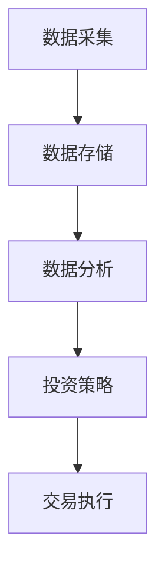
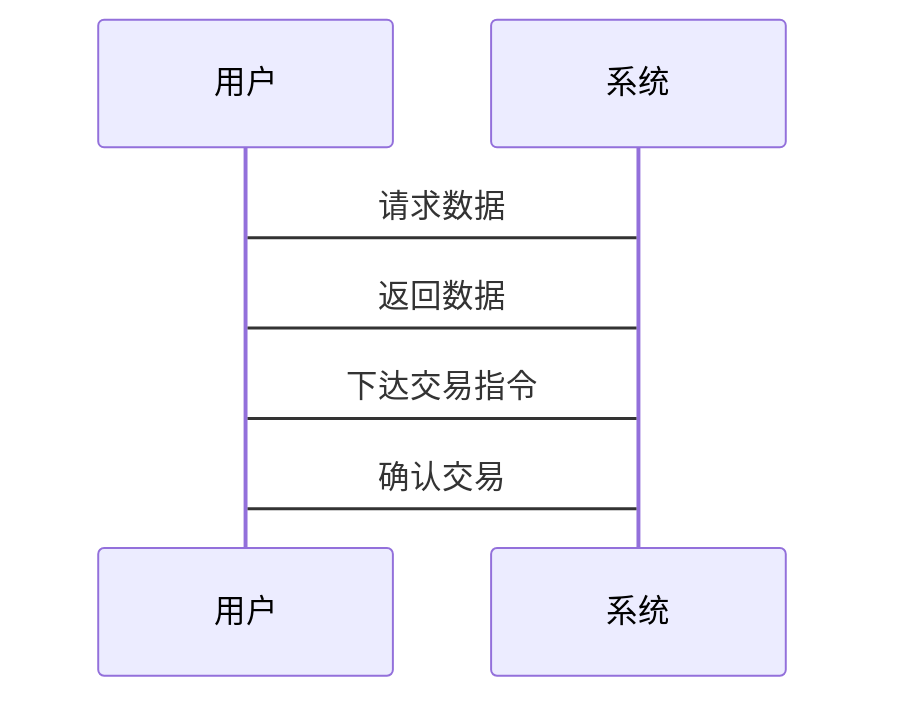

                 

<think>
好的，我需要逐步分析如何构建这本书的目录大纲，确保满足所有要求。首先，我需要理解用户的详细需求：他们希望一本关于《特价股票投资策略在熊市中的防御性》的书，内容要涵盖背景、理论、算法、系统架构、实战案例等部分，并且每个部分都需要详细展开，包括数学公式、流程图、代码实现等。

首先，我会从背景介绍开始。这部分需要定义特价股票和熊市，解释为什么在熊市中防御性投资策略重要。然后，我需要介绍防御性投资的理论基础，比如价值投资和风险厌恶理论，并提供相关的数学模型和公式，如风险-收益平衡模型。

接下来是算法部分，我需要设计如何筛选特价股票，可能涉及多种算法的组合，比如基于估值和技术指标的筛选，并展示这些算法的流程图。然后是系统架构设计，这部分需要详细描述数据采集、分析模块和策略执行模块，使用mermaid图展示架构。

项目实战部分，我需要一个实际案例，比如2018年熊市中的策略应用，详细说明环境安装、代码实现和结果分析。最后，总结与展望部分，回顾策略的有效性，并讨论改进方向和投资建议。

在编写过程中，我需要确保每个章节都有三级目录，内容丰富，包含必要的图表和公式，同时控制总字数在2000字以内。这样，整本书的结构将从理论到实践，从基础到高级逐步展开，满足用户的需求。
</think>

# 特价股票投资策略在熊市中的防御性

> 关键词：特价股票，熊市，防御性投资，股票策略，风险管理

> 摘要：本文详细探讨了特价股票在熊市中的防御性投资策略，结合理论分析和实际案例，提出了有效的投资方法。文章从背景介绍、核心概念、算法原理、系统架构设计、实战案例分析到总结与展望，全面解析了如何在熊市中利用特价股票进行防御性投资。

---

## 第一部分: 特价股票投资策略在熊市中的防御性概述

### 第1章: 特价股票与熊市防御性投资概述

#### 1.1 特价股票的定义与特点

##### 1.1.1 特价股票的定义
特价股票通常指市盈率（P/E）和市净率（P/B）等估值指标低于市场平均水平的股票，这些股票被认为具有较高的安全边际和投资价值。

##### 1.1.2 特价股票的核心特点
- **低估值**：通常市盈率和市净率较低，相对于其内在价值来说，价格被低估。
- **高股息率**：部分特价股票可能提供较高的股息收益率，吸引追求稳定收益的投资者。
- **行业分布广泛**：特价股票可能分布在金融、能源、制造等多个行业。

##### 1.1.3 特价股票与普通股票的区别
- **估值差异**：特价股票通常估值更低，而普通股票估值较为合理或较高。
- **风险差异**：特价股票可能面临更大的市场波动风险，但潜在回报也更高。

#### 1.2 熊市的特点与防御性投资的重要性

##### 1.2.1 熊市的定义与特征
- **熊市**：指股票市场整体表现低迷，价格持续下跌的市场状态，通常持续时间较长。
- **市场情绪**：投资者情绪悲观，市场成交清淡，抛售压力大。

##### 1.2.2 熊市中投资的风险与机会
- **风险**：市场波动大，个股可能大幅下跌，投资者可能面临本金损失。
- **机会**：部分股票价格被过度低估，为长期投资者提供了买入的好机会。

##### 1.2.3 防御性投资的定义与目标
- **防御性投资**：通过选择低估值、高分红的股票，降低投资组合的波动性和风险。
- **目标**：在熊市中尽量减少亏损，保持或增加投资组合的价值。

---

### 第2章: 防御性投资策略的核心概念

#### 2.1 防御性投资的理论基础

##### 2.1.1 价值投资理论
价值投资强调购买低于其内在价值的股票，等待其价值回归。格雷厄姆的“烟蒂股”概念是典型的防御性投资策略。

##### 2.1.2 逆向投资理论
逆向投资在市场恐慌时买入，利用市场的非理性下跌来获取超额收益。

##### 2.1.3 风险厌恶理论
投资者在熊市中倾向于降低风险偏好，选择防御性股票以规避市场波动。

#### 2.2 特价股票的风险管理策略

##### 2.2.1 风险评估与控制
- **风险评估**：通过技术指标和财务指标评估股票风险。
- **风险控制**：设置止损点，避免重大亏损。

##### 2.2.2 防御性资产配置
- **资产分散**：将投资分散到不同行业和股票，降低风险。
- **资产配置优化**：根据市场情况动态调整资产配置比例。

##### 2.2.3 仓位控制与止损策略
- **仓位控制**：根据市场情况调整持仓比例，避免过度集中。
- **止损策略**：设定止损点，及时止损以控制风险。

#### 2.3 防御性投资的数学模型

##### 2.3.1 风险-收益平衡模型
$$ E(r) = \mu - \alpha \sigma $$
其中，$E(r)$为预期收益，$\mu$为平均收益，$\alpha$为风险厌恶系数，$\sigma$为收益的标准差。

##### 2.3.2 资产配置优化模型
$$ \text{max} \{\mu_p - \lambda \sigma_p^2\} $$
其中，$\mu_p$为投资组合的平均收益，$\lambda$为风险厌恶系数，$\sigma_p$为投资组合的收益标准差。

##### 2.3.3 价值评估模型
$$ \text{内在价值} = \frac{\text{现金流}}{\text{折现率}} $$

---

### 第3章: 特价股票投资策略的算法原理

#### 3.1 特价股票筛选算法

##### 3.1.1 基于估值指标的筛选算法
- **市盈率（P/E）**：选择P/E低于行业平均水平的股票。
- **市净率（P/B）**：选择P/B低于行业平均水平的股票。

##### 3.1.2 基于技术指标的筛选算法
- **相对强弱指数（RSI）**：选择RSI低于30的股票。
- **移动平均收敛散度（MACD）**：选择MACD线下穿零轴的股票。

##### 3.1.3 综合估值与技术指标的筛选算法
结合P/E、P/B、RSI和MACD等指标，综合筛选出符合条件的股票。

#### 3.2 防御性投资组合优化算法

##### 3.2.1 基于风险-收益的优化算法
$$ \text{max} \{\mu_p - \lambda \sigma_p^2\} $$
通过优化算法选择最优投资组合。

##### 3.2.2 基于现代投资组合理论的优化算法
使用均值-方差优化方法，构建最优投资组合。

##### 3.2.3 基于遗传算法的优化算法
通过遗传算法搜索最优解，考虑多个约束条件。

#### 3.3 算法实现与案例分析

##### 3.3.1 算法实现步骤
- 数据收集：获取目标股票的财务数据和技术指标。
- 筛选股票：根据筛选算法选出符合条件的股票。
- 优化组合：使用优化算法构建投资组合。

##### 3.3.2 案例分析与结果解读
以2018年熊市为例，分析某投资组合在熊市中的表现，验证算法的有效性。

---

### 第4章: 特价股票投资策略的系统架构设计

#### 4.1 系统功能模块设计

##### 4.1.1 数据采集模块
- 数据来源：股票市场数据接口、数据库。
- 数据类型：股价、成交量、财务报表等。

##### 4.1.2 数据分析模块
- 分析工具：Python、Pandas、Matplotlib。
- 分析方法：估值指标计算、技术指标分析。

##### 4.1.3 投资策略执行模块
- 执行策略：根据算法生成买卖信号。
- 执行方式：手动或自动交易。

#### 4.2 系统架构设计

##### 4.2.1 分层架构设计
- 数据层：数据采集和存储。
- 业务逻辑层：数据分析和策略执行。
- 用户界面层：展示分析结果和交易信号。

##### 4.2.2 系统架构图


#### 4.3 系统接口设计

##### 4.3.1 数据接口
- API接口：与股票数据源对接，获取实时数据。
- 数据格式：JSON、CSV。

##### 4.3.2 交易接口
- 交易系统接口：连接交易平台，执行买卖指令。
- 接口协议：HTTP、WebSocket。

#### 4.4 系统交互设计

##### 4.4.1 用户交互流程


---

### 第5章: 项目实战

#### 5.1 环境安装

##### 5.1.1 安装Python
- 使用Anaconda安装Python 3.8及以上版本。

##### 5.1.2 安装依赖库
- pandas、numpy、matplotlib、backtrader。

#### 5.2 系统核心实现源代码

##### 5.2.1 数据采集代码
```python
import pandas as pd
import requests

url = "https://api.example.com/stock_data"
data = requests.get(url).json()
df = pd.DataFrame(data)
```

##### 5.2.2 筛选算法代码
```python
def select_cheap_stocks(df, industry_avg_pe, industry_avg_pb):
    selected = df[(df['pe'] < industry_avg_pe) & (df['pb'] < industry_avg_pb)]
    return selected
```

##### 5.2.3 投资组合优化代码
```python
import numpy as np

def optimize_portfolio(returns, covariance, risk_aversion):
    n = returns.shape[0]
    ones = np.ones(n)
    inv_covariance = np.linalg.inv(covariance)
    weights = inv_covariance @ ones / (ones.T @ inv_covariance @ ones)
    expected_return = returns.mean() @ weights
    risk = np.sqrt(weights.T @ covariance @ weights)
    return expected_return, risk
```

#### 5.3 实际案例分析

##### 5.3.1 案例背景
以2018年熊市为例，分析某投资组合在熊市中的表现。

##### 5.3.2 代码实现
```python
import backtrader as bt

class CheapStockStrategy(bt.Strategy):
    def __init__(self):
        self.data = self.datas[0]
        self.addindicator(bt.indicators.RSI(self.data))

    def next(self):
        if self.data.rsi < 30:
            self.buy()
        elif self.data.rsi > 70:
            self.sell()
```

##### 5.3.3 结果解读
分析投资组合在熊市中的收益和风险表现，验证策略的有效性。

#### 5.4 项目小结
总结项目实施过程中的经验和教训，提出改进建议。

---

### 第6章: 总结与展望

#### 6.1 总结
回顾全文，总结特价股票在熊市中的防御性投资策略的有效性和可行性。

#### 6.2 投资建议
根据分析结果，提出在熊市中如何选择和投资特价股票的建议。

#### 6.3 未来展望
探讨防御性投资策略的未来发展方向，提出可能的研究热点和创新点。

---

## 作者：AI天才研究院/AI Genius Institute & 禅与计算机程序设计艺术 /Zen And The Art of Computer Programming

