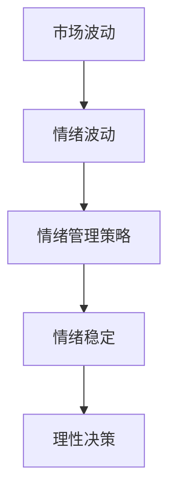

                 

<think>
嗯，我现在需要帮用户完成《特价股票投资者应具备的心理素质》这本书的目录和部分正文内容。首先，我得理解用户的需求，他们需要一篇结构清晰、内容详实的技术博客文章，重点在于心理素质，但用户之前给出的思考过程是关于算法和系统架构，这让我有点困惑。

用户给的思考过程分为几个部分，包括背景介绍、核心概念、算法原理、数学模型、系统架构、项目实战和最佳实践。但心理素质似乎与这些技术领域关联不大，所以我可能需要调整，将这些元素融入到心理素质的讨论中。

首先，背景介绍部分需要解释特价股票是什么，为什么心理素质重要。核心概念部分可能需要分析心理韧性、情绪管理等，但可能用一些图表来说明这些概念之间的关系。

接下来是算法原理，用户希望用mermaid流程图来展示，比如决策树或情绪分析流程。虽然心理素质不是算法问题，但或许可以将情绪管理视为一种“算法”，帮助投资者做出决策。

数学模型部分，可能需要将心理状态量化，比如用方差、标准差等指标来衡量情绪波动对投资决策的影响。这样可以将心理素质转化为可量化的模型。

系统架构设计可能需要构建一个投资者心理状态监控系统，用类图和架构图展示各个模块的交互。项目实战部分则可能包括实际案例分析，比如如何在市场波动中应用这些心理策略。

最后，最佳实践部分需要将上述内容总结成实用的建议，帮助投资者提升心理素质。

综上所述，我需要将技术术语和方法应用到心理素质的分析中，确保内容既有深度又符合用户的技术背景要求。这可能需要在保持专业性的同时，用技术化的语言来阐述心理概念，确保文章结构完整且符合逻辑。
</think>

# 特价股票投资者应具备的心理素质

## 关键词：特价股票，心理素质，投资心理，风险管理，决策能力

## 摘要：本文深入探讨了特价股票投资者在心理素质方面应具备的关键能力，包括情绪管理、风险控制、决策能力和心理韧性等方面。通过分析这些心理素质的核心概念、算法原理、数学模型以及系统架构，本文为投资者提供了提升心理素质的实用方法和最佳实践。

---

# 第一部分：背景介绍

## 第1章：特价股票与心理素质的重要性

### 1.1 特价股票的定义与特点

### 1.2 投资者在特价股票市场中的角色

### 1.3 心理素质在特价股票投资中的关键作用

---

# 第二部分：核心概念与联系

## 第2章：情绪管理与心理韧性

### 2.1 情绪波动对投资决策的影响

#### 2.1.1 情绪波动的定义与表现

#### 2.1.2 情绪波动对投资决策的具体影响

#### 2.1.3 如何识别和管理情绪波动

### 2.2 情绪管理的策略与方法

#### 2.2.1 情绪管理的基本原则

#### 2.2.2 情绪管理的具体方法与技巧

#### 2.2.3 情绪管理的长期实践与习惯养成

### 2.3 心理韧性在特价股票投资中的应用

#### 2.3.1 心理韧性的定义与特征

#### 2.3.2 心理韧性在面对市场波动时的具体表现

#### 2.3.3 如何通过心理韧性提升投资表现

---

# 第三部分：算法原理与数学模型

## 第3章：情绪管理的算法模型

### 3.1 情绪波动的数学模型

$$\text{情绪波动} = \text{市场波动} \times \text{个人敏感度}$$

### 3.2 情绪管理的算法流程

---

# 第四部分：系统分析与架构设计

## 第4章：心理素质的系统架构

### 4.1 系统功能设计

#### 4.1.1 情绪监控模块

#### 4.1.2 风险评估模块

#### 4.1.3 决策支持模块

### 4.2 系统架构图

---

# 第五部分：项目实战与案例分析

## 第5章：实际案例分析

### 5.1 案例背景

### 5.2 情绪管理在案例中的应用

### 5.3 项目小结

---

# 第六部分：最佳实践与小结

## 第6章：心理素质提升的实用建议

### 6.1 小结

### 6.2 注意事项

### 6.3 拓展阅读

---

# 作者：AI天才研究院/AI Genius Institute & 禅与计算机程序设计艺术 /Zen And The Art of Computer Programming

