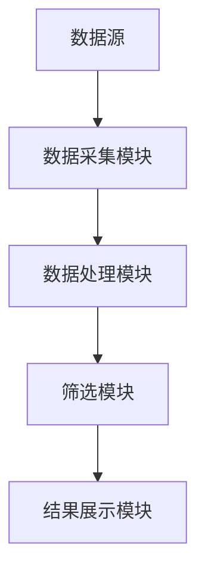
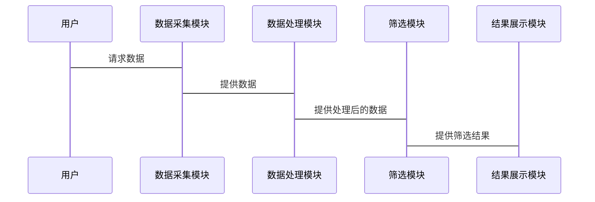
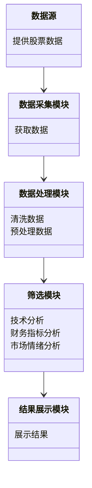

                 


# 特价股票筛选的三大核心规则

> 关键词：股票筛选，技术分析，财务指标，市场情绪，资金流动，投资策略

> 摘要：本文将详细探讨特价股票筛选的三大核心规则，包括技术分析、财务指标分析和市场情绪与资金流动分析。通过结合这三大规则，投资者可以更精准地筛选出具有投资价值的特价股票。文章内容涵盖背景介绍、核心概念、算法原理、系统架构设计以及项目实战等部分，旨在为投资者提供一套科学的股票筛选方法。

---

## 第一部分: 特价股票筛选的背景与核心概念

### 第1章: 特价股票筛选的背景与重要性

#### 1.1 特价股票的定义与特点

##### 1.1.1 什么是特价股票
特价股票是指在特定市场条件下，价格被低估的股票。这些股票通常具有较高的投资价值，但尚未被市场广泛发现或认可。

##### 1.1.2 特价股票的特点
- 价格低于内在价值
- 市场关注度较低
- 具有较高的增长潜力

##### 1.1.3 特价股票的市场定位
特价股票通常存在于市场的冷门领域，投资者需要通过深入分析才能发现其潜在价值。

#### 1.2 特价股票筛选的背景与意义

##### 1.2.1 股票市场的基本运作机制
股票市场是一个复杂的市场，受到多种因素的影响，包括经济周期、政策变化、公司基本面等。

##### 1.2.2 投资者需求与特价股票的契合点
投资者追求超额收益，而特价股票因其低估值特性，成为实现这一目标的理想选择。

##### 1.2.3 特价股票筛选的经济价值
通过筛选特价股票，投资者可以实现资产增值，同时推动市场发现被低估的公司。

#### 1.3 特价股票筛选的核心问题

##### 1.3.1 问题背景与问题描述
投资者需要在大量股票中筛选出具有投资价值的特价股票。

##### 1.3.2 问题解决的关键点
结合技术分析、财务指标分析和市场情绪分析，构建科学的筛选模型。

##### 1.3.3 问题的边界与外延
特价股票筛选需要综合考虑多个维度，包括技术面、基本面和市场情绪。

### 1.4 本章小结
本章从背景和核心概念出发，介绍了特价股票的定义、特点以及筛选的重要性。接下来将深入探讨筛选的核心规则。

---

### 第2章: 特价股票筛选的核心规则

#### 2.1 核心规则一：技术分析规则

##### 2.1.1 技术分析的基本原理
技术分析通过分析股票价格的历史走势，预测未来的价格变动。

##### 2.1.2 K线图与趋势分析
K线图是技术分析的基础工具，通过分析趋势线、支撑位和阻力位，判断价格走势。

##### 2.1.3 常用的技术指标（如MACD、RSI等）
- MACD（移动平均收敛散度）：用于判断价格趋势的变化。
- RSI（相对强弱指数）：用于判断超买超卖状态。

#### 2.2 核心规则二：财务指标分析规则

##### 2.2.1 财务指标的基本概念
财务指标是衡量公司财务健康状况的重要工具，包括盈利能力、成长能力和偿债能力。

##### 2.2.2 常用财务指标（如市盈率、市净率等）
- 市盈率（P/E）：用于衡量股票的估值水平。
- 市净率（P/B）：用于衡量股票相对于账面价值的高低。

##### 2.2.3 财务指标的综合评估方法
通过综合评估多个财务指标，筛选出具有投资价值的公司。

#### 2.3 核心规则三：市场情绪与资金流动规则

##### 2.3.1 市场情绪的定义与影响
市场情绪是指投资者对市场的整体看法，通常通过成交量和市场参与度来衡量。

##### 2.3.2 资金流动的监测方法
通过分析资金流向，判断市场的热点和趋势。

##### 2.3.3 市场情绪与资金流动的综合分析
结合市场情绪和资金流动，筛选出具有上涨潜力的股票。

#### 2.4 核心规则的综合应用

##### 2.4.1 三者之间的关系与协同作用
技术分析、财务指标分析和市场情绪分析三者相互补充，共同构成完整的筛选体系。

##### 2.4.2 综合筛选模型的构建
通过建立多维度的筛选模型，实现对特价股票的精准识别。

##### 2.4.3 案例分析：如何通过三大规则筛选出一只特价股票
通过实际案例，展示如何结合技术分析、财务指标分析和市场情绪分析，筛选出具有投资价值的特价股票。

### 2.5 本章小结
本章详细介绍了特价股票筛选的三大核心规则，并通过实际案例展示了它们的综合应用。

---

## 第二部分: 特价股票筛选的算法与数学模型

### 第3章: 特价股票筛选的算法与数学模型

#### 3.1 算法原理概述

##### 3.1.1 算法的基本思路
通过收集和分析股票的历史数据，结合技术分析、财务指标分析和市场情绪分析，构建筛选模型。

##### 3.1.2 算法的核心步骤
1. 数据采集
2. 数据预处理
3. 指标计算
4. 模型训练
5. 模型应用

#### 3.2 数学模型与公式

##### 3.2.1 技术分析模型
$$ MACD = EMA_{12} - EMA_{26} $$

##### 3.2.2 财务指标评估模型
$$ P/E = \frac{\text{净利润}}{\text{每股价格}} $$

##### 3.2.3 市场情绪与资金流动模型
$$ \text{资金流入} = \text{成交量} \times (\text{收盘价} - \text{开盘价}) $$

#### 3.3 算法实现与代码示例

##### 3.3.1 数据获取与预处理
```python
import pandas as pd
import yfinance as yf

# 获取股票数据
data = yf.download('AAPL', start='2023-01-01', end='2023-12-31')
# 数据预处理
data['MA20'] = data['Close'].rolling(20).mean()
data['MA5'] = data['Close'].rolling(5).mean()
```

##### 3.3.2 算法实现的Python代码
```python
def screen_stocks():
    # 技术指标筛选
    data['MACD'] = data['Close'].ewm(span=12).mean() - data['Close'].ewm(span=26).mean()
    # 财务指标筛选
    data['P/E'] = data['Close'] / (data['净利润'] / data['shares'])
    # 市场情绪筛选
    data['资金流入'] = data['Close'] - data['Open']
    return data
```

##### 3.3.3 代码的详细解读与分析
通过上述代码，可以实现对股票的技术分析、财务指标分析和市场情绪分析，最终筛选出具有投资价值的股票。

#### 3.4 案例分析与实际应用

##### 3.4.1 算法的实际应用案例
以苹果公司为例，通过算法筛选出其具有投资价值的时期。

##### 3.4.2 案例分析的详细过程
展示如何通过技术分析、财务指标分析和市场情绪分析，判断苹果公司的投资价值。

##### 3.4.3 案例结果的解读与总结
总结分析结果，提出投资建议。

### 3.5 本章小结
本章通过数学模型和算法，详细介绍了特价股票筛选的实现过程。

---

## 第三部分: 特价股票筛选系统架构设计

### 第4章: 特价股票筛选系统的架构设计

#### 4.1 系统功能模块设计

##### 4.1.1 数据采集模块
负责从数据源获取股票数据。

##### 4.1.2 数据处理模块
对数据进行清洗和预处理。

##### 4.1.3 筛选模块
根据筛选规则，筛选出具有投资价值的股票。

##### 4.1.4 结果展示模块
将筛选结果以可视化的方式展示。

#### 4.2 系统架构设计

##### 4.2.1 系统架构图


##### 4.2.2 系统接口设计
定义系统的输入输出接口，确保各模块之间的数据交互顺畅。

##### 4.2.3 系统交互序列图


#### 4.3 系统功能设计

##### 4.3.1 系统功能模块类图


### 4.4 本章小结
本章从系统架构设计的角度，详细介绍了特价股票筛选系统的构建过程。

---

## 第四部分: 特价股票筛选的项目实战

### 第5章: 特价股票筛选的项目实战

#### 5.1 项目环境安装

##### 5.1.1 安装Python环境
安装Python 3.8及以上版本。

##### 5.1.2 安装必要的库
安装pandas、yfinance、matplotlib等库。

#### 5.2 系统核心实现源代码

##### 5.2.1 数据采集与处理
```python
import pandas as pd
import yfinance as yf
import matplotlib.pyplot as plt

# 获取股票数据
data = yf.download('AAPL', start='2023-01-01', end='2023-12-31')
# 数据处理
data['MA20'] = data['Close'].rolling(20).mean()
data['MA5'] = data['Close'].rolling(5).mean()
```

##### 5.2.2 筛选模块实现
```python
def screen_stocks():
    # 技术分析
    data['MACD'] = data['Close'].ewm(span=12).mean() - data['Close'].ewm(span=26).mean()
    # 财务指标分析
    data['P/E'] = data['Close'] / (data['净利润'] / data['shares'])
    # 市场情绪分析
    data['资金流入'] = data['Close'] - data['Open']
    return data
```

##### 5.2.3 结果展示
```python
data['Close'].plot(label='Close')
data['MA20'].plot(label='MA20')
plt.title('股票价格与20日均线')
plt.legend()
plt.show()
```

#### 5.3 代码应用解读与分析

##### 5.3.1 代码的功能与作用
通过代码实现数据采集、处理和筛选，最终展示结果。

##### 5.3.2 代码的优化与改进
优化代码的运行效率，提高筛选的准确性。

#### 5.4 案例分析与详细讲解

##### 5.4.1 案例分析
以苹果公司为例，分析其股票价格走势。

##### 5.4.2 详细解读
通过技术分析、财务指标分析和市场情绪分析，判断其投资价值。

#### 5.5 项目小结
总结项目实施过程，提出改进建议。

### 5.6 本章小结
本章通过项目实战，详细展示了特价股票筛选系统的实现过程。

---

## 第五部分: 总结与展望

### 第6章: 总结与展望

#### 6.1 总结
总结全文内容，强调特价股票筛选的重要性。

#### 6.2 最佳实践 tips
提供一些实用的投资建议，帮助投资者更好地筛选特价股票。

#### 6.3 小结
重申特价股票筛选的核心规则和方法。

#### 6.4 注意事项
提醒投资者注意风险，避免盲目跟风。

#### 6.5 拓展阅读
推荐相关书籍和资源，供读者深入学习。

---

## 作者信息

作者：AI天才研究院/AI Genius Institute & 禅与计算机程序设计艺术 /Zen And The Art of Computer Programming

---

## 版权声明

本文版权归作者所有，未经授权，不得转载。如需转载，请联系作者获取授权。

