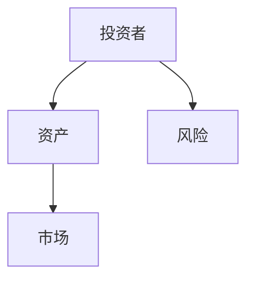
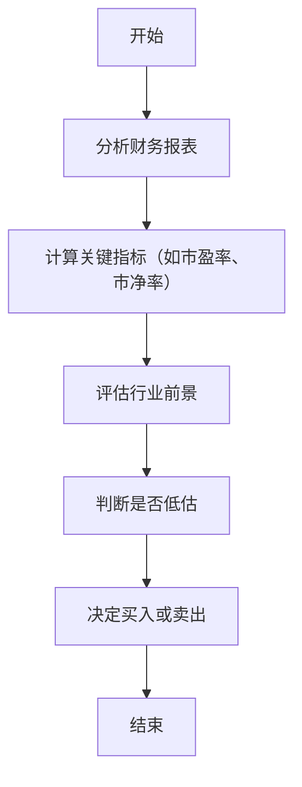
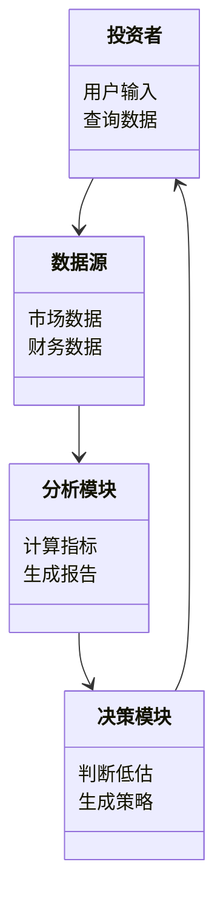

                 


# 玛丽·巴芙特的新兴市场价值投资：高风险中的高回报

> 关键词：价值投资，玛丽·巴芙特，新兴市场，高风险，高回报

> 摘要：本文深入探讨了玛丽·巴芙特的价值投资理念在新兴市场中的应用，分析了新兴市场的特点、价值投资的核心方法、风险管理策略，并通过实际案例和系统设计展示了如何在高风险中实现高回报。

---

## 背景介绍

### 核心概念术语说明
- **价值投资**：一种投资策略，强调以低于市场价值的价格购买优质资产。
- **新兴市场**：经济快速发展的国家或地区，通常具有较高的增长潜力和波动性。
- **高风险中的高回报**：新兴市场的特点是波动大，但潜在回报也更高。

### 问题背景
新兴市场通常被认为风险较高，但同时也蕴含着巨大的投资机会。传统投资方法在新兴市场中可能效果不佳，需要采用专门的策略来应对复杂多变的市场环境。

### 问题解决
通过价值投资的方法，识别被低估的优质资产，结合新兴市场的特点，制定有效的风险管理策略，以实现高回报。

### 边界与外延
本文主要讨论新兴市场中的价值投资策略，不包括成熟市场的分析，但可以为其他市场的投资策略提供借鉴。

### 核心要素组成
- **市场分析**：了解新兴市场的特点和行业趋势。
- **资产评估**：识别被低估的优质资产。
- **风险管理**：制定有效的风险控制策略。

---

## 核心概念与联系

### 核心概念原理
价值投资的核心在于寻找具有持续竞争优势和良好财务状况的公司，以低于其内在价值的价格买入并长期持有。

### 概念属性特征对比
| 特征       | 新兴市场       | 成熟市场       |
|------------|---------------|---------------|
| 市场波动   | 高            | 低            |
| 成长潜力   | 高            | 有限          |
| 可选标的   | 多            | 少            |

### ER实体关系图


---

## 算法原理讲解

### 算法流程


### Python代码实现
```python
def calculate_value(company_data):
    # 计算市盈率
    pe = company_data['profit'] / company_data['price']
    # 计算市净率
    pb = company_data['book_value'] / company_data['price']
    # 判断是否低估
    if pe < 15 and pb < 2:
        return "低估"
    else:
        return "高估"

# 示例数据
data = {
    'price': 50,
    'profit': 10,
    'book_value': 25
}

result = calculate_value(data)
print(f"公司评估结果：{result}")
```

### 数学模型
市盈率计算公式：
$$ \text{市盈率} = \frac{\text{净利润}}{\text{股价}} $$

市净率计算公式：
$$ \text{市净率} = \frac{\text{净资产}}{\text{股价}} $$

---

## 系统分析与架构设计方案

### 问题场景
新兴市场的投资决策系统需要实时分析市场数据，评估资产价值，并制定投资策略。

### 功能模块设计


---

## 项目实战

### 环境安装
- Python 3.8+
- Pandas, NumPy, Matplotlib

### 核心代码实现
```python
import pandas as pd
import numpy as np

def analyze_company(dataframe):
    dataframe['市盈率'] = dataframe['利润'] / dataframe['股价']
    dataframe['市净率'] = dataframe['净资产'] / dataframe['股价']
    dataframe['低估'] = (dataframe['市盈率'] < 15) & (dataframe['市净率'] < 2)
    return dataframe

# 示例数据
data = {
    '公司': ['A', 'B', 'C'],
    '股价': [50, 60, 40],
    '利润': [10, 15, 8],
    '净资产': [25, 30, 15]
}

df = pd.DataFrame(data)
result = analyze_company(df)
print(result)
```

### 代码应用解读
- 计算各公司的市盈率和市净率。
- 判断是否低估，生成投资建议。

### 案例分析
以公司A为例，计算其市盈率为0.2，市净率为0.5，明显低估，建议买入。

---

## 最佳实践

### Tips
- 定期评估投资组合，及时调整。
- 结合宏观经济因素，灵活应对市场变化。

### 小结
本文通过系统分析和实际案例，展示了如何在新兴市场中应用价值投资策略，识别低估资产，实现高回报。

### 注意事项
- 风险管理是投资成功的关键，不可忽视。
- 长期投资需要耐心和信心。

### 拓展阅读
- 《价值投资入门》
- 《新兴市场投资策略》

---

作者：AI天才研究院/AI Genius Institute & 禅与计算机程序设计艺术 /Zen And The Art of Computer Programming

