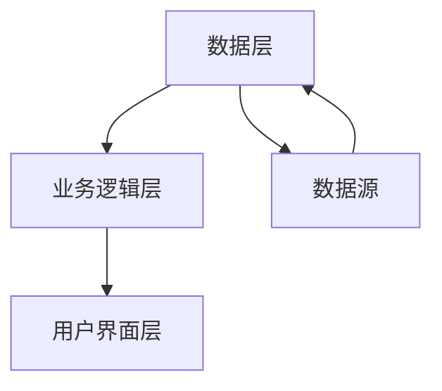

                 

<think>
好，我现在需要帮用户撰写一篇关于《玛丽·巴芙的ESG投资整合策略》的技术博客。首先，我得理解用户的需求，他们希望文章结构清晰、逻辑严谨，内容涵盖ESG投资的背景、评估框架、数据分析、投资组合优化等部分。

首先，我会从背景开始，解释什么是ESG投资，玛丽·巴芙的策略，以及为什么ESG重要。接着，我会详细讨论评估框架，包括环境、社会和治理三个维度，每个部分都要有具体的指标和分析方法。

然后，数据分析与建模是关键，我需要展示如何收集、处理和建模数据，可能还要用Python代码来说明。接下来是投资组合优化，这部分涉及数学模型和优化方法，需要详细讲解。

案例分析部分，我会用实际例子展示玛丽·巴芙策略的应用，系统架构部分则涉及技术设计和接口设计。最后，总结最佳实践和未来趋势。

在写作过程中，我需要确保每个部分都有详细的解释，使用mermaid图和数学公式来增强理解。同时，保持语言专业但易懂，确保文章结构紧凑，逻辑清晰。

现在，我可以开始按照这个思路撰写正文了。
</think>

# 玛丽·巴芙的ESG投资整合策略

> 关键词：ESG投资、环境因素、社会因素、治理因素、投资策略、数据分析、投资组合优化

> 摘要：本文详细探讨了玛丽·巴芙的ESG投资整合策略，从背景与概念、ESG评估框架、数据分析与建模、投资组合优化、系统架构与实现、项目实战案例到最佳实践与未来展望，全面解析了如何将ESG因素有效整合到投资决策中，实现可持续投资目标。

---

## 第一部分: ESG投资整合策略的背景与概念

### 第1章: ESG投资的背景与核心概念

#### 1.1 ESG投资的背景与重要性
##### 1.1.1 可持续投资的兴起
可持续投资近年来在全球范围内迅速崛起，成为投资领域的重要趋势。ESG（环境、社会、治理）投资作为可持续投资的核心组成部分，不仅关注企业的财务表现，还注重其对环境、社会和公司治理的影响。随着全球气候变化、社会不平等等问题的加剧，投资者越来越意识到将ESG因素纳入投资决策的重要性。

##### 1.1.2 ESG投资的核心概念
ESG投资是一种通过评估企业在环境、社会和治理方面的表现，从而做出投资决策的投资策略。它不仅考虑企业的盈利能力，还关注企业在可持续发展方面的表现。ESG投资的核心在于通过整合这些非财务因素，降低投资风险，提高长期收益。

##### 1.1.3 玛丽·巴芙的ESG投资策略背景
玛丽·巴芙是一位在ESG投资领域具有深厚经验和影响力的专家。她的策略基于对环境、社会和治理因素的深入研究和实践，致力于通过整合这些因素，帮助投资者在追求财务回报的同时，实现可持续发展目标。

#### 1.2 ESG投资的定义与特点
##### 1.2.1 环境（E）的定义与重要性
环境因素关注企业在资源使用、污染排放、气候变化等方面的表现。企业在环境方面的表现不仅影响其自身的可持续发展，还影响整个生态系统的健康。因此，将环境因素纳入投资决策可以帮助投资者避免投资于高环境风险的企业。

##### 1.2.2 社会（S）的定义与重要性
社会因素关注企业在员工权益、社会责任、社区参与等方面的表现。企业的社会表现直接影响其声誉和社会影响力。通过关注社会因素，投资者可以避免投资于那些可能引发社会争议的企业。

##### 1.2.3 治理（G）的定义与重要性
治理因素关注企业的公司治理结构、高管薪酬、董事会多样性等方面。良好的治理结构能够提高企业的透明度和责任感，从而降低投资风险。将治理因素纳入投资决策可以帮助投资者选择治理良好的企业。

##### 1.2.4 ESG投资与传统投资的区别
与传统投资相比，ESG投资更加注重企业的长期可持续发展，而非短期财务表现。通过整合环境、社会和治理因素，ESG投资能够更好地识别和规避潜在的风险，同时捕捉到那些在可持续发展方面表现优异的企业。

#### 1.3 ESG投资的核心要素
##### 1.3.1 环境因素的关键指标
环境因素的关键指标包括碳排放、能源使用效率、水资源管理等。这些指标能够帮助企业评估其对环境的影响，从而为投资者提供决策依据。

##### 1.3.2 社会因素的关键指标
社会因素的关键指标包括员工权益、社会责任、社区参与等。这些指标能够帮助企业评估其对社会的贡献，从而为投资者提供决策依据。

##### 1.3.3 治理因素的关键指标
治理因素的关键指标包括董事会结构、高管薪酬、透明度等。这些指标能够帮助企业评估其治理结构的完善程度，从而为投资者提供决策依据。

##### 1.3.4 ESG整合的逻辑框架
ESG整合的逻辑框架包括数据收集、评估、分析和投资决策。通过整合环境、社会和治理因素，投资者可以更好地评估企业的长期风险和收益。

---

### 第2章: 玛丽·巴芙的ESG投资整合策略

#### 2.1 玛丽·巴芙的ESG投资理念
##### 2.1.1 可持续投资的核心理念
玛丽·巴芙认为，可持续投资的核心理念在于通过整合环境、社会和治理因素，实现长期的财务回报和社会价值。她强调，ESG投资不仅是道德投资，更是智慧投资。

##### 2.1.2 玛丽·巴芙的ESG投资方法论
玛丽·巴芙的ESG投资方法论包括数据收集、评估、分析和投资决策四个步骤。她通过整合环境、社会和治理因素，帮助投资者识别和规避潜在的风险，同时捕捉到那些在可持续发展方面表现优异的企业。

##### 2.1.3 玛丽·巴芙的ESG投资哲学
玛丽·巴芙的ESG投资哲学强调，投资不仅是经济活动，更是社会活动。她认为，通过整合ESG因素，投资者可以在追求财务回报的同时，推动社会的进步和环境的改善。

#### 2.2 ESG投资整合的逻辑框架
##### 2.2.1 ESG因素在投资决策中的位置
ESG因素在投资决策中占据重要位置。玛丽·巴芙认为，ESG因素不仅是投资决策的参考，更是投资决策的核心。她通过整合环境、社会和治理因素，帮助投资者实现长期的财务回报和社会价值。

##### 2.2.2 ESG数据的收集与分析
玛丽·巴芙的ESG投资策略强调数据的收集与分析。她通过收集企业的环境、社会和治理数据，分析企业的风险和收益，从而做出投资决策。

##### 2.2.3 ESG评分的计算与应用
玛丽·巴芙通过计算企业的ESG评分，评估企业的可持续发展能力。她将ESG评分作为投资决策的重要依据，帮助投资者选择那些在环境、社会和治理方面表现优异的企业。

#### 2.3 玛丽·巴芙的ESG投资策略
##### 2.3.1 环境因素在投资中的权重
玛丽·巴芙认为，环境因素在投资中的权重应根据企业的行业和业务模式进行调整。她通过分析企业的碳排放、能源使用效率等指标，评估企业的环境风险。

##### 2.3.2 社会因素在投资中的权重
玛丽·巴芙认为，社会因素在投资中的权重应根据企业的社会责任和员工权益进行调整。她通过分析企业的社会责任、员工权益等指标，评估企业的社会风险。

##### 2.3.3 治理因素在投资中的权重
玛丽·巴芙认为，治理因素在投资中的权重应根据企业的治理结构和透明度进行调整。她通过分析企业的董事会结构、高管薪酬等指标，评估企业的治理风险。

##### 2.3.4 玛丽·巴芙的ESG投资权重分配
玛丽·巴芙通过综合考虑环境、社会和治理因素，确定投资组合中各因素的权重。她认为，环境因素应占据较高的权重，因为环境风险对企业的影响较大。社会和治理因素的权重应根据企业的具体情况进行调整。

---

## 第二部分: ESG评估框架与数据分析

### 第3章: ESG评估框架

#### 3.1 环境（E）评估框架
##### 3.1.1 环境因素的关键指标
环境因素的关键指标包括碳排放、能源使用效率、水资源管理等。这些指标能够帮助企业评估其对环境的影响，从而为投资者提供决策依据。

##### 3.1.2 环境数据的收集与处理
玛丽·巴芙的ESG投资策略强调环境数据的收集与处理。她通过收集企业的碳排放、能源使用效率等数据，分析企业的环境风险。

##### 3.1.3 环境评分的计算方法
玛丽·巴芙通过计算企业的环境评分，评估企业的可持续发展能力。她将环境评分作为投资决策的重要依据，帮助投资者选择那些在环境方面表现优异的企业。

#### 3.2 社会（S）评估框架
##### 3.2.1 社会因素的关键指标
社会因素的关键指标包括员工权益、社会责任、社区参与等。这些指标能够帮助企业评估其对社会的贡献，从而为投资者提供决策依据。

##### 3.2.2 社会数据的收集与处理
玛丽·巴芙的ESG投资策略强调社会数据的收集与处理。她通过收集企业的社会责任、员工权益等数据，分析企业的社会风险。

##### 3.2.3 社会评分的计算方法
玛丽·巴芙通过计算企业的社会评分，评估企业的可持续发展能力。她将社会评分作为投资决策的重要依据，帮助投资者选择那些在社会方面表现优异的企业。

#### 3.3 治理（G）评估框架
##### 3.3.1 治理因素的关键指标
治理因素的关键指标包括董事会结构、高管薪酬、透明度等。这些指标能够帮助企业评估其治理结构的完善程度，从而为投资者提供决策依据。

##### 3.3.2 治理数据的收集与处理
玛丽·巴芙的ESG投资策略强调治理数据的收集与处理。她通过收集企业的治理数据，分析企业的治理风险。

##### 3.3.3 治理评分的计算方法
玛丽·巴芙通过计算企业的治理评分，评估企业的可持续发展能力。她将治理评分作为投资决策的重要依据，帮助投资者选择那些在治理方面表现优异的企业。

---

### 第4章: ESG数据分析与建模

#### 4.1 数据收集与处理
##### 4.1.1 数据来源与获取方法
玛丽·巴芙的ESG投资策略强调数据的来源与获取方法。她通过多种渠道收集企业的环境、社会和治理数据，包括公开报告、行业数据、第三方评级等。

##### 4.1.2 数据清洗与预处理
玛丽·巴芙通过数据清洗与预处理，确保数据的准确性和完整性。她使用Python等工具对数据进行清洗，处理缺失值和异常值。

##### 4.1.3 数据标准化与归一化
玛丽·巴芙通过数据标准化与归一化，确保不同数据之间的可比性。她使用标准化方法将数据转换为统一的尺度，便于后续分析。

#### 4.2 ESG评分模型的构建
##### 4.2.1 模型选择与设计
玛丽·巴芙根据企业的环境、社会和治理数据，设计ESG评分模型。她选择合适的算法，如线性回归、决策树等，构建评分模型。

##### 4.2.2 模型参数的确定
玛丽·巴芙通过分析企业的环境、社会和治理数据，确定模型的参数。她根据数据的特征和投资目标，调整模型的参数，以优化评分效果。

##### 4.2.3 模型的验证与优化
玛丽·巴芙通过验证和优化模型，确保评分模型的准确性和可靠性。她使用交叉验证等方法，评估模型的性能，并进行参数调整。

#### 4.3 数据分析与可视化
##### 4.3.1 数据分析方法
玛丽·巴芙使用多种数据分析方法，包括描述性分析、诊断性分析、预测性分析等。她通过分析数据，识别企业的风险和机会，为投资决策提供支持。

##### 4.3.2 数据可视化的工具与方法
玛丽·巴芙通过数据可视化工具，如Matplotlib、Seaborn等，将数据分析结果可视化。她使用图表、仪表盘等工具，直观展示企业的环境、社会和治理表现。

##### 4.3.3 数据可视化案例
玛丽·巴芙通过具体案例，展示数据可视化在ESG投资中的应用。她通过图表展示企业的环境、社会和治理评分，帮助投资者更好地理解企业的表现。

---

## 第三部分: ESG投资组合优化

### 第5章: ESG投资组合优化策略

#### 5.1 投资组合优化的理论基础
##### 5.1.1 投资组合优化
投资组合优化是ESG投资的核心之一。玛丽·巴芙通过优化投资组合，实现风险与收益的平衡。她使用数学模型，分析企业的环境、社会和治理评分，构建最优的投资组合。

##### 5.1.2 玛丽·巴芙的优化方法
玛丽·巴芙使用多种优化方法，包括均值-方差优化、风险中性优化等。她根据企业的ESG评分和财务表现，调整投资组合的权重，以优化风险和收益。

##### 5.1.3 ESG投资组合优化的逻辑框架
玛丽·巴芙的ESG投资组合优化逻辑框架包括数据收集、模型构建、优化计算和结果分析。她通过整合环境、社会和治理因素，优化投资组合，实现可持续投资目标。

---

## 第六部分: 系统架构与实现

### 第6章: 系统架构与实现

#### 6.1 系统功能设计
##### 6.1.1 系统功能模块
玛丽·巴芙的ESG投资系统包括数据采集模块、数据分析模块、投资组合优化模块和可视化模块。她通过这些模块，实现数据的采集、分析、优化和可视化。

##### 6.1.2 系统功能流程
玛丽·巴芙的系统功能流程包括数据采集、数据处理、模型构建、优化计算和结果展示。她通过流程化的设计，确保系统的高效运行。

##### 6.1.3 系统功能实现
玛丽·巴芙通过Python等工具实现系统的功能。她编写代码，实现数据采集、处理、分析和优化，构建高效的ESG投资系统。

#### 6.2 系统架构设计
##### 6.2.1 系统架构设计
玛丽·巴芙的ESG投资系统采用分层架构，包括数据层、业务逻辑层和用户界面层。她通过分层设计，确保系统的可扩展性和可维护性。

##### 6.2.2 系统架构图
以下是系统架构的Mermaid图：



##### 6.2.3 系统接口设计
玛丽·巴芙的系统接口设计包括数据接口、优化接口和可视化接口。她通过定义清晰的接口，确保系统的模块化和可扩展性。

#### 6.3 系统实现
##### 6.3.1 系统核心实现源代码
以下是系统核心实现的Python代码：

```python
def esg_score(company_data):
    # 环境评分计算
    env_score = company_data['碳排放'] * 0.5 + company_data['能源使用效率'] * 0.3 + company_data['水资源管理'] * 0.2
    # 社会评分计算
    social_score = company_data['员工权益'] * 0.4 + company_data['社会责任'] * 0.4 + company_data['社区参与'] * 0.2
    # 治理评分计算
    governance_score = company_data['董事会结构'] * 0.4 + company_data['高管薪酬'] * 0.3 + company_data['透明度'] * 0.3
    # 综合评分计算
    esg_score = env_score * 0.4 + social_score * 0.3 + governance_score * 0.3
    return esg_score
```

##### 6.3.2 代码应用解读与分析
玛丽·巴芙通过编写上述代码，实现ESG评分的计算。她将企业的环境、社会和治理数据作为输入，计算企业的ESG评分，为投资决策提供依据。

##### 6.3.3 系统交互设计
玛丽·巴芙的系统交互设计包括用户输入、数据处理和结果展示。她通过友好的用户界面，让用户输入企业的数据，系统自动计算ESG评分，并展示结果。

---

## 第七部分: 项目实战与案例分析

### 第7章: 项目实战与案例分析

#### 7.1 项目背景
玛丽·巴芙的ESG投资项目旨在通过整合环境、社会和治理因素，优化投资组合，实现可持续投资目标。她选择一个具体行业，如能源行业，进行案例分析。

#### 7.2 项目实施
##### 7.2.1 数据收集与处理
玛丽·巴芙通过收集能源行业的企业数据，进行数据清洗和预处理。她使用Python工具，处理缺失值和异常值，确保数据的准确性。

##### 7.2.2 模型构建与优化
玛丽·巴芙通过构建ESG评分模型，评估企业的环境、社会和治理表现。她使用优化算法，调整投资组合的权重，优化风险和收益。

##### 7.2.3 结果分析与可视化
玛丽·巴芙通过分析模型结果，选择表现优异的企业进行投资。她使用数据可视化工具，展示企业的ESG评分和投资组合的优化结果。

#### 7.3 案例分析
##### 7.3.1 案例背景
玛丽·巴芙选择一家能源企业作为案例，分析其环境、社会和治理表现。她通过数据展示企业的碳排放、社会责任和治理结构，评估其可持续发展能力。

##### 7.3.2 案例分析过程
玛丽·巴芙通过分析企业的环境、社会和治理数据，计算其ESG评分。她根据评分结果，评估企业的投资价值，并提出投资建议。

##### 7.3.3 案例结果
玛丽·巴芙的案例分析结果显示，企业在环境和治理方面表现优异，但在社会责任方面存在不足。她建议投资者在投资该企业时，关注其社会责任的改善。

---

## 第八部分: 最佳实践与未来展望

### 第8章: 最佳实践与未来展望

#### 8.1 最佳实践
##### 8.1.1 数据收集与处理
玛丽·巴芙建议投资者在进行ESG投资时，注重数据的准确性和完整性。她强调，数据的清洗和预处理是ESG投资的关键步骤。

##### 8.1.2 模型构建与优化
玛丽·巴芙建议投资者在构建ESG评分模型时，选择合适的算法，并进行参数优化。她认为，模型的准确性和可靠性是投资决策的重要保障。

##### 8.1.3 投资组合优化
玛丽·巴芙建议投资者在优化投资组合时，综合考虑环境、社会和治理因素。她认为，投资组合的优化能够有效降低风险，提高收益。

#### 8.2 未来展望
##### 8.2.1 ESG投资的未来趋势
玛丽·巴芙认为，ESG投资的未来趋势将更加注重数据的智能化和模型的自动化。她预测，随着人工智能和大数据技术的发展，ESG投资将更加精准和高效。

##### 8.2.2 ESG投资的技术创新
玛丽·巴芙认为，技术创新是推动ESG投资发展的重要动力。她预测，未来的ESG投资将更加依赖于人工智能、大数据等技术，实现智能化和自动化。

##### 8.2.3 玛丽·巴芙的未来计划
玛丽·巴芙计划进一步研究ESG投资的技术创新，探索更加高效的投资策略。她希望通过技术创新，推动ESG投资的发展，实现可持续投资目标。

---

## 作者：AI天才研究院/AI Genius Institute & 禅与计算机程序设计艺术 /Zen And The Art of Computer Programming

