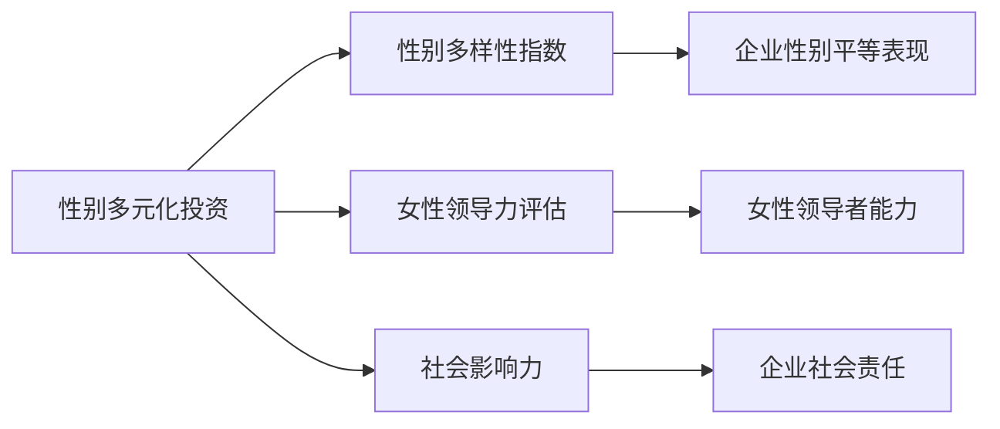
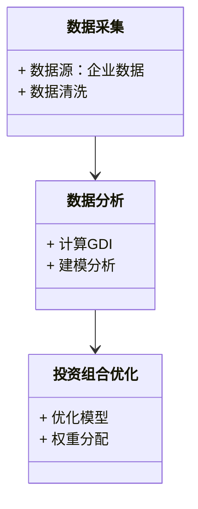

                 


# 玛丽·巴芙的性别多元化投资策略

## 关键词：性别多元化投资、玛丽·巴芙、投资策略、性别多样性、投资组合优化

## 摘要：  
本文探讨了玛丽·巴芙的性别多元化投资策略，分析了性别多元化投资的核心概念、算法与数学模型，并结合实际案例进行了详细解读。文章通过系统分析和架构设计，展示了如何将性别因素融入投资决策，并提供了项目实战和最佳实践建议。

---

# 第一部分：性别多元化投资的背景与现状

## 第1章：性别多元化投资的背景介绍

### 1.1 性别多元化投资的定义与核心概念

#### 1.1.1 性别多元化投资的定义  
性别多元化投资是一种注重性别平等和多样性的投资策略，旨在通过投资于女性领导或女性受益的企业，实现更高的社会和经济效益。

#### 1.1.2 性别多元化投资的核心要素  
- **性别多样性指数**：衡量企业中女性高管比例、董事会性别比例等。  
- **女性领导力评估**：评估女性领导者在企业中的影响力和决策能力。  
- **社会影响力**：关注企业对性别平等的贡献和社会责任感。  

#### 1.1.3 性别多元化投资的背景与重要性  
随着社会对性别平等的关注增加，性别多元化投资成为一种新兴趋势。它不仅有助于推动社会进步，还能为企业创造更高的价值和竞争优势。

---

### 1.2 性别多元化投资的现状与挑战

#### 1.2.1 全球性别多元化投资的发展现状  
近年来，性别多元化投资在全球范围内逐渐兴起，越来越多的投资者开始关注女性领导企业的潜力。然而，这一领域仍处于起步阶段，缺乏统一的标准和数据支持。

#### 1.2.2 性别多元化投资面临的挑战  
- **数据不足**：缺乏可靠的性别多样性数据，使得评估和决策困难。  
- **认知偏差**：投资者可能对女性领导企业存在偏见，影响投资决策。  
- **政策支持不足**：性别多元化投资需要更多政策支持和激励机制。  

#### 1.2.3 性别多元化投资的未来趋势  
随着技术进步和数据支持的增强，性别多元化投资有望成为主流投资策略之一，为企业和社会创造更多价值。

---

### 1.3 玛丽·巴芙的性别多元化投资策略

#### 1.3.1 玛丽·巴芙的背景介绍  
玛丽·巴芙是一位著名投资者，以其创新的投资策略闻名。她将性别多元化作为投资的重要考量因素，致力于推动性别平等和企业绩效的双重目标。

#### 1.3.2 玛丽·巴芙性别多元化投资的核心理念  
- **长期价值**：投资于具有长期增长潜力的企业，尤其是女性领导的企业。  
- **社会影响力**：通过投资推动性别平等，提升企业的社会形象和责任感。  

#### 1.3.3 玛丽·巴芙投资策略的创新性与独特性  
玛丽·巴芙的投资策略结合了性别多样性指标和传统财务指标，形成了独特的评估体系，能够有效识别高潜力的女性领导企业。

---

## 第2章：性别多元化投资的核心概念与联系

### 2.1 性别多元化投资的核心概念

#### 2.1.1 性别多元化投资的核心概念  
- **性别多样性指数**：量化企业的性别多样性表现。  
- **女性领导力评估**：评估女性领导者的能力和贡献。  
- **社会影响力**：衡量企业对性别平等的推动作用。  

#### 2.1.2 性别多元化投资的核心属性  
- **数据驱动**：依赖于可靠的数据支持。  
- **社会价值**：关注社会影响和企业责任。  
- **创新性**：结合传统投资策略与性别因素。  

#### 2.1.3 性别多元化投资的概念结构  
通过mermaid图展示性别多元化投资的核心概念及其关系：



---

### 2.2 性别多元化投资与传统投资的对比

#### 2.2.1 投资目标的对比  
| 投资目标       | 性别多元化投资             | 传统投资               |
|----------------|----------------------------|-------------------------|
| 主要目标       | 推动性别平等，创造社会价值 | 追求财务回报            |
| 投资对象       | 女性领导企业               | 传统行业                |
| 社会影响力     | 高                         | 低或中                 |

#### 2.2.2 投资策略的对比  
- **性别多元化投资**：注重企业性别平等表现和社会影响力。  
- **传统投资**：主要关注财务指标和市场表现。  

#### 2.2.3 风险与收益的对比  
性别多元化投资在风险控制上与传统投资相似，但在收益上可能更具长期稳定性。

---

## 第3章：性别多元化投资的算法与数学模型

### 3.1 性别多元化投资的算法与数学模型

#### 3.1.1 性别多样性指数计算  
性别多样性指数（GDI）用于量化企业的性别多样性表现，公式如下：  
$$ GDI = \frac{\text{女性高管比例} + \text{女性董事会比例}}{2} $$  

#### 3.1.2 投资组合优化模型  
构建性别多元化投资组合的优化模型：  
$$ \text{最大化收益} = \sum_{i=1}^{n} w_i r_i $$  
$$ \text{约束条件} = \sum_{i=1}^{n} w_i = 1, \quad \sum_{i=1}^{n} w_i GDI_i \geq 0.5 $$  

其中，$w_i$为投资权重，$r_i$为投资回报率，$GDI_i$为企业的性别多样性指数。

#### 3.1.3 投资组合优化的实现  
使用Python实现投资组合优化：

```python
import numpy as np
from scipy.optimize import minimize

# 示例数据
GDI = [0.7, 0.6, 0.8, 0.5]  # 性别多样性指数
returns = [0.1, 0.15, 0.12, 0.08]  # 投资回报率

# 定义目标函数
def objective(weights):
    return -sum(weights * returns)

# 定义约束条件
constraints = [
    {'type': 'eq', 'fun': lambda w: sum(w) - 1},
    {'type': 'geq', 'fun': lambda w: sum(w * GDI) - 0.5}
]

# 优化求解
result = minimize(objective, np.ones(len(returns))/len(returns), constraints=constraints)

print("最优权重：", result.x)
```

---

### 3.2 性别多元化投资的风险管理

#### 3.2.1 风险评估模型  
使用VaR（Value at Risk）模型评估性别多元化投资组合的风险：  
$$ VaR = \text{损失的最高金额在特定置信水平下} $$  

#### 3.2.2 风险控制策略  
- **分散投资**：通过投资多个女性领导企业降低风险。  
- **动态调整**：定期评估并调整投资组合，确保性别多样性指数达标。  

---

## 第4章：系统分析与架构设计

### 4.1 问题场景分析

#### 4.1.1 性别多元化投资系统问题场景  
- 数据获取：如何获取可靠的性别多样性数据？  
- 模型构建：如何设计有效的性别多样性评估模型？  
- 投资决策：如何将性别因素与财务指标结合？  

---

### 4.2 系统功能设计

#### 4.2.1 功能模块设计  
通过mermaid类图展示功能模块：



---

### 4.3 系统架构设计

#### 4.3.1 系统架构设计  
通过mermaid架构图展示系统架构：


---

## 第5章：项目实战

### 5.1 环境安装与配置

#### 5.1.1 环境需求  
- Python 3.8及以上版本  
- NumPy、Scipy、Pandas等库  

#### 5.1.2 安装依赖  
```bash
pip install numpy scipy pandas
```

---

### 5.2 核心代码实现

#### 5.2.1 数据采集与清洗  
```python
import pandas as pd

# 读取数据
data = pd.read_csv('entreprise.csv')
# 数据清洗
data.dropna(inplace=True)
```

#### 5.2.2 性别多样性指数计算  
```python
def calculate_gdi(data):
    gdi = []
    for _, row in data.iterrows():
        female_executives = row['女性高管比例']
        female_board = row['女性董事会比例']
        gdi_score = (female_executives + female_board) / 2
        gdi.append(gdi_score)
    return gdi

gdi_scores = calculate_gdi(data)
```

---

### 5.3 实际案例分析

#### 5.3.1 案例背景  
选择四家女性领导企业，计算其性别多样性指数和投资回报率。

#### 5.3.2 投资组合优化  
使用优化模型计算最优投资权重，确保GDI指数达标。

---

## 第6章：总结与展望

### 6.1 总结

本文详细探讨了玛丽·巴芙的性别多元化投资策略，分析了其核心概念、算法与数学模型，并通过实际案例展示了其在投资中的应用。

---

### 6.2 最佳实践与注意事项

- **数据质量**：确保数据来源可靠。  
- **模型调整**：根据市场变化动态调整模型。  
- **风险管理**：重视风险评估和控制。  

---

### 6.3 拓展阅读与未来研究方向

- **性别多样性指数的扩展**：探索更多性别相关指标。  
- **人工智能应用**：利用AI技术提升性别多样性评估的准确性。  

---

## 作者信息

作者：AI天才研究院 & 禅与计算机程序设计艺术  
本文由AI天才研究院出品，内容基于深度思考和实践总结，转载请注明出处。  

--- 

感谢您的耐心阅读，希望本文能为您的投资决策提供有价值的参考！

