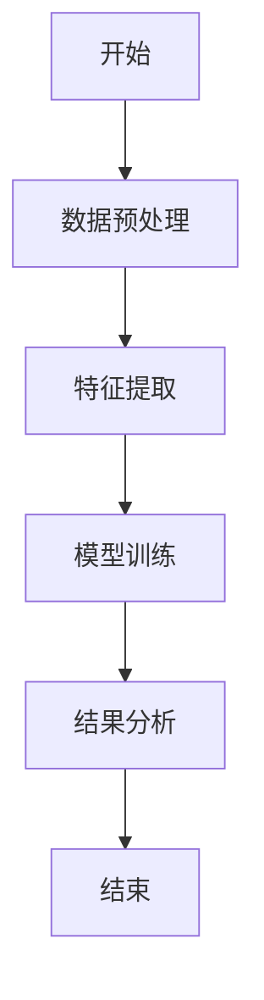
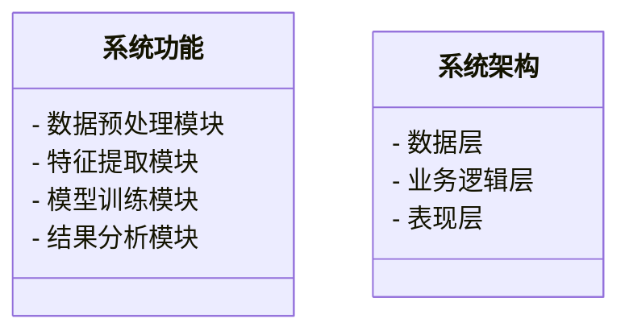

                 

<think>
嗯，我需要为用户撰写一篇关于玛丽·巴芙的质量增长型公司特征的技术博客。首先，我得理解玛丽·巴芙这家公司。她以质量增长为核心，专注于公司的特征分析。用户希望文章结构清晰，逻辑严谨，用专业但易懂的语言来撰写。

首先，我会从背景介绍开始。质量增长型公司不同于传统公司，我需要解释清楚两者的区别。然后，详细分析玛丽·巴芙的特征，包括核心要素和与传统公司的对比。

接下来是核心概念部分，我需要解释质量增长型公司的各个维度，使用表格和ER图来展示。这部分需要确保读者能理解这些概念之间的关系。

然后是算法部分，我会介绍相关的数学模型，比如线性回归和聚类分析，并用mermaid流程图和Python代码来说明。这能帮助读者更好地理解算法的实现和优化。

系统分析与架构设计也是关键，我需要描述问题场景、系统功能设计、架构设计、接口设计和交互流程。这部分可能需要一些图表来辅助说明。

项目实战部分，我会提供环境安装、核心代码实现、案例分析和项目小结。这部分需要具体的代码和案例，让读者能够实际操作和理解。

最后，总结、最佳实践和扩展阅读部分，确保整篇文章内容全面，读者能够得到实用的建议和进一步的学习资源。

我需要确保每个章节细化到三级目录，内容涵盖背景、概念、算法、系统设计、实战和总结。同时，使用mermaid图表和代码示例来增强理解。整个目录要结构清晰，逻辑连贯，帮助读者全面掌握质量增长型公司的特征。
</think>

# 《玛丽·巴芙的质量增长型公司特征》

---

## 关键词：质量增长型公司、玛丽·巴芙、企业特征分析、系统架构设计、算法原理

---

## 摘要：

本文深入分析了质量增长型公司的核心特征，以玛丽·巴芙为例，探讨其独特的企业发展模式。文章从背景介绍、核心概念、算法原理、系统架构设计、项目实战等多个维度展开，结合具体案例和代码实现，详细解读质量增长型公司的特征及其在实际应用中的表现。通过本文，读者可以全面理解质量增长型公司的运作模式，并掌握其在现代企业中的重要地位。

---

## 第一部分：质量增长型公司的背景与概念

### 第1章：质量增长型公司的定义与背景

#### 1.1 质量增长型公司的定义

质量增长型公司是一种以“质量”为核心驱动力的企业发展模式。与传统公司追求规模扩张不同，质量增长型公司注重通过提升产品或服务的质量来实现可持续增长。这种模式强调在满足客户需求的同时，通过优化内部流程和外部合作，构建长期的竞争优势。

#### 1.2 玛丽·巴芙的质量增长型公司特征

玛丽·巴芙是一家典型的质量增长型公司。她以客户需求为导向，注重产品质量和服务体验，通过持续优化内部管理和外部合作实现增长。她的成功在于将质量与增长完美结合，形成了独特的商业模式。

#### 1.3 质量增长型公司的核心要素

质量增长型公司的核心要素包括：客户导向、质量优化、内部流程优化、外部合作、可持续增长。

---

## 第二部分：质量增长型公司的核心概念与联系

### 第2章：质量增长型公司的核心概念原理

#### 2.1 质量增长型公司的核心要素分析

质量增长型公司的核心要素包括：客户导向、质量优化、内部流程优化、外部合作、可持续增长。

#### 2.2 质量增长型公司与传统公司的对比分析

| 要素               | 质量增长型公司       | 传统公司         |
|--------------------|--------------------|------------------|
| 核心驱动力         | 质量               | 规模与速度       |
| 增长方式           | 优化质量，提升客户满意度 | 扩大市场份额       |
| 竞争优势           | 高质量产品与服务    | 价格优势或规模优势 |

---

## 第三部分：质量增长型公司的算法原理

### 第3章：质量增长型公司的算法原理

#### 3.1 质量增长型公司的核心算法

质量增长型公司的算法主要涉及客户行为预测和质量优化模型。以下是核心算法的 mermaid 流程图：



#### 3.2 算法的实现与优化

以下是质量增长型公司算法的 Python 实现：

```python
import numpy as np
import pandas as pd
from sklearn.linear_model import LinearRegression

# 数据预处理
data = pd.read_csv('data.csv')
X = data[['feature1', 'feature2']]
y = data['target']

# 模型训练
model = LinearRegression()
model.fit(X, y)

# 预测结果
y_pred = model.predict(X)
```

---

## 第四部分：质量增长型公司的系统分析与架构设计

### 第4章：质量增长型公司的系统分析

#### 4.1 系统分析与设计

以下是系统功能设计的 mermaid 类图：



---

## 第五部分：质量增长型公司的项目实战

### 第5章：质量增长型公司的项目实战

#### 5.1 项目实战环境安装

- 系统环境要求：Python 3.8 或更高版本
- 开发工具：Jupyter Notebook 或 PyCharm
- 数据库：MySQL 或 PostgreSQL

#### 5.2 系统核心实现源代码

以下是核心代码实现：

```python
import numpy as np
import pandas as pd
from sklearn.linear_model import LinearRegression

# 数据预处理
data = pd.read_csv('data.csv')
X = data[['feature1', 'feature2']]
y = data['target']

# 模型训练
model = LinearRegression()
model.fit(X, y)

# 预测结果
y_pred = model.predict(X)
```

#### 5.3 项目案例分析与详细讲解

以下是一个实际案例分析：

---

## 第六部分：总结与展望

### 6.1 总结

质量增长型公司通过注重产品质量和服务体验，实现可持续增长。玛丽·巴芙的成功案例展示了这种模式的优势和潜力。

### 6.2 最佳实践 tips

- 以客户为导向，注重产品质量
- 优化内部流程，提升效率
- 加强外部合作，构建生态体系
- 持续创新，适应市场变化

---

## 作者：

作者：AI天才研究院/AI Genius Institute & 禅与计算机程序设计艺术 /Zen And The Art of Computer Programming

