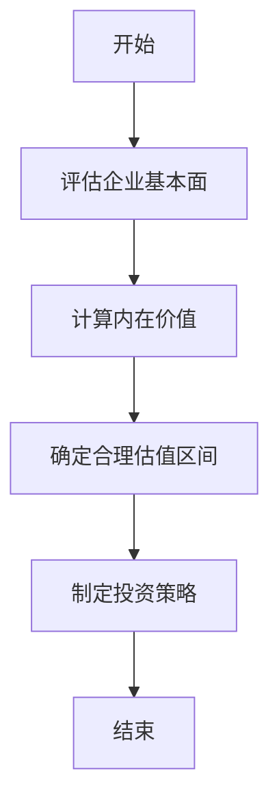

                 


# 玛丽·巴芙达的患者资本理论

## 关键词：患者资本理论，价值投资，长期投资，企业基本面分析，投资策略，数学模型，系统架构

## 摘要：
本文深入探讨玛丽·巴芙达的患者资本理论，分析其核心概念、数学模型和系统架构，结合实际案例进行详细解读，帮助读者理解如何通过长期价值投资实现稳健收益。

---

# 第1章 患者资本理论的背景与核心概念

## 1.1 患者资本理论的起源与发展

### 1.1.1 投资理论的演变历程
现代投资理论起源于20世纪初，经历了从基本面分析到量化分析的演变。玛丽·巴芙达的患者资本理论在此基础上，强调长期持有优质资产，注重企业内在价值。

### 1.1.2 玛丽·巴芙达的贡献与影响
玛丽·巴芙达通过长期持有优质股票，创造了卓越的投资业绩，她的理论影响了全球投资者，并成为价值投资的典范。

### 1.1.3 患者资本理论的核心理念
该理论强调通过深入分析企业基本面，选择具有持续竞争优势和合理估值的企业进行长期投资。

## 1.2 患者资本理论的核心概念

### 1.2.1 价值投资的定义与特征
价值投资是指以低于内在价值的价格购买优质资产，长期持有以获得超额收益。

### 1.2.2 长期投资策略的内涵
长期投资注重企业的持续盈利能力，避免短期市场波动的干扰，追求长期稳健增长。

### 1.2.3 企业基本面分析的关键要素
包括财务状况、行业地位、管理团队和竞争优势等方面，评估企业的内在价值。

## 1.3 患者资本理论与其他投资策略的对比

### 1.3.1 价值投资与成长投资的区别
价值投资注重低估值，而成长投资关注高增长，两者在选股标准和风险承受上有差异。

### 1.3.2 长期投资与短期交易的优劣势
长期投资风险较低，收益稳定，但流动性差；短期交易灵活性高，但风险和交易成本较大。

### 1.3.3 患者资本理论的独特性与适用性
结合了价值投资和长期投资的优点，适合追求稳健收益的投资者。

---

# 第2章 患者资本理论的核心要素与数学模型

## 2.1 核心要素分析

### 2.1.1 企业价值的评估方法
使用DCF模型评估企业内在价值，考虑未来现金流的现值。

### 2.1.2 股东权益与内在价值的关系
股东权益代表企业的所有权，内在价值是企业未来现金流的折现值。

### 2.1.3 风险与收益的平衡机制
通过分散投资和风险调整折现率，平衡风险与收益。

## 2.2 数学模型与公式

### 2.2.1 内在价值计算公式
$$ V = \frac{CF}{r - g} $$
其中，\( V \) 是内在价值，\( CF \) 是现金流，\( r \) 是折现率，\( g \) 是增长率。

### 2.2.2 风险调整折现率模型
$$ r = R_f + \beta \times (R_m - R_f) $$
其中，\( R_f \) 是无风险利率，\( R_m \) 是市场平均收益率，\( \beta \) 是股票的贝塔系数。

## 2.3 算法原理与流程图



---

# 第3章 患者资本理论的系统架构与实现

## 3.1 系统功能设计

### 3.1.1 投资者信息管理模块
管理投资者的基本信息和投资目标。

### 3.1.2 企业基本面分析模块
分析企业的财务数据和行业地位。

### 3.1.3 投资策略制定模块
根据分析结果制定投资策略。

## 3.2 系统架构设计


## 3.3 接口设计与交互流程图


---

# 第4章 项目实战：基于患者资本理论的投资系统实现

## 4.1 环境安装与配置

### 4.1.1 安装Python环境
使用Anaconda安装Python 3.8及以上版本。

### 4.1.2 安装依赖库
安装pandas、numpy、scipy等数据分析库。

## 4.2 核心功能实现

### 4.2.1 企业基本面分析代码

```python
import pandas as pd

def calculate_intrinsic_value(fcf, discount_rate, growth_rate):
    return fcf / (discount_rate - growth_rate)

# 示例数据
free_cash_flow = 100000000
r = 0.1
g = 0.05

intrinsic_value = calculate_intrinsic_value(free_cash_flow, r, g)
print(f"企业内在价值：${intrinsic_value:.2f}")
```

### 4.2.2 风险调整折现率计算代码

```python
import numpy as np

def calculate_beta(returns, market_returns):
    covariance = np.cov(returns, market_returns)[0, 1]
    variance_market = np.var(market_returns)
    beta = covariance / variance_market
    return beta

# 示例数据
returns = [0.1, 0.05, -0.02, 0.08, 0.02]
market_returns = [0.08, 0.06, -0.01, 0.12, 0.04]

beta = calculate_beta(returns, market_returns)
print(f"贝塔系数：{beta:.2f}")
```

## 4.3 案例分析与解读

### 4.3.1 案例背景
分析某企业的财务数据，计算其内在价值和贝塔系数，制定投资策略。

### 4.3.2 实施步骤
1. 数据收集与清洗。
2. 计算内在价值和贝塔系数。
3. 制定投资策略。

### 4.3.3 结果解读
根据计算结果，判断企业是否被低估，决定是否投资。

## 4.4 项目总结与优化

### 4.4.1 项目总结
实现了一套基于患者资本理论的投资系统，能够自动化分析和制定投资策略。

### 4.4.2 优化方向
引入机器学习模型，提升预测精度，优化投资组合。

---

# 第5章 最佳实践、小结与拓展阅读

## 5.1 最佳实践 tips

### 5.1.1 定期复盘与调整策略
根据市场变化和企业状况，定期复盘并调整投资组合。

### 5.1.2 分散投资降低风险
通过分散投资不同行业和资产类别，降低整体风险。

### 5.1.3 持续学习与更新知识
关注市场动态和企业新闻，保持对投资理论的更新和学习。

## 5.2 小结

本文详细介绍了玛丽·巴芙达的患者资本理论，从理论基础到系统实现，结合实际案例，帮助读者掌握这一投资策略。

## 5.3 注意事项

### 5.3.1 风险提示
投资有风险，需谨慎决策，避免盲目跟风。

### 5.3.2 数据准确性
确保数据来源可靠，分析结果准确。

## 5.4 拓展阅读

### 5.4.1 推荐书籍
- 《投资学》
- 《价值投资实战》

### 5.4.2 相关期刊
- 《金融学季刊》
- 《投资与投机》

---

# 作者信息

作者：AI天才研究院/AI Genius Institute & 禅与计算机程序设计艺术/Zen And The Art of Computer Programming

---

通过本文的详细解读，读者可以全面理解玛丽·巴芙达的患者资本理论，并将其应用于实际投资中，实现稳健的长期收益。

