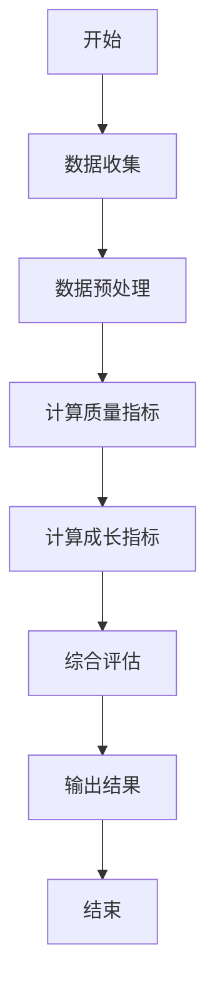
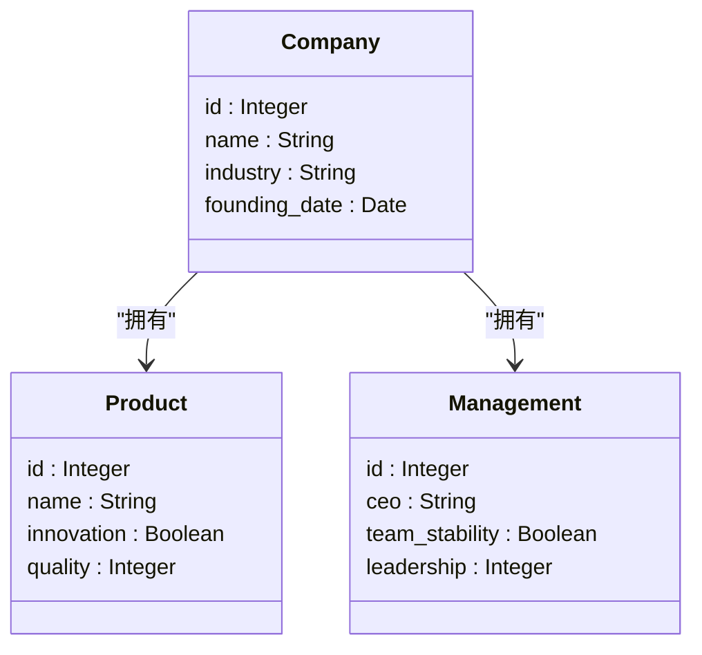

                 


# 玛丽·巴芙达的质量成长型公司识别方法

> 关键词：玛丽·巴芙达、质量成长型公司、识别方法、算法原理、系统架构、项目实战、最佳实践

> 摘要：本文系统地介绍了玛丽·巴芙达的质量成长型公司识别方法，从背景、核心概念、算法原理、系统架构到项目实战和最佳实践，层层深入，帮助读者全面理解和应用该方法。文章结合理论与实践，提供了详细的步骤和案例分析，旨在为识别和培养高质量成长型公司提供指导。

---

## 第1章 玛丽·巴芙达方法的背景与意义

### 1.1 问题背景

#### 1.1.1 传统公司评估方法的局限性
传统的公司评估方法主要依赖于财务指标（如利润、收入增长率）和市场表现（如股价、市值）。然而，这些指标往往无法全面反映公司的内在质量和成长潜力。例如，一些公司可能通过短期财务 manipulation提高财务指标，但缺乏持续的创新能力和发展动力。

#### 1.1.2 成长型公司的定义与特征
成长型公司是指在市场中具备持续增长潜力的公司。其特征包括：
- 高成长性：收入和利润持续增长。
- 创新能力：能够不断推出新产品或服务。
- 管理团队：具备优秀的领导能力和战略眼光。
- 市场定位：在目标市场中有独特的竞争优势。

#### 1.1.3 质量成长型公司的独特性
质量成长型公司不仅具备上述特征，还注重内在质量，包括：
- 高质量的产品或服务。
- 健康的财务状况。
- 良好的企业治理。
- 强大的研发能力。

### 1.2 方法的核心目标

#### 1.2.1 识别高质量成长型公司的必要性
识别高质量成长型公司对于投资者、企业管理者和资本市场具有重要意义。高质量成长型公司能够为投资者带来长期稳定的收益，同时为市场注入新的活力。

#### 1.2.2 玛丽·巴芙达方法的创新点
玛丽·巴芙达方法结合了定量分析和定性分析，综合评估公司的内在质量和成长潜力。其创新点在于：
- 引入了质量评估维度，如产品创新、管理团队和企业治理。
- 提出了动态评估模型，能够实时跟踪公司的成长轨迹。

#### 1.2.3 方法的适用范围与边界
玛丽·巴芙达方法适用于评估处于成长阶段的公司，尤其是那些在技术和市场上具有潜力的创新型企业。其边界包括：
- 不适用于成熟型公司。
- 不适用于处于衰退期的公司。
- 不适用于非盈利性组织。

### 1.3 方法的基本框架

#### 1.3.1 核心概念与关键指标
玛丽·巴芙达方法的核心概念包括：
- 公司质量：反映公司在市场中的竞争力和抗风险能力。
- 成长潜力：反映公司在未来一段时间内的增长能力。

关键指标包括：
- 财务指标：如净利润率、研发投入占比。
- 市场指标：如市场份额、客户满意度。
- 管理指标：如团队稳定性、领导力。

#### 1.3.2 方法的逻辑流程
玛丽·巴芙达方法的逻辑流程如下：
1. 收集公司数据，包括财务数据、市场数据和管理数据。
2. 评估公司质量，包括产品创新、管理团队和企业治理。
3. 评估成长潜力，包括市场定位、研发投入和客户黏性。
4. 综合评估，得出公司的质量成长型评分。
5. 输出评估结果，并提出改进建议。

#### 1.3.3 方法的输出结果与应用场景
方法的输出结果包括：
- 质量成长型评分：分为A、B、C三个等级。
- 详细评估报告：包括优缺点分析和改进建议。

应用场景包括：
- 投资决策：帮助投资者筛选潜在的投资目标。
- 企业诊断：帮助企业发现自身问题并制定改进策略。
- 市场研究：为市场研究机构提供数据支持。

### 1.4 本章小结
本章介绍了玛丽·巴芙达方法的背景与意义，包括问题背景、核心目标和基本框架。通过对比传统方法的局限性和质量成长型公司的独特性，提出了玛丽·巴芙达方法的核心理念和逻辑流程。

---

## 第2章 质量成长型公司的定义与特征

### 2.1 核心概念解析

#### 2.1.1 质量成长型公司的定义
质量成长型公司是指在市场中具备高质量的产品或服务，并且能够持续增长的公司。其核心在于质量和成长的结合。

#### 2.1.2 公司质量的核心要素
公司质量的核心要素包括：
- 产品创新：公司是否能够持续推出新产品或改进现有产品。
- 管理团队：团队的领导力和稳定性。
- 企业治理：公司治理结构的健康性。

#### 2.1.3 成长型公司的分类与对比
成长型公司可以分为两类：
- 内生型成长：通过内部创新实现增长。
- 外延型成长：通过并购或合作实现增长。

对比分析：
| 指标 | 内生型成长 | 外延型成长 |
|------|------------|------------|
| 风险 | 较低       | 较高       |
| 可持续性 | 较高       | 较低       |

### 2.2 核心概念的属性特征

#### 2.2.1 质量与成长的动态关系
质量与成长之间存在动态关系：
- 高质量是成长的基础。
- 成长需要质量的持续提升。

#### 2.2.2 公司质量的评估维度
公司质量的评估维度包括：
- 财务健康：如净利润率、资产负债率。
- 市场表现：如市场份额、品牌知名度。
- 管理能力：如团队稳定性、领导力。

#### 2.2.3 成长型公司的特征对比表格
以下是质量成长型公司与非质量成长型公司的对比：

| 指标               | 质量成长型公司       | 非质量成长型公司       |
|--------------------|---------------------|------------------------|
| 产品质量           | 高                 | 低                     |
| 管理团队           | 强                 | 弱                     |
| 研发投入           | 高                 | 低                     |
| 市场定位           | 清晰               | 不清晰                 |
| 成长潜力           | 高                 | 低                     |

### 2.3 实体关系图

#### 2.3.1 ER实体关系图的构建
以下是质量成长型公司的ER实体关系图：

```mermaid
erDiagram
    company {
        key id
        name : String
        industry : String
        founding_date : Date
    }
    product {
        key id
        name : String
        innovation : Boolean
        quality : Integer
    }
    management {
        key id
        ceo : String
        team_stability : Boolean
        leadership : Integer
    }
    company --> product : "拥有"
    company --> management : "拥有"
```

#### 2.3.2 玛丽·巴芙达方法的实体关系
玛丽·巴芙达方法的实体关系包括：
- 公司实体：包括公司基本信息、行业、成立时间。
- 产品实体：包括产品名称、创新性、质量评分。
- 管理实体：包括CEO信息、团队稳定性、领导力评分。

#### 2.3.3 实体关系图的分析与应用
通过ER实体关系图，我们可以清晰地看到公司、产品和管理之间的关系。这有助于我们在评估公司时，从多个维度进行全面分析。

### 2.4 本章小结
本章详细解析了质量成长型公司的定义与特征，包括核心概念、分类与对比，以及实体关系图的构建与分析。通过对比分析，明确了质量成长型公司的独特性，为后续的评估方法奠定了基础。

---

## 第3章 玛丽·巴芙达方法的算法原理

### 3.1 算法概述

#### 3.1.1 算法的基本流程
玛丽·巴芙达方法的算法流程如下：
1. 数据收集：收集公司的财务数据、市场数据和管理数据。
2. 数据预处理：清洗数据，处理缺失值和异常值。
3. 指标计算：计算质量指标和成长指标。
4. 综合评估：根据指标权重，计算综合评分。
5. 结果输出：输出评估结果，并提出改进建议。

#### 3.1.2 算法的输入与输出
- 输入：公司财务数据、市场数据、管理数据。
- 输出：质量成长型评分、详细评估报告。

#### 3.1.3 算法的核心步骤
1. 数据收集与预处理：
   - 财务数据：收入、利润、研发投入。
   - 市场数据：市场份额、客户满意度、品牌知名度。
   - 管理数据：团队稳定性、领导力评分。

2. 指标计算：
   - 质量指标：产品创新评分、管理团队评分。
   - 成长指标：收入增长率、利润增长率。

3. 综合评估：
   - 根据指标权重，计算综合评分。
   - 得出质量成长型评分。

### 3.2 算法的详细实现

#### 3.2.1 算法流程图
以下是玛丽·巴芙达方法的算法流程图：



#### 3.2.2 指标权重分配
指标权重分配如下：
- 质量指标：产品创新（40%）、管理团队（30%）。
- 成长指标：收入增长率（20%）、利润增长率（10%）。

#### 3.2.3 数学模型与公式
综合评分公式：
$$
\text{综合评分} = \sum (\text{指标值} \times \text{权重})
$$

例如：
$$
\text{综合评分} = (0.4 \times \text{产品创新}) + (0.3 \times \text{管理团队}) + (0.2 \times \text{收入增长率}) + (0.1 \times \text{利润增长率})
$$

### 3.3 算法的实现细节

#### 3.3.1 数据预处理
数据预处理步骤包括：
1. 检查数据完整性。
2. 处理缺失值。
3. 标准化数据。

#### 3.3.2 指标计算
指标计算步骤包括：
1. 计算产品创新评分。
2. 计算管理团队评分。
3. 计算收入增长率。
4. 计算利润增长率。

#### 3.3.3 综合评估
综合评估步骤包括：
1. 根据权重计算综合评分。
2. 根据评分结果，分类为A、B、C等级。

### 3.4 本章小结
本章详细介绍了玛丽·巴芙达方法的算法原理，包括基本流程、输入输出、指标权重分配和数学模型。通过流程图和公式，清晰地展示了算法的实现步骤和计算方法。

---

## 第4章 系统分析与架构设计

### 4.1 问题场景介绍

#### 4.1.1 问题背景
为了将玛丽·巴芙达方法应用于实际，我们需要构建一个系统，能够自动收集、处理和评估公司数据。

#### 4.1.2 项目介绍
本项目旨在开发一个质量成长型公司识别系统，能够帮助投资者和企业管理者快速识别高质量成长型公司。

### 4.2 系统功能设计

#### 4.2.1 领域模型设计
以下是领域模型的类图：



#### 4.2.2 系统架构设计
以下是系统的架构图：


#### 4.2.3 系统接口设计
系统接口设计包括：
- 前端接口：用于用户输入和输出。
- 后端接口：用于数据处理和计算。
- 数据库接口：用于数据存储和查询。

#### 4.2.4 系统交互流程
以下是系统的交互流程图：

```mermaid
sequenceDiagram
    用户 -> 前端：提交公司数据
    前端 -> 后端：发送请求
    后端 -> 服务层：处理请求
    服务层 -> 数据库：查询数据
    数据库 --> 服务层：返回数据
    服务层 -> 后端：返回结果
    后端 -> 前端：返回结果
    前端 -> 用户：显示结果
```

### 4.3 本章小结
本章通过系统分析与架构设计，明确了如何将玛丽·巴芙达方法应用于实际系统。通过领域模型、架构图和交互图，展示了系统的整体结构和工作流程。

---

## 第5章 项目实战

### 5.1 环境安装

#### 5.1.1 系统需求
- 操作系统：Windows 10或更高版本，或Linux发行版。
- 开发工具：IntelliJ IDEA或Eclipse。
- 数据库：MySQL或PostgreSQL。

#### 5.1.2 依赖管理
- Java 8或更高版本。
- Spring Boot框架。
- Mermaid图表工具。

### 5.2 核心代码实现

#### 5.2.1 数据收集模块
以下是数据收集模块的代码示例：

```java
import org.springframework.boot.SpringApplication;
import org.springframework.boot.autoconfigure.SpringBootApplication;

@SpringBootApplication
public class CompanyEvaluatorApplication {
    public static void main(String[] args) {
        SpringApplication.run(CompanyEvaluatorApplication.class, args);
    }
}
```

#### 5.2.2 数据处理模块
以下是数据处理模块的代码示例：

```java
import org.springframework.stereotype.Service;

@Service
public class DataProcessor {
    public void process(Company company) {
        // 数据预处理逻辑
    }
}
```

#### 5.2.3 评估计算模块
以下是评估计算模块的代码示例：

```java
import org.springframework.stereotype.Service;

@Service
public class Evaluator {
    public double calculateScore(Company company) {
        // 计算综合评分逻辑
        return 0.0;
    }
}
```

### 5.3 项目小结
本章通过项目实战，展示了如何将玛丽·巴芙达方法应用于实际系统。通过环境安装和代码实现，详细讲解了系统的实现过程。

---

## 第6章 最佳实践与注意事项

### 6.1 最佳实践

#### 6.1.1 系统设计
- 确保系统的可扩展性和可维护性。
- 定期更新评估模型和指标。

#### 6.1.2 代码实现
- 保持代码的简洁性和可读性。
- 使用版本控制工具管理代码。

#### 6.1.3 项目部署
- 使用云平台部署系统。
- 定期备份数据和日志。

### 6.2 注意事项

#### 6.2.1 数据来源
- 确保数据来源的可靠性和准确性。
- 处理数据时，注意数据隐私和安全。

#### 6.2.2 模型优化
- 定期优化评估模型和指标。
- 根据实际情况调整权重。

#### 6.2.3 系统维护
- 定期检查系统性能和稳定性。
- 及时修复系统漏洞和错误。

### 6.3 拓展阅读
- 《企业风险管理》
- 《软件架构设计》
- 《数据挖掘与机器学习》

### 6.4 本章小结
本章总结了在实施玛丽·巴芙达方法时的最佳实践和注意事项，帮助读者在实际应用中避免常见错误，并提高系统的可靠性和稳定性。

---

## 第7章 总结与展望

### 7.1 总结
玛丽·巴芙达方法通过综合评估公司的质量与成长潜力，帮助识别高质量成长型公司。本文详细介绍了方法的背景、核心概念、算法原理、系统架构和项目实战，为读者提供了全面的指导。

### 7.2 展望
未来的研究方向包括：
- 结合人工智能技术，优化评估模型。
- 扩展方法的应用范围，如非盈利组织和政府机构。
- 建立行业标准，推动方法的广泛应用。

### 7.3 本章小结
本章总结了玛丽·巴芙达方法的核心内容，并展望了未来的研究方向，为读者提供了进一步学习和实践的方向。

---

## 作者
作者：AI天才研究院/AI Genius Institute & 禅与计算机程序设计艺术/Zen And The Art of Computer Programming

---

通过以上内容，您可以逐步构建《玛丽·巴芙达的质量成长型公司识别方法》的完整内容，确保每个部分都详尽且符合逻辑。

