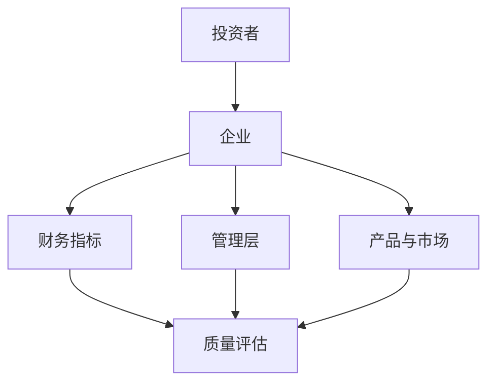
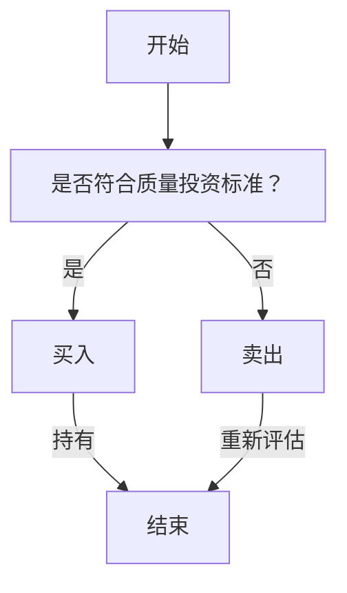
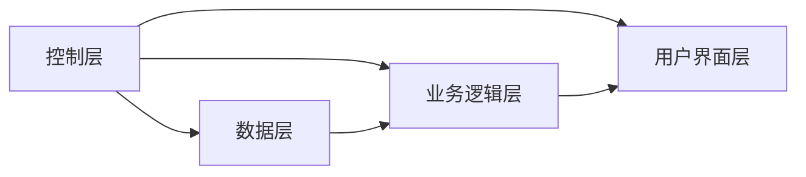

                 


# 玛丽·巴芙达的质量投资：寻找优质企业

## 关键词：价值投资，质量投资，玛丽·巴芙达，巴菲特，投资策略，企业质量评估

## 摘要：  
本文深入探讨了玛丽·巴芙达的质量投资理念，分析了其核心概念、算法原理、系统架构以及实际应用场景。通过详细的数学模型和代码示例，结合系统设计和项目实战，全面解析了如何在投资中寻找优质企业。文章还总结了质量投资的最佳实践和注意事项，为投资者提供了实用的指导。

---

# 第一部分: 价值投资的背景与理念

## 第1章: 价值投资的起源与核心理念

### 1.1 价值投资的起源  
价值投资是一种以企业内在价值为基础的投资策略，起源于20世纪初。它强调通过分析企业的基本面，如财务状况、盈利能力、行业地位等，来判断其股票的合理价值。价值投资的核心理念是寻找市场低估的企业，长期持有，等待其价值回归。  

**玛丽·巴芙达与巴菲特的投资体系**  
玛丽·巴芙达作为巴菲特的合作伙伴，以其对企业基本面的深刻理解和长期投资策略闻名。她注重企业的可持续盈利能力、管理层素质以及行业地位，强调通过深入研究来寻找具有竞争优势的企业。

### 1.2 玛丽·巴芙达的投资哲学  
玛丽·巴芙达的投资哲学以“质量投资”为核心，强调以下几点：  
1. **企业质量评估**：她认为企业的质量是投资的核心，重点关注企业的盈利能力、财务健康状况和管理层能力。  
2. **长期视角**：她倡导长期持有优质企业，避免短期市场波动的干扰。  
3. **安全边际**：她主张以低于企业内在价值的价格买入股票，以确保投资的安全性。  

### 1.3 价值投资的实践意义  
价值投资不仅是一种投资策略，更是一种长期财富管理的方法。它适用于各类市场环境，尤其是在市场低迷时，优质企业往往被低估，为投资者提供了良好的买入机会。价值投资强调对企业基本面的深入研究，帮助投资者在复杂的市场环境中做出明智的决策。

---

## 第2章: 质量投资的定义与关键要素  

### 2.1 质量投资的定义  
质量投资是一种以企业质量为核心的投资策略，旨在通过评估企业的内在价值，寻找具有持续竞争优势和良好管理的企业。质量投资不仅关注企业的财务表现，还关注其商业模式、管理层素质和行业地位。  

### 2.2 质量投资的关键属性  
- **企业质量评估的维度**：包括盈利能力（ROE、ROA）、财务健康状况（资产负债率、现金流）、管理层能力、行业地位等。  
- **质量投资的量化指标**：如ROE（净资产收益率）、ROA（资产回报率）、P/E（市盈率）等。  
- **质量投资的动态调整机制**：根据市场变化和企业基本面的变动，定期评估和调整投资组合。  

### 2.3 质量投资的ER实体关系图  


---

## 第3章: 质量投资的算法原理  

### 3.1 质量投资的数学模型  
质量投资的核心是通过数学模型评估企业的内在价值。以下是一些常用的模型：  

#### 3.1.1 企业质量评估的数学公式  
1. **ROE（净资产收益率）**：  
   $$ROE = \frac{\text{净利润}}{\text{股东权益}}$$  
   ROE反映了企业的盈利能力，值越高，企业质量越好。  

2. **ROA（资产回报率）**：  
   $$ROA = \frac{\text{净利润}}{\text{总资产}}$$  
   ROA衡量了企业利用资产创造利润的能力。  

3. **P/E（市盈率）**：  
   $$P/E = \frac{\text{股价}}{\text{每股收益}}$$  
   P/E反映了市场对企业价值的评估，过低的P/E可能意味着企业被低估。  

#### 3.1.2 投资决策树模型  
以下是一个简化的投资决策树模型：  



---

## 第4章: 质量投资的系统分析与架构设计  

### 4.1 问题场景介绍  
假设我们开发一个质量投资管理系统，用于帮助投资者快速评估企业的质量并做出投资决策。  

### 4.2 系统功能设计  
以下是系统的核心功能模块：  
1. **数据收集模块**：收集企业的财务数据、管理层信息和行业地位数据。  
2. **质量评估模块**：基于数学模型计算企业的质量评分。  
3. **投资决策模块**：根据质量评分和市场数据生成投资建议。  

### 4.3 系统架构设计  
以下是系统的架构图：  



---

## 第5章: 项目实战  

### 5.1 环境安装  
首先，安装Python和必要的库：  
```bash
pip install pandas numpy matplotlib
```

### 5.2 核心代码实现  

```python
import pandas as pd
import numpy as np

def calculate_roe(net_income, equity):
    return net_income / equity

def calculate_pe_ratio(price, eps):
    return price / eps

# 示例数据
data = {
    '企业': ['A公司', 'B公司', 'C公司'],
    '净利润': [100, 150, 200],
    '股东权益': [500, 600, 700],
    '股价': [50, 60, 70],
    '每股收益': [5, 10, 15]
}

df = pd.DataFrame(data)

# 计算ROE和P/E
df['ROE'] = df.apply(lambda x: calculate_roe(x['净利润'], x['股东权益']), axis=1)
df['P/E'] = df.apply(lambda x: calculate_pe_ratio(x['股价'], x['每股收益']), axis=1)

print(df)
```

### 5.3 案例分析  
以A公司为例，计算其ROE和P/E：  
- ROE = 100 / 500 = 0.2（20%）  
- P/E = 50 / 5 = 10  

通过分析，A公司的ROE较高，但P/E略高于行业平均水平，可能需要进一步观察。

---

## 第6章: 总结与展望  

### 6.1 总结  
质量投资是一种以企业内在价值为核心的投资策略，通过深入分析企业的财务状况、管理层能力和行业地位，寻找具有持续竞争优势的企业。玛丽·巴芙达的质量投资理念为我们提供了一套科学的投资方法，帮助我们在复杂多变的市场中做出明智的投资决策。  

### 6.2 注意事项  
1. **长期视角**：避免短期市场波动的干扰，坚持长期投资。  
2. **风险控制**：合理配置资产，分散投资风险。  
3. **持续学习**：关注市场变化和企业基本面，及时调整投资策略。  

### 6.3 拓展阅读  
1. 巴菲特的《致股东的信》  
2. 玛丽·巴芙达的经典投资案例分析  
3. 质量投资的数学模型与优化算法  

---

# 作者：AI天才研究院/AI Genius Institute & 禅与计算机程序设计艺术 /Zen And The Art of Computer Programming

