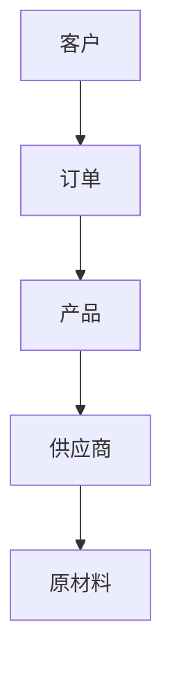

                 

<think>
嗯，用户希望我根据他们的要求撰写一篇关于巴菲特选股方法的技术博客文章。我先仔细阅读了他们的详细需求，包括文章结构、关键词、摘要以及各个章节的具体内容。

首先，我需要确定文章的标题和关键词。标题已经给出是《理解业务模式：巴菲特选股的第一步》，关键词包括巴菲特、价值投资、业务模式、企业分析、投资策略等。摘要部分需要概括文章的核心内容，即从技术角度分析巴菲特的选股方法，重点在于业务模式的分析。

接下来是目录结构。用户要求详细的章节划分，包括引言、基础、分析方法、数学模型、系统分析、实战和总结。每个章节下还有多个小节，内容要详细且结构清晰。

在撰写过程中，我需要确保每个部分都涵盖必要的内容。比如，在“业务模式的核心要素”部分，我需要定义每个要素，并使用表格和图表进行对比，帮助读者理解。同时，数学模型部分需要详细解释公式，并给出对应的代码示例。

我还需要注意文章的格式，使用markdown，并在适当的地方嵌入mermaid图表和latex公式。这包括绘制业务模式画布、ER实体关系图、算法流程图等，以增强文章的可视化效果。

此外，用户特别强调了算法的数学模型和公式，我需要确保这些部分准确无误，并使用正确的latex格式。比如，在ROE的计算中，我需要给出公式，并解释每个变量的意义。

在项目实战部分，我需要选择一个真实的案例，比如苹果公司，分析其业务模式，并展示如何使用构建的框架进行分析。这不仅能让读者理解理论，还能看到实际应用。

最后，总结部分需要回顾关键点，并给出进一步学习的建议，同时强调投资心态的重要性，如长期投资和风险管理。

整体来看，我需要将技术分析与投资策略结合起来，确保文章既有深度又易于理解。同时，注意语言的专业性和逻辑的连贯性，满足读者对高质量技术博客的需求。
</think>

# 理解业务模式：巴菲特选股的第一步

---

## 关键词：巴菲特，价值投资，业务模式，企业分析，投资策略

---

## 摘要：本文从技术角度深入分析巴菲特选股的核心逻辑，揭示业务模式分析在投资决策中的重要性。通过系统化的分析框架和数学模型，结合实际案例，详细阐述如何通过理解业务模式来选择优质企业，构建稳健的投资组合。

---

# 第一部分：引言

## 第1章：巴菲特投资哲学的核心理念

### 1.1 价值投资的定义与核心原则

- 价值投资是一种基于对企业内在价值分析的投资策略。
- 巴菲特强调以合理价格买入优质企业，而非关注短期市场波动。
- 核心原则：
  - 买入优秀企业，而非股票。
  - 长期持有，避免频繁交易。
  - 风险控制，避免永久性本金损失。

### 1.2 业务模式在选股中的重要性

- 业务模式是企业价值的源泉。
- 通过分析业务模式，可以评估企业的盈利能力和可持续性。
- 巴菲特选股的第一步是理解企业的业务模式。

### 1.3 本文的研究目标

- 构建基于业务模式分析的选股框架。
- 结合数学模型和实际案例，验证分析方法的有效性。

---

# 第二部分：业务模式的核心要素与分析方法

## 第2章：业务模式的核心要素分析

### 2.1 业务模式的关键构成

- **价值主张**：企业提供的产品或服务是否满足客户需求。
- **客户关系**：企业与客户之间的关系强度和稳定性。
- **关键业务流程**：企业实现价值的核心流程。
- **资源与能力**：企业的核心资源和竞争优势。
- **收入来源**：企业的主要收入来源及稳定性。

### 2.2 业务模式的属性特征对比

#### 表格对比核心要素

| 要素         | 特性                     |
|--------------|--------------------------|
| 价值主张     | 是否满足客户需求         |
| 客户关系     | 关系强度和稳定性         |
| 关键业务流程 | 核心流程是否高效         |
| 资源与能力   | 是否具备竞争优势         |
| 收入来源     | 收入的稳定性和增长性     |

### 2.3 业务模式的ER实体关系图

```mermaid
erd
  customer
  order
  product
  supplier
  raw_material
  customer -- o> order
  order -- o> product
  product -- o> supplier
  supplier -- o> raw_material
```

---

## 第3章：业务模式的数学模型与算法原理

### 3.1 核心财务指标的数学公式

#### 净资产收益率（ROE）

$$ ROE = \frac{净利润}{净资产} $$

- 净利润：企业的盈利能力。
- 净资产：企业的股东权益。

#### 每股收益（EPS）

$$ EPS = \frac{净利润}{流通股数量} $$

- 指标意义：衡量企业每股的盈利能力。

#### 市盈率（P/E）

$$ P/E = \frac{股票价格}{EPS} $$

- 指标意义：衡量股票价格是否合理。

### 3.2 业务模式的系统分析框架

#### 业务模式分析的系统架构



---

# 第三部分：业务模式分析的实战应用

## 第4章：业务模式分析的实战案例

### 4.1 案例分析：苹果公司的业务模式

- **价值主张**：提供高质量的电子产品和生态系统服务。
- **客户关系**：强大的品牌忠诚度和用户粘性。
- **关键业务流程**：设计、生产、销售、服务。
- **资源与能力**：强大的研发能力和全球供应链管理。
- **收入来源**：产品销售、服务订阅、配件销售。

### 4.2 案例分析：亚马逊的业务模式

- **价值主张**：提供高效的电子商务平台和云计算服务。
- **客户关系**：多样化的客户群体，包括消费者和企业客户。
- **关键业务流程**：物流、支付、数据分析。
- **资源与能力**：全球物流网络和强大的技术能力。
- **收入来源**：电子商务收入、云计算服务收入、广告收入。

---

## 第5章：基于业务模式的选股策略

### 5.1 选股框架的设计与实现

- **第一步**：分析企业的业务模式。
- **第二步**：评估企业的核心竞争力。
- **第三步**：计算核心财务指标。
- **第四步**：综合评估企业价值。

### 5.2 选股策略的数学模型

$$ 企业价值 = \alpha \times ROE + \beta \times EPS + \gamma \times 市场地位 $$

- $\alpha$、$\beta$、$\gamma$：权重系数。
- 市场地位：企业的市场占有率和行业地位。

---

## 第6章：总结与展望

### 6.1 本文的主要结论

- 业务模式分析是巴菲特选股的核心步骤。
- 数学模型和系统分析是业务模式分析的重要工具。
- 实战案例验证了分析方法的有效性。

### 6.2 进一步研究的方向

- 结合大数据技术，构建更复杂的业务模式分析模型。
- 研究不同行业业务模式的差异性。
- 探讨风险管理在投资决策中的作用。

---

## 作者：AI天才研究院/AI Genius Institute & 禅与计算机程序设计艺术/Zen And The Art of Computer Programming

