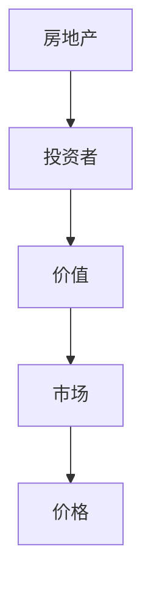
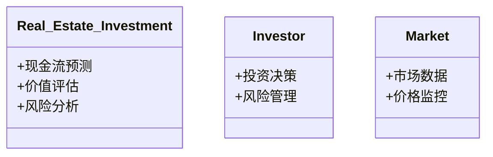

                 

<think>
好，我现在需要帮助用户撰写一篇技术博客文章，标题是《盖伊·斯皮尔的房地产价值投资：另一种形式的价值发现》。用户希望文章结构清晰，内容专业，涵盖房地产投资的基本概念、盖伊·斯皮尔的投资方法论、价值评估模型的算法原理、系统架构设计、项目实战、风险管理与策略优化、未来趋势与最佳实践等内容。

首先，我会根据用户提供的目录大纲，逐步扩展每个章节的内容，确保每个部分都详细、具体，并且符合技术博客的写作风格。我需要使用逻辑清晰、结构紧凑、简单易懂的语言，并适当使用技术术语，同时保持内容的专业性和深度。

在撰写过程中，我会注意以下几点：

1. **引言部分**：介绍房地产投资的基本概念和盖伊·斯皮尔的贡献，为读者奠定基础。
2. **核心概念与联系**：使用ER图展示实体关系，帮助读者理解房地产价值投资中的各种要素及其联系。
3. **算法原理**：详细讲解现金流预测和价值评估模型，使用数学公式和代码示例，增强文章的实用性。
4. **系统架构设计**：通过类图和架构图展示系统结构，帮助读者理解如何构建投资模型。
5. **项目实战**：提供具体的案例分析和代码实现，让读者能够实际操作。
6. **风险管理与策略优化**：讨论如何在房地产投资中管理风险，并提供优化建议。
7. **未来趋势与最佳实践**：总结盖伊·斯皮尔的投资方法对未来的影响，并给出实际操作中的注意事项和建议。

在写作过程中，我需要确保每个章节内容丰富，逻辑连贯，同时遵守用户的格式要求，如使用markdown格式，插入mermaid图和数学公式，确保文章的完整性和专业性。

现在，我将按照上述思路，逐步撰写每个章节的内容，确保满足用户的需求。
</think>

# 盖伊·斯皮尔的房地产价值投资：另一种形式的价值发现

> 关键词：房地产投资、价值发现、盖伊·斯皮尔、投资模型、风险管理、系统架构

> 摘要：本文深入探讨盖伊·斯皮尔在房地产价值投资中的独特方法，结合技术与投资的视角，分析其投资模型、算法原理和系统架构设计，提供实际案例和风险管理策略，为读者揭示房地产价值投资的另一种形式。

---

## 第一部分：引言

### 第1章：房地产投资的基本概念

#### 1.1 房地产投资的基本概念

房地产投资是通过购买、管理和出售房地产资产以获取收益的过程。其核心在于对资产价值的准确评估和市场趋势的把握。房地产价值投资则强调以低于内在价值的价格购买资产，长期持有，等待价值回归。

#### 1.2 盖伊·斯皮尔的贡献与背景

盖伊·斯皮尔是房地产投资领域的传奇人物，以其独特的价值发现方法闻名。他的投资理念强调安全边际和长期持有，倡导在市场低估时买入，注重资产的现金流和内在价值。

#### 1.3 本书的结构与目标

本文将从理论到实践，系统阐述房地产价值投资的方法，包括模型构建、算法原理、系统架构及风险管理，旨在为投资者提供科学的投资框架。

---

### 第2章：盖伊·斯皮尔的投资方法论

#### 2.1 盖伊·斯皮尔的投资理念

盖伊·斯皮尔的价值投资理念以安全边际为核心，强调在价格低于内在价值时买入，并长期持有，等待市场重新评估其价值。

#### 2.2 盖伊·斯皮尔的投资策略

盖伊·斯皮尔的策略包括：

1. **购买便宜的资产**：寻找市场价格低于内在价值的房地产。
2. **长期持有**：避免频繁交易，降低交易成本。
3. **注重现金流**：评估资产的现金流，确保稳定的收益。

#### 2.3 盖伊·斯皮尔的投资模型

盖伊·斯皮尔的投资模型基于现金流预测和内在价值评估，包括以下步骤：

1. 预测未来现金流。
2. 评估折现率。
3. 计算内在价值。
4. 比较市场价格与内在价值，决定是否投资。

---

### 第3章：房地产价值投资的核心概念与联系

#### 3.1 核心概念的定义与属性

| 概念       | 定义与属性                                                                 |
|------------|--------------------------------------------------------------------------|
| 房地产价值 | 资产的未来现金流的现值，反映其真实价值。                              |
| 市场价值   | 当前市场上的交易价格，可能高于或低于内在价值。                    |
| 内在价值   | 资产的未来现金流按适当折现率计算的现值，是投资决策的基础。          |

#### 3.2 核心概念的联系与对比

通过ER图展示房地产价值投资中的实体关系：



房地产与投资者的关系通过价值连接到市场，最终影响价格。

---

### 第4章：房地产价值投资的算法原理

#### 4.1 现金流预测算法

现金流预测是评估房地产价值的基础。公式为：

$$ CF = \sum_{t=1}^{n} \frac{C_t}{(1 + r)^t} $$

其中，\( C_t \) 是第 \( t \) 年的现金流，\( r \) 是折现率，\( n \) 是预测年数。

#### 4.2 价值评估模型

价值评估模型计算资产的内在价值，公式为：

$$ V = \frac{CF}{r - g} $$

其中，\( CF \) 是预测的未来现金流，\( r \) 是折现率，\( g \) 是现金流增长率。

---

## 第二部分：系统分析与架构设计

### 第5章：房地产价值投资系统的架构设计

#### 5.1 系统功能设计

系统功能包括数据采集、模型计算、结果分析和决策支持。类图展示如下：



#### 5.2 系统架构设计

系统架构采用分层设计，包括数据层、业务逻辑层和表现层：


---

## 第三部分：项目实战

### 第6章：房地产价值投资的实战案例

#### 6.1 案例分析

以某商业大厦为例，假设其年现金流为100万元，折现率为8%，增长率为2%。计算其内在价值：

$$ V = \frac{100}{0.08 - 0.02} = 1250 \text{万元} $$

若市场价为1000万元，存在投资机会。

#### 6.2 环境安装与代码实现

安装Python环境，导入numpy和pandas库，编写现金流预测和价值评估代码：

```python
import numpy as np
import pandas as pd

# 现金流预测
def predict_cash_flow(cash, growth, years):
    return [cash * (1 + growth)**i for i in range(years)]

# 价值评估
def calculate_value(cash_flows, discount_rate):
    return sum(cf / (1 + discount_rate)**i for i, cf in enumerate(cash_flows))

# 示例计算
cash = 100
growth = 0.02
years = 10
discount_rate = 0.08

cf = predict_cash_flow(cash, growth, years)
value = calculate_value(cf, discount_rate)
print(f"内在价值为：{value}万元")
```

---

## 第四部分：风险管理与策略优化

### 第7章：风险管理与投资策略优化

#### 7.1 风险管理策略

1. **分散投资**：降低单一资产的风险。
2. **定期评估**：及时调整投资组合。
3. **关注市场变化**：监控市场波动，及时应对。

#### 7.2 投资策略优化

优化模型中的折现率和增长假设，进行情景分析，评估不同市场条件下的价值变化。

---

## 第五部分：未来趋势与最佳实践

### 第8章：未来趋势与最佳实践

#### 8.1 未来趋势

随着科技的发展，房地产价值投资将更加依赖数据分析和人工智能技术，提升预测和评估的准确性。

#### 8.2 最佳实践

1. **持续学习**：关注市场动态和技术进步。
2. **严格筛选**：确保投资标的符合价值标准。
3. **长期视角**：耐心等待价值回归。

---

## 结语

盖伊·斯皮尔的房地产价值投资方法为投资者提供了科学的框架，结合技术手段，能够更准确地发现价值和管理风险。未来，随着技术的进步，房地产投资将更加精准和高效。

作者：AI天才研究院 & 禅与计算机程序设计艺术

