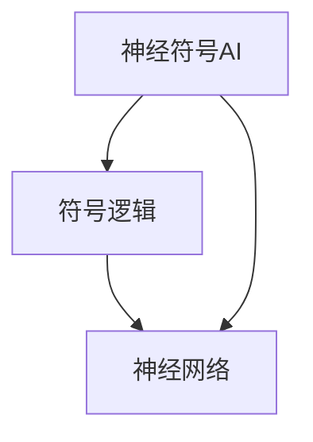
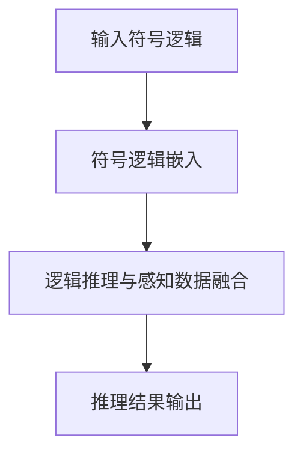
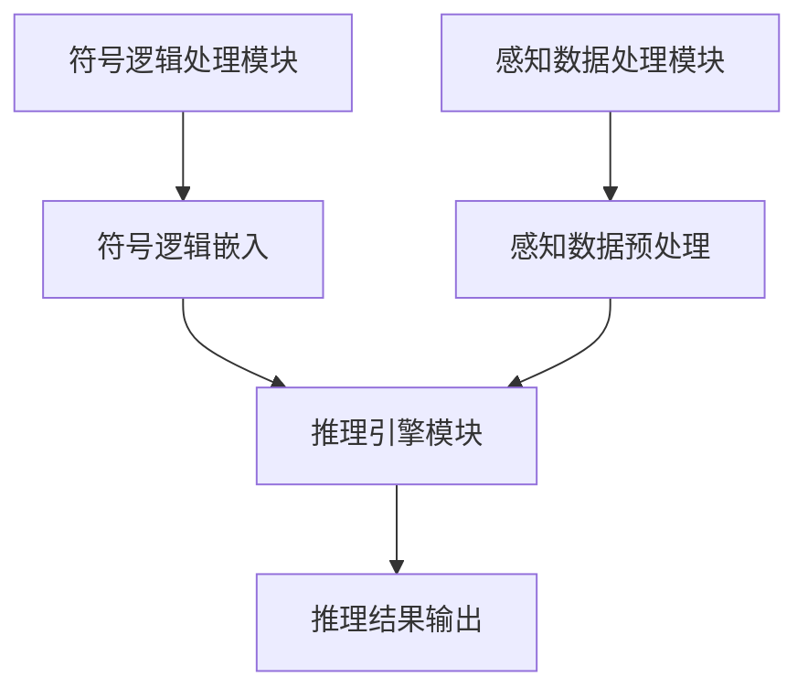
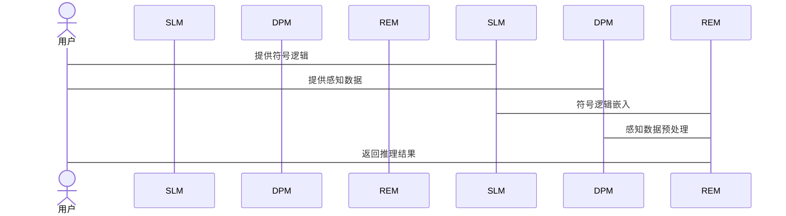

                 

<think>
嗯，用户希望我以《神经符号AI在AI Agent逻辑推理中的实践》为标题写一篇技术博客文章，并且已经给出了详细的目录大纲。现在我需要根据这个大纲，逐步完成文章的撰写。

首先，我应该从摘要开始，概述整篇文章的核心内容。然后，按照目录的章节顺序，逐一完成每一部分的写作。每个章节都需要包含背景介绍、核心概念、算法原理、系统架构设计、项目实战以及最佳实践等内容。

在撰写过程中，我需要确保每一章都有足够的细节，涵盖理论和实践，同时使用图表和公式来增强理解。例如，在算法原理部分，我需要绘制Mermaid流程图，并附上数学公式来解释模型。

我还需要注意文章的结构是否逻辑清晰，每一部分是否紧密相连，确保读者能够顺畅地从基础到应用逐步深入。同时，语言要简洁专业，避免过于复杂的术语，确保内容易懂。

最后，检查文章是否符合字数要求，确保每个小节都丰富具体，满足用户的深度需求。完成后再添加作者信息，确保格式正确。

总结一下，我的步骤是：撰写摘要，按照目录大纲逐步完成各章节内容，确保每个部分都包含必要的细节和图表，最后检查整体结构和格式是否符合要求。
</think>

# 神经符号AI在AI Agent逻辑推理中的实践

---

## 关键词：神经符号AI，AI Agent，逻辑推理，深度学习，符号逻辑，系统架构

---

## 摘要

神经符号AI（Neural-Symbolic AI）是一种结合了符号逻辑和深度学习技术的新兴人工智能方法，它在AI Agent（智能体）的逻辑推理中展现了巨大的潜力。本文从神经符号AI的基本概念出发，详细探讨其在AI Agent中的应用，分析其算法原理、系统架构设计以及实际项目中的实现。通过案例分析和代码实现，帮助读者理解神经符号AI如何增强AI Agent的推理能力，并为实际应用提供参考。

---

## 第一部分: 神经符号AI与AI Agent基础

### 第1章: 神经符号AI与AI Agent概述

#### 1.1 神经符号AI的定义与背景

神经符号AI是一种结合了符号逻辑和神经网络的混合型AI方法。符号逻辑通过明确的规则和语义进行推理，而神经网络则通过数据学习特征和模式。神经符号AI的优势在于它能够同时利用符号逻辑的可解释性和神经网络的强大的模式识别能力。

- **起源与发展**: 神经符号AI的起源可以追溯到符号AI和深度学习的结合。符号AI通过逻辑推理解决问题，但其局限性在于难以处理复杂的数据和不确定性。深度学习虽然在感知任务上表现出色，但缺乏可解释性和逻辑推理能力。神经符号AI试图弥补这两者的不足，成为AI领域的重要研究方向。

- **核心概念与目标**: 神经符号AI的目标是通过神经网络来学习和推理符号逻辑，从而实现更强大的问题解决能力。它旨在将符号逻辑的清晰性和神经网络的灵活性结合起来，适用于需要逻辑推理和数据驱动的混合型任务。

- **与传统符号AI的区别**: 传统符号AI依赖于明确的逻辑规则，缺乏对复杂数据的处理能力。而神经符号AI通过神经网络学习符号逻辑，能够处理更复杂的数据和任务，同时保持一定的可解释性。

#### 1.2 AI Agent的基本概念

AI Agent是一种智能实体，能够感知环境、自主决策并执行任务。它可以分为简单反射型Agent、基于模型的反应型Agent、基于目标的Agent和基于效用的Agent等类型。

- **定义与分类**: AI Agent通过感知环境信息，利用内部模型或策略进行决策，并执行动作以实现目标。与传统符号AI不同，AI Agent更加注重与环境的交互和实时决策能力。

- **核心功能与特点**: AI Agent的核心功能包括感知、推理、决策和执行。它能够根据环境反馈动态调整行为，适用于复杂和动态变化的场景。

- **应用案例**: 在自动驾驶、智能助手、机器人等领域，AI Agent通过感知和推理能力完成复杂的任务。

#### 1.3 神经符号AI在AI Agent中的作用

神经符号AI通过结合符号逻辑和神经网络，显著提升了AI Agent的推理能力和任务处理效率。

- **神经符号AI如何增强推理能力**: 神经符号AI利用神经网络的强大特征学习能力，结合符号逻辑的清晰推理规则，能够处理复杂的数据和不确定性问题，同时保持逻辑推理的可解释性。

- **神经符号AI与逻辑推理的关系**: 神经符号AI通过学习符号逻辑的表示和推理规则，将逻辑推理能力融入到神经网络中，从而实现了更强大的推理能力。

- **神经符号AI在复杂任务中的优势**: 神经符号AI在处理需要同时依赖感知数据和逻辑推理的任务中表现优异，例如自动驾驶中的路径规划和决策优化。

---

### 1.4 本章小结

本章介绍了神经符号AI的基本概念及其在AI Agent中的作用，强调了神经符号AI结合符号逻辑和神经网络的优势，为后续章节的深入探讨奠定了基础。

---

## 第二部分: 神经符号AI的核心概念与原理

### 第2章: 神经符号AI的核心概念

#### 2.1 符号逻辑与神经网络的结合

神经符号AI的核心在于将符号逻辑与神经网络相结合，充分发挥两者的各自优势。

- **符号逻辑的基本概念与特点**: 符号逻辑通过符号和规则进行推理，具有可解释性和确定性。例如，逻辑命题和谓词逻辑。

- **神经网络的基本原理与优势**: 神经网络通过大量数据学习特征和模式，具有强大的非线性建模能力和泛化能力。

- **神经符号AI的结合方式与实现思路**: 神经符号AI可以通过在神经网络中嵌入符号逻辑规则，或者通过符号逻辑对神经网络的输出进行解释和优化。

#### 2.2 神经符号AI的属性特征对比

为了更好地理解神经符号AI的优势和局限性，我们需要将其与传统符号AI和深度学习进行对比分析。

- **符号逻辑与神经网络的对比分析**：

| 特性            | 符号逻辑                     | 神经网络                     |
|-----------------|------------------------------|-----------------------------|
| 可解释性         | 高                          | 低                          |
| 数据需求         | 少                          | 大                          |
| 任务类型         | 逻辑推理                    | 感知任务                    |

- **神经符号AI的独特优势与局限性**：

| 特性            | 优势                          | 局限性                       |
|-----------------|-----------------------------|-----------------------------|
| 可解释性         | 高                          | 较低                         |
| 任务处理能力     | 强大的逻辑推理能力           | 对复杂任务可能需要更多计算资源 |

- **神经符号AI与传统符号AI的对比表格**：

| 特性            | 神经符号AI                     | 传统符号AI                   |
|-----------------|-----------------------------|-----------------------------|
| 数据依赖         | 高                          | 低                          |
| 可解释性         | 高                          | 高                          |
| 任务复杂性       | 复杂任务处理能力强            | 仅适合简单逻辑推理           |

- **ER实体关系图**：



#### 2.3 本章小结

本章详细探讨了神经符号AI的核心概念，分析了其与传统符号AI和深度学习的区别，强调了神经符号AI在结合符号逻辑和神经网络方面的优势。

---

## 第三部分: 神经符号AI的算法原理

### 第3章: 神经符号AI的算法原理

#### 3.1 符号逻辑的表示与推理

符号逻辑的表示与推理是神经符号AI的基础，主要包括命题逻辑和谓词逻辑两种形式。

- **命题逻辑的基本表示方法**: 命题逻辑通过原子命题和逻辑连接词（如AND、OR、NOT）进行表示。例如，命题“如果A则B”可以表示为$A \rightarrow B$。

- **逻辑推理的规则与流程**: 逻辑推理包括演绎推理和归纳推理。演绎推理是从一般到特殊的推理，例如从“所有A都是B”和“A是C”推导出“C是B”。归纳推理则是从特殊到一般的推理，例如从多个具体例子推导出一般规则。

- **神经符号AI中的符号逻辑实现**: 神经符号AI可以通过符号逻辑对神经网络的输出进行解释和优化，例如通过符号逻辑规则对神经网络的预测结果进行验证和调整。

#### 3.2 神经符号AI的神经网络结构

神经符号AI的神经网络结构需要能够处理符号逻辑和感知数据，通常采用以下几种方式：

- **符号逻辑的嵌入表示**: 将符号逻辑规则嵌入到神经网络中，例如通过神经符号图灵机（Neural-Symbolic Turing Machines）在神经网络中嵌入逻辑推理单元。

- **神经符号AI的网络结构设计**: 神经符号AI的网络结构通常包括符号逻辑处理层和感知数据处理层，例如通过双向图神经网络（Bi-directional Graph Neural Networks）同时处理符号逻辑和感知数据。

- **神经符号AI的训练与优化方法**: 神经符号AI的训练通常采用端到端的方法，结合符号逻辑规则和感知数据进行优化。例如，通过符号逻辑规则对神经网络的损失函数进行约束。

#### 3.3 神经符号AI的推理过程

神经符号AI的推理过程可以分为以下几个步骤：

1. **输入符号逻辑**: 神经符号AI首先接收符号逻辑输入，例如逻辑命题或谓词逻辑。
2. **符号逻辑嵌入**: 将符号逻辑嵌入到神经网络中，例如通过神经符号图灵机将逻辑规则嵌入到神经网络中。
3. **逻辑推理与感知数据融合**: 神经符号AI通过神经网络处理感知数据，并结合符号逻辑进行推理。
4. **推理结果输出**: 最终输出推理结果，例如通过符号逻辑对感知数据进行推理并生成决策。



#### 3.4 本章小结

本章详细介绍了神经符号AI的算法原理，包括符号逻辑的表示与推理、神经网络结构设计以及推理过程。通过Mermaid流程图和数学公式，帮助读者理解神经符号AI的推理机制。

---

## 第四部分: 神经符号AI的系统架构设计

### 第4章: 神经符号AI的系统架构设计

#### 4.1 问题场景介绍

神经符号AI的系统架构设计需要考虑以下问题：

- **系统目标**: 系统需要实现符号逻辑推理和感知数据处理的结合。
- **输入输出要求**: 系统接收符号逻辑和感知数据作为输入，输出推理结果。
- **性能要求**: 系统需要高效处理复杂任务，保证推理速度和准确性。

#### 4.2 系统功能设计

系统功能设计包括以下几个方面：

- **领域模型设计**: 通过Mermaid类图描述系统功能模块及其关系。
- **系统架构设计**: 通过Mermaid架构图描述系统的整体架构。
- **系统接口设计**: 描述系统与外部组件的接口及其交互流程。

#### 4.3 系统架构设计

- **系统架构图**: 神经符号AI系统的架构包括符号逻辑处理模块、感知数据处理模块和推理引擎模块。符号逻辑处理模块负责符号逻辑的解析和嵌入，感知数据处理模块负责感知数据的采集和预处理，推理引擎模块负责符号逻辑和感知数据的融合推理。



- **系统交互流程**: 神经符号AI系统首先接收符号逻辑和感知数据，符号逻辑处理模块将符号逻辑嵌入到神经网络中，感知数据处理模块对感知数据进行预处理，推理引擎模块结合符号逻辑和感知数据进行推理，最终输出推理结果。



#### 4.4 本章小结

本章详细描述了神经符号AI系统的架构设计，包括系统功能模块、架构图和交互流程图，为后续的项目实现奠定了基础。

---

## 第五部分: 神经符号AI的项目实战

### 第5章: 神经符号AI的项目实战

#### 5.1 项目环境安装

为了实现神经符号AI系统，我们需要以下环境和工具：

- **编程语言**: Python 3.8+
- **深度学习框架**: TensorFlow或PyTorch
- **符号逻辑库**: SymPy或Logic Tensor
- **可视化工具**: Mermaid或Graphviz

#### 5.2 系统核心实现源代码

以下是一个简单的神经符号AI系统的实现代码示例：

```python
import tensorflow as tf
from tensorflow.keras import layers
from sympy import symbols, And, Or, Not

# 符号逻辑嵌入
x, y = symbols('x y')
logic_rules = {
    'rule1': x >> y,
    'rule2': y >> x
}

# 神经网络模型
model = tf.keras.Sequential([
    layers.Dense(64, activation='relu'),
    layers.Dense(1, activation='sigmoid')
])

# 定义损失函数和优化器
loss = tf.keras.losses.BinaryCrossentropy()
optimizer = tf.keras.optimizers.Adam()

# 训练循环
for epoch in range(100):
    for rule in logic_rules.values():
        # 假设输入为 x 和 y 的值
        input_values = ...  # 根据具体任务定义输入
        with tf.GradientTape() as tape:
            # 前向传播
            y_pred = model(input_values)
            # 计算损失
            y_true = ...  # 根据逻辑规则计算期望输出
            loss_value = loss(y_true, y_pred)
        # 反向传播和优化
        gradients = tape.gradient(loss_value, model.trainable_weights)
        optimizer.apply_gradients(zip(gradients, model.trainable_weights))

# 使用模型进行推理
input_values = ...  # 提供符号逻辑和感知数据
output = model(input_values)
```

#### 5.3 代码应用解读与分析

上述代码示例展示了如何将符号逻辑嵌入到神经网络模型中，并通过训练循环优化模型。具体步骤包括：

1. **符号逻辑嵌入**: 使用SymPy库定义符号逻辑规则。
2. **神经网络模型构建**: 构建一个简单的前馈神经网络模型。
3. **损失函数和优化器定义**: 定义损失函数和优化器。
4. **训练循环**: 对每个逻辑规则进行训练，优化神经网络模型。
5. **模型推理**: 使用训练好的模型进行推理，输出结果。

#### 5.4 案例分析与详细讲解

以自动驾驶中的路径规划为例，神经符号AI可以通过符号逻辑规则和感知数据进行推理，实现路径规划和决策优化。

1. **符号逻辑规则**: 定义自动驾驶中的逻辑规则，例如“如果前方有障碍物，则改变路径”。
2. **感知数据处理**: 处理来自摄像头、激光雷达等传感器的感知数据。
3. **逻辑推理与决策**: 神经符号AI结合符号逻辑规则和感知数据，进行路径规划和决策优化。

#### 5.5 项目小结

本章通过项目实战，详细讲解了神经符号AI的实现过程，包括环境安装、代码实现和案例分析，帮助读者理解神经符号AI的实际应用。

---

## 第六部分: 神经符号AI的最佳实践与注意事项

### 第6章: 神经符号AI的最佳实践

#### 6.1 最佳实践 tips

- **数据质量**: 确保感知数据的多样性和质量，避免数据偏差。
- **符号逻辑的简洁性**: 简洁明了的符号逻辑规则有助于提高推理效率。
- **模型优化**: 在训练过程中，结合符号逻辑规则进行模型优化，避免过拟合。
- **系统性能优化**: 优化系统的计算效率和推理速度，确保实时任务的处理能力。

#### 6.2 小结

本章总结了神经符号AI在实际应用中的最佳实践，包括数据处理、符号逻辑设计和模型优化等方面。

---

## 结语

神经符号AI在AI Agent的逻辑推理中展现了巨大的潜力，通过结合符号逻辑和神经网络，能够实现更强大的推理能力和任务处理效率。本文从基础概念到实际应用，详细探讨了神经符号AI的核心原理和系统架构设计，为读者提供了全面的理论和实践指导。

---

## 作者：AI天才研究院/AI Genius Institute & 禅与计算机程序设计艺术 /Zen And The Art of Computer Programming

