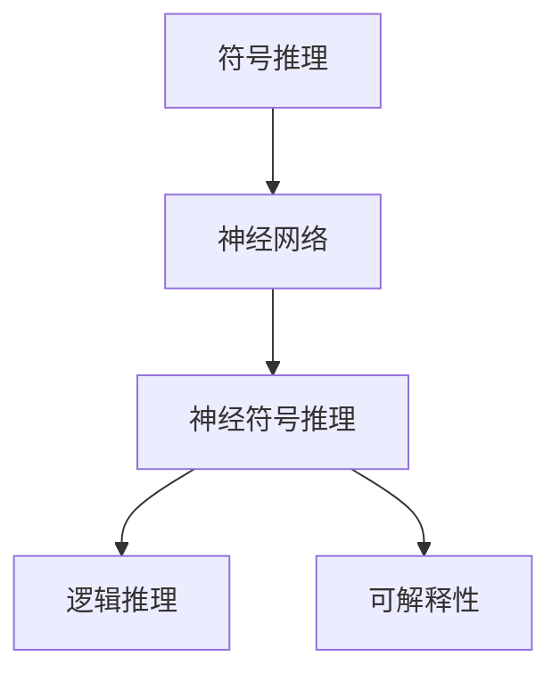
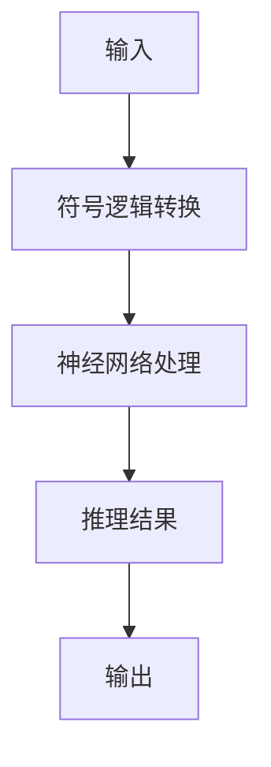
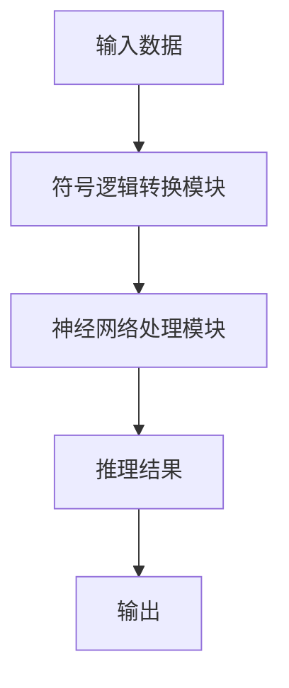

                 


# 神经符号推理：增强AI Agent的逻辑分析能力

---

## 关键词：
神经符号推理, AI Agent, 逻辑分析能力, 神经网络, 符号推理, 可解释性, 逻辑推理

---

## 摘要：
神经符号推理是一种结合神经网络和符号推理的技术，旨在增强AI Agent的逻辑分析能力。本文从神经符号推理的背景、核心概念、算法原理、系统架构、项目实战到最佳实践，全面探讨了这一技术的理论与实践。通过详细分析神经符号推理的逻辑推理能力、可解释性以及应用场景，本文为读者提供了从基础到高级的系统性讲解，帮助读者深入理解并掌握这一前沿技术。

---

# 第一部分: 神经符号推理的背景与核心概念

## 第1章: 神经符号推理的背景与问题背景

### 1.1 神经符号推理的背景介绍
神经符号推理是一种结合神经网络和符号推理的技术，旨在弥补传统神经网络和符号推理各自的局限性。随着AI Agent在复杂任务中的广泛应用，如何提升其逻辑分析能力成为研究重点。神经符号推理通过结合神经网络的感知能力与符号推理的逻辑推理能力，为AI Agent提供了更强大的问题解决能力。

#### 1.1.1 神经符号推理的背景介绍
神经符号推理的发展始于20世纪末，随着深度学习的兴起，研究人员开始探索如何将符号推理与神经网络结合。近年来，随着大语言模型和图神经网络的快速发展，神经符号推理在自然语言处理、知识图谱推理等领域取得了显著进展。

#### 1.1.2 神经符号推理的发展历程
1. **早期研究**：20世纪末，研究人员开始尝试将符号逻辑与神经网络结合，提出了初步的神经符号推理模型。
2. **深度学习时代**：随着深度学习的兴起，神经符号推理结合卷积神经网络（CNN）和循环神经网络（RNN）等技术，取得了一系列成果。
3. **现代进展**：近年来，基于大语言模型和图神经网络的神经符号推理模型逐渐成为研究热点。

#### 1.1.3 神经符号推理的核心目标
神经符号推理的核心目标是通过结合神经网络的感知能力和符号推理的逻辑推理能力，提升AI Agent在复杂任务中的逻辑分析能力，使其能够处理不确定性、知识推理和多任务协作等问题。

---

### 1.2 神经符号推理的问题背景
传统神经网络和符号推理各自存在局限性，无法满足复杂任务的需求。

#### 1.2.1 传统神经网络的局限性
1. **缺乏逻辑推理能力**：神经网络擅长模式识别和数据处理，但在逻辑推理和符号操作方面能力有限。
2. **可解释性差**：神经网络的决策过程通常被视为“黑箱”，难以解释其推理过程。

#### 1.2.2 符号推理的局限性
1. **难以处理复杂感知任务**：符号推理依赖于规则和逻辑，难以处理复杂的感知任务，如图像识别和自然语言理解。
2. **计算效率低**：符号推理在处理大规模数据时效率较低，难以应用于实时任务。

#### 1.2.3 神经符号推理的必要性
神经符号推理通过结合神经网络和符号推理的优势，弥补了两者的不足，为解决复杂任务提供了新的可能性。

---

### 1.3 神经符号推理的定义与问题描述
神经符号推理是一种结合神经网络和符号推理的技术，旨在通过神经网络处理感知任务，同时利用符号推理进行逻辑推理，从而实现复杂任务的智能处理。

#### 1.3.1 神经符号推理的定义
神经符号推理是一种结合神经网络和符号推理的技术，旨在通过神经网络处理感知任务，同时利用符号推理进行逻辑推理，从而实现复杂任务的智能处理。

#### 1.3.2 神经符号推理的核心问题
1. 如何将符号逻辑与神经网络结合？
2. 如何实现神经符号推理的高效推理？
3. 如何提升神经符号推理的可解释性？

#### 1.3.3 神经符号推理的边界与外延
神经符号推理主要应用于需要逻辑推理和感知能力结合的任务，如知识图谱推理、自然语言推理和机器人路径规划等。其外延包括符号逻辑、概率推理和图神经网络等领域。

---

### 1.4 神经符号推理的概念结构与核心要素
神经符号推理的核心要素包括神经网络、符号推理、逻辑推理和可解释性。

#### 1.4.1 神经符号推理的核心概念
1. **神经网络**：用于处理感知任务，如图像识别和自然语言理解。
2. **符号推理**：用于逻辑推理，如知识图谱推理和规则推理。
3. **逻辑推理**：通过符号逻辑和概率推理实现复杂任务的推理。
4. **可解释性**：通过符号推理提供推理过程的解释。

#### 1.4.2 神经符号推理的组成要素
1. **感知模块**：负责处理输入数据，如图像和文本。
2. **符号逻辑模块**：负责符号化处理和逻辑推理。
3. **推理模块**：负责基于符号逻辑进行推理。
4. **可解释性模块**：负责提供推理过程的解释。

#### 1.4.3 神经符号推理的系统架构
神经符号推理的系统架构通常包括感知模块、符号逻辑模块和推理模块。感知模块负责处理输入数据，符号逻辑模块负责符号化处理和逻辑推理，推理模块负责基于符号逻辑进行推理。

---

## 第2章: 神经符号推理的核心概念与联系

### 2.1 神经符号推理的核心概念
神经符号推理的核心概念包括符号逻辑、概率推理和神经网络的结合。

#### 2.1.1 神经符号推理的符号逻辑
符号逻辑是神经符号推理的基础，通过符号化表示和逻辑推理实现复杂任务的处理。

#### 2.1.2 神经符号推理的概率推理
概率推理是神经符号推理的重要组成部分，通过概率模型实现不确定性推理。

#### 2.1.3 神经符号推理的神经网络
神经网络是神经符号推理的感知部分，负责处理图像和文本等感知任务。

---

### 2.2 神经符号推理的核心概念对比
通过对比神经网络和符号推理的特征，可以更好地理解神经符号推理的优势。

#### 2.2.1 神经符号推理与传统符号推理的对比
| 特性                | 神经符号推理                | 传统符号推理               |
|---------------------|-----------------------------|-----------------------------|
| 输入                | 多模态数据                  | 符号化数据                  |
| 输出                | 符号化结果                  | 符号化结果                  |
| 推理能力            | 强大的逻辑推理能力          | 较弱的感知能力               |
| 可解释性            | 较高                       | 较低                       |

#### 2.2.2 神经符号推理与传统神经网络的对比
| 特性                | 神经符号推理                | 传统神经网络               |
|---------------------|-----------------------------|-----------------------------|
| 输入                | 多模态数据                  | 图像、文本等                |
| 输出                | 符号化结果                  | 分类结果、生成结果           |
| 推理能力            | 强大的逻辑推理能力          | 较弱的逻辑推理能力           |
| 可解释性            | 较高                       | 较低                       |

---

### 2.3 神经符号推理的ER实体关系图


---

### 2.4 本章小结
本章介绍了神经符号推理的核心概念，包括符号逻辑、概率推理和神经网络的结合。通过对比神经符号推理与传统符号推理和神经网络的差异，明确了神经符号推理的优势和应用前景。

---

## 第3章: 神经符号推理的算法原理

### 3.1 神经符号推理的算法流程
神经符号推理的算法流程包括符号逻辑表示、神经网络处理和推理结果输出。

#### 3.1.1 神经符号推理的基本流程
1. 输入感知数据，如图像或文本。
2. 将输入数据符号化，转化为符号逻辑表示。
3. 基于符号逻辑进行推理，得到推理结果。
4. 输出推理结果。

---

### 3.2 神经符号推理的算法实现
神经符号推理的算法实现包括符号逻辑表示、概率推理模型和神经网络结构。

#### 3.2.1 神经符号推理的符号逻辑表示
符号逻辑表示通常采用一阶逻辑（FOL），例如：
$$ p(x) \rightarrow q(x) $$

#### 3.2.2 神经符号推理的概率推理模型
概率推理模型通常采用马尔可夫逻辑网络（MLN）或贝叶斯网络，例如：
$$ P(q|x) = \frac{P(q \land x)}{P(x)} $$

#### 3.2.3 神经符号推理的神经网络结构
神经符号推理的神经网络结构通常采用图神经网络（GNN）或Transformer结构，用于处理符号逻辑和感知数据。

---

### 3.3 神经符号推理的算法流程图


---

### 3.4 神经符号推理的数学模型
神经符号推理的数学模型通常结合符号逻辑和概率推理。

#### 3.4.1 神经符号推理的符号逻辑公式
$$ p \rightarrow q $$

#### 3.4.2 神经符号推理的概率推理公式
$$ P(q|x) = \frac{P(q \land x)}{P(x)} $$

---

### 3.5 神经符号推理的实现代码
以下是一个简单的神经符号推理算法的Python实现示例：
```python
import numpy as np

def neural_symbolic_reasoning(input_data):
    # 符号逻辑转换
    symbolized_data = symbolize(input_data)
    # 神经网络处理
    output = neural_network(symbolized_data)
    # 推理结果
    return output

def symbolize(data):
    # 符号化处理
    return data

def neural_network(symbolized_data):
    # 神经网络处理
    return np.dot(symbolized_data, weights) + biases
```

---

## 第4章: 神经符号推理的系统分析与架构设计

### 4.1 神经符号推理的应用场景
神经符号推理适用于需要逻辑推理和感知能力结合的任务，如知识图谱推理、自然语言推理和机器人路径规划。

---

### 4.2 神经符号推理的系统功能设计
系统功能设计包括符号逻辑转换、神经网络处理和推理结果输出。

#### 4.2.1 符号逻辑转换
符号逻辑转换模块负责将输入数据符号化，转化为符号逻辑表示。

#### 4.2.2 神经网络处理
神经网络处理模块负责基于符号逻辑进行推理，得到推理结果。

#### 4.2.3 推理结果输出
推理结果输出模块负责将推理结果输出，供上层应用使用。

---

### 4.3 神经符号推理的系统架构图


---

## 第5章: 神经符号推理的项目实战

### 5.1 项目环境安装
安装必要的依赖库，如TensorFlow、PyTorch和符号逻辑库。

```bash
pip install tensorflow torch sympy
```

---

### 5.2 神经符号推理的核心代码实现
以下是一个简单的神经符号推理项目的Python代码实现：
```python
import tensorflow as tf
from tensorflow.keras import layers

def build_model(input_shape):
    model = tf.keras.Sequential()
    model.add(layers.Dense(64, activation='relu', input_shape=input_shape))
    model.add(layers.Dense(32, activation='relu'))
    model.add(layers.Dense(1, activation='sigmoid'))
    return model

def train_model(model, x_train, y_train):
    model.compile(optimizer='adam', loss='binary_crossentropy', metrics=['accuracy'])
    model.fit(x_train, y_train, epochs=10, batch_size=32)

# 示例输入
x_train = np.random.rand(100, 64)
y_train = np.random.randint(2, size=100)

model = build_model((64,))
train_model(model, x_train, y_train)
```

---

### 5.3 项目案例分析
以下是一个简单的神经符号推理项目案例分析：
假设我们有一个知识图谱，表示水果和颜色的关系。我们希望推理出“苹果是红色的”。

#### 5.3.1 符号逻辑表示
```
苹果的类型是水果。
水果的颜色可以是红色。
因此，苹果的颜色是红色。
```

#### 5.3.2 神经网络处理
神经网络通过训练学习水果和颜色的对应关系，输出“苹果是红色的”。

---

## 第6章: 神经符号推理的最佳实践

### 6.1 神经符号推理的小结
神经符号推理是一种结合神经网络和符号推理的技术，能够提升AI Agent的逻辑分析能力。

---

### 6.2 神经符号推理的注意事项
1. 神经符号推理的模型设计需要结合具体任务需求。
2. 神经符号推理的可解释性需要通过符号逻辑和概率推理实现。
3. 神经符号推理的计算效率需要通过优化算法和硬件加速实现。

---

### 6.3 神经符号推理的拓展阅读
1. 阅读相关论文，了解神经符号推理的最新进展。
2. 实践神经符号推理项目，提升实际应用能力。
3. 关注神经符号推理在不同领域的应用，如自然语言处理和机器人技术。

---

## 结语
神经符号推理是一种结合神经网络和符号推理的技术，能够提升AI Agent的逻辑分析能力。通过本文的详细介绍，读者可以深入了解神经符号推理的背景、核心概念、算法原理、系统架构和项目实战，为实际应用提供参考。

---

## 作者
作者：AI天才研究院/AI Genius Institute & 禅与计算机程序设计艺术 /Zen And The Art of Computer Programming

