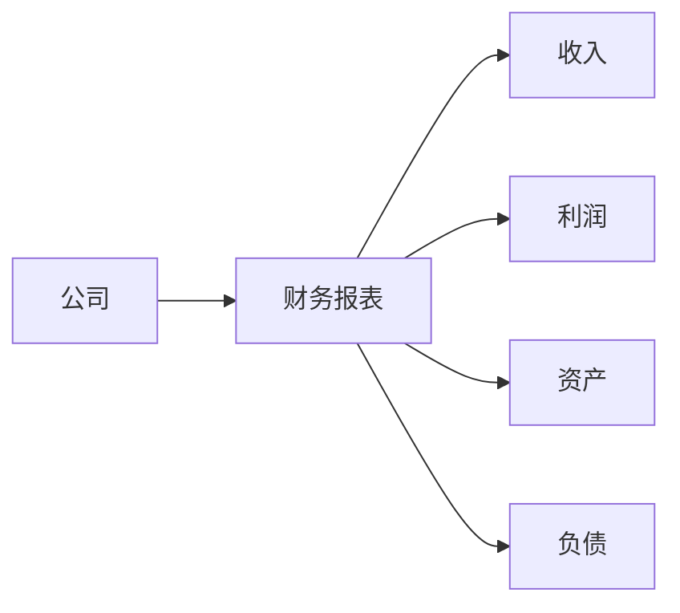
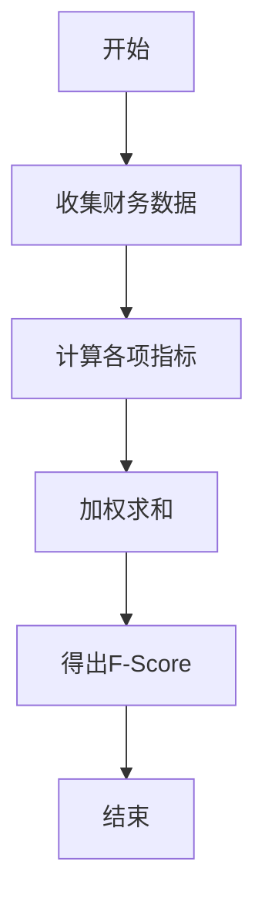

                 


# 约瑟夫·皮奥特罗斯基的F-Score：量化价值投资的尝试

## 关键词
F-Score，价值投资，财务分析，投资模型，约瑟夫·皮奥特罗斯基

## 摘要
本文详细探讨了约瑟夫·皮奥特罗斯基提出的F-Score模型，该模型旨在通过量化分析公司的财务数据，评估其投资价值。文章从背景介绍、核心概念、数学模型、系统架构等多个维度深入分析了F-Score的原理、应用及实际案例，帮助读者全面理解如何利用这一模型进行价值投资。

---

# 第一部分: 背景介绍

## 第1章: 价值投资与F-Score的起源

### 1.1 价值投资的理论基础
#### 1.1.1 价值投资的核心理念
价值投资是一种以公司基本面分析为基础的投资策略，旨在通过识别市场低估的公司，长期持有以获得超额收益。其核心理念在于寻找那些具有持续盈利能力、良好财务状况和合理估值的公司。

#### 1.1.2 价值投资的历史发展
价值投资的理论基础可以追溯到本杰明·格雷厄姆和戴维·多德的工作。他们提出，股票的内在价值可以通过对公司基本面的分析来确定，并建议投资者以低于内在价值的价格买入股票。这一理念为后来的价值投资策略奠定了基础。

#### 1.1.3 约瑟夫·皮奥特罗斯基与F-Score的提出
约瑟夫·皮奥特罗斯基是价值投资领域的知名投资者，他在实践中发现，传统的价值投资方法往往依赖于主观判断，缺乏量化标准。为了克服这一问题，他提出了一种基于财务数据的量化模型——F-Score，旨在为投资者提供一种客观的评估工具。

### 1.2 F-Score的定义与目标
#### 1.2.1 F-Score的定义
F-Score是一种通过分析公司的财务数据，评估其投资价值的量化模型。它基于对公司收益稳定性、财务杠杆和盈利能力的综合评估，帮助投资者识别具有可持续竞争优势的公司。

#### 1.2.2 F-Score的核心目标
F-Score的核心目标是通过量化分析，筛选出那些具有稳定收益、良好财务状况和较高盈利能力的公司，从而为投资者提供可靠的选股工具。

#### 1.2.3 F-Score的应用场景
F-Score适用于以下场景：
- 个股筛选：帮助投资者快速评估某只股票的投资价值。
- 投资组合构建：通过F-Score筛选出优质股票，构建风险可控、收益潜力大的投资组合。
- 市场周期分析：在不同市场周期下，F-Score可以帮助投资者调整投资策略。

### 1.3 F-Score与其他投资模型的对比
#### 1.3.1 常见投资模型概述
- 市盈率模型（P/E）：通过比较股票价格与每股收益的比率，评估股票的估值。
- 市净率模型（P/B）：通过比较股票价格与每股净资产的比率，评估股票的估值。
- 股息率模型：通过比较股票的股息收益率，评估股票的投资回报。

#### 1.3.2 F-Score的独特性
与传统投资模型相比，F-Score的独特性在于其综合考虑了多个财务指标，并通过加权计算得出一个综合评分，从而更全面地评估公司的投资价值。

#### 1.3.3 F-Score的优缺点分析
优点：
- 综合性：F-Score综合考虑了收益稳定性、财务杠杆和盈利能力，能够更全面地评估公司的投资价值。
- 客观性：通过量化分析，减少了主观判断的影响，提高了评估的客观性。

缺点：
- 简化性：F-Score通过简化财务指标来评估公司价值，可能导致信息丢失，影响评估的准确性。
- 适用性：F-Score主要适用于成熟企业，对新兴企业和亏损企业可能不太适用。

---

# 第二部分: 核心概念与联系

## 第2章: F-Score的核心概念与联系

### 2.1 F-Score的原理与机制
#### 2.1.1 F-Score的基本原理
F-Score通过分析公司的财务数据，计算三个核心指标：收益稳定性（EVA-Margin）、财务杠杆（Leverage Ratio）和盈利能力（ROE），并根据预设的权重对这些指标进行加权求和，最终得出F-Score评分。

#### 2.1.2 F-Score的计算公式
$$ F\text{-Score} = w_1 \times \text{EVA-Margin} + w_2 \times \text{Leverage Ratio} + w_3 \times \text{ROE} $$

其中：
- $w_1$、$w_2$、$w_3$为各指标的权重，通常取值为0.5、0.3和0.2。
- EVA-Margin表示企业的经济增加值利润率，Leverage Ratio表示企业的财务杠杆比率，ROE表示企业的净资产收益率。

#### 2.1.3 F-Score的指标权重分配
F-Score的权重分配基于以下几个考虑：
- 收益稳定性（EVA-Margin）是企业长期盈利能力的体现，权重较高。
- 财务杠杆（Leverage Ratio）是衡量企业财务风险的重要指标，权重适中。
- 盈利能力（ROE）是衡量企业资产使用效率的重要指标，权重较低。

### 2.2 F-Score的核心指标分析
#### 2.2.1 收益稳定性（EVA-Margin）
EVA-Margin是衡量企业经济增加值利润率的指标，计算公式为：
$$ \text{EVA-Margin} = \frac{\text{EVA}}{\text{Revenue}} \times 100\% $$
其中，EVA（Earnings Before Amortization and Depreciation）表示企业息税折旧及摊销前利润。

#### 2.2.2 财务杠杆（Leverage Ratio）
Leverage Ratio是衡量企业财务杠杆的指标，计算公式为：
$$ \text{Leverage Ratio} = \frac{\text{Total Assets}}{\text{Equity}} $$
该指标越高，说明企业财务杠杆越高，财务风险越大。

#### 2.2.3 盈利能力（ROE）
ROE是衡量企业净资产收益率的指标，计算公式为：
$$ \text{ROE} = \frac{\text{Net Profit}}{\text{Total Equity}} \times 100\% $$

### 2.3 F-Score的实体关系图


---

# 第三部分: 算法原理与数学模型

## 第3章: F-Score的数学模型与算法原理

### 3.1 F-Score的计算流程


### 3.2 F-Score的数学公式
$$ F\text{-Score} = 0.5 \times \text{EVA-Margin} + 0.3 \times \text{Leverage Ratio} + 0.2 \times \text{ROE} $$

### 3.3 F-Score的算法实现
以下是一个Python实现的示例代码：
```python
def calculate_f_score(eva_margin, leverage_ratio, roe):
    f_score = 0.5 * eva_margin + 0.3 * leverage_ratio + 0.2 * roe
    return f_score

# 示例数据
eva_margin = 15
leverage_ratio = 2.5
roe = 12

# 计算F-Score
f_score = calculate_f_score(eva_margin, leverage_ratio, roe)
print(f"计算得到的F-Score为：{f_score}")
```

---

# 第四部分: 系统分析与架构设计

## 第4章: 系统分析与架构设计

### 4.1 系统应用场景
F-Score模型可以应用于以下场景：
- 个股筛选：通过计算F-Score，帮助投资者快速筛选出具有投资价值的股票。
- 投资组合优化：基于F-Score，构建一个风险可控、收益潜力大的投资组合。
- 市场周期分析：在不同市场周期下，利用F-Score模型动态调整投资策略。

### 4.2 系统功能设计
以下是系统的功能模块设计：


### 4.3 系统架构设计


### 4.4 系统接口设计
以下是系统的主要接口：
- 数据接口：提供财务数据的导入和导出功能。
- 计算接口：提供F-Score计算的API，供其他系统调用。
- 展示接口：提供F-Score结果的可视化展示界面。

---

# 第五部分: 项目实战

## 第5章: 项目实战

### 5.1 环境安装
为了运行F-Score模型，需要安装以下环境：
- Python 3.6以上版本
- 数据处理库（如Pandas、NumPy）
- 可视化库（如Matplotlib、Seaborn）

### 5.2 核心实现代码
以下是一个F-Score计算的Python代码示例：
```python
import pandas as pd

def calculate_f_score(eva_margin, leverage_ratio, roe):
    return 0.5 * eva_margin + 0.3 * leverage_ratio + 0.2 * roe

# 读取财务数据
data = pd.read_csv('financial_data.csv')

# 计算各项指标
data['eva_margin'] = data['EVA'] / data['Revenue'] * 100
data['leverage_ratio'] = data['Total Assets'] / data['Equity']
data['roe'] = data['Net Profit'] / data['Total Equity'] * 100

# 计算F-Score
data['f_score'] = data.apply(lambda x: calculate_f_score(x['eva_margin'], x['leverage_ratio'], x['roe']), axis=1)

# 输出结果
print(data[['Company', 'f_score']].head())
```

### 5.3 实际案例分析
以下是一个实际案例分析：
假设我们有以下数据：
| 公司   | EVA | Revenue | Total Assets | Equity | Net Profit |
|--------|-----|---------|--------------|--------|------------|
| 公司A  | 100 | 500     | 400          | 200    | 50         |
| 公司B  | 150 | 600     | 500          | 250    | 75         |

计算F-Score：
- 公司A：
  - EVA-Margin = 100 / 500 = 20%
  - Leverage Ratio = 400 / 200 = 2
  - ROE = 50 / 200 = 25%
  - F-Score = 0.5 * 20 + 0.3 * 2 + 0.2 * 25 = 10 + 0.6 + 5 = 15.6

- 公司B：
  - EVA-Margin = 150 / 600 = 25%
  - Leverage Ratio = 500 / 250 = 2
  - ROE = 75 / 250 = 30%
  - F-Score = 0.5 * 25 + 0.3 * 2 + 0.2 * 30 = 12.5 + 0.6 + 6 = 19.1

---

# 第六部分: 最佳实践与小结

## 第6章: 最佳实践

### 6.1 投资策略建议
- 在使用F-Score进行投资时，建议结合其他指标（如市盈率、市净率等）进行综合评估。
- 对于不同行业和市场环境，可能需要调整F-Score的权重和指标。

### 6.2 风险提示
- F-Score模型是基于历史数据的统计模型，未来市场可能会发生变化，导致模型失效。
- F-Score模型忽略了宏观经济因素和市场情绪，可能影响投资决策的准确性。

### 6.3 未来趋势
随着人工智能和大数据技术的发展，F-Score模型可能会进一步优化，引入更多财务和非财务指标，以提高评估的准确性和全面性。

---

# 小结

本文详细介绍了约瑟夫·皮奥特罗斯基的F-Score模型，从其背景、核心概念、算法原理到实际应用，进行了全面的分析。通过F-Score模型，投资者可以更科学地评估公司的投资价值，从而做出更明智的投资决策。

---

# 作者

作者：AI天才研究院/AI Genius Institute & 禅与计算机程序设计艺术/Zen And The Art of Computer Programming

