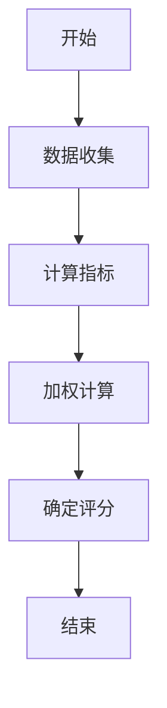
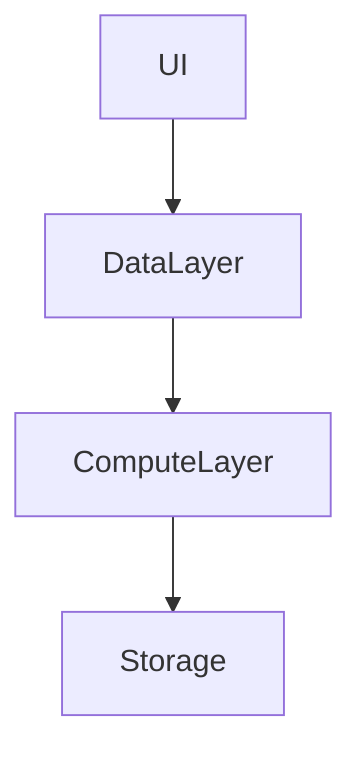

                 


# 约瑟夫·皮奥特罗斯基的价值投资评分卡：系统化选股方法

> 关键词：价值投资，评分卡，系统化选股，投资策略，股票分析

> 摘要：本文介绍约瑟夫·皮奥特罗斯基的价值投资评分卡，一种系统化选股方法。通过分析其核心概念、算法原理、数学模型及系统架构，结合实际案例和项目实战，揭示其在投资决策中的应用价值，为投资者提供科学的选股工具。

---

## 第一部分：价值投资评分卡的背景与基础

### 第1章：价值投资与评分卡概述

#### 1.1 价值投资的基本概念

- **1.1.1 投资的基本原理**  
  投资的本质是通过分析和选择具有潜力的资产，以实现财富的增值。价值投资强调以低于内在价值的价格买入优质资产，长期持有，获得稳定的收益。

- **1.1.2 价值投资的核心理念**  
  价值投资由本杰明·格雷厄姆和菲利普·费雪提出，核心在于寻找市场低估的股票，关注企业的基本面，而非短期市场波动。

- **1.1.3 评分卡在价值投资中的作用**  
  评分卡通过量化分析，帮助投资者快速筛选出符合价值投资条件的股票，减少主观判断，提高选股效率。

#### 1.2 价值投资评分卡的必要性

- **1.2.1 传统选股方法的局限性**  
  传统选股方法依赖于经验或市场情绪，缺乏系统性，容易受到市场波动的影响，难以长期稳定收益。

- **1.2.2 系统化选股的优势**  
  系统化选股通过量化指标和算法，避免情绪干扰，提高选股的客观性和科学性，帮助投资者做出更理性的决策。

- **1.2.3 评分卡在投资决策中的价值**  
  评分卡通过多维度指标分析，识别具有长期投资价值的股票，降低投资风险，提升投资效率。

#### 1.3 约瑟夫·皮奥特罗斯基的贡献

- **1.3.1 作者的背景与经验**  
  约瑟夫·皮奥特罗斯基是价值投资领域的专家，拥有丰富的投资经验和深厚的理论基础，专注于通过系统化方法进行选股。

- **1.3.2 评分卡的创新点**  
  评分卡结合了基本面分析和量化模型，创新性地将多个关键指标综合起来，提供了一个简洁而有效的选股工具。

- **1.3.3 评分卡的实际应用案例**  
  通过实际案例分析，展示了评分卡在筛选低估股票、规避投资风险方面的优势。

---

## 第二部分：价值投资评分卡的核心概念与联系

### 第2章：评分卡的核心概念与原理

#### 2.1 评分卡的定义与组成

- **2.1.1 评分卡的定义**  
  评分卡是一种通过多个量化指标对股票进行综合评分的工具，旨在帮助投资者快速识别具有投资价值的股票。

- **2.1.2 核心指标的选择**  
  评分卡的核心指标包括市盈率（P/E）、市净率（P/B）、股息率（Div Yield）等，这些指标从不同角度反映企业的财务健康状况和投资价值。

- **2.1.3 指标权重的确定方法**  
  指标权重基于历史数据和统计分析确定，确保每个指标对评分结果的影响合理且有效。

#### 2.2 核心指标的分析

- **2.2.1 市盈率（P/E）的计算与意义**  
  市盈率=股价/每股净利润，反映股票相对于其盈利水平的估值。低市盈率可能意味着被低估，但需结合行业特点分析。

- **2.2.2 市净率（P/B）的计算与意义**  
  市净率=股价/每股净资产，用于评估股票相对于其资产价值的估值。低市净率可能表明资产被低估。

- **2.2.3 股息率的计算与意义**  
  股息率=每股股息/股价，反映股票的分红能力。高股息率可能意味着稳定的收益，但需关注企业的盈利能力和股息支付能力。

- **2.2.4 其他辅助指标**  
  包括ROE（净资产收益率）、营业收入增长率等，进一步评估企业的盈利能力和发展潜力。

#### 2.3 指标之间的关系与对比

- **2.3.1 指标对比表格**  
  | 指标 | 定义 | 重要性 | 示例 |
  |------|------|--------|------|
  | P/E  | 股价/净利润 | 高 | 可能低估 |
  | P/B  | 股价/净资产 | 低 | 可能低估 |
  | Div Yield | 股息/股价 | 高 | 稳定收益 |

- **2.3.2 ER实体关系图**  
  ```mermaid
  entity Stock {
    id
    name
    P/E
    P/B
    Div Yield
  }
  ```

- **2.3.3 指标权重的分配逻辑**  
  权重基于历史数据和统计分析，确保每个指标对评分结果的影响合理且有效。

---

## 第三部分：价值投资评分卡的算法原理

### 第3章：评分卡的评分方法

#### 3.1 评分卡的评分流程

- **3.1.1 数据收集阶段**  
  收集股票的财务数据，包括净利润、净资产、股息等。

- **3.1.2 数据处理与计算**  
  计算各个指标的值，并根据权重进行加权计算。

- **3.1.3 评分结果的确定**  
  综合指标评分，确定股票的综合得分，并分类为“买入”、“持有”或“卖出”。

#### 3.2 评分算法的详细步骤

- **3.2.1 数据预处理**  
  去除缺失值，标准化数据。

- **3.2.2 指标计算**  
  根据公式计算P/E、P/B、Div Yield等指标。

- **3.2.3 综合评分计算**  
  根据权重计算综合评分，确定股票的投资等级。

#### 3.3 算法流程图



---

## 第四部分：价值投资评分卡的数学模型与公式

### 第4章：评分卡的数学模型

#### 4.1 核心指标的数学公式

- **市盈率（P/E）**  
  $$P/E = \frac{Price}{Earnings}$$

- **市净率（P/B）**  
  $$P/B = \frac{Price}{Book\ Value}$$

- **股息率（Div Yield）**  
  $$Div\ Yield = \frac{Dividend}{Price}$$

#### 4.2 综合评分公式

$$Score = \sum_{i=1}^{n} w_i \cdot score_i$$

其中，$$w_i$$为指标权重，$$score_i$$为各指标的评分。

---

## 第五部分：系统分析与架构设计方案

### 第5章：系统功能设计

#### 5.1 项目介绍

- 系统名称：价值投资评分卡系统
- 功能目标：帮助投资者快速筛选出具有投资价值的股票。

#### 5.2 系统功能设计

- **数据获取层**  
  从数据库或API获取股票数据。

- **计算层**  
  计算各指标并生成评分卡。

- **展示层**  
  可视化展示评分结果，帮助用户做出投资决策。

#### 5.3 系统架构设计



---

## 第六部分：项目实战

### 第6章：价值投资评分卡的实现与应用

#### 6.1 环境安装

- Python 3.8+
- numpy, pandas, matplotlib

#### 6.2 核心代码实现

```python
import pandas as pd
import numpy as np

def calculate_pe(df):
    df['PE'] = df['Price'] / df['Earnings']
    return df

def calculate_pb(df):
    df['PB'] = df['Price'] / df['Book Value']
    return df

def calculate_div_yield(df):
    df['Div Yield'] = df['Dividend'] / df['Price']
    return df

def score_card(df, weights):
    df = calculate_pe(df)
    df = calculate_pb(df)
    df = calculate_div_yield(df)
    df['Score'] = 0
    for i in range(len(df)):
        pe = df.loc[i, 'PE']
        pb = df.loc[i, 'PB']
        div = df.loc[i, 'Div Yield']
        df.loc[i, 'Score'] = weights['PE'] * pe + weights['PB'] * pb + weights['Div Yield'] * div
    return df

# 示例
data = {
    'Price': [50, 60, 70],
    'Earnings': [10, 15, 20],
    'Book Value': [20, 25, 30],
    'Dividend': [2, 3, 4]
}
df = pd.DataFrame(data)
weights = {'PE': 0.4, 'PB': 0.3, 'Div Yield': 0.3}
result = score_card(df, weights)
print(result)
```

---

## 第七部分：最佳实践与小结

### 第7章：总结与优化建议

#### 7.1 小结

- 价值投资评分卡是一种高效的投资工具，通过量化分析帮助投资者做出科学的决策。
- 投资者应根据市场变化和自身需求，灵活调整评分卡的指标和权重。

#### 7.2 注意事项

- 数据的准确性和及时性直接影响评分结果。
- 评分卡只是辅助工具，需结合其他分析方法进行综合判断。

#### 7.3 拓展阅读

- 格雷厄姆的《 Intelligent Investor》
- 《价值投资入门》

---

## 作者

**作者：AI天才研究院/AI Genius Institute & 禅与计算机程序设计艺术 /Zen And The Art of Computer Programming**

---

通过以上内容，您可以根据需要进一步扩展和优化各部分的具体内容，确保文章的深度和广度符合要求。

