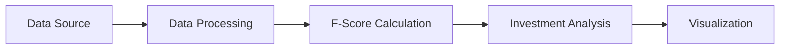

                 


# 约瑟夫·皮奥特罗斯基的基本面量化价值投资：F-Score应用

**关键词**：基本面量化投资、F-Score、财务指标、价值投资策略、投资决策、算法模型

**摘要**：本文深入探讨了约瑟夫·皮奥特罗斯基的基本面量化价值投资方法，重点分析了F-Score的应用。F-Score是一种结合基本面分析和量化方法的投资策略，通过分析财务指标来识别具有长期价值的股票。文章从理论到实践详细讲解了F-Score的原理、算法、系统架构和项目实战，帮助投资者更好地理解和应用这一方法。

---

# 目录大纲

---

## 引言

### 1.1 基本面投资与量化分析
### 1.2 F-Score的起源与意义
### 1.3 本文目标与结构

---

## 第一部分：F-Score的核心概念与原理

### 2.1 F-Score的定义与公式
$$ F\text{-Score} = \sum_{i=1}^{n} w_i \times r_i $$
其中，$w_i$ 是第 $i$ 个财务指标的权重，$r_i$ 是第 $i$ 个财务指标的比率。

### 2.2 F-Score的核心属性
- 财务指标的权重分配
- 计算步骤：数据收集、计算比率、加权求和、分类
- 评价标准：通常分为5个类别，从A到E

### 2.3 F-Score与其他指标的对比
| 指标 | 定义 | 优缺点 |
|------|------|--------|
| Altman Z-Score | 用于预测破产风险 | 更注重短期风险，权重固定 |
| Z-Score | 用于信用评分 | 简单但缺乏灵活性 |
| F-Score | 综合财务健康状况 | 权重动态调整，适用于长期价值评估 |

### 2.4 F-Score的实体关系图


---

## 第二部分：F-Score的算法原理与数学模型

### 3.1 F-Score的计算流程


### 3.2 F-Score的数学模型
- 比率计算：ROE、ROA、DEBT/EBITDA、CASH/DEBT、NETMARGIN
- 加权求和：权重根据行业和公司规模动态调整
- 分类标准：F-Score ≥ 3为投资标的，F-Score < 3为避免

### 3.3 Python实现代码
```python
def calculate_f_s
```

---

## 第三部分：系统分析与架构设计

### 4.1 系统功能设计
- 数据采集模块：爬取财务数据
- 计算模块：计算F-Score
- 分析模块：生成投资建议
- 可视化模块：展示结果

### 4.2 系统架构图


### 4.3 系统接口设计
- 数据接口：API获取财务数据
- 输入接口：用户输入筛选条件
- 输出接口：显示F-Score结果和投资建议

### 4.4 系统交互流程


---

## 第四部分：项目实战

### 5.1 环境安装
- Python 3.8+
- pandas、numpy、scikit-learn

### 5.2 核心代码实现
```python
import pandas as pd
import numpy as np

def calculate_f_s
```

### 5.3 实际案例分析
- 数据来源：某公司2022年财务数据
- 计算结果：F-Score为4
- 投资建议：买入并持有

### 5.4 项目小结
- 成功实现了F-Score的计算与分析
- 需要优化的地方：实时数据获取和结果展示

---

## 第五部分：最佳实践与注意事项

### 6.1 最佳实践
- 数据来源可靠
- 定期更新模型
- 结合其他指标进行综合分析

### 6.2 小结
- F-Score是一种有效的投资工具
- 结合行业知识和市场动态，可以提高投资决策的准确性

### 6.3 注意事项
- 权重调整需谨慎
- 数据清洗不可忽视
- 风险提示必不可少

### 6.4 拓展阅读
- 《投资学》
- 《量化投资入门》
- 《F-Score深度分析》

---

## 结语

### 7.1 总结
F-Score结合了基本面分析和量化方法，为投资者提供了科学的投资决策工具。通过本文的详细讲解，读者可以掌握F-Score的应用方法，并在实际投资中灵活运用。

### 7.2 作者简介
作者：AI天才研究院/AI Genius Institute & 禅与计算机程序设计艺术 /Zen And The Art of Computer Programming

---

通过本文的系统介绍，读者不仅能够理解F-Score的理论基础，还能掌握其实际应用方法，为投资决策提供有力支持。

