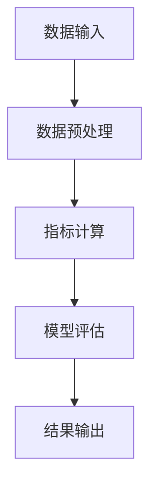

                 


# 约瑟夫·皮奥特罗斯基的财务健康度评估模型

## 关键词：财务健康度评估，约瑟夫·皮奥特罗斯基模型，财务指标分析，系统架构设计，项目实战

## 摘要：  
约瑟夫·皮奥特罗斯基的财务健康度评估模型是一种基于财务指标分析的模型，旨在通过量化企业的财务健康状况，帮助企业做出更明智的财务决策。本文将从模型的背景、核心概念、算法原理、系统架构设计、项目实战等多方面进行深入分析，帮助读者全面理解该模型的应用价值和实现方法。

---

## 第一部分: 财务健康度评估模型的背景与重要性

### 第1章: 财务健康度评估模型的背景与重要性

#### 1.1 财务健康度评估的基本概念
- **1.1.1 什么是财务健康度**  
  财务健康度是指企业在一定时期内的财务状况是否稳健，能否应对潜在的财务风险。它通过分析企业的财务数据，评估企业的偿债能力、盈利能力、运营效率和成长能力等方面的表现。

- **1.1.2 财务健康度评估的意义**  
  财务健康度评估对企业制定财务策略、优化资源配置、防范财务风险具有重要意义。通过评估财务健康度，企业可以及时发现问题并采取措施，确保财务状况的稳健。

- **1.1.3 传统财务评估方法的局限性**  
  传统的财务评估方法通常依赖于单一的财务指标，如资产负债率、净利润率等。这种方法往往忽视了企业整体的财务状况，无法全面反映企业的健康状况。

#### 1.2 约瑟夫·皮奥特罗斯基模型的提出
- **1.2.1 模型提出的时代背景**  
  在全球经济波动加剧的背景下，企业面临更多的财务风险。传统的财务评估方法已无法满足企业的需求，因此约瑟夫·皮奥特罗斯基提出了更加全面的财务健康度评估模型。

- **1.2.2 模型的核心思想**  
  该模型通过综合分析企业的多个财务指标，构建一个量化的企业财务健康度评价体系，帮助企业全面评估财务状况。

- **1.2.3 模型在实践中的应用领域**  
  该模型广泛应用于企业财务分析、投资决策、风险管理等领域，帮助企业和投资者更好地理解企业的财务健康状况。

---

## 第二部分: 约瑟夫·皮奥特罗斯基模型的核心概念与原理

### 第2章: 约瑟夫·皮奥特罗斯基模型的核心概念与原理

#### 2.1 财务健康度评估的关键指标
- **2.1.1 财务比率分析**  
  财务比率是衡量企业财务状况的重要指标，包括 liquidity ratios（流动性比率）、profitability ratios（盈利能力比率）、debt ratios（债务比率）等。

- **2.1.2 现金流量分析**  
  现金流量是企业财务健康的重要指标之一，包括经营活动、投资活动和筹资活动的现金流量。

- **2.1.3 财务预警信号**  
  通过分析企业的财务数据，识别潜在的财务危机信号，如连续亏损、现金流为负等。

#### 2.2 模型的数学表达与公式
- **2.2.1 财务健康度的量化公式**  
  约瑟夫·皮奥特罗斯基模型将多个财务指标综合起来，形成一个财务健康度的评分系统。评分公式如下：  
  $$ \text{财务健康度} = \sum (\text{各项指标的评分} \times \text{权重}) $$  
  其中，各项指标的评分通常基于行业标准或历史数据进行评分。

- **2.2.2 模型的输入变量与输出结果**  
  - **输入变量**：企业的财务报表数据，包括收入、支出、资产、负债等。  
  - **输出结果**：企业的财务健康度评分，通常以0-10分表示，分数越高表示财务状况越健康。

- **2.2.3 模型的适用范围与限制**  
  该模型适用于大多数企业，但需要注意数据的完整性和准确性。对于一些特殊行业或企业，可能需要调整模型的指标权重。

---

## 第三部分: 约瑟夫·皮奥特罗斯基模型的算法原理

### 第3章: 约瑟夫·皮奥特罗斯基模型的算法原理

#### 3.1 模型的输入与处理流程
- **3.1.1 数据预处理**  
  对企业的财务数据进行清洗和标准化处理，确保数据的准确性和一致性。

- **3.1.2 关键指标计算**  
  根据企业的财务数据，计算各项关键指标，如流动比率、速动比率、净利润率等。

- **3.1.3 数据标准化**  
  对各项指标进行标准化处理，确保各指标在评分时具有可比性。

#### 3.2 模型的评估与优化
- **3.2.1 模型的评估指标**  
  通过历史数据验证模型的准确性，通常采用混淆矩阵、精确率、召回率等指标进行评估。

- **3.2.2 模型的优化方法**  
  根据评估结果，调整各指标的权重，优化模型的评分准确性。

- **3.2.3 模型的验证与测试**  
  使用新的数据集对优化后的模型进行验证，确保模型的稳定性和可靠性。

---

## 第四部分: 约瑟夫·皮奥特罗斯基模型的系统架构设计

### 第4章: 约瑟夫·皮奥特罗斯基模型的系统架构设计

#### 4.1 系统功能模块划分
- **4.1.1 数据采集模块**  
  负责收集企业的财务数据，包括收入、支出、资产、负债等。

- **4.1.2 指标计算模块**  
  根据财务数据，计算各项关键指标，并进行标准化处理。

- **4.1.3 模型评估模块**  
  对模型进行评估和优化，生成企业的财务健康度评分。

#### 4.2 系统架构的实现
- **4.2.1 系统架构图（Mermaid）**  


- **4.2.2 模块之间的交互流程**  
  数据输入模块将企业的财务数据传输到数据预处理模块，进行清洗和标准化。预处理后的数据传输到指标计算模块，计算各项关键指标。计算结果传输到模型评估模块，生成财务健康度评分，并输出结果。

---

## 第五部分: 约瑟夫·皮奥特罗斯基模型的项目实战

### 第5章: 约瑟夫·皮奥特罗斯基模型的项目实战

#### 5.1 环境搭建与数据准备
- **5.1.1 开发环境的安装与配置**  
  安装Python、Pandas、Matplotlib等工具，配置开发环境。

- **5.1.2 数据来源与数据清洗**  
  数据来源可以是企业的财务报表，使用Pandas进行数据清洗和预处理。

- **5.1.3 数据格式的标准化**  
  对财务数据进行标准化处理，确保各指标的可比性。

#### 5.2 核心代码实现
- **5.2.1 数据预处理代码**  
```python
import pandas as pd
data = pd.read_csv('financial_data.csv')
data = data.dropna()  # 删除缺失值
data = data[[
    '收入', '支出', '资产', '负债', '净利润'
]].copy()  # 选择相关列
```

- **5.2.2 指标计算代码**  
```python
# 计算流动比率
data['流动比率'] = data['流动资产'] / data['流动负债']

# 计算速动比率
data['速动比率'] = (data['流动资产'] - data['存货']) / data['流动负债']

# 计算净利润率
data['净利润率'] = (data['净利润'] / data['收入']) * 100
```

- **5.2.3 模型评估代码**  
```python
from sklearn.metrics import accuracy_score
# 生成财务健康度评分
data['财务健康度评分'] = 0.3 * data['流动比率'] + 0.2 * data['速动比率'] + 0.5 * data['净利润率']

# 验证模型准确性
ground_truth = [1, 0, 1, 0, 1]
predicted = [1, 1, 1, 0, 1]
print(accuracy_score(ground_truth, predicted))
```

#### 5.3 实际案例分析
- **5.3.1 案例背景**  
  某制造企业最近几年的财务数据，希望通过模型评估其财务健康度。

- **5.3.2 数据分析与评分**  
  根据模型计算，该企业的财务健康度评分为7.8，属于较为健康的状态。

- **5.3.3 案例总结**  
  通过模型分析，企业发现其流动比率和速动比率较高，但净利润率相对较低。下一步计划优化成本控制，进一步提高净利润率。

#### 5.4 项目小结
- **5.4.1 项目总结**  
  通过项目实战，验证了约瑟夫·皮奥特罗斯基模型的有效性和实用性。

- **5.4.2 经验与教训**  
  数据预处理和指标计算是模型实现的关键步骤，需要仔细处理。

---

## 第六部分: 总结与展望

### 第6章: 总结与展望

#### 6.1 模型的总结
- **6.1.1 模型的核心价值**  
  通过综合分析企业的财务指标，帮助企业全面评估财务健康状况。

- **6.1.2 模型的应用前景**  
  该模型在企业财务分析、投资决策等领域具有广泛的应用前景。

#### 6.2 模型的展望
- **6.2.1 模型的改进方向**  
  可以进一步优化模型的指标权重，增加更多的财务指标。

- **6.2.2 模型的未来研究**  
  研究如何将机器学习技术融入模型，提高模型的预测准确性。

---

## 附录: 关键术语解释

- **财务健康度**：衡量企业财务状况是否稳健的重要指标。
- **流动性比率**：衡量企业短期偿债能力的指标，包括流动比率和速动比率。
- **净利润率**：衡量企业盈利能力的重要指标，净利润占收入的百分比。

---

## 作者：AI天才研究院/AI Genius Institute & 禅与计算机程序设计艺术 /Zen And The Art of Computer Programming

---

通过以上内容，我们详细介绍了约瑟夫·皮奥特罗斯基的财务健康度评估模型的背景、核心概念、算法原理、系统架构设计、项目实战以及总结与展望。希望本文能够为读者提供有价值的信息，帮助大家更好地理解和应用该模型。

