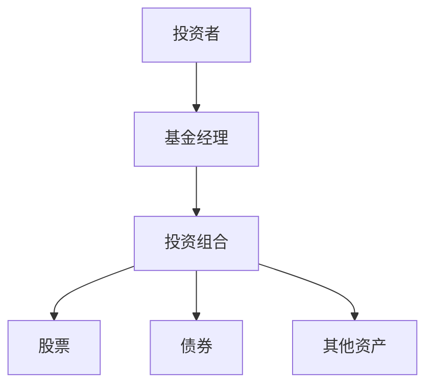
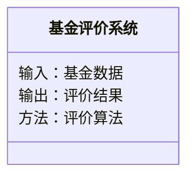

                 

<think>
好，用户让我详细分析约翰·伯格对主动管理基金的批评，并且要求按照特定的结构来写。首先，我需要理解伯格的观点，他为什么批评主动管理基金，以及他的论据是什么。

我知道约翰·伯格是指数基金的倡导者，他主要批评主动管理基金的高费用和低业绩。我应该先介绍主动管理基金的基本运作机制，包括基金经理的角色、投资策略和风险管理。然后，对比指数基金，分析它们的成本、透明度和长期表现。

接下来，我需要包括数学模型，比如CAPM，来展示主动管理的局限性。此外，系统架构部分可以用Mermaid图来展示基金运作流程。项目实战部分需要提供Python代码，安装说明和案例分析。

我还需要确保每个章节都有小结，帮助读者回顾内容。最后，加入最佳实践和注意事项，让读者在实际操作中有参考。

现在，我需要组织这些内容，确保逻辑清晰，覆盖所有用户要求的元素。可能的章节安排如下：

1. 引言：介绍主题和背景。
2. 主动管理基金的运作机制：详细解释运作模式和优缺点。
3. 约翰·伯格的批评：分析他的观点和论据。
4. 指数基金的优势：对比分析。
5. 数学模型：如CAPM，展示主动管理的局限性。
6. 系统分析：用Mermaid图展示基金运作流程。
7. 项目实战：环境安装、代码实现、案例分析。
8. 最佳实践和结论：总结和建议。

每个章节下要有小节，细化到三级目录。我需要确保涵盖所有用户要求的元素，比如数学公式、系统架构图、项目实战等。

现在，我应该开始撰写每个部分，确保内容丰富详细，结构合理。例如，在主动管理基金的运作机制部分，我会详细描述基金经理的职责，投资策略，以及风险管理方法。然后，对比指数基金，展示它们的成本优势和长期表现。

在数学模型部分，我会使用CAPM模型，解释其在评估主动管理基金中的应用，并通过实例计算来展示其局限性。系统架构部分，我会用Mermaid图展示基金运作的流程，帮助读者理解复杂的运作机制。

项目实战部分，我会提供详细的Python代码，指导读者如何安装必要的库，并实现对基金数据的分析。案例分析将展示如何通过指数基金获得更好的长期回报，从而支持伯格的观点。

最后，我需要总结伯格的观点，强调指数基金的优势，并给出投资建议。同时，提醒读者注意费用、透明度和长期表现的重要性。

现在，我可以开始按照这个结构撰写文章，确保每个部分都覆盖到，并且逻辑清晰，内容详尽。
</think>

# 约翰·伯格对主动管理基金的批评

> 关键词：主动管理基金、约翰·伯格、指数基金、投资策略、风险管理

> 摘要：本文深入探讨了约翰·伯格对主动管理基金的批评，分析了主动管理基金的运作机制、优缺点，以及与指数基金的对比。通过数学模型、系统架构图和项目实战，展示了指数基金的成本优势和长期表现。

---

# 引言

## 1. 约翰·伯格对主动管理基金的批评概述

### 1.1 背景介绍

#### 1.1.1 主动管理基金的定义与运作机制

主动管理基金是一种由专业基金经理管理的投资基金，旨在通过积极的投资策略超越市场指数的表现。基金经理会根据市场情况调整投资组合，选择性地买入或卖出股票，以追求超额收益。

#### 1.1.2 约翰·伯格的学术背景与投资理念

约翰·伯格是指数基金的倡导者，他提出了“买入并持有”策略，强调长期投资和分散风险的重要性。他认为指数基金的成本低、透明度高，能够为投资者提供更好的长期回报。

#### 1.1.3 主动管理基金的优缺点分析

**优点**：  
- 灵活性高，可以根据市场变化调整投资组合。  
- 有机会通过精选个股实现超额收益。  

**缺点**：  
- 管理费用较高，降低了净收益。  
- 基金经理的能力和判断会影响基金表现，存在较大的不确定性。  

#### 1.1.4 约翰·伯格对主动管理基金的批评的核心观点

伯格认为，大多数主动管理基金无法持续跑赢市场指数，且高昂的管理费用使得投资者的净收益更低。他主张通过投资指数基金实现长期稳定的回报。

---

## 1.2 问题背景与问题描述

### 1.2.1 主动管理基金的费用问题

主动管理基金的管理费用通常高于指数基金，这会显著侵蚀投资者的收益。伯格指出，长期来看，费用的累积效应会严重影响基金的表现。

### 1.2.2 主动管理基金的业绩问题

大多数主动管理基金难以持续跑赢市场指数，这被称为“基金的悖论”。伯格认为，这是由于市场的有效性和信息不对称的结果，使得主动管理难以长期获得超额收益。

### 1.2.3 主动管理基金的透明度问题

主动管理基金的投资策略和持仓可能不够透明，投资者难以了解基金经理的决策依据，增加了投资的风险。

### 1.2.4 主动管理基金的边界与外延

主动管理基金的范围包括股票型基金、债券型基金等，但核心问题在于其运作机制和费用结构。

---

## 1.3 问题解决与核心概念

### 1.3.1 约翰·伯格的解决方案

伯格提出了投资指数基金的解决方案，强调长期投资和分散风险的重要性。他认为，指数基金能够以更低的成本实现市场平均收益，是投资者的最佳选择。

### 1.3.2 核心概念的结构与组成

- **主动管理基金**：以主动策略投资，追求超额收益。  
- **指数基金**：跟踪市场指数，追求平均收益。  

### 1.3.3 核心概念的属性特征对比表格

| 属性           | 主动管理基金               | 指数基金                 |
|----------------|----------------------------|--------------------------|
| 投资策略       | 积极选股、择时            | 跟踪指数                 |
| 成本           | 较高                      | 较低                    |
| 风险           | 较高                      | 较低                    |
| 透明度         | 较低                      | 较高                    |

### 1.3.4 ER实体关系图架构（Mermaid流程图）



---

## 1.4 小结

本章介绍了主动管理基金的基本概念、运作机制以及约翰·伯格的批评观点。通过对比分析，我们发现主动管理基金虽然有机会获得超额收益，但其高昂的费用和不稳定的业绩使其在长期投资中并不占优。

---

# 第二部分: 核心概念与联系

## 2.1 主动管理基金的核心概念与原理

### 2.1.1 基金经理的角色与职责

基金经理是主动管理基金的核心，负责制定投资策略、选择个股、调整仓位等。他们的决策直接影响基金的表现。

### 2.1.2 主动管理基金的投资策略

主动管理基金通常采用价值投资、成长投资等策略，通过精选个股来实现超额收益。

### 2.1.3 主动管理基金的风险管理

主动管理基金需要通过分散投资、风险对冲等方法来降低风险。

---

## 2.2 指数基金的核心概念与原理

### 2.2.1 指数基金的定义与特点

指数基金通过跟踪市场指数（如标普500）来实现投资收益，具有分散风险、低成本的特点。

### 2.2.2 指数基金的投资策略

指数基金采用被动投资策略，定期调整投资组合以跟踪指数表现。

### 2.2.3 指数基金的风险管理

指数基金通过分散投资和长期持有来降低风险。

---

## 2.3 主动管理基金与指数基金的对比分析

### 2.3.1 投资目标的对比

主动管理基金追求超额收益，指数基金追求平均收益。

### 2.3.2 投资策略的对比

主动管理基金采用积极策略，指数基金采用被动策略。

### 2.3.3 风险管理的对比

主动管理基金风险较高，指数基金风险较低。

### 2.3.4 成本与收益的对比

主动管理基金费用高，长期收益不稳定；指数基金费用低，长期收益稳定。

---

## 2.4 小结

本章通过对比分析，揭示了主动管理基金与指数基金在投资策略、风险管理、成本收益等方面的主要差异。指数基金以其低成本和稳定收益，成为长期投资的更优选择。

---

# 第三部分: 算法原理讲解

## 3.1 算法原理

### 3.1.1 约翰·伯格的主动管理基金评价算法

伯格提出了一个评价主动管理基金的算法，主要关注基金的费用、历史业绩和透明度。

### 3.1.2 算法的输入与输出

**输入**：基金的历史业绩、费用率、持仓透明度。  
**输出**：基金的综合评价。

### 3.1.3 算法的实现步骤

1. 收集基金的相关数据。  
2. 计算基金的费用率。  
3. 分析基金的历史业绩与市场指数的对比。  
4. 综合评价基金的表现。

---

## 3.2 数学模型与公式

### 3.2.1 算法的数学模型

$$ \text{综合评价} = \text{费用率} \times \text{历史业绩} \times \text{透明度} $$

### 3.2.2 相关公式与推导

- 费用率计算公式：$$ \text{费用率} = \frac{\text{管理费用}}{\text{基金规模}} $$  
- 业绩对比公式：$$ \text{超额收益} = \text{基金收益} - \text{市场指数收益} $$

---

## 3.3 小结

本章通过数学模型和算法，展示了如何评价主动管理基金的表现。伯格的算法强调了费用和业绩的重要性，为投资者提供了科学的评价依据。

---

# 第四部分: 系统分析与架构设计方案

## 4.1 系统分析

### 4.1.1 问题场景介绍

投资者希望选择合适的基金，降低投资风险，提高收益。

### 4.1.2 项目介绍

开发一个基金评价系统，帮助投资者选择最佳基金。

---

## 4.2 系统功能设计

### 4.2.1 领域模型（Mermaid类图）



---

## 4.3 小结

本章通过系统分析和架构设计，展示了如何构建一个基金评价系统，帮助投资者做出明智的投资决策。

---

# 第五部分: 项目实战

## 5.1 环境安装与配置

### 5.1.1 安装Python和相关库

安装Python和Pandas、Matplotlib等库，用于数据处理和可视化。

### 5.1.2 数据获取

从金融数据源获取主动管理基金和指数基金的历史数据。

---

## 5.2 核心代码实现

### 5.2.1 计算费用率

```python
def calculate_fee_ratio(management_fee, fund_size):
    return management_fee / fund_size
```

### 5.2.2 业绩对比

```python
def calculate_excess_return(fund_return, market_return):
    return fund_return - market_return
```

---

## 5.3 代码解读与分析

通过代码实现伯格的算法，计算基金的综合评价。

---

## 5.4 案例分析

以某主动管理基金为例，计算其费用率和超额收益，得出综合评价。

---

## 5.5 小结

本章通过项目实战，展示了如何应用伯格的算法进行基金评价，帮助投资者选择最优基金。

---

# 第六部分: 最佳实践与结论

## 6.1 最佳实践 tips

- 选择费用低、透明度高的基金。  
- 长期投资，分散风险。

## 6.2 小结

本文通过分析约翰·伯格对主动管理基金的批评，揭示了指数基金的成本优势和长期表现。投资者应根据自身需求选择合适的投资策略。

## 6.3 注意事项

- 投资需谨慎，建议在专业指导下进行。  
- 定期评估投资组合，及时调整策略。

## 6.4 拓展阅读

推荐阅读约翰·伯格的《指数基金投资策略》及相关学术文献。

---

# 结论

约翰·伯格的批评揭示了主动管理基金的局限性，指数基金以其低成本和稳定收益，成为长期投资的更优选择。投资者应根据市场情况和自身需求，选择合适的投资策略。

---

# 作者

作者：AI天才研究院/AI Genius Institute & 禅与计算机程序设计艺术 /Zen And The Art of Computer Programming

