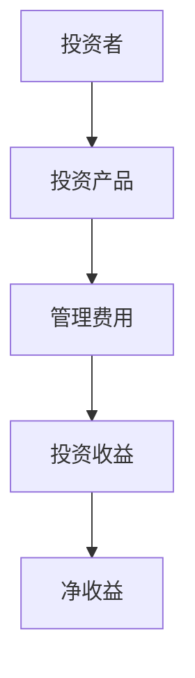
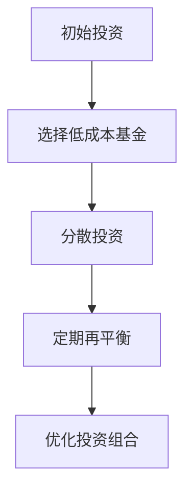

                 


# 约翰·伯格的低成本投资哲学

> 关键词：低成本投资，约翰·伯格，指数基金，投资哲学，投资策略

> 摘要：本文深入探讨了约翰·伯格的低成本投资哲学，分析了其核心思想、低成本投资的背景与问题、核心概念、算法原理、系统分析、项目实战以及投资的未来展望。通过详细的技术分析和实例，揭示了低成本投资的优势和实现方法，为投资者提供了实用的指导。

---

## 第1章: 约翰·伯格的投资哲学基础

### 1.1 约翰·伯格的背景与投资理念

#### 1.1.1 约翰·伯格的生平简介

约翰·伯格（John C. Bogle）是美国著名的投资专家，被誉为“指数基金之父”。他于1940年出生在美国宾夕法尼亚州，毕业于宾夕法尼亚大学沃顿商学院。伯格的职业生涯始于1965年，当时他加入了费城投资信托基金（Philadelphia Stock Exchange Investment Trust），并在此后逐渐发展出他对低成本投资的深刻理解。

伯格在1975年创立了先锋集团（Vanguard Group），这是全球最大的指数基金公司之一。他在投资领域的主要贡献在于推广低成本指数基金，强调长期投资和分散投资的重要性。

#### 1.1.2 伯格的投资哲学核心思想

伯格的投资哲学可以总结为以下几点：

1. **低成本投资**：伯格认为，高昂的管理费用会显著侵蚀投资收益，尤其是对于长期投资者而言，费用的影响更为明显。因此，他提倡选择低成本的投资工具，如指数基金。

2. **长期投资**：伯格反对频繁交易和市场择时，他认为市场预测几乎是不可能的，而长期持有优质资产才是实现财富增长的关键。

3. **分散投资**：通过分散投资于不同资产类别或地区，可以有效降低投资组合的整体风险。

4. **价值投资**：伯格强调投资于具有长期增长潜力的资产，而不是短期市场波动。

#### 1.1.3 伯格投资哲学的现实意义

伯格的投资哲学不仅在理论上具有深远影响，而且在实践中也被广泛应用于个人和机构的投资策略中。他的低成本投资理念帮助许多投资者降低了投资成本，提高了净收益。此外，伯格的长期投资和分散投资策略也被证明是应对市场不确定性的重要方法。

---

### 1.2 低成本投资的背景与问题背景

#### 1.2.1 投资成本的定义与分类

投资成本是指投资者在投资过程中所产生的各种费用，主要包括管理费、托管费、交易佣金等。这些成本会直接影响投资收益，因此降低投资成本是提高投资回报的重要途径。

投资成本可以分为显性成本和隐性成本。显性成本包括管理费、托管费等可以直接看到的费用，而隐性成本则包括由于市场冲击或交易频率增加而产生的额外成本。

#### 1.2.2 高成本投资的局限性与问题

高成本投资的主要问题在于其高昂的费用会显著侵蚀投资收益。例如，一只管理费为1.5%的基金，长期来看可能会比管理费为0.5%的基金收益低很多。此外，高成本投资还可能导致投资者频繁交易，进一步增加交易成本和税务负担。

#### 1.2.3 低成本投资的兴起与趋势

随着金融技术的进步和市场竞争的加剧，低成本投资逐渐兴起。指数基金和交易所交易基金（ETFs）的普及，使得投资者可以以较低的成本分散投资于多种资产。此外，互联网技术的发展也使得投资者可以更方便地获取信息和进行投资，进一步推动了低成本投资的趋势。

---

## 第2章: 低成本投资的核心概念与联系

### 2.1 低成本投资的核心概念

#### 2.1.1 投资成本的构成与影响

投资成本主要包括管理费、托管费、交易佣金等。这些成本会直接影响投资收益，尤其是长期投资中，复利效应会使成本的影响更加显著。

例如，假设两只基金A和B，分别以1.5%和0.5%的管理费进行投资，长期来看，基金A的净收益将显著低于基金B。

#### 2.1.2 低成本投资的定义与特征

低成本投资是指通过选择低成本的投资工具和策略，以降低投资成本并提高净收益的投资方式。其主要特征包括：

1. **低管理费用**：选择管理费较低的基金或投资工具。
2. **长期持有**：避免频繁交易以减少交易成本。
3. **分散投资**：通过投资于多种资产或地区降低风险。
4. **被动管理**：通过指数基金等被动投资工具减少主动管理的费用。

#### 2.1.3 低成本与高收益的平衡点

低成本投资并不意味着追求最低的绝对成本，而是在合理控制成本的前提下，追求长期的高收益。通过选择合适的低成本投资工具和策略，投资者可以在控制成本的同时实现资产的长期增长。

---

### 2.2 核心概念的属性特征对比

#### 2.2.1 成本与收益的对比分析

| 成本类型       | 收益影响                   |
|----------------|--------------------------|
| 管理费         | 显著侵蚀长期收益           |
| 交易佣金       | 高频交易成本显著增加       |
| 托管费         | 长期积累成本               |

#### 2.2.2 投资期限与成本的关系

投资期限越长，投资成本对收益的影响越大。例如，长期投资者更应关注管理费等持续性成本。

#### 2.2.3 投资品种与成本的关联

不同类型的投资品种成本不同。例如，指数基金的管理费通常低于主动管理型基金。

### 2.3 ER实体关系图



---

## 第3章: 低成本投资的算法原理

### 3.1 低成本投资的数学模型

#### 3.1.1 投资收益公式

$$ \text{净收益} = \text{投资收益} - \text{管理费用} $$

#### 3.1.2 费用对复利的影响

$$ \text{复利收益} = P \times (1 + r)^n $$

其中：
- \( P \) 是初始投资金额
- \( r \) 是年收益率
- \( n \) 是投资年数

#### 3.1.3 投资组合优化算法



---

### 3.2 投资组合优化算法实现

以下是一个简单的投资组合优化算法的Python实现：

```python
import numpy as np

def calculate_net_return(initial_amount, annual_return, fee_rate, years):
    for _ in range(years):
        initial_amount = initial_amount * (1 + annual_return - fee_rate)
    return initial_amount

initial_amount = 10000
annual_return = 0.07
fee_rate = 0.015
years = 30

net_return = calculate_net_return(initial_amount, annual_return, fee_rate, years)
print(f"净收益: {net_return:.2f}")
```

---

## 第4章: 系统分析与架构设计方案

### 4.1 投资系统问题场景

#### 4.1.1 高成本投资的局限性

高成本投资会导致长期收益的显著下降，尤其是在市场波动较大的情况下。

#### 4.1.2 低成本投资的优势

低成本投资通过降低费用和优化投资策略，可以实现长期的稳定收益。

### 4.2 领域模型设计


---

## 第5章: 项目实战

### 5.1 环境安装

为了实现低成本投资，首先需要选择一个低成本的投资平台，例如使用指数基金或ETFs。

### 5.2 核心实现

以下是一个简单的投资组合优化的Python实现：

```python
import pandas as pd

def create_low_cost_portfolio(tickers, weights):
    portfolio = pd.DataFrame({'标的': tickers, '权重': weights})
    return portfolio

tickers = ['AAPL', 'GOOGL', 'MSFT', 'AMZN']
weights = [0.3, 0.3, 0.2, 0.2]

portfolio = create_low_cost_portfolio(tickers, weights)
print(portfolio)
```

---

## 第6章: 总结与展望

### 6.1 总结

约翰·伯格的低成本投资哲学强调了低成本、长期投资和分散投资的重要性。通过选择合适的低成本投资工具和策略，投资者可以在控制成本的同时实现长期的财富增长。

### 6.2 未来展望

随着技术的进步和市场的进一步发展，低成本投资将继续得到普及和发展。未来的投资领域可能会出现更多创新的低成本投资工具和策略，为投资者提供更多选择。

---

## 作者：AI天才研究院/AI Genius Institute & 禅与计算机程序设计艺术 /Zen And The Art of Computer Programming

---

以上是《约翰·伯格的低成本投资哲学》的完整文章大纲及内容。

