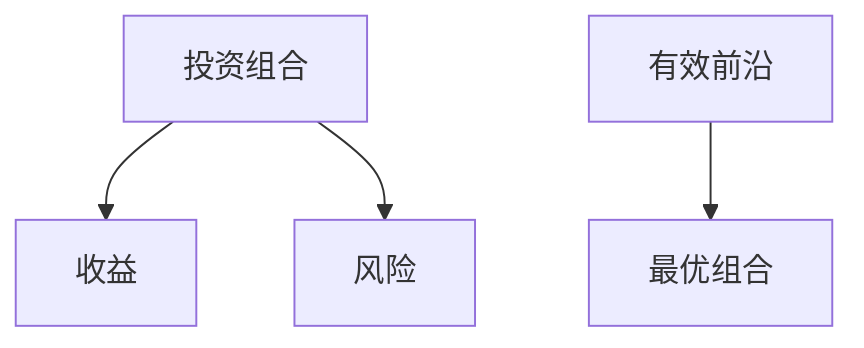
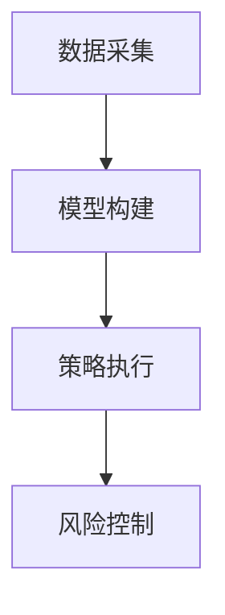

                 


# 约翰·伯格的全球多元化投资理念

> 关键词：约翰·伯格，指数基金，多元化投资，资产配置，风险管理

> 摘要：本文深入探讨了约翰·伯格的全球多元化投资理念，分析了其核心概念、算法原理、系统架构及项目实战，结合最佳实践，为读者提供全面的理论与实践指导。

---

# 正文

## 第一部分：投资的演变与约翰·伯格的全球多元化投资理念

### 第1章：投资的演变与伯格的投资理念

#### 1.1 投资的演变历程

##### 1.1.1 传统投资与现代投资的分水岭

投资从早期的个股选择和市场投机，逐渐发展为基于数据和模型的系统化投资。20世纪中期，机构投资者开始采用多元化策略，以降低风险并提高收益稳定性。

##### 1.1.2 约翰·伯格的生平与投资理念的形成

约翰·伯格（John C. Bogle）是指数基金之父，他在1975年创立了第一只指数基金（Vanguard 500 Index Fund），并倡导长期、分散化的投资策略。他的理念源于对市场波动和投资者情绪的研究。

##### 1.1.3 多元化投资的背景与重要性

随着全球市场的波动加剧，投资者意识到通过多元化配置资产可以有效分散风险，同时捕捉全球经济增长的机会。伯格的理念在全球化背景下显得尤为重要。

### 第2章：多元化投资的核心概念

#### 2.1 投资的基本概念

##### 2.1.1 资产配置的定义与作用

资产配置是将资金分配到不同资产类别（股票、债券、房地产等）以实现风险与收益的平衡。通过资产配置，投资者可以在不同市场环境下优化收益。

##### 2.1.2 风险与收益的关系

风险与收益成正比，但通过多元化可以降低特定资产的风险，提高整体投资组合的稳定性。

##### 2.1.3 投资组合的构成要素

一个典型的投资组合包括股票、债券、现金等资产，每种资产的比例根据风险偏好和投资目标而定。

#### 2.2 现代投资组合理论

##### 2.2.1 马科维茨的有效前沿模型

马科维茨提出的投资组合理论是基于均值-方差模型，通过优化资产组合的收益和风险，找到最优投资组合。下图展示了有效前沿的概念：



##### 2.2.2 资产分配的数学模型

均值-方差优化的公式为：

$$
\text{Minimize } \sigma^2 \text{ subject to } E(r) = \text{target return}
$$

其中，$\sigma^2$是投资组合的方差，$E(r)$是预期收益。

## 第二部分：系统化投资策略与风险管理

### 第3章：系统化投资策略

#### 3.1 投资系统的构建

##### 3.1.1 投资目标的设定与分解

明确投资目标（如保本、收益最大化）后，将其分解为可执行的子目标，如资产分配比例。

##### 3.1.2 投资策略的系统化框架

系统化投资策略包括数据采集、模型构建、策略执行和风险控制四个阶段。下图展示了系统化投资的流程：



##### 3.1.3 投资组合的动态调整机制

根据市场变化定期调整投资组合，确保其符合预定目标。

### 3.2 风险管理的数学模型

#### 3.2.1 风险价值（VaR）的计算方法

VaR是衡量投资组合潜在损失的重要指标，计算公式为：

$$
VaR = \text{损失的第} \alpha \text{分位数}
$$

#### 3.2.2 压力测试的实施步骤

压力测试模拟极端市场情况，评估投资组合的承受能力。

#### 3.2.3 风险调整

根据风险评估结果调整投资组合，降低潜在损失。

## 第三部分：项目实战

### 第4章：全球多元化投资的实践

#### 4.1 项目环境安装

##### 4.1.1 安装Python和必要的库

安装Python 3.x，使用pip安装numpy、pandas、scipy等库。

##### 4.1.2 数据源获取

从Yahoo Finance获取全球主要市场的指数数据。

#### 4.2 核心代码实现

##### 4.2.1 数据清洗与处理

```python
import pandas as pd
import numpy as np

# 下载指数数据
data = pd.read_csv('global_indices.csv')

# 删除缺失值
data.dropna(inplace=True)
```

##### 4.2.2 优化模型实现

```python
from scipy.optimize import minimize

# 定义目标函数
def portfolio_optimization(weights, returns):
    return np.var(weights.dot(returns))

# 约束条件
def constraint(weights):
    return np.sum(weights) - 1

# 最优化问题
result = minimize(portfolio_optimization, [1/len(returns)], 
                 method='SLSQP', constraints={'type': 'eq', 'fun': constraint})
```

##### 4.2.3 结果分析与可视化

优化后的权重分布展示了各资产的配置比例，帮助投资者理解风险与收益的平衡。

### 第5章：最佳实践与小结

#### 5.1 最佳实践 tips

- 定期再平衡投资组合，确保符合目标配置。
- 长期投资，避免频繁交易产生的费用。

#### 5.2 小结

通过系统化的投资策略和风险管理，投资者可以实现资产的长期稳定增长，伯格的多元化投资理念在全球化背景下具有重要的指导意义。

---

# 作者：AI天才研究院/AI Genius Institute & 禅与计算机程序设计艺术 /Zen And The Art of Computer Programming

