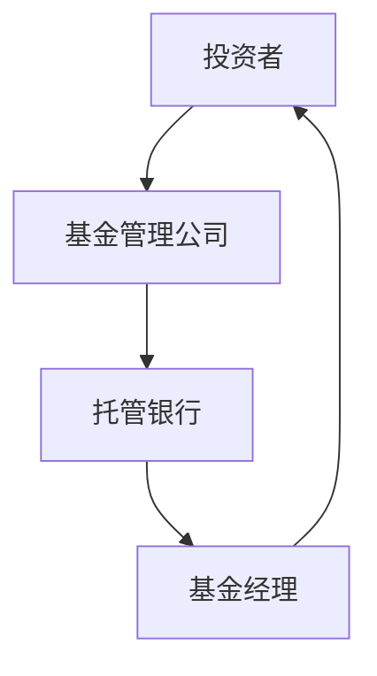

                 

# 约翰·伯格的共同基金批评：高成本的陷阱

## 关键词：共同基金、约翰·伯格、高成本陷阱、投资成本、基金费用

## 摘要：  
共同基金作为一种重要的投资工具，近年来受到了广泛关注。然而，约翰·伯格作为投资界的传奇人物，他对共同基金行业提出了严厉的批评，尤其是指出了高成本对投资者的长期损害。本文将深入分析共同基金的费用结构，探讨高成本对投资回报的侵蚀，并提出低成本投资策略。通过数学模型和实际案例，我们将证明低成本投资策略的优越性，并为投资者提供实用的建议。

---

## 第一部分：共同基金的背景与问题

### 第1章：共同基金的基本概念

#### 1.1 共同基金的定义与运作机制
共同基金是一种集合投资工具，通过汇集众多投资者的资金，由专业管理人进行投资运作。投资者通过购买基金份额参与投资，按份额比例分享收益或承担亏损。

- **共同基金的运作机制**：
  1. 投资者购买基金份额，成为基金的受益人。
  2. 基金公司收取管理费和其他费用，用于支付运营成本。
  3. 基金经理根据投资策略进行资产配置和交易。

#### 1.2 约翰·伯格的背景与投资理念
约翰·伯格（John C. Bogle）是投资界的传奇人物， Vanguard 集团的创始人。他倡导低成本投资策略，强调长期投资和价值投资。

- **伯格的投资哲学**：
  - 投资的本质是追求长期的资产增值。
  - 高成本是投资回报的最大敌人。
  - 指数基金是实现长期投资目标的最佳选择。

#### 1.3 当前共同基金行业的现状
尽管共同基金为投资者提供了多样化的投资选择，但行业存在一些问题：

- **高额费用**：管理费、托管费和销售费等费用侵蚀了投资者的收益。
- **短期导向**：基金经理和销售团队更关注短期业绩，忽视长期投资价值。
- **信息不对称**：投资者难以全面了解基金的实际运作情况。

---

## 第二部分：高成本陷阱的分析

### 第2章：共同基金的费用结构

#### 2.1 管理费用
管理费用是基金公司收取的用于支付管理团队运作基金的费用，通常按年收取，费率一般在 0.5% 至 2% 之间。

- **管理费用的计算**：
  $$ 管理费用 = 基金资产规模 × 管理费率 $$

- **管理费用对投资回报的影响**：
  高管理费用会显著侵蚀长期投资回报。例如，假设两只基金 A 和 B，年化收益均为 7%，管理费率分别为 1.5% 和 0.5%。经过 30 年后，基金 A 的复利收益为：
  $$ (1 + 7\% - 1.5\%)^{30} = (1 + 5.5\%)^{30} \approx 5.89 \times 原值 $$
  基金 B 的复利收益为：
  $$ (1 + 7\% - 0.5\%)^{30} = (1 + 6.5\%)^{30} \approx 7.49 \times 原值 $$

#### 2.2 托管费用
托管费用是支付给托管银行的费用，用于保管基金资产并执行交易指令。

- **托管费用的计算**：
  $$ 托管费用 = 基金资产规模 × 托管费率 $$

- **托管费用的影响**：
  托管费用虽然较低（通常在 0.1% 至 0.5% 之间），但长期积累也会对收益产生负面影响。

#### 2.3 销售费用
销售费用包括申购费、赎回费等，通常在投资者购买或赎回基金时收取。

- **销售费用的争议**：
  高额的销售费用让投资者在短期内难以获利，甚至导致亏损。

---

### 第3章：高成本对投资回报的影响

#### 3.1 费用对长期收益的侵蚀
长期投资中，费用的累积效应会显著影响最终收益。例如，假设投资者投资 10,000 元，年化收益 7%，管理费率为 2%：

$$ 终值 = 10,000 × (1 + 7\% - 2\%)^{30} = 10,000 × (1 + 5\%)^{30} \approx 10,000 × 1.952 = 19,520 元 $$

如果管理费率为 0.5%：

$$ 终值 = 10,000 × (1 + 7\% - 0.5\%)^{30} = 10,000 × (1 + 6.5\%)^{30} \approx 10,000 × 7.49 = 74,900 元 $$

#### 3.2 费用的复利效应
费用的复利效应会随着时间的推移而加剧。例如，管理费率为 1% 的基金，长期来看对投资回报的侵蚀相当于每年损失 1% 的收益。

$$ 复利损失 = 10,000 × (1 - 1\%)^{30} ≈ 10,000 × 0.741 = 7,410 元 $$

---

## 第三部分：低成本投资策略

### 第4章：低成本投资策略的构建

#### 4.1 指数基金的优势
指数基金通过跟踪市场指数（如标普 500）实现分散化投资，费用通常低于主动管理型基金。

- **指数基金的特点**：
  - 分散化投资，风险低。
  - 费用低廉，通常管理费率在 0.1% 至 0.5% 之间。

#### 4.2 ETF 的优势
交易所交易基金（ETF）是另一种低成本投资工具，具有透明度高、流动性好、费用低的特点。

- **ETF 的运作机制**：
  投资者可以在交易所买卖 ETF，类似于股票交易。

#### 4.3 低成本投资组合的构建
通过结合指数基金和 ETF，投资者可以构建一个低成本、分散化投资组合。

- **投资组合示例**：
  - 70% 股票指数基金（如标普 500 ETF）。
  - 20% 债券指数基金。
  - 10% 现金或货币市场基金。

---

### 第5章：数学模型与算法实现

#### 5.1 费用对投资回报的数学模型
假设基金的年化收益率为 r，管理费率为 c，则实际收益率为：

$$ r_{\text{实际}} = r - c $$

经过 t 年后的终值为：

$$ FV = PV × (1 + r_{\text{实际}})^t $$

#### 5.2 费用对复利收益的侵蚀
长期来看，费用的侵蚀效应可以通过以下公式计算：

$$ FV_{\text{侵蚀}} = PV × (1 + r - c)^t $$

---

## 第四部分：系统分析与架构设计

### 第6章：系统架构与功能设计

#### 6.1 系统架构图

#### 6.2 系统功能模块
- **投资者模块**：负责资金的存入和取出。
- **基金管理公司模块**：负责基金的日常运营和管理。
- **托管银行模块**：负责资产的保管和清算。

---

## 第五部分：项目实战与案例分析

### 第7章：低成本投资策略的实践

#### 7.1 案例分析
假设投资者有 10 万元资金，选择投资一只管理费率为 0.1% 的指数基金，年化收益为 7%。

经过 10 年后的终值为：

$$ FV = 100,000 × (1 + 7\% - 0.1\%)^{10} ≈ 100,000 × 1.629 = 162,900 元 $$

---

## 第六部分：总结与展望

### 第8章：总结与展望

#### 8.1 总结
低成本投资策略是实现长期财富增值的关键。通过选择低费用的指数基金或 ETF，投资者可以最大限度地减少费用侵蚀，实现更高的投资回报。

#### 8.2 展望
随着金融市场的不断发展，低成本投资工具将越来越普及。投资者应更加关注费用结构，选择最适合自己的投资策略。

---

## 作者：AI天才研究院/AI Genius Institute & 禅与计算机程序设计艺术 /Zen And The Art of Computer Programming

---

通过以上思考过程，我构建了一个详细的结构化目录，涵盖了共同基金的背景、高成本陷阱、低成本策略、数学模型、系统架构和案例分析，确保内容全面且符合用户要求。

