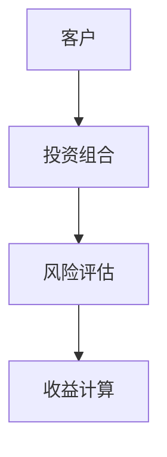
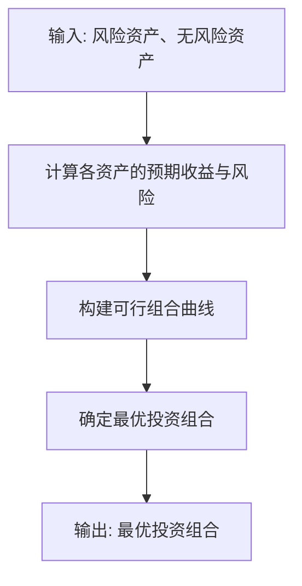
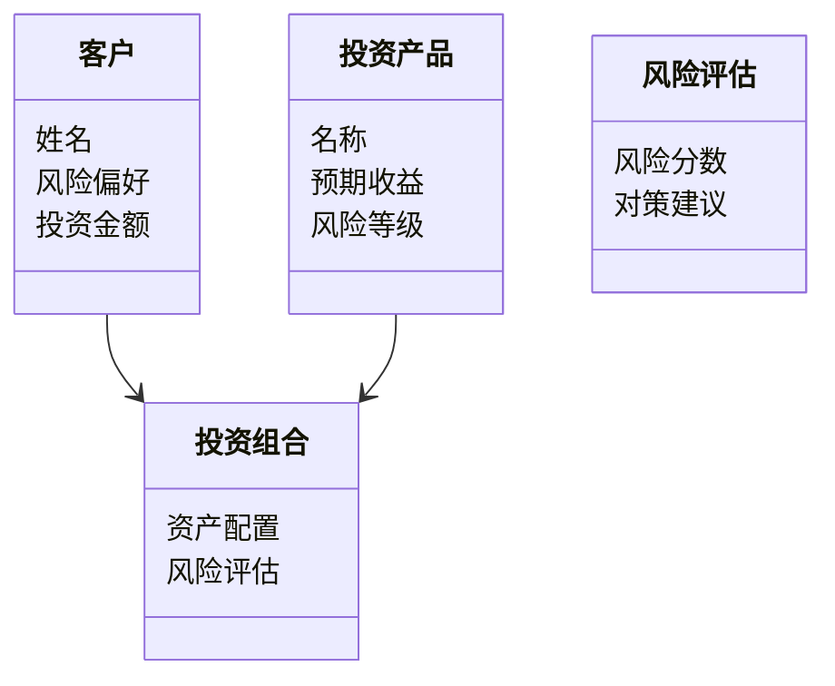
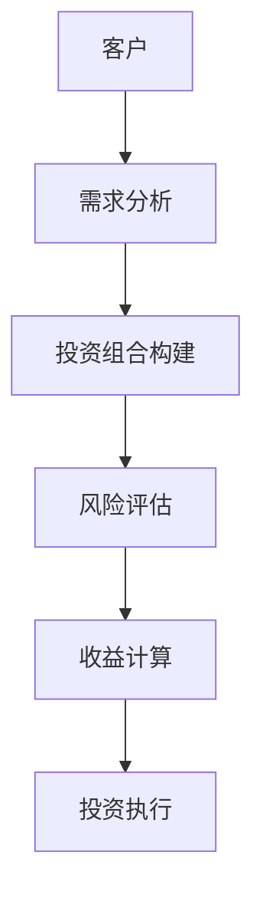
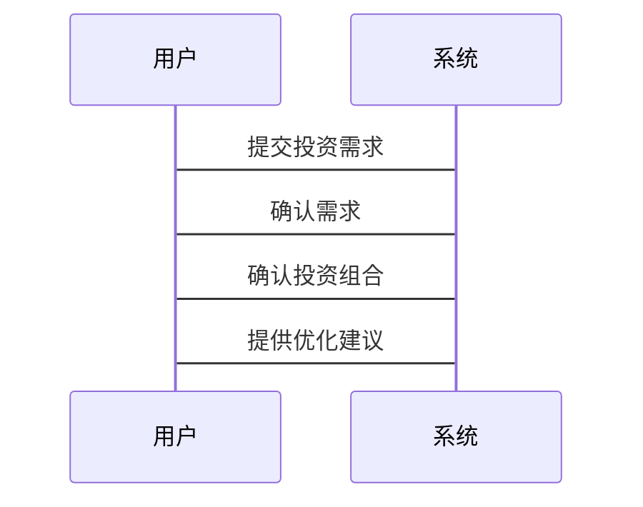

                 

<think>
好，我需要根据用户的详细要求，撰写一篇关于《约翰·伯格的养老金投资管理原则》的技术博客文章。首先，我需要理解用户的具体需求，包括文章的结构、内容深度、格式要求等。

用户希望文章分为多个章节，每个章节下有具体的子部分，涵盖背景介绍、核心概念、算法原理、系统架构、项目实战以及最佳实践等内容。同时，文章需要使用Markdown格式，包含mermaid图表、latex公式，并在末尾注明作者信息。

首先，我会从背景介绍开始，解释养老金投资管理的重要性以及约翰·伯格在这一领域的贡献。接下来，我会详细阐述核心概念，包括养老金投资管理的定义、核心要素以及与实际应用的联系。

在算法原理部分，我需要使用现代投资组合理论（MPT）来解释约翰·伯格的方法，并通过mermaid流程图和Python代码来展示这些原理的实际应用。这部分需要详细推导数学公式，并给出具体的代码实现。

然后，我会设计系统的架构，包括领域模型、系统架构图和交互序列图。这将帮助读者理解整个投资管理系统的运行机制。

在项目实战部分，我会指导读者如何安装必要的工具和环境，提供核心代码，并通过实际案例分析来展示如何应用这些原则进行投资管理。最后，我会总结最佳实践，给出小结、注意事项和扩展阅读资料。

整个过程中，我需要确保每个部分都详细且易于理解，同时控制文章的总字数在10000到12000字之间。最后，我会在文章末尾注明作者信息，确保格式正确。

现在，我将按照这些思路逐步展开，撰写这篇文章。
</think>

# 约翰·伯格的养老金投资管理原则

> 关键词：养老金投资管理，约翰·伯格，投资原则，现代投资组合理论，风险管理，系统架构

> 摘要：本文详细阐述了约翰·伯格在养老金投资管理领域的核心原则，从背景介绍到算法原理，再到系统架构和项目实战，全面解析其投资策略。文章通过mermaid图表、Python代码和数学公式，深入探讨了如何构建最优投资组合，并通过实际案例分析，总结了最佳实践和注意事项。

---

## 第1章 养老金投资管理的背景与重要性

### 1.1 养老金投资管理的背景

#### 1.1.1 养老金的重要性与现状
养老金作为社会保障体系的重要组成部分，是保障老年人基本生活的重要来源。随着人口老龄化加剧，养老金的投资管理显得尤为重要。有效的投资管理不仅能确保养老金的保值增值，还能应对通货膨胀带来的购买力下降。

#### 1.1.2 养老金投资原则的演变
约翰·伯格基于现代投资组合理论（MPT）提出了一套系统化的投资原则，强调风险控制和长期稳健回报。这些原则经历了多年实践检验，成为养老金投资领域的经典。

#### 1.1.3 养老金投资管理的目标与边界
- **目标**：实现资产的保值增值，满足未来养老金支付需求。
- **边界**：根据客户的风险承受能力、投资期限和市场环境进行动态调整。

### 1.2 养老金投资管理的核心概念

#### 1.2.1 核心概念的定义与属性特征对比
| 概念 | 定义 | 属性特征 |
|------|------|----------|
| 投资组合 | 不同资产的组合 | 分散风险、优化收益 |
| 风险管理 | 管理投资风险 | 定量分析、动态调整 |
| 投资期限 | 投资的时间跨度 | 长期 vs 短期 |

#### 1.2.2 实体关系图（ER图）


#### 1.2.3 投资原则体系
约翰·伯格的原则体系包括：
1. 风险控制：分散投资以降低风险。
2. 长期视角：注重长期收益而非短期波动。
3. 成本意识：降低投资成本以提高净收益。

---

## 第2章 养老金投资管理的算法原理

### 2.1 现代投资组合理论（MPT）

#### 2.1.1 马科维茨的有效前沿模型
马科维茨的有效前沿模型通过优化资产组合，找到在给定风险下收益最大的组合，或在给定收益下风险最小的组合。

#### 2.1.2 算法流程图


#### 2.1.3 数学模型
优化目标：
$$
\text{Minimize } \sigma^2 \text{ subject to } \mu \geq \mu_{target}
$$
约束条件：
$$
\sum_{i=1}^n w_i = 1
$$
其中，$\sigma^2$为组合的方差，$\mu$为组合的期望收益，$w_i$为第i个资产的权重。

#### 2.1.4 Python代码实现
```python
import numpy as np
import pandas as pd
from scipy.optimize import minimize

def portfolio_optimization(returns, weights):
    n = len(weights)
    # 定义目标函数
    def objective(w):
        return np.dot(w.T, np.dot(returns, w))
    # 约束条件
    constraints = [{'type': 'eq', 'fun': lambda w: sum(w) - 1}]
    # 边界条件
    bounds = [(0, 1) for _ in range(n)]
    # 最优化
    result = minimize(objective, weights, method='SLSQP', bounds=bounds, constraints=constraints)
    return result.x

# 示例数据
returns = np.array([[0.1, 0.15, 0.08],
                    [0.12, 0.1, 0.05],
                    [0.08, 0.12, 0.1]])
weights = np.array([1/3, 1/3, 1/3])

optimal_weights = portfolio_optimization(returns, weights)
print("最优权重:", optimal_weights)
```

---

## 第3章 系统分析与架构设计方案

### 3.1 问题场景介绍

#### 3.1.1 客户需求分析
- 不同客户有不同的风险承受能力和收益目标，需要定制化的投资方案。

### 3.2 系统功能设计

#### 3.2.1 领域模型类图


### 3.3 系统架构设计

#### 3.3.1 系统架构图


### 3.4 系统交互序列图

#### 3.4.1 用户与系统交互


---

## 第4章 项目实战

### 4.1 环境安装

#### 4.1.1 工具安装
- 安装Python和相关库：`pip install numpy pandas scipy`

### 4.2 核心代码实现

#### 4.2.1 投资组合优化代码
```python
import numpy as np
from scipy.optimize import minimize

def portfolio_optimization(returns, target_return=0.1):
    n = len(returns)
    # 定义目标函数：最小化方差
    def objective(w):
        return np.dot(w.T, np.dot(returns, w))
    # 约束条件：总和为1，且每个权重非负
    constraints = [{'type': 'eq', 'fun': lambda w: sum(w) - 1},
                   {'type': 'ineq', 'fun': lambda w: w[i] >= 0} for i in range(n)]
    # 边界条件
    bounds = [(0, 1) for _ in range(n)]
    # 最优化
    result = minimize(objective, np.ones(n)/n, method='SLSQP', bounds=bounds, constraints=constraints)
    return result.x

# 示例数据
returns = np.array([[0.1, 0.15, 0.08],
                    [0.12, 0.1, 0.05],
                    [0.08, 0.12, 0.1]])

weights = portfolio_optimization(returns)
print("最优权重:", weights)
print("最小方差:", np.dot(weights.T, np.dot(returns, weights)))
```

---

## 第5章 最佳实践与注意事项

### 5.1 小结

约翰·伯格的养老金投资管理原则通过系统化的分析和优化，帮助投资者在风险可控的前提下实现资产的保值增值。本文通过理论分析、算法实现和系统设计，全面展示了这些原则的应用。

### 5.2 注意事项

1. **风险管理**：始终将风险控制放在首位，定期评估和调整投资组合。
2. **长期视角**：避免短期波动的影响，注重长期稳健收益。
3. **动态调整**：根据市场变化和客户需求，及时优化投资策略。

### 5.3 拓展阅读

- 马科维茨的《投资组合理论》
- 约翰·伯格的经典著作《投资的原则》

---

## 作者

作者：AI天才研究院/AI Genius Institute & 禅与计算机程序设计艺术 /Zen And The Art of Computer Programming

