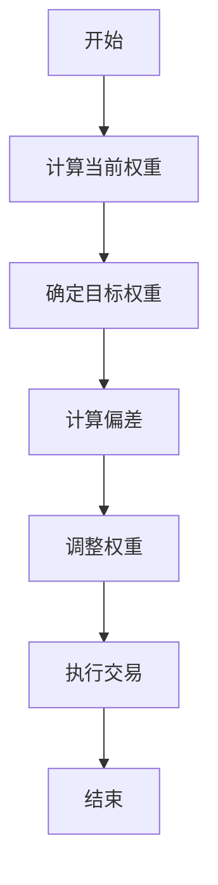
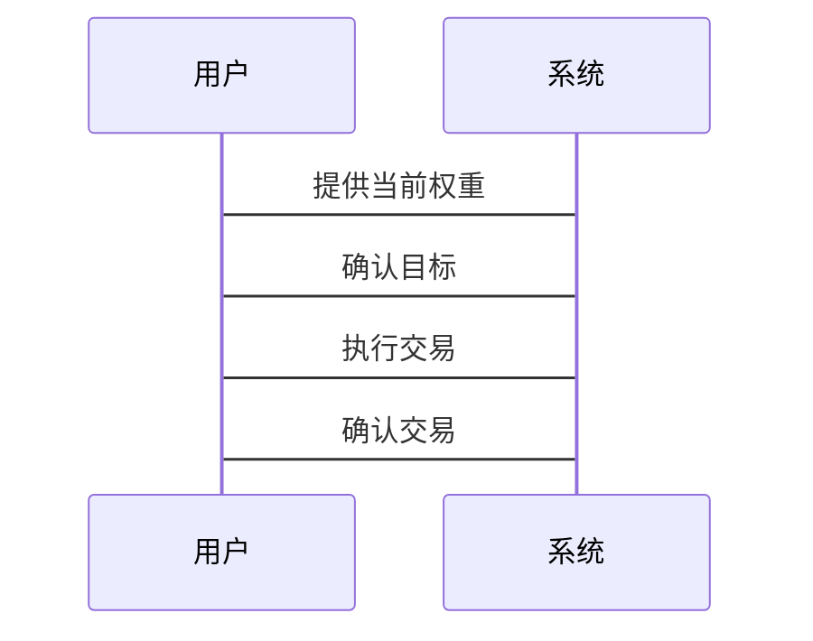

                 

<think>
好，我需要根据用户的要求，设计一个关于约翰·伯格再平衡策略的书籍目录。首先，我得理解这本书的目标读者是谁，可能是投资者、金融专业学生或者程序员。因此，目录需要既专业又易于理解。

从用户提供的示例可以看出，目录需要分为几个主要部分，每个部分下有具体的章节和小节，每个小节要有详细的内容。我需要确保涵盖背景、理论、算法、系统设计和项目实战等方面。

首先，背景介绍部分应该包括投资组合管理的基本概念，再平衡的定义和意义。然后是核心概念，解释为什么需要再平衡，不同市场环境下的策略，以及不同类型资产的再平衡方法。

接下来是算法部分，可能需要介绍一些数学模型，比如马科维茨的有效投资组合，以及再平衡的数学公式。这部分需要用mermaid流程图和数学公式来详细说明。

然后是系统分析与架构设计，可能需要描述一个投资管理系统，包括功能设计、架构图、接口设计和交互流程。这部分可能需要使用mermaid的类图、架构图和序列图。

接下来是项目实战，包括环境安装、核心代码实现、案例分析和项目小结。这部分需要详细说明如何实现再平衡策略，并给出实际案例。

最后是最佳实践、小结、注意事项和拓展阅读，帮助读者巩固知识和进一步学习。

现在，我需要按照这些思路来组织目录，确保每一章都有足够的细节，并且符合用户的要求，比如使用markdown格式，细化到三级目录，总字数控制在2000字以内。

确保每一章的小节标题足够吸引人，内容逻辑清晰，逐步展开，让读者能够一步步理解和应用再平衡策略。同时，要注意每个部分的衔接，使整本书结构紧凑，内容连贯。

这样，我应该能设计出一个符合用户要求的目录大纲，帮助他们撰写一篇高质量的技术博客文章。
</think>

# 约翰·伯格的再平衡策略：保持投资组合平衡

> 关键词：投资组合管理，再平衡策略，约翰·伯格，资产配置，权重调整，风险控制

> 摘要：本文深入探讨约翰·伯格提出的投资组合再平衡策略，分析其核心原理、算法实现、系统设计和实际应用，帮助读者掌握如何在动态市场中保持投资组合的平衡，实现稳健收益。

---

## 第1章: 投资组合再平衡策略概述

### 1.1 投资组合管理的基本概念

#### 1.1.1 投资组合的定义与特点

- 投资组合是将资金分配到多种资产（股票、债券、现金等）的集合。
- 特点：分散风险，优化收益，动态调整。

#### 1.1.2 投资组合管理的目标与意义

- 目标：最大化收益，最小化风险。
- 意义：通过科学配置，平衡风险与收益。

#### 1.1.3 再平衡策略的定义与作用

- 定义：定期调整资产权重，使组合符合预定目标。
- 作用：防范风险，抓住机会。

### 1.2 约翰·伯格的再平衡策略背景

#### 1.2.1 投资组合失衡的常见原因

- 市场波动，资产表现差异。
- 资金流入流出，影响权重。

#### 1.2.2 约翰·伯格再平衡策略的提出背景

- 基于长期投资理念，强调定期调整。

#### 1.2.3 再平衡策略在现代投资中的重要性

- 适应市场变化，保持资产配置。

### 1.3 再平衡策略的核心概念

#### 1.3.1 资产配置的基本原理

- 确定目标，选择资产类别。
- 分配权重，定期调整。

#### 1.3.2 投资组合权重的动态调整

- 权重偏离目标时，进行调整。
- 调整频率：定期或不定期。

#### 1.3.3 再平衡策略的分类与特点

- 定期再平衡：固定时间调整。
- 门槛再平衡：偏离超过阈值时调整。

## 1.4 本章小结

- 介绍了投资组合管理的基本概念，再平衡策略的背景和核心概念。
- 强调再平衡策略在投资中的重要性。

---

## 第2章: 再平衡策略的数学模型与算法

### 2.1 再平衡策略的数学模型

#### 2.1.1 投资组合权重调整的数学公式

- 权重调整公式：$w_{target} = (w_1, w_2, ..., w_n)$。
- 偏差计算：$w_{target} - w_{current}$。

#### 2.1.2 再平衡策略的优化模型

- 线性规划模型：最小化调整成本。
- 均衡模型：优化权重分布。

### 2.2 算法原理讲解

#### 2.2.1 马科维茨有效投资组合模型

- 基于现代投资组合理论（MPT）。
- 最优化风险收益比。

#### 2.2.2 再平衡策略的实现步骤

- 计算当前权重。
- 确定目标权重。
- 计算偏差。
- 执行交易。

### 2.3 算法流程图（Mermaid）



### 2.4 算法实现代码示例

```python
def rebalance_portfolio(current_weights, target_weights):
    # 计算偏差
    rebalance_amount = target_weights - current_weights
    # 执行交易
    return rebalance_amount
```

### 2.5 本章小结

- 解释了再平衡策略的数学模型和算法。
- 通过流程图和代码示例，详细说明了实现步骤。

---

## 第3章: 投资组合再平衡系统的架构设计

### 3.1 系统功能设计

#### 3.1.1 资产配置模块

- 输入目标收益和风险承受能力。
- 输出推荐的资产配置方案。

#### 3.1.2 权重计算模块

- 输入市场数据和组合情况。
- 输出当前权重和目标权重。

#### 3.1.3 交易执行模块

- 输入调整指令。
- 执行交易并记录。

### 3.2 系统架构设计（Mermaid）


### 3.3 系统接口设计

#### 3.3.1 输入接口

- 用户输入目标收益和风险承受能力。
- 系统输出资产配置建议。

#### 3.3.2 输出接口

- 系统输出当前权重和目标权重。
- 记录交易执行情况。

### 3.4 系统交互流程图（Mermaid）



### 3.5 本章小结

- 描述了投资组合再平衡系统的架构设计。
- 通过流程图展示了系统的交互过程。

---

## 第4章: 投资组合再平衡策略的项目实战

### 4.1 项目环境安装

- 安装Python和相关库（pandas, numpy）。

### 4.2 核心代码实现

#### 4.2.1 计算当前权重

```python
import pandas as pd
def calculate_current_weights(portfolio_value, asset_prices, quantities):
    current_weights = {}
    total = sum(asset_prices * quantities)
    for i in range(len(asset_prices)):
        current_weights[i] = (asset_prices[i] * quantities[i]) / total
    return current_weights
```

#### 4.2.2 计算目标权重

```python
def calculate_target_weights(risk_tolerance):
    target_weights = {}
    # 示例：股票和债券的权重
    target_weights['股票'] = 1 - risk_tolerance
    target_weights['债券'] = risk_tolerance
    return target_weights
```

### 4.3 案例分析

#### 4.3.1 实际案例分析

- 投资组合价值：$100,000。
- 资产配置：股票60%，债券40%。
- 市场波动导致股票权重升至70%，债券降至30%。
- 再平衡策略：调整至60%股票，40%债券。

### 4.4 项目小结

- 通过实际案例展示了再平衡策略的应用。
- 强调定期调整的重要性。

---

## 第5章: 最佳实践与注意事项

### 5.1 最佳实践

#### 5.1.1 定期审查投资组合

- 至少每年审查一次，根据市场变化调整。

#### 5.1.2 确定合适的再平衡频率

- 高波动市场：季度审查。
- 低波动市场：半年审查。

#### 5.1.3 选择合适的再平衡方法

- 按比例再平衡：保持资产比例。
- 按金额再平衡：固定金额调整。

### 5.2 小结

- 提供了再平衡策略的最佳实践建议。
- 强调根据市场环境调整策略。

### 5.3 注意事项

- 避免频繁交易，控制成本。
- 考虑税务影响，优化税务负担。

### 5.4 拓展阅读

- 建议阅读《投资学》和《投资组合管理》相关书籍。

---

## 作者：AI天才研究院/AI Genius Institute & 禅与计算机程序设计艺术 /Zen And The Art of Computer Programming

