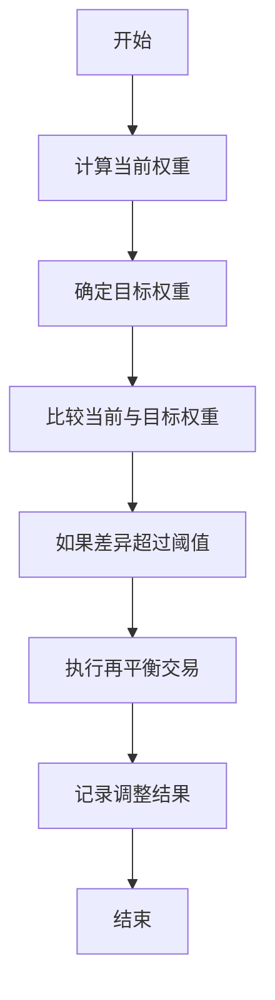
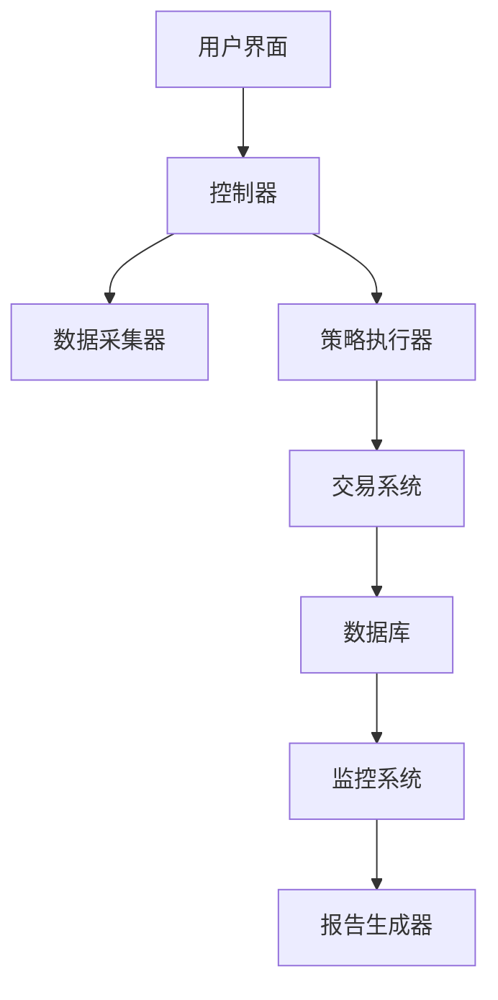

                 


```markdown
# 约翰·伯格的再平衡策略：维持投资组合平衡

## 关键词
- 投资组合再平衡
- 约翰·伯格
- 动态再平衡策略
- 投资组合管理
- 风险控制

## 摘要
本文深入探讨约翰·伯格的再平衡策略，分析其在投资组合管理中的重要性、核心概念、算法原理、系统架构及实际应用。通过详细讲解再平衡策略的背景、原理、实现和最佳实践，为投资者和金融从业者提供实用的指导和见解。

---

## 第一部分: 投资组合再平衡策略概述

### 第1章: 投资组合再平衡策略的背景与意义

#### 1.1 投资组合再平衡的基本概念
- **定义**：投资组合再平衡是指定期调整资产配置，以维持目标风险和收益水平的过程。
- **重要性**：确保投资组合按计划发展，应对市场变化，降低风险。
- **作用**：优化收益、分散风险、应对市场波动。

#### 1.2 投资组合再平衡的背景与演变
- **传统方法的局限性**：静态配置忽视市场变化。
- **策略演变**：从定期再平衡到动态再平衡。
- **当前环境**：市场波动加剧，再平衡策略更受重视。

### 第2章: 投资组合再平衡的核心概念与联系

#### 2.1 再平衡策略的原理与机制
- **定期再平衡**：按固定周期调整。
- **动态再平衡**：根据市场变化实时调整。
- **风险控制**：通过调整降低风险。

#### 2.2 再平衡策略的核心要素对比
- **属性特征对比**：
  | 策略类型 | 调整频率 | 适用场景 | 优缺点 |
  |----------|----------|----------|--------|
  | 定期再平衡 | 定期     | 稳定市场 | 操作简单，但不够灵活 |
  | 动态再平衡 | 实时     | 波动市场 | 灵活，但需高频监控 |
- **ER实体关系图**：
```mermaid
er
actor 投资者
actor 市场
actor 策略执行系统
```

---

## 第二部分: 投资组合再平衡的算法原理

### 第3章: 投资组合再平衡的算法原理

#### 3.1 再平衡算法的数学模型
- **权重计算公式**：
  $$ w_i = \frac{v_i}{\sum_{j=1}^{n} v_j} $$
  其中，\( w_i \) 是第i个资产的权重，\( v_i \) 是第i个资产的价值，\( n \) 是资产总数。

#### 3.2 动态再平衡算法流程


#### 3.3 Python实现
```python
def rebalance_portfolio(current_weights, target_weights, tolerance=0.05):
    # 计算差异
    differences = {asset: current - target for asset, current, target in zip(
        current_weights.index, current_weights, target_weights)}
    
    # 执行交易
    for asset, diff in differences.items():
        if abs(diff) > tolerance:
            trade(asset, -diff)
    
    return current_weights.rebalance()
```

---

## 第三部分: 系统分析与架构设计方案

### 第4章: 系统分析与架构设计方案

#### 4.1 问题场景
- **市场波动**：影响资产权重。
- **投资者偏好**：风险承受能力变化。
- **交易成本**：再平衡的经济影响。

#### 4.2 系统功能设计
- **数据采集**：实时市场数据。
- **策略执行**：自动调整。
- **监控与报告**：记录结果，生成报告。

#### 4.3 系统架构设计


---

## 第四部分: 项目实战

### 第5章: 项目实战

#### 5.1 环境安装
- **工具**：Python、Pandas、NumPy、Matplotlib。

#### 5.2 核心代码实现
```python
import pandas as pd
import numpy as np

def calculate_rebalanced_weights(weights, target_weights, tolerance=0.05):
    # 计算差异
    differences = weights - target_weights
    # 过滤差异超过容忍度的资产
    rebalanced_assets = [asset for asset in weights.index if abs(differences[asset]) > tolerance]
    # 计算调整后的权重
    new_weights = pd.Series(index=rebalanced_assets, data=np.ones(len(rebalanced_assets)) / len(rebalanced_assets))
    return new_weights

# 示例数据
current_weights = pd.Series({'股票':0.6, '债券':0.3, '现金':0.1})
target_weights = pd.Series({'股票':0.5, '债券':0.3, '现金':0.2})

# 执行再平衡
rebalanced_weights = calculate_rebalanced_weights(current_weights, target_weights)
print(rebalanced_weights)
```

#### 5.3 案例分析
- **案例背景**：市场波动导致权重偏离。
- **实施步骤**：识别差异，执行交易，记录结果。

---

## 第五部分: 最佳实践与总结

### 第6章: 最佳实践

#### 6.1 最佳实践
- **定期审查**：持续监控投资组合。
- **选择合适的策略**：根据市场情况选择再平衡方式。
- **控制交易成本**：优化交易以降低成本。

#### 6.2 小结
再平衡策略是投资组合管理的关键，定期审查和调整是维持目标配置的有效方法。

#### 6.3 注意事项
- **市场风险**：再平衡可能带来短期损失。
- **交易成本**：频繁交易增加费用。
- **税务影响**：再平衡可能导致税务负担。

#### 6.4 拓展阅读
- 《投资学》：资产配置的基础知识。
- 《机构投资的创新之路》：现代投资策略。

---

## 作者：AI天才研究院 & 禅与计算机程序设计艺术

---

通过本文的详细讲解，读者可以全面理解约翰·伯格的再平衡策略，掌握其在投资组合管理中的应用，并在实际操作中有效实施这些策略以优化投资结果。
```

