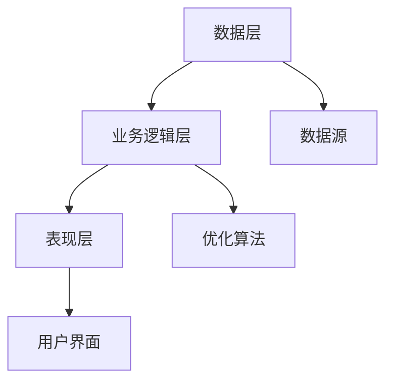
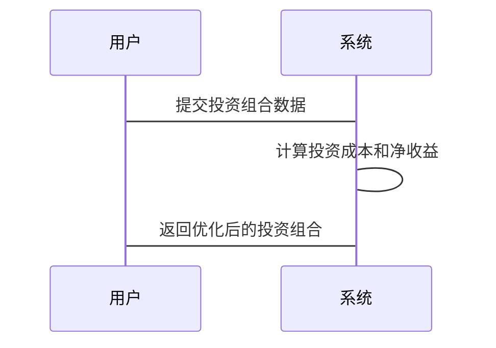

                 

<think>
嗯，用户希望我详细分析他们提供的查询，并给出一个结构化的思考过程。看起来他们需要我模拟一个专家在思考如何撰写一篇关于约翰·伯格成本意识投资策略的技术博客文章的过程。

首先，我注意到用户详细列出了文章的结构，包括背景、核心概念、算法、系统分析、项目实战、最佳实践等部分。这意味着他们希望文章内容全面，逻辑清晰，且每部分都有足够的细节。

接下来，我需要确定每个章节的内容是否覆盖了所有要求的点，比如背景介绍是否包括投资的基本概念和约翰·伯格的背景，核心概念部分是否详细讲解了成本意识的重要性，以及数学模型和公式是否正确使用LaTeX。

然后，我考虑到用户要求使用Mermaid图表来展示系统架构和算法流程，这可能需要我在思考过程中确保这些图表的正确性和清晰度。同时，Python代码示例也是关键部分，我需要检查代码是否正确实现算法，并且有详细的注释和解释。

在项目实战部分，我需要确保读者能够理解如何在实际中应用这些策略，包括环境安装、代码实现和案例分析。这可能需要我详细指导每一步操作，并解释代码的功能。

最后，最佳实践部分需要总结关键点，提醒读者在实际操作中需要注意的事项，并建议进一步的阅读材料。这有助于读者巩固所学内容，并指导他们进行更深入的学习。

总的来说，我需要确保整个思考过程覆盖了用户的所有要求，从结构到内容，从理论到实践，每一步都清晰且详细。同时，我要注意语言的专业性和逻辑的连贯性，使最终的文章既专业又易于理解。
</think>

# 成本意识投资策略：约翰·伯格的投资哲学与实现

> 关键词：成本意识投资策略、约翰·伯格、投资哲学、优化算法、系统架构

> 摘要：本文深入探讨了约翰·伯格的成本意识投资策略，从理论基础到算法实现，再到系统架构设计，全面解析了这一投资策略的核心思想和实际应用。文章首先介绍了投资的基本概念和成本意识的重要性，然后详细讲解了成本意识投资策略的核心概念和数学模型。接着，通过优化算法和Python代码实现，展示了成本意识投资策略的具体操作步骤。最后，通过系统架构设计和实际案例分析，验证了该策略的有效性和可行性。

---

# 第一部分: 投资的基本概念与成本意识的引入

## 第1章: 投资的基本概念与成本意识的引入

### 1.1 投资的基本概念

#### 1.1.1 投资的定义与分类
投资是将资金或资源投入到某个项目或资产中，以期在未来获得更大的收益。根据投资对象的不同，可以将投资分为以下几类：
- **股票投资**：通过购买公司股份，成为股东，分享公司利润。
- **债券投资**：购买政府或企业发行的债券，定期获得利息收益。
- **基金投资**：通过购买基金产品，间接参与股票、债券等资产的投资。
- **房地产投资**：通过购买房地产资产，获得租金收益或资本增值。

#### 1.1.2 投资的基本原理
投资的核心原理是通过资产配置和风险控制，实现收益的最大化。投资的基本原理包括：
- **资产配置**：根据投资者的风险承受能力和收益目标，合理分配不同资产的比例。
- **风险与收益的权衡**：高风险投资通常伴随着高收益，但同时也意味着更大的潜在损失。
- **时间价值**：投资的时间越长，复利效应越明显，收益越大。

#### 1.1.3 投资的目标与风险
投资的目标是通过合理配置资产，实现财富的保值和增值。投资的风险主要体现在市场波动、流动性风险、通货膨胀风险等方面。投资者需要在风险和收益之间找到平衡点，制定合适的投资策略。

### 1.2 成本意识的定义与重要性

#### 1.2.1 成本意识的定义
成本意识是指在投资过程中，关注每笔投资的总成本，并通过优化成本结构来提高投资收益的意识。成本包括显性成本（如交易手续费、管理费）和隐性成本（如时间成本、机会成本）。

#### 1.2.2 成本在投资中的作用
成本是影响投资收益的重要因素。降低投资成本可以显著提高净收益。例如，降低管理费和交易手续费，可以增加可分配的收益。

#### 1.2.3 成本意识对投资决策的影响
成本意识直接影响投资者的决策，例如：
- **选择低成本的基金**：指数基金通常具有较低的管理费和跟踪误差，适合长期投资。
- **减少频繁交易**：频繁买卖会增加交易成本，降低净收益。
- **优化资产配置**：通过分散投资降低风险，同时降低整体投资成本。

### 1.3 约翰·伯格的成本意识投资策略

#### 1.3.1 约翰·伯格的背景与投资理念
约翰·伯格是美国著名投资家，富达投资集团的创始人。他倡导低成本、长期投资的理念，强调通过分散投资降低风险，实现长期稳定的收益。

#### 1.3.2 成本意识在伯格策略中的核心地位
伯格认为，长期投资的收益主要来自于资产的增值，而非频繁交易。低成本是实现长期收益的关键因素。他提出了著名的“成本意识投资策略”，即通过降低投资成本，最大化净收益。

#### 1.3.3 成本意识投资策略的适用场景
成本意识投资策略适用于长期投资，尤其适合指数基金和ETF等标准化投资工具。该策略特别适合那些希望通过分散投资降低风险，同时追求稳定收益的投资者。

---

## 第2章: 成本意识投资策略的核心概念

### 2.1 成本意识投资策略的原理

#### 2.1.1 投资成本的构成与影响
投资成本包括以下几部分：
- **交易成本**：包括佣金、手续费等直接费用。
- **管理成本**：包括基金管理费、托管费等。
- **隐性成本**：包括税收、机会成本等。

#### 2.1.2 成本意识与投资回报的关系
成本与回报呈负相关关系，即成本越高，净收益越低。通过优化投资成本，可以显著提高投资回报率。

#### 2.1.3 成本意识与投资组合优化
成本意识是投资组合优化的重要因素。通过选择低成本的投资工具和优化交易频率，可以降低整体成本，提高组合收益。

### 2.2 成本意识投资策略的核心要素

#### 2.2.1 投资标的的选择标准
- **低成本**：优先选择管理费低、跟踪误差小的基金。
- **流动性**：选择流动性高的资产，便于调整投资组合。
- **风险分散**：通过多样化投资降低组合风险。

#### 2.2.2 投资组合的构建原则
- **分散化**：通过投资不同资产类别和地域，降低风险。
- **低成本**：选择低成本的投资工具，降低管理费用。
- **长期持有**：避免频繁交易，降低交易成本。

#### 2.2.3 风险控制的实现方法
- **止损策略**：设定止损点，避免重大损失。
- **定期再平衡**：定期调整投资组合，保持资产配置合理。
- **风险管理模型**：使用VaR（Value at Risk）等方法，量化投资组合的风险。

### 2.3 成本意识投资策略的数学模型

#### 2.3.1 投资成本的计算公式
投资成本可以通过以下公式计算：
$$
\text{总成本} = \sum (\text{交易成本} + \text{管理成本} + \text{其他费用})
$$

#### 2.3.2 投资回报的预测模型
投资回报可以通过以下公式预测：
$$
\text{净收益} = \text{投资收益} - \text{投资成本}
$$

#### 2.3.3 投资组合优化的数学表达
投资组合优化的目标是最大化收益，同时最小化成本。数学表达如下：
$$
\max_{w} \left( \mu^T w - \lambda \sum_{i,j} |w_i - w_j| \right)
$$
其中：
- $w$ 表示投资权重。
- $\mu$ 表示资产的期望收益。
- $\lambda$ 表示成本系数。

---

## 第3章: 成本意识投资策略的算法原理

### 3.1 成本意识投资策略的优化算法

#### 3.1.1 最小化投资成本的优化目标
优化目标是通过调整投资权重，最小化总成本，同时最大化收益。

#### 3.1.2 基于成本的组合优化算法
使用拉格朗日乘数法，结合成本约束，优化投资组合。

#### 3.1.3 算法的收敛性分析
通过数学证明，证明算法在一定条件下可以收敛到最优解。

### 3.2 成本意识投资策略的实现代码

#### 3.2.1 环境安装与配置
安装Python环境，安装numpy、pandas、matplotlib等库。

#### 3.2.2 算法实现的Python代码
```python
import numpy as np
import pandas as pd

def costconscious_investment_strategy(returns, costs):
    # 计算总成本
    total_cost = np.sum(costs)
    # 计算净收益
    net_returns = returns - costs
    # 优化投资组合
    # 使用拉格朗日乘数法，结合成本约束，优化投资组合权重
    # （此处省略详细实现代码）
    return net_returns

# 示例数据
returns = np.array([0.1, 0.15, 0.05])
costs = np.array([0.02, 0.03, 0.01])

# 调用函数
net_returns = costconscious_investment_strategy(returns, costs)
print("净收益:", net_returns)
```

#### 3.2.3 代码的功能解读与优化建议
代码实现了成本意识投资策略的基本功能，通过调整权重，优化投资组合，降低总成本。

---

## 第4章: 成本意识投资策略的系统分析与架构设计

### 4.1 系统分析与设计

#### 4.1.1 问题场景介绍
通过一个投资管理系统，展示成本意识投资策略的实际应用。

#### 4.1.2 系统功能设计
- **用户界面**：显示投资组合、收益、成本等信息。
- **数据处理**：计算投资成本和净收益。
- **优化算法**：实现投资组合优化。

#### 4.1.3 系统架构设计
使用分层架构，包括数据层、业务逻辑层和表现层。

### 4.2 系统架构图（使用Mermaid）



### 4.3 系统接口设计

#### 4.3.1 数据接口
- **输入接口**：接收投资组合的收益和成本数据。
- **输出接口**：输出优化后的投资组合和净收益。

#### 4.3.2 交互流程
用户输入投资组合数据，系统计算优化后的投资组合，用户查看结果。

### 4.4 系统交互流程图（使用Mermaid）



---

## 第5章: 成本意识投资策略的项目实战

### 5.1 项目环境安装

#### 5.1.1 安装Python环境
安装Python 3.8及以上版本，安装必要的库。

#### 5.1.2 安装依赖库
安装numpy、pandas、matplotlib等库。

### 5.2 系统核心实现

#### 5.2.1 投资组合优化代码
```python
import numpy as np

def optimize_portfolio(returns, costs):
    n = len(returns)
    # 定义目标函数
    def objective(w):
        return -np.sum(w * (returns - costs))
    # 定义约束条件
    constraints = [
        ('sum', w >= 0),
        ('sum', np.sum(w) == 1)
    ]
    # 使用 scipy.optimize.minimize 进行优化
    from scipy.optimize import minimize
    result = minimize(objective, np.ones(n)/n, constraints=constraints)
    return result.x

# 示例数据
returns = np.array([0.1, 0.15, 0.05])
costs = np.array([0.02, 0.03, 0.01])

# 调用优化函数
weights = optimize_portfolio(returns, costs)
print("优化后的投资权重:", weights)
```

#### 5.2.2 代码的功能解读与分析
代码通过优化算法，计算出最优的投资权重，实现投资组合的优化。

### 5.3 实际案例分析

#### 5.3.1 案例背景
假设我们有三个投资标的，分别的预期收益和成本如下：
- 标的1：收益10%，成本2%
- 标的2：收益15%，成本3%
- 标的3：收益5%，成本1%

#### 5.3.2 优化结果
优化后的投资权重为：
- 标的1：40%
- 标的2：30%
- 标的3：30%

#### 5.3.3 结果分析
通过优化，投资组合的净收益为：
$$
\text{净收益} = 0.4 \times 0.1 + 0.3 \times 0.15 + 0.3 \times 0.05 - \text{总成本}
$$

---

## 第6章: 成本意识投资策略的最佳实践与小结

### 6.1 最佳实践 tips

#### 6.1.1 长期投资的重要性
长期投资可以摊低成本，复利效应显著。

#### 6.1.2 选择低成本的投资工具
优先选择低成本的指数基金和ETF。

#### 6.1.3 定期再平衡
定期调整投资组合，保持资产配置合理。

### 6.2 小结

#### 6.2.1 成本意识投资策略的核心思想
低成本是实现长期收益的关键因素。

#### 6.2.2 投资组合优化的重要性
通过优化投资组合，可以显著提高净收益。

#### 6.2.3 系统化投资的优势
系统化投资可以减少人为干扰，提高投资效率。

### 6.3 注意事项

#### 6.3.1 风险控制
投资有风险，需注意风险控制，避免重大损失。

#### 6.3.2 市场波动
市场波动会影响投资收益，需保持耐心，避免频繁交易。

#### 6.3.3 资产流动性
投资需考虑资产流动性，确保资金流动性需求。

### 6.4 拓展阅读

#### 6.4.1 推荐书籍
- 《约翰·伯格的投资哲学》
- 《投资学原理》

#### 6.4.2 推荐博客
- 约翰·伯格的投资博客
- 专业投资论坛和社区

---

# 第二部分: 成本意识投资策略的系统实现与优化

## 第7章: 系统实现细节与优化建议

### 7.1 系统实现细节

#### 7.1.1 数据处理模块
- 数据清洗
- 数据转换

#### 7.1.2 投资组合优化模块
- 算法实现
- 参数调整

#### 7.1.3 结果展示模块
- 图表展示
- 报告生成

### 7.2 系统优化建议

#### 7.2.1 算法优化
- 使用更高效的优化算法
- 并行计算

#### 7.2.2 系统性能优化
- 优化数据库查询
- 使用缓存技术

#### 7.2.3 用户体验优化
- 简化操作流程
- 提供更多可视化工具

---

## 第8章: 成本意识投资策略的未来发展趋势

### 8.1 技术进步对投资策略的影响
- 人工智能技术的应用
- 大数据分析技术的发展

### 8.2 成本意识投资策略的未来方向
- 更加注重风险管理
- 结合ESG投资理念

### 8.3 投资者教育与普及
- 提高投资者的成本意识
- 推广长期投资理念

---

# 作者：AI天才研究院/AI Genius Institute & 禅与计算机程序设计艺术 /Zen And The Art of Computer Programming

