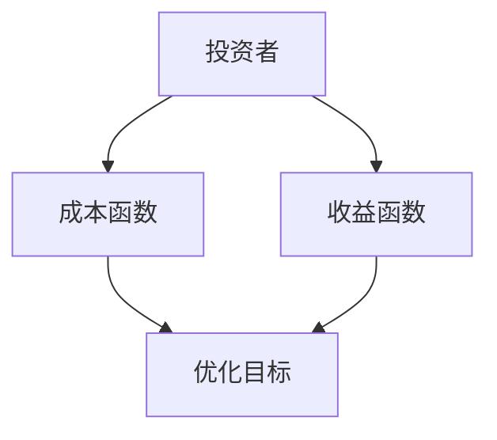
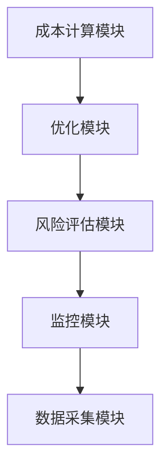

                 


# 约翰·伯格的成本敏感型投资：长期累积的力量

## 关键词：成本敏感型投资、投资策略、风险管理、优化算法、系统架构

## 摘要：本文深入探讨了成本敏感型投资的理论基础、核心概念、算法原理、系统架构以及实际应用。通过分析约翰·伯格的成本敏感型投资策略，结合优化算法和系统设计，展示了如何在长期投资中累积力量，实现收益最大化和风险最小化。

---

# 第一部分: 成本敏感型投资的背景与核心概念

## 第1章: 成本敏感型投资的背景介绍

### 1.1 成本敏感型投资的起源与演变

#### 1.1.1 投资学的基本概念与发展

投资学是研究资源分配和财富增值的学科，起源于20世纪初。传统投资理论以收益最大化为目标，忽视了交易成本、税费等其他因素的影响。

#### 1.1.2 传统投资理论的局限性

传统投资理论在实际应用中存在以下问题：
- 忽略交易成本和管理费用；
- 未充分考虑税收对投资决策的影响；
- 风险管理过于依赖收益-波动率的简单关系。

#### 1.1.3 成本敏感型投资的提出背景

随着金融市场的复杂化，投资者逐渐意识到，忽视交易成本和税务影响的投资决策往往会导致实际收益低于预期。因此，成本敏感型投资应运而生，强调在决策过程中综合考虑各项成本因素。

---

### 1.2 成本敏感型投资的定义与特点

#### 1.2.1 成本敏感型投资的定义

成本敏感型投资是一种在投资决策过程中，将交易成本、税费、管理费用等成本因素纳入考量的投资策略。其目标是在综合考虑成本的情况下，实现收益的最大化和风险的最小化。

#### 1.2.2 成本敏感型投资的核心特点

- **成本前置**：在决策阶段就考虑各项成本因素。
- **动态调整**：根据市场变化和成本变动，实时优化投资组合。
- **全周期管理**：覆盖投资生命周期的各个阶段，包括买入、持有、卖出等环节。

#### 1.2.3 成本敏感型投资与传统投资的区别

| 特性                | 传统投资                     | 成本敏感型投资               |
|---------------------|------------------------------|-----------------------------|
| 成本考虑            | 较少考虑交易成本和税费       | 强调考虑所有相关成本因素   |
| 投资决策            | 基于收益和风险的简单关系     | 基于收益减去成本的净收益最大化 |
| 优化目标            | 收益最大化                   | 净收益最大化                 |

---

### 1.3 成本敏感型投资的理论基础

#### 1.3.1 现金流贴现模型

现金流贴现模型（DCF）是一种将未来现金流折现到现值的方法，是评估投资项目价值的基础工具。

$$ PV = \sum_{t=1}^{n} \frac{CF_t}{(1 + r)^t} $$

其中：
- $CF_t$ 是第 $t$ 年的现金流。
- $r$ 是折现率。

#### 1.3.2 资本资产定价模型（CAPM）

CAPM用于确定资产的预期收益，公式为：

$$ E(r_i) = r_f + \beta_i (E(r_m) - r_f) $$

其中：
- $E(r_i)$ 是资产 $i$ 的预期收益率。
- $r_f$ 是无风险利率。
- $\beta_i$ 是资产 $i$ 的贝塔系数。
- $E(r_m)$ 是市场预期收益率。

#### 1.3.3 投资组合理论

投资组合理论强调通过分散投资来降低风险。现代投资组合理论（MPT）将成本因素纳入考虑，以优化投资组合。

---

## 第2章: 成本敏感型投资的核心概念

### 2.1 成本敏感型投资的核心要素

#### 2.1.1 成本函数的定义

成本函数 $C(x)$ 表示投资组合中各项投资的总成本，通常包括交易成本和持有成本。

$$ C(x) = \sum_{i=1}^{n} c_i x_i $$

其中：
- $c_i$ 是第 $i$ 项投资的成本系数。
- $x_i$ 是第 $i$ 项投资的权重。

#### 2.1.2 成本敏感型投资的优化目标

在成本敏感型投资中，优化目标是在考虑成本的情况下，最大化净收益。

$$ \max \sum_{i=1}^{n} (r_i - c_i) x_i $$

其中：
- $r_i$ 是第 $i$ 项投资的预期收益率。
- $c_i$ 是第 $i$ 项投资的成本系数。
- $x_i$ 是第 $i$ 项投资的权重。

#### 2.1.3 成本敏感型投资的决策变量

决策变量包括投资组合中各项资产的权重、交易频率、持有期限等。

---

### 2.2 成本敏感型投资的数学模型

#### 2.2.1 成本敏感型投资的数学表达式

$$ \max \sum_{i=1}^{n} (r_i - c_i) x_i $$
$$ \text{subject to } \sum_{i=1}^{n} x_i = 1 $$
$$ x_i \geq 0, \forall i $$

其中：
- $r_i$ 是第 $i$ 项投资的预期收益率。
- $c_i$ 是第 $i$ 项投资的成本系数。
- $x_i$ 是第 $i$ 项投资的权重。

#### 2.2.2 成本敏感型投资的属性特征对比

| 属性           | 传统投资       | 成本敏感型投资     |
|----------------|----------------|-------------------|
| 成本考虑       | 较少           | 强调             |
| 风险控制       | 主要依赖收益-风险权衡 | 考虑成本对风险的影响 |
| 投资决策       | 基于收益最大化 | 基于收益减去成本的最大化 |

---

### 2.3 成本敏感型投资的ER实体关系图



---

## 第3章: 成本敏感型投资的算法原理

### 3.1 成本敏感型投资的优化算法

#### 3.1.1 动态规划算法

动态规划是一种解决多阶段决策问题的优化算法，适用于成本敏感型投资中的组合优化问题。

#### 3.1.2 遗传算法

遗传算法模拟生物进化过程，适用于复杂的非线性优化问题。

---

### 3.2 成本敏感型投资的算法实现

```python
def cost_sensitive_optimization(returns, costs, weights):
    # 计算总成本
    total_cost = sum(costs[i] * weights[i] for i in range(len(costs)))
    # 计算总收益
    total_return = sum(returns[i] * weights[i] for i in range(len(returns)))
    # 计算净收益
    net_return = total_return - total_cost
    return net_return
```

---

### 3.3 成本敏感型投资的数学模型与优化

通过建立数学模型，我们可以清晰地看到成本对投资决策的影响。例如，考虑以下优化问题：

$$ \max \sum_{i=1}^{n} (r_i - c_i) x_i $$
$$ \text{subject to } \sum_{i=1}^{n} x_i = 1 $$
$$ x_i \geq 0, \forall i $$

通过求解上述优化问题，我们可以找到最优的投资组合。

---

## 第4章: 成本敏感型投资的系统架构

### 4.1 投资管理系统功能设计

系统功能模块包括：
- 数据采集模块
- 成本计算模块
- 投资组合优化模块
- 风险评估模块
- 系统监控模块

---

### 4.2 系统架构设计



---

## 第5章: 成本敏感型投资的项目实战

### 5.1 项目环境配置

安装必要的Python库，如numpy、pandas、scipy等。

### 5.2 核心代码实现

```python
import numpy as np
from scipy.optimize import minimize

def objective_function(weights, returns, costs):
    return -(np.sum((returns * weights) - (costs * weights)))

def constraint_function(weights):
    return np.sum(weights) - 1

weights = np.array([0.3, 0.2, 0.5])
returns = np.array([0.1, 0.15, 0.08])
costs = np.array([0.01, 0.02, 0.015])

# 定义约束条件
cons = ({'type': 'eq', 'fun': constraint_function})

# 调用优化函数
result = minimize(objective_function, weights, args=(returns, costs), constraints=cons)

print(result)
```

### 5.3 案例分析

通过具体案例分析，展示如何利用成本敏感型投资策略优化投资组合，实现收益最大化。

---

## 第6章: 成本敏感型投资的总结与展望

### 6.1 总结

成本敏感型投资通过综合考虑各项成本因素，优化投资组合，实现长期累积的力量。

### 6.2 展望

未来，随着人工智能和大数据技术的发展，成本敏感型投资将更加智能化和个性化。

---

# 附录

### 附录1: 术语表

- 成本敏感型投资：一种在投资决策中综合考虑成本因素的投资策略。
- 优化算法：用于寻找最优投资组合的数学方法。
- 系统架构：投资管理系统的整体结构和模块设计。

### 附录2: 工具安装指南

安装Python环境和相关库：

```bash
pip install numpy pandas scipy
```

### 附录3: 扩展阅读

推荐书籍和文章，供读者深入学习。

---

# 作者

作者：AI天才研究院/AI Genius Institute & 禅与计算机程序设计艺术 /Zen And The Art of Computer Programming

