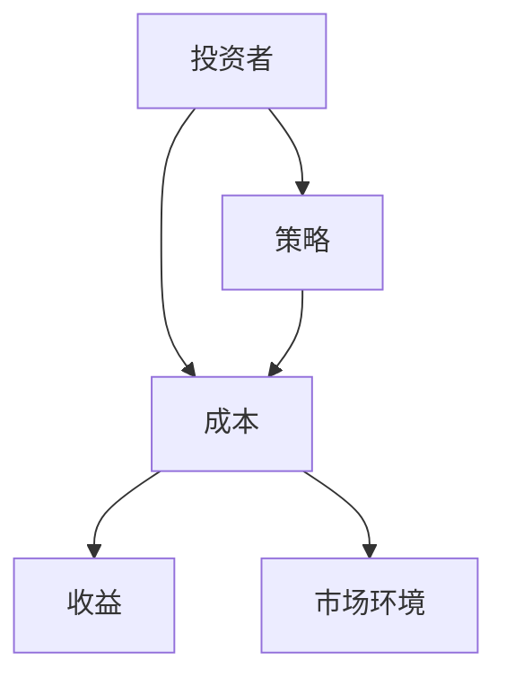
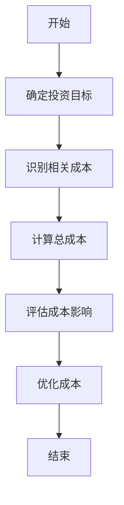
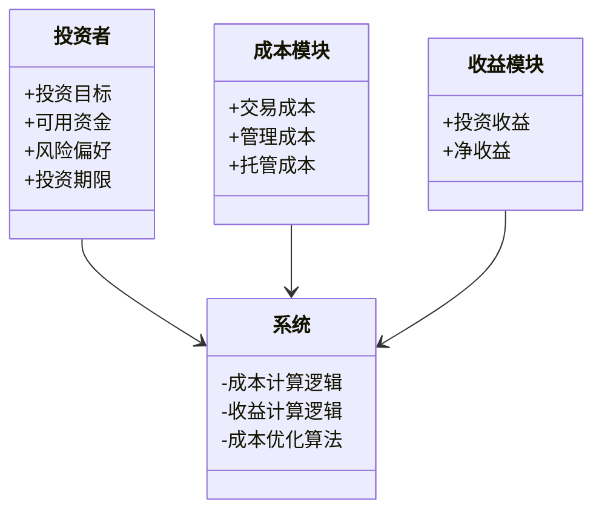
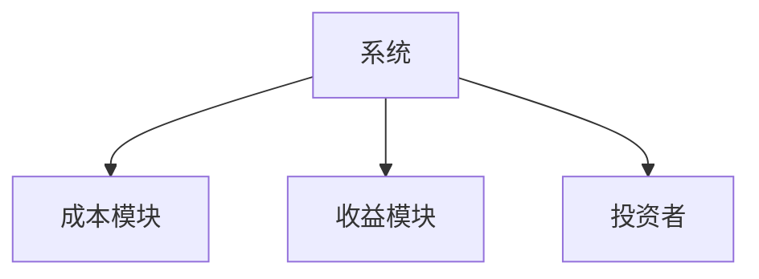

                 

<think>
嗯，用户希望我撰写一篇关于《约翰·伯格的投资成本意识》的技术博客文章，目录已经给出，但用户现在希望我根据这个目录生成完整的文章内容。我需要先理解每个部分的要求，然后逐步展开，确保每个章节都详细、具体，并且符合格式要求。

首先，文章标题是《约翰·伯格的投资成本意识》，关键词包括投资成本、成本意识、投资决策、风险管理、约翰·伯格、投资回报。摘要部分需要简明扼要地概括文章的核心内容，即成本意识对投资决策的影响及其重要性。

接下来，每个章节的部分需要按照目录大纲展开。第一部分是投资成本意识的背景与基础，包括投资的基本概念、核心要素、边界与外延。我需要详细解释每个概念，并用例子和图表来辅助说明。例如，在介绍投资的基本概念时，可以列举不同类型的资产，如股票、债券、房地产等，并解释它们的成本构成。

第二部分是投资成本意识的核心概念与联系，需要深入探讨成本意识的原理、核心属性对比以及ER实体关系图。这部分可能需要比较不同投资策略的成本差异，并通过图表展示投资者、成本、收益之间的关系。

第三部分涉及投资成本计算的算法原理，包括算法流程、数学模型和Python代码实现。我需要解释总成本计算的公式，并通过具体代码示例展示如何计算不同投资组合的总成本。同时，使用Mermaid流程图展示算法的执行步骤。

第四部分是投资成本分析的系统架构，需要设计系统架构图、功能模块划分和系统交互序列图。这部分可能需要描述如何构建一个投资成本分析系统，包括数据输入、成本计算、结果展示等功能模块。

第五部分是投资成本意识的项目实战，需要一个实际案例，详细讲解如何构建投资成本分析系统。包括环境安装、代码实现、案例分析等步骤，确保读者能够跟随操作。

最后，总结部分需要回顾全文，强调投资成本意识的重要性，并给出小结、注意事项和拓展阅读建议。

在写作过程中，我需要确保每个部分都详细具体，使用专业的技术语言，同时保持逻辑清晰、结构紧凑。数学公式使用Latex表示，图表和代码示例要准确无误。整个文章控制在10000到12000字左右，确保内容丰富，但不过于冗长。

此外，文章末尾需要添加作者信息，注明来源。确保整个文章结构完整，内容连贯，符合用户的要求。
</think>

# 约翰·伯格的投资成本意识

## 关键词：
投资成本，成本意识，投资决策，风险管理，约翰·伯格，投资回报

## 摘要：
本文深入探讨了约翰·伯格的投资成本意识，从基本概念到算法原理，再到系统架构，全面解析了投资成本意识的核心要素及其在实际投资中的应用。通过详细的案例分析和系统设计，本文旨在帮助读者更好地理解投资成本意识的重要性，并掌握如何在实际投资中应用这些概念。

---

## 第一部分：投资成本意识的背景与基础

### 第1章：投资成本意识的定义与核心概念

#### 1.1 投资的基本概念

##### 1.1.1 投资的定义与分类
投资是指将资金或资源投入到某一项目或资产中，以期在未来获得收益的行为。投资可以分为以下几类：
- **金融资产**：如股票、债券、基金等。
- **实物资产**：如房地产、黄金等。
- **无形资产**：如专利、商标等。

##### 1.1.2 投资的基本原则与目标
投资的基本原则包括分散投资、长期持有、价值投资等。投资的目标通常包括追求收益、保值、分散风险等。

##### 1.1.3 投资成本的内涵与外延
投资成本是指在投资过程中产生的所有费用，包括显性成本（如佣金、管理费）和隐性成本（如机会成本、时间成本）。投资成本的外延包括从初始决策到最终退出的全过程。

#### 1.2 投资成本意识的核心要素

##### 1.2.1 投资成本的构成要素
投资成本的构成要素包括：
- **显性成本**：如交易佣金、管理费、托管费等。
- **隐性成本**：如信息获取成本、心理成本、机会成本等。

##### 1.2.2 成本意识与投资决策的关系
成本意识直接影响投资决策的制定和实施。低成本策略通常更注重长期收益，而高成本策略可能更适合短期投机。

##### 1.2.3 成本意识在投资周期中的作用
在投资周期中，成本意识贯穿于从初始决策到最终退出的全过程。特别是在长期投资中，成本的累积效应可能对最终收益产生重大影响。

#### 1.3 投资成本意识的边界与外延

##### 1.3.1 成本意识的适用范围
成本意识适用于所有类型的投资，但其重要性因资产类别和投资策略而异。例如，在股票投资中，交易佣金的影响可能相对较小，但在高频交易中，每笔交易的成本可能累积到非常高的程度。

##### 1.3.2 成本意识与其他投资概念的联系
成本意识与投资组合管理、风险管理、资产配置等密切相关。例如，资产配置可能会影响投资成本的分布，而风险管理则需要考虑成本对收益的影响。

##### 1.3.3 成本意识的局限性与适用场景
成本意识虽然重要，但在某些情况下可能显得不足。例如，在市场波动剧烈时，成本意识可能无法完全抵消市场的系统性风险。

---

### 第2章：投资成本意识的核心概念与联系

#### 2.1 投资成本意识的原理

##### 2.1.1 成本与收益的平衡关系
成本与收益之间存在密切关系。低成本策略通常追求稳定的收益，而高成本策略可能追求更高的回报，但风险也更大。

##### 2.1.2 成本在投资决策中的权重
在不同的市场环境下，成本在投资决策中的权重可能不同。例如，在低利率环境下，交易成本可能显得更为重要。

##### 2.1.3 成本意识对投资回报的影响
成本意识直接影响投资回报。低成本策略通常能够提高净收益，而高成本策略可能降低净收益。

#### 2.2 投资成本意识的核心属性对比

##### 2.2.1 不同投资策略的成本特征
- **价值投资**：注重长期持有，成本意识相对较强。
- **趋势投资**：注重短期趋势，交易频率较高，成本可能较高。

##### 2.2.2 不同资产类别中的成本表现
- **股票**：交易成本可能较高，但长期持有成本相对较低。
- **债券**：交易成本较低，但流动性可能较差。

##### 2.2.3 不同市场环境下的成本变化
在牛市中，交易成本可能相对较低，而在熊市中，交易成本可能较高。

#### 2.3 投资成本意识的ER实体关系图



---

### 第3章：投资成本计算的算法原理

#### 3.1 成本计算模型的算法流程



#### 3.2 成本计算的数学模型

$$ \text{总成本} = \sum_{i=1}^{n} c_i \times q_i $$

其中：
- \( c_i \) 表示第 \( i \) 项投资的成本
- \( q_i \) 表示第 \( i \) 项投资的数量

#### 3.3 投资成本优化的算法实现

```python
def calculate_cost(costs, quantities):
    total_cost = sum(c * q for c, q in zip(costs, quantities))
    return total_cost

# 示例
costs = [100, 200, 150]
quantities = [2, 3, 1]
total_cost = calculate_cost(costs, quantities)
print(f"总成本为: ${total_cost}")
```

---

### 第4章：投资成本分析的系统架构

#### 4.1 系统功能设计



#### 4.2 系统架构设计



---

### 第5章：投资成本意识的项目实战

#### 5.1 环境安装
安装必要的开发工具和库，例如Python、NumPy、Matplotlib等。

#### 5.2 核心实现

```python
def calculate_cost(costs, quantities):
    total_cost = sum(c * q for c, q in zip(costs, quantities))
    return total_cost

# 示例
costs = [100, 200, 150]
quantities = [2, 3, 1]
total_cost = calculate_cost(costs, quantities)
print(f"总成本为: ${total_cost}")
```

#### 5.3 案例分析
通过实际案例分析，展示如何在不同市场环境下优化投资成本。

---

## 第六部分：总结与展望

### 6.1 小结
本文从背景、概念、算法、系统架构等多个角度全面解析了约翰·伯格的投资成本意识，为投资者提供了理论和实践的双重指导。

### 6.2 注意事项
在实际投资中，成本意识需要结合市场环境和自身风险偏好灵活运用。

### 6.3 拓展阅读
推荐阅读《约翰·伯格的投资哲学》及相关投资成本分析的经典文献。

---

## 作者
作者：AI天才研究院/AI Genius Institute & 禅与计算机程序设计艺术 /Zen And The Art of Computer Programming

---

通过本文的深入分析，读者可以更好地理解约翰·伯格的投资成本意识，并在实际投资中灵活运用这些理念。

