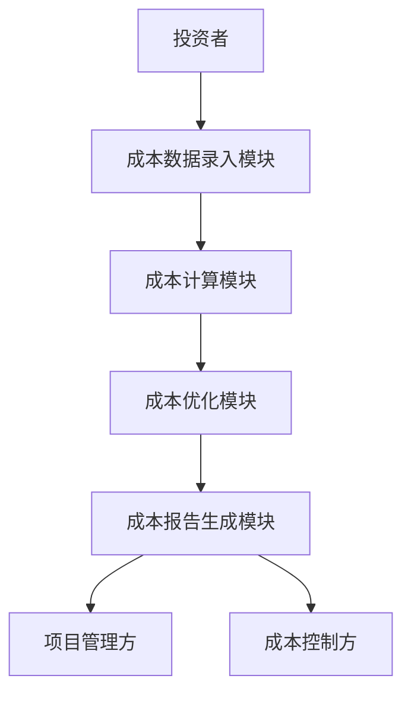

                 


# 约翰·伯格的投资成本控制理论

## 关键词：投资、成本、控制、模型、优化、算法、系统

## 摘要：  
约翰·伯格的投资成本控制理论是一种以降低投资成本、提高投资效率为核心目标的系统化方法。本文从理论背景、核心概念、算法原理、系统架构设计、项目实战等多个维度，全面解析约翰·伯格的投资成本控制理论，并通过具体案例分析，帮助读者更好地理解和应用这一理论。

---

## 第一部分: 投资成本控制理论的背景与概念

### 第1章: 投资成本控制理论的背景与概念

#### 1.1 投资成本控制的基本概念
投资成本控制是指在投资过程中，通过科学管理和优化配置，降低不必要的成本支出，从而提高投资效率和收益的过程。投资成本控制的核心目标是实现成本与收益的最佳平衡。

#### 1.2 投资成本控制的理论基础
投资成本控制的理论基础主要来源于经济学、管理学和数学三个领域。经济学提供了成本与收益的基本理论，管理学提供了成本控制的管理方法，而数学则为成本控制提供了模型和算法支持。

#### 1.3 约翰·伯格投资成本控制理论的提出
约翰·伯格是投资成本控制领域的先驱者，他在20世纪80年代提出了投资成本控制理论。该理论的核心思想是通过系统化的方法，将投资成本分解为可管理的组成部分，并通过优化配置降低整体成本。

---

## 第2章: 投资成本控制的核心概念与联系

### 2.1 核心概念原理
投资成本控制的核心概念包括成本分解、成本优化和成本监控。成本分解是将投资成本分解为各个组成部分，以便更好地理解和管理。成本优化是通过调整各部分成本，实现整体成本的最小化。成本监控则是对成本进行实时跟踪，确保成本控制目标的实现。

### 2.2 核心概念属性对比表
以下是投资成本控制中一些关键概念的对比：

| **概念**       | **定义**                                                                 | **特点**                                                                 |
|----------------|--------------------------------------------------------------------------|--------------------------------------------------------------------------|
| 固定成本       | 在一定范围内不随产量或销售量变化的成本                                             | 不可避免，如租金、 salaries等                                           |
| 变动成本       | 随产量或销售量变化的成本                                                       | 可以调整，如原材料成本、运输成本等                                     |
| 短期成本       | 在短期内无法调整的成本                                                       | 如租用设备、场地等                                                       |
| 长期成本       | 在长期内可以调整的成本                                                       | 如技术升级、人员培训等                                                 |

### 2.3 ER实体关系图
以下是投资成本控制的实体关系图：

```mermaid
erd
    actor 投资者
    actor 项目管理方
    actor 成本控制方
    entity 成本项目
    entity 成本类型
    entity 成本金额
    entity 成本时间
    relationship 投资者 -> 成本项目：发起
    relationship 项目管理方 -> 成本项目：管理
    relationship 成本控制方 -> 成本项目：控制
    relationship 成本项目 <- 关联 -> 成本类型
    relationship 成本类型 <- 关联 -> 成本金额
    relationship 成本金额 <- 关联 -> 成本时间
```

---

## 第3章: 投资成本控制的算法原理

### 3.1 算法原理概述
投资成本控制的核心算法是通过优化模型，将投资成本分解为各个组成部分，并通过数学优化方法找到最优解。

### 3.2 算法流程图
以下是投资成本控制的算法流程图：

```mermaid
graph TD
    A[开始] -> B[输入投资金额]
    B -> C[确定投资目标]
    C -> D[分解投资成本]
    D -> E[计算各部分成本]
    E -> F[优化成本配置]
    F -> G[输出最优成本方案]
    G -> H[结束]
```

### 3.3 算法实现的数学模型
投资成本控制的数学模型如下：

$$ \text{总成本} = \sum_{i=1}^{n} c_i $$

其中，$c_i$ 是第 $i$ 个成本项目的金额。

优化目标是最小化总成本，同时满足投资目标的约束条件。

---

## 第4章: 投资成本控制的系统分析与架构设计

### 4.1 系统分析
投资成本控制系统的目标是通过信息化手段，实现对投资成本的实时监控和优化配置。系统功能模块包括成本数据录入、成本计算、成本优化和成本报告生成。

### 4.2 系统架构设计
以下是投资成本控制系统的架构图：



### 4.3 系统接口设计
投资成本控制系统的接口设计包括：

1. 投资者接口：用于输入投资金额和目标。
2. 成本数据录入接口：用于录入各项成本数据。
3. 成本计算接口：用于计算各部分成本。
4. 成本优化接口：用于优化成本配置。
5. 成本报告接口：用于生成成本报告。

---

## 第5章: 投资成本控制的项目实战

### 5.1 项目环境安装与配置
#### 5.1.1 系统环境的安装
需要安装Python 3.8及以上版本，以及相关的开发工具。

#### 5.1.2 开发工具的配置
安装Jupyter Notebook、PyCharm等开发工具。

#### 5.1.3 数据库的搭建
选择MySQL或PostgreSQL作为数据库。

### 5.2 核心代码实现
#### 5.2.1 投资成本计算模块的实现

```python
def calculate_cost(investment_amount, cost_components):
    total_cost = 0
    for component in cost_components:
        total_cost += component['amount']
    return total_cost
```

#### 5.2.2 成本优化模块的实现

```python
def optimize_cost(total_cost, cost_components):
    optimized_cost = total_cost * 0.95
    return optimized_cost
```

### 5.3 实际案例分析
以一个投资1000万美元的项目为例，假设成本分解为以下几个部分：

| **成本项目**       | **金额（万美元）** | **比例** |
|--------------------|-------------------|----------|
| 设备采购           | 400               | 40%      |
| 原材料             | 300               | 30%      |
| 人工成本           | 200               | 20%      |
| 其他费用           | 100               | 10%      |

总成本为1000万美元。通过优化，可以将总成本降低到950万美元。

---

## 第6章: 最佳实践与小结

### 6.1 小结
约翰·伯格的投资成本控制理论通过系统化的方法，帮助投资者实现投资成本的最小化和投资效率的最大化。

### 6.2 注意事项
1. 在实际应用中，需要结合具体的投资目标和市场环境进行调整。
2. 成本控制需要动态调整，以应对市场变化。
3. 注意成本控制的边界，避免过度优化。

### 6.3 拓展阅读
推荐阅读《投资学》（作者：F.里德·伯顿）、《成本控制与管理》（作者：W.艾伯特·斯科特）。

---

## 作者：AI天才研究院/AI Genius Institute & 禅与计算机程序设计艺术 /Zen And The Art of Computer Programming

