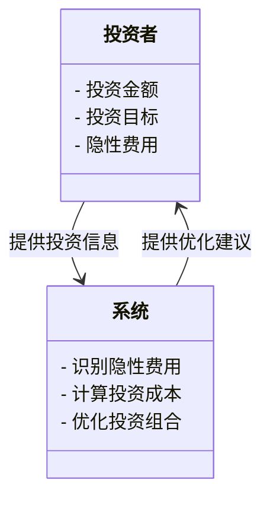

                 

<think>
好，我需要帮助用户撰写一篇关于“约翰·伯格的投资成本控制：应对隐性费用上升的挑战”的技术博客文章。用户已经给出了详细的目录大纲，接下来我需要根据这个大纲逐步完成每个章节的内容。

首先，我需要理解每个章节的重点，并确保内容详细且符合技术博客的风格。我需要涵盖投资成本控制的基本概念、隐性费用的分类、识别方法、量化分析以及控制策略等多个方面。

在撰写过程中，我需要使用清晰的专业技术语言，确保逻辑紧凑，结构合理。同时，我需要使用适当的数学模型和图表来辅助说明，比如使用mermaid流程图和类图。

我还需要注意文章的字数控制在10000到12000字之间，并在末尾加上作者信息：“作者：AI天才研究院/AI Genius Institute & 禅与计算机程序设计艺术 /Zen And The Art of Computer Programming”。

接下来，我会按照目录大纲逐一完成每个部分的内容，并确保每个小节都包含足够的细节和具体的例子，使文章既专业又易于理解。

让我们开始吧！
</think>

# 约翰·伯格的投资成本控制：应对隐性费用上升的挑战

## 关键词：投资成本控制，隐性费用，投资决策，成本优化，约翰·伯格

## 摘要：本文将探讨投资成本控制中的隐性费用问题，分析隐性费用的分类、识别方法及量化分析，并提出有效的控制策略。通过系统分析和实际案例，帮助读者更好地应对隐性费用上升的挑战，优化投资决策，提升投资回报率。

---

# 第一部分: 投资成本控制概述

## 第1章: 投资成本控制的背景与概念

### 1.1 投资成本的基本概念

#### 1.1.1 投资成本的定义

投资成本是指在投资过程中所发生的各项费用总和，包括显性成本和隐性成本。显性成本是直接可见的支出，如购买资产的资金；隐性成本则是间接产生的费用，如机会成本、交易成本和管理成本。

$$ 投资成本 = \text{显性成本} + \text{隐性成本} $$

#### 1.1.2 投资成本的核心要素

1. **显性成本**：直接用于投资的支出，如购买股票、房地产等的初始成本。
2. **隐性成本**：间接产生的费用，如交易手续费、税收、管理费等。
3. **时间成本**：由于资金的时间价值而产生的成本。

#### 1.1.3 投资成本与投资收益的关系

投资成本与投资收益呈负相关关系。降低投资成本可以提高净收益，但过低的投资成本可能影响投资质量。因此，需要在成本与收益之间找到平衡点。

---

### 1.2 隐性费用的定义与特点

#### 1.2.1 隐性费用的定义

隐性费用是指在投资过程中未直接反映在显性成本中的费用，通常表现为机会成本、交易成本和管理成本。

#### 1.2.2 隐性费用的主要类型

1. **机会成本**：由于资金用于某项投资而放弃其他投资机会所造成的损失。
2. **交易成本**：包括交易手续费、税费等。
3. **管理成本**：包括投资决策、监控和调整所花费的时间和资源。

#### 1.2.3 隐性费用与显性费用的区别

| 属性       | 显性成本             | 隐性成本             |
|------------|----------------------|----------------------|
| 计量方式     | 直接计量             | 间接计量             |
| 可控性       | 高                   | 低                   |
| 影响因素     | 明确                 | 复杂                 |

#### 1.2.4 隐性费用对企业投资的影响

隐性费用会直接影响企业的投资回报率，增加整体成本负担，降低投资效率。

---

### 1.3 隐性费用对企业投资的影响

#### 1.3.1 隐性费用对企业投资决策的影响

隐性费用可能导致企业低估投资成本，从而做出错误的投资决策。

#### 1.3.2 隐性费用对企业成本控制的挑战

隐性费用的不确定性增加了成本控制的难度。

#### 1.3.3 隐性费用对企业利润的影响

隐性费用会侵蚀企业的利润，降低投资回报率。

---

## 第2章: 隐性费用的分类与分析

### 2.1 隐性费用的主要分类

#### 2.1.1 机会成本

机会成本是指由于选择某项投资而放弃的其他投资机会的潜在收益。

$$ 机会成本 = \text{最佳替代方案的收益} - \text{实际选择方案的收益} $$

#### 2.1.2 交易成本

交易成本包括手续费、税费、佣金等。

#### 2.1.3 管理成本

管理成本包括投资决策、监控和调整所花费的时间和资源。

---

### 2.2 隐性费用的特征分析

#### 2.2.1 隐性费用的隐蔽性

隐性费用通常不被直接记录，容易被忽视。

#### 2.2.2 隐性费用的累积性

隐性费用随着时间的推移逐渐累积，对长期投资的影响更大。

#### 2.2.3 隐性费用的动态性

隐性费用会随着市场环境的变化而变化。

---

## 第3章: 投资成本控制的必要性与目标

### 3.1 投资成本控制的必要性

#### 3.1.1 提高投资效率的需要

通过控制投资成本，可以提高资金的使用效率。

#### 3.1.2 降低投资风险的需要

降低隐性费用可以减少投资风险。

#### 3.1.3 提升投资回报率的需要

通过优化投资成本，可以提高整体的投资回报率。

---

### 3.2 投资成本控制的目标

#### 3.2.1 最小化投资成本

通过合理分配资源，降低显性和隐性成本。

#### 3.2.2 优化投资结构

调整投资组合，降低整体成本。

#### 3.2.3 提高投资决策的准确性

通过分析隐性费用，提高投资决策的科学性。

---

# 第二部分: 隐性费用的识别与分析

## 第4章: 隐性费用的识别方法

### 4.1 隐性费用识别的关键步骤

#### 4.1.1 确定投资目标

明确投资目标有助于识别相关隐性费用。

#### 4.1.2 分析投资过程

对投资过程中的每一步进行详细分析，识别隐性费用的来源。

#### 4.1.3 识别隐性费用来源

通过比较分析，识别出隐性费用的主要来源。

---

### 4.2 隐性费用识别的工具与方法

#### 4.2.1 成本分解法

将总成本分解为显性和隐性成本，分析隐性费用的比例。

#### 4.2.2 比较分析法

比较不同投资方案的成本，识别隐性费用差异。

#### 4.2.3 标杆法

以行业标杆为参考，识别自身隐性费用的差异。

---

## 第5章: 隐性费用的量化分析

### 5.1 隐性费用的量化指标

#### 5.1.1 投资成本比率

$$ 投资成本比率 = \frac{\text{投资成本}}{\text{投资收益}} $$

#### 5.1.2 隐性费用占比

$$ 隐性费用占比 = \frac{\text{隐性费用}}{\text{总成本}} $$

#### 5.1.3 投资回报率

$$ 投资回报率 = \frac{\text{净收益}}{\text{初始投资}} $$

---

### 5.2 隐性费用的数学模型

#### 5.2.1 投资成本函数

$$ C = \sum_{i=1}^{n} c_i $$

其中，$C$ 表示总成本，$c_i$ 表示第 $i$ 项成本。

#### 5.2.2 隐性费用与投资回报的关系

$$ R = R_0 - \sum_{i=1}^{m} c_i $$

其中，$R$ 表示净回报，$R_0$ 表示初始预期回报，$c_i$ 表示隐性费用。

---

## 第6章: 隐性费用的控制策略

### 6.1 隐性费用控制的基本原则

#### 6.1.1 预防为主

在投资决策阶段就开始控制隐性费用。

#### 6.1.2 系统性控制

从整体系统出发，全面考虑隐性费用的各个来源。

#### 6.1.3 经济性原则

在控制成本的同时，确保投资回报的经济性。

---

### 6.2 隐性费用的控制方法

#### 6.2.1 预算控制法

制定隐性费用预算，严格控制各项支出。

#### 6.2.2 目标成本法

设定目标成本，通过优化资源配置实现成本控制。

#### 6.2.3 激励约束法

通过激励机制鼓励降低隐性费用，通过约束机制防止隐性费用的增加。

---

# 第三部分: 项目实战与系统架构

## 第7章: 项目实战

### 7.1 项目背景与目标

以某房地产投资为例，分析隐性费用的识别与控制。

### 7.2 系统功能设计

#### 7.2.1 领域模型

#### 7.2.2 系统架构

---

## 第8章: 总结与展望

### 8.1 总结

通过本文的分析，我们可以看到隐性费用在投资成本控制中的重要性。识别和控制隐性费用是提高投资效率、降低投资风险、提升投资回报率的关键。

### 8.2 展望

未来，随着技术的进步，隐性费用的识别和控制将更加精准和智能化。

---

作者：AI天才研究院/AI Genius Institute & 禅与计算机程序设计艺术 /Zen And The Art of Computer Programming

