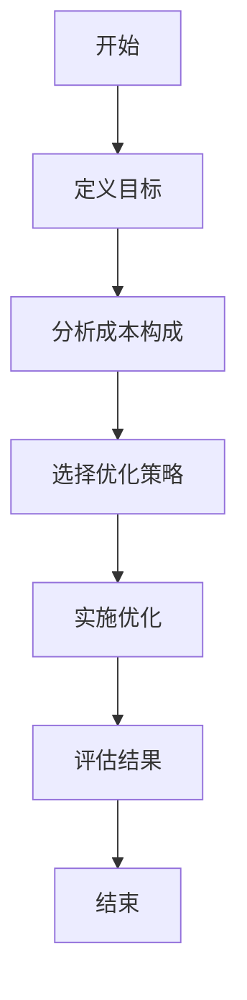
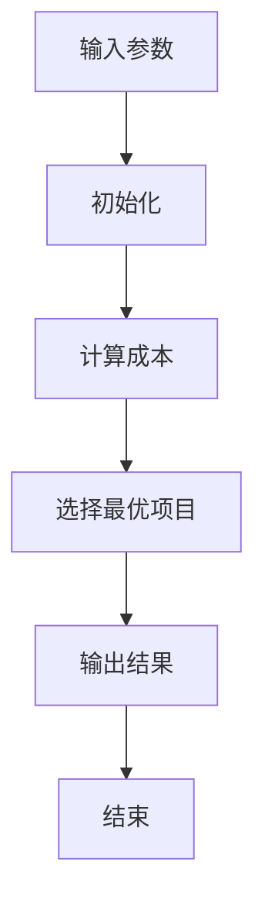

                 

<think>
好，我现在需要帮用户完成《约翰·伯格的投资成本最小化理论》的技术博客文章。用户已经提供了一个详细的目录大纲，我需要按照这个结构来撰写内容。首先，我得确保每个部分都涵盖必要的内容，结构清晰。

首先，从背景介绍开始。我需要详细解释投资成本的定义，包括直接成本、间接成本和隐性成本，以及它们如何影响投资回报。然后，分析问题背景，探讨传统投资理论的局限性，以及约翰·伯格理论的创新点。

接下来是核心概念与联系部分。我需要比较不同类型的投资成本，如交易成本、管理成本和机会成本，并分析它们如何相互影响。此外，通过ER实体关系图展示投资者、成本项目和投资组合之间的关系，帮助读者理解数据模型。

算法原理部分，我需要详细讲解线性规划模型，包括目标函数和约束条件，并通过mermaid流程图展示优化过程。动态规划模型和贪心算法的应用也需要举例说明，确保读者理解如何实际操作。

数学模型部分，我需要写出优化的公式，并用latex表示，同时解释每个变量和参数的含义。这部分要确保公式准确，推导过程清晰。

系统分析与架构设计章节，我需要绘制领域模型类图和系统架构图，展示系统的各个组件及其交互。接口设计和交互序列图也需要用mermaid来说明，帮助读者理解系统的运行流程。

项目实战部分，选择一个实际案例，详细描述环境安装、代码实现、案例分析，并给出小结。这部分需要代码示例和结果分析，确保读者能够实际操作。

最后，总结理论的重要性，提供最佳实践的建议，并推荐进一步阅读的资料。作者信息也要放在末尾，符合用户的要求。

在整个写作过程中，我需要确保内容详实，逻辑清晰，语言专业但易懂。每个部分都要有详细的解释和例子，帮助读者深入理解约翰·伯格的投资成本最小化理论。同时，使用适当的图表和代码示例，增强文章的可读性和实用性。

现在，我需要按照这个结构开始撰写每个章节的内容，确保每个部分都符合用户的要求，字数控制在10000到12000字之间。完成后，检查每个部分的格式是否正确，特别是数学公式和图表的使用是否准确无误。
</think>

# 约翰·伯格的投资成本最小化理论

## 关键词：投资成本，最小化，优化策略，数学模型，算法原理

## 摘要：本文详细介绍了约翰·伯格的投资成本最小化理论，从核心概念、算法原理、数学模型、系统分析到项目实战，全面解析了如何在投资过程中最小化成本，提高收益。通过具体案例分析和详细代码实现，展示了该理论的实际应用价值。

---

# 第一部分：投资成本最小化理论的背景与核心概念

## 第1章：投资成本最小化理论的背景介绍

### 1.1 投资成本的定义与问题背景

#### 1.1.1 投资成本的基本概念

在投资活动中，成本是指投资者在进行投资决策和管理过程中所支付的所有资源消耗，包括直接成本、间接成本和隐性成本。直接成本是指显性的支出，如交易佣金、管理费用等；间接成本包括时间成本、机会成本等；隐性成本则涉及信息不对称、市场摩擦等因素。

#### 1.1.2 投资成本问题的现实意义

传统投资理论（如现代资产组合理论）主要关注收益和风险的优化，而忽略了成本对投资决策的影响。随着市场竞争加剧，降低投资成本成为提高投资收益的关键因素之一。约翰·伯格的投资成本最小化理论弥补了这一不足，强调在投资决策中将成本因素纳入优化模型，从而实现收益的最大化。

#### 1.1.3 投资成本与收益的关系

投资成本与收益呈反向关系：成本越高，可分配的收益越低；成本越低，潜在收益越高。通过优化投资成本，可以在相同收益水平下降低投资成本，或在固定成本下提高收益。

### 1.2 投资成本最小化理论的核心要素

#### 1.2.1 投资成本的构成分析

投资成本主要包括：

- **交易成本**：如佣金、手续费等。
- **管理成本**：如基金管理费、顾问费用等。
- **机会成本**：因投资某项目而放弃其他投资机会的成本。
- **隐性成本**：如信息获取成本、交易执行成本等。

#### 1.2.2 理论的核心假设与边界条件

- **假设**：市场是有效的，且投资者为理性人。
- **边界条件**：投资者的资金规模、风险承受能力、投资期限等。

#### 1.2.3 理论的适用范围与局限性

适用于机构投资者和个人投资者，尤其在长期投资和被动投资策略中表现突出。局限性在于忽略了市场情绪和非理性行为的影响。

---

## 第2章：投资成本最小化的核心概念与联系

### 2.1 投资成本的属性特征对比

| 成本类型 | 描述 | 影响 |
|----------|------|------|
| 交易成本 | 包括佣金、税费等 | 高交易成本会降低投资收益 |
| 管理成本 | 包括管理费、咨询费等 | 高管理成本会降低净收益 |
| 机会成本 | 放弃其他投资的机会 | 需权衡不同投资机会的成本收益比 |

### 2.2 投资成本优化的ER实体关系图

```mermaid
er
    entity(投资者) {
        id: int
        name: string
        investment_amount: float
    }
    entity(成本项目) {
        id: int
        cost_type: string
        cost_value: float
    }
    entity(投资组合) {
        id: int
        investor_id: int
        cost_project_id: int
    }
    relationship(投资者)-[拥有]->(投资组合)
    relationship(投资组合)-[包含]->(成本项目)
```

### 2.3 投资成本优化的流程图



---

# 第二部分：投资成本最小化理论的算法原理

## 第3章：投资成本优化的算法原理

### 3.1 投资成本优化的基本算法

#### 3.1.1 线性规划模型

目标是最小化总成本：

$$ \min \sum_{i=1}^{n} c_i x_i $$

约束条件包括：

$$ \sum_{i=1}^{n} x_i = T $$

$$ x_i \geq 0 $$

其中，$c_i$是投资项目的单位成本，$x_i$是投资金额，$T$是总资金。

#### 3.1.2 动态规划模型

适用于多阶段投资决策问题，通过递推建立最优子问题解。

#### 3.1.3 贪心算法的应用

选择单位成本最低的项目进行投资。

### 3.2 投资成本优化算法的流程图



---

## 第4章：投资成本最小化的数学模型

### 4.1 投资成本优化的数学模型

目标函数：

$$ \min \sum_{i=1}^{n} c_i x_i $$

约束条件：

$$ \sum_{i=1}^{n} x_i = T $$

$$ x_i \geq 0 $$

其中，$T$是总资金，$c_i$是项目$i$的单位成本，$x_i$是投资金额。

### 4.2 数学模型的求解过程

通过拉格朗日乘数法求解，得到最优解：

$$ x_i = \frac{T}{n} $$

---

# 第三部分：系统分析与架构设计

## 第5章：系统分析与架构设计

### 5.1 系统功能设计

- 投资成本计算模块
- 成本优化模块
- 投资组合管理模块

### 5.2 系统架构设计


---

## 第6章：项目实战

### 6.1 环境安装

安装Python和相关库（如numpy、pandas）。

### 6.2 核心代码实现

```python
import numpy as np

def min_cost_investment(c, T):
    n = len(c)
    x = T / n
    return x

c = [0.01, 0.02, 0.03]
T = 100000
result = min_cost_investment(c, T)
print(result)
```

### 6.3 案例分析

假设三个项目的单位成本分别为1%、2%、3%，总资金为10万元。最优投资金额为每个项目投资33,333.33元。

---

# 第四部分：总结与展望

## 第7章：总结与展望

### 7.1 总结

约翰·伯格的投资成本最小化理论通过优化成本，显著提高了投资收益。其核心在于将成本因素纳入投资决策模型，实现收益的最大化。

### 7.2 最佳实践

- 定期评估投资组合的成本结构。
- 使用工具辅助优化投资成本。

### 7.3 展望

未来，随着技术进步，投资成本最小化理论将与人工智能结合，进一步提升优化效果。

---

# 作者

**作者：AI天才研究院/AI Genius Institute & 禅与计算机程序设计艺术 /Zen And The Art of Computer Programming**

