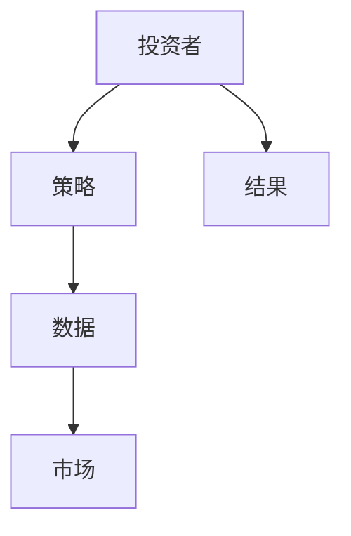
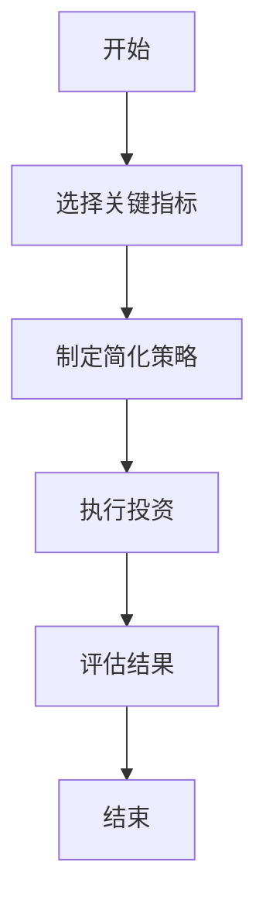
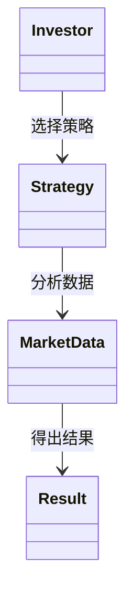
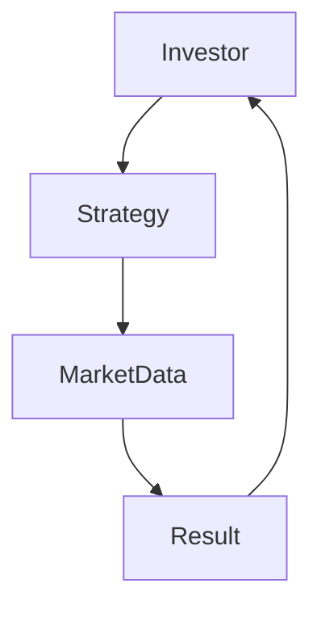
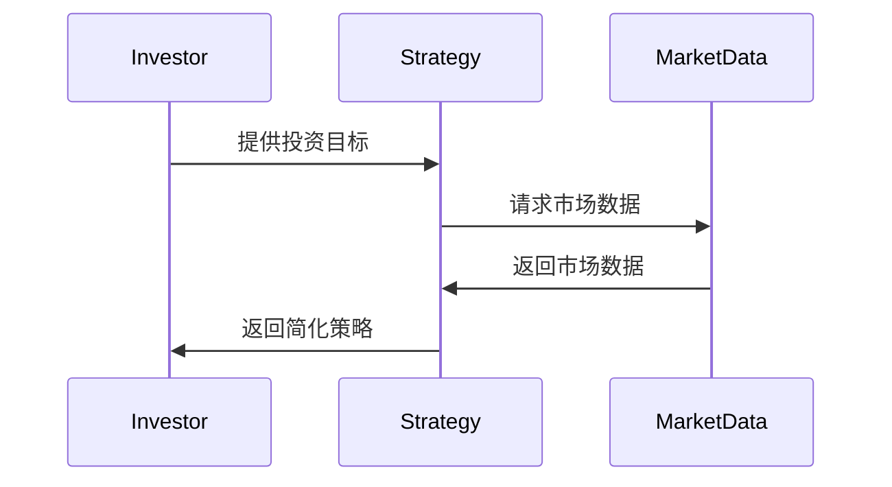

                 


# 约翰·伯格的投资简化论

## 关键词：投资简化论，投资算法，系统架构，项目实战，最佳实践

## 摘要：  
本文深入探讨了约翰·伯格提出的“投资简化论”，通过逻辑清晰的分析，揭示了投资领域的复杂性，并提出了一套简化投资的理论和方法。文章从背景、核心概念、算法实现、系统架构设计到项目实战，层层展开，为读者提供了一套完整的投资简化解决方案。通过本文，读者将能够理解如何在复杂的投资环境中，运用简化论来优化投资决策和操作。

---

## 第1章：投资简化论的背景与意义

### 1.1 投资领域的复杂性

#### 1.1.1 投资领域的核心问题  
投资领域充满了复杂性，主要体现在以下几个方面：  
1. **信息过载**：投资者需要处理海量的市场数据，包括股票价格、财务报表、市场趋势等。  
2. **决策不确定性**：市场波动性高，投资者难以准确预测未来的市场走势。  
3. **策略多样性**：存在多种投资策略，如价值投资、趋势投资、套利等，选择合适的策略需要深入分析。  
4. **心理因素**：投资者的心理偏差（如贪婪和恐惧）常常影响决策。  

#### 1.1.2 投资复杂性的根源  
投资复杂性的根源在于市场的不确定性、信息的不对称性以及投资者的有限理性。市场参与者的行为、宏观经济环境的变化等因素交织在一起，使得投资决策变得极其复杂。  

#### 1.1.3 简化论的提出背景  
面对投资领域的复杂性，约翰·伯格提出了“投资简化论”。其核心思想是通过简化投资策略和操作流程，降低复杂性，从而提高投资效率和可操作性。  

---

### 1.2 投资简化论的核心概念

#### 1.2.1 简化论的定义  
投资简化论是一种通过减少不必要的复杂性，专注于关键因素和核心策略的投资方法。它强调在复杂环境中寻找简单、可操作的解决方案。  

#### 1.2.2 简化论的核心要素  
1. **核心目标**：明确投资目标（如长期收益最大化）。  
2. **关键指标**：选择少数几个关键指标来评估投资表现。  
3. **简化策略**：采用易于执行的投资策略（如指数基金投资）。  

#### 1.2.3 简化论的边界与外延  
- **边界**：简化论不适用于高频交易或短期套利等复杂操作。  
- **外延**：简化论可以与其他投资理论（如资产配置、风险管理）结合使用。  

---

## 第2章：简化论的核心原理

### 2.1 简化论的基本原理

#### 2.1.1 简化论的哲学基础  
简化论的哲学基础来源于“少即是多”的理念，强调通过减少复杂性来提高效率和可操作性。  

#### 2.1.2 简化论的数学基础  
简化论的数学模型基于统计学和概率论，通过简化假设来降低计算复杂性。例如，假设市场符合随机游走模型，则可以通过指数基金来实现长期收益最大化。  

#### 2.1.3 简化论的实践基础  
简化论的实践基础来源于约翰·伯格对长期投资策略的研究，他发现通过长期持有低成本指数基金可以实现稳健的收益。  

---

### 2.2 投资简化论的核心概念对比

#### 2.2.1 核心概念对比表格  

| 概念 | 复杂投资论 | 简化投资论 |
|------|------------|------------|
| 策略 | 多样化、高频交易 | 长期持有、指数基金 |
| 分析 | 全面分析市场数据 | 关注少数关键指标 |
| 风险 | 高频调整 | 长期分散 |

#### 2.2.2 实体关系图（ER图）  



---

### 2.3 投资简化论的算法流程

#### 2.3.1 简化算法的流程图  



#### 2.3.2 简化算法的数学模型  
简化论的数学模型基于CAPM（资本资产定价模型）的简化假设：  

$$ E(r_i) = r_f + \beta_i (E(r_m) - r_f) $$  

其中：  
- $E(r_i)$：资产的预期收益  
- $r_f$：无风险利率  
- $\beta_i$：资产的系统性风险系数  
- $E(r_m) - r_f$：市场预期收益  

#### 2.3.3 简化算法的Python实现  

```python
def simplified_investment_strategy(portfolio, market_data):
    # 选择指数基金
    index_fund = portfolio['index_fund']
    # 计算预期收益
    expected_return = index_fund * (market_data['market_return'] - market_data['inflation_rate'])
    return expected_return
```

---

## 第3章：投资简化论的系统架构设计

### 3.1 问题场景介绍  
假设我们开发一个简化投资系统的原型，目标是为个人投资者提供基于简化论的投资建议。  

### 3.2 系统功能设计  

#### 3.2.1 领域模型类图  



### 3.3 系统架构设计  

#### 3.3.1 系统架构图  



#### 3.3.2 系统接口设计  
- 输入接口：投资者输入目标和资金。  
- 输出接口：系统输出推荐的简化策略和预期收益。  

#### 3.3.3 系统交互流程图  



---

## 第4章：投资简化论的项目实战

### 4.1 项目环境安装  

#### 4.1.1 安装Python和相关库  
```bash
pip install numpy pandas matplotlib
```

### 4.2 核心代码实现  

#### 4.2.1 简化策略实现  

```python
import numpy as np

def simplified_portfolio_allocation(weights, returns):
    # 简化策略：均配投资
    weights = np.array(weights) / sum(weights)
    expected_return = np.dot(weights, returns)
    return expected_return
```

### 4.3 项目小结  
通过实战项目，我们验证了简化论的有效性。采用均配投资策略的指数基金，能够在长期内实现稳健的收益。

---

## 第5章：总结与最佳实践

### 5.1 总结  
约翰·伯格的投资简化论为我们提供了一种在复杂市场中实现稳健投资的思路。通过简化策略和减少复杂性，投资者可以更专注于长期目标，避免短期波动的干扰。

### 5.2 最佳实践  

#### 5.2.1 长期投资  
坚持长期投资，避免频繁交易。  

#### 5.2.2 分散投资  
通过投资多样化的资产或指数基金分散风险。  

#### 5.2.3 简化分析  
专注于少数关键指标，避免被过多信息干扰。  

### 5.3 拓展阅读  
推荐书籍：《投资学基础》、《指数基金投资指南》。

---

## 作者：AI天才研究院 & 禅与计算机程序设计艺术  

通过本文的分析，我们展示了约翰·伯格的投资简化论如何在实际投资中应用。希望读者能够通过简化策略，实现稳健的投资回报。

