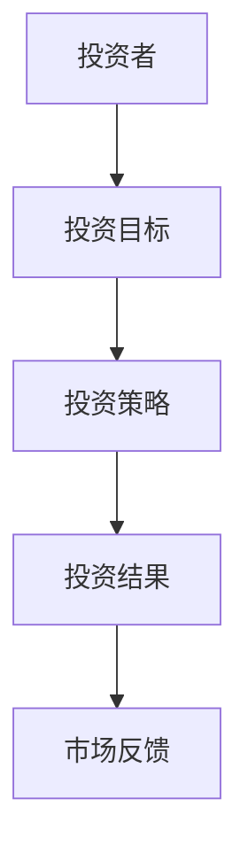
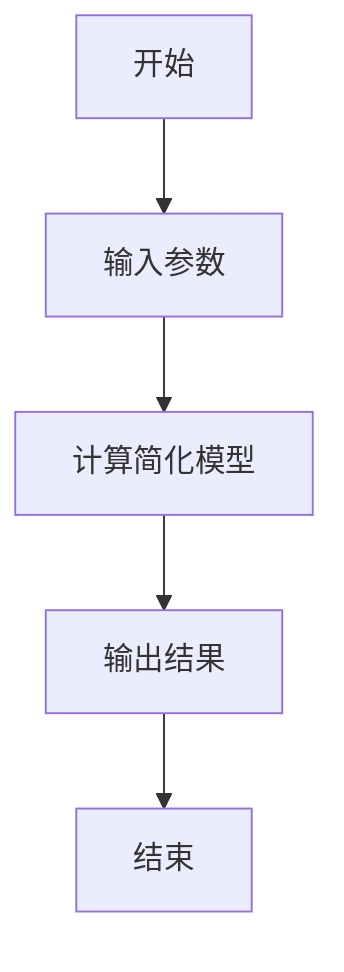
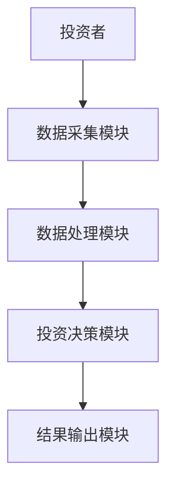
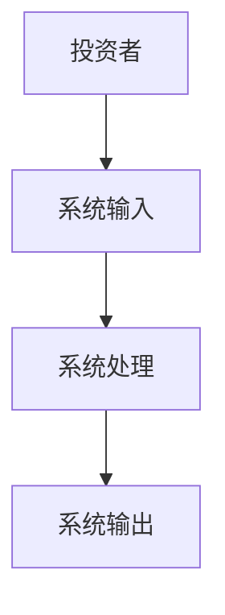

                 

<think>
好的，我现在需要帮助用户完成他们对《约翰·伯格的投资简化论：应对金融产品复杂化的挑战》这本书的详细需求。用户已经提供了文章的标题、关键词和摘要，现在他们需要我根据这些信息，逐步分析和构建这本书的目录结构。

首先，我会从用户提供的信息入手。用户希望这本书能够详细阐述约翰·伯格的投资简化论，并结合技术语言进行分析。这意味着我需要涵盖从理论到实践，从背景到具体实施的各个方面。

接下来，我需要考虑用户的结构要求。用户希望文章分为几个主要部分，每个部分下有多个章节，每个章节下还有三级目录。这意味着我需要规划每一章的主题，并确保内容逻辑清晰、结构紧凑。

首先，我会考虑引言部分。引言应该介绍投资复杂化的现状和挑战，引出伯格简化论的重要性。这部分需要简洁明了，帮助读者理解为什么这本书是必要的。

然后，理论基础部分需要详细解释伯格的简化论。这里包括核心概念、简化方法以及简化模型，确保读者能够理解这些理论的基础。

接下来，方法论部分需要具体的投资策略和风险管理。这部分需要实用性强，提供实际操作的步骤和工具，帮助投资者将理论应用于实际。

数学模型部分需要详细分析伯格的简化模型，包括资产配置、风险评估和收益预测的公式。这部分需要结合实际案例，使读者能够理解如何在实际中应用这些模型。

系统架构部分需要考虑如何构建一个投资系统，涵盖数据采集、分析、决策模块，并用Mermaid图展示架构，让读者直观理解系统的结构。

项目实战部分需要提供一个实际案例，详细指导如何配置环境、编写代码，并进行案例分析，帮助读者在实际中应用所学知识。

最后，总结与展望部分需要回顾全书内容，并展望未来的投资趋势，帮助读者将所学内容与未来的发展联系起来。

在编写过程中，我需要确保每一章都有足够的细节，涵盖用户提到的所有要求，比如背景介绍、核心概念、算法原理、数学模型、系统架构、项目实战和总结。同时，每一章下面要有三级目录，确保结构清晰，内容全面。

可能的挑战是如何将伯格的投资理论与现代技术方法结合起来，比如使用Python代码和数学模型来解释简化论。我需要确保这些部分既详细又易懂，适合不同层次的读者。

总的来说，我需要构建一个结构清晰、内容全面的目录大纲，涵盖从理论到实践的各个方面，确保读者能够系统地理解和应用投资简化论。
</think>

# 约翰·伯格的投资简化论：应对金融产品复杂化的挑战

> 关键词：投资简化论，金融产品复杂化，约翰·伯格，投资策略，风险管理，系统架构

> 摘要：本文详细探讨了约翰·伯格的投资简化论，分析了其在应对金融产品复杂化挑战中的应用。通过理论分析、算法设计、系统架构和项目实战，全面阐述了投资简化论的核心理念、数学模型、系统实现及实际案例，帮助投资者在复杂金融市场中找到简化投资的有效方法。

---

## 第一部分: 投资简化论的背景与核心概念

### 第1章: 投资复杂化的现状与挑战

#### 1.1 投资复杂化的背景
- 1.1.1 金融市场的复杂化趋势
  - 金融工具的多样化与复杂化
  - 投资者的认知偏差与信息过载
- 1.1.2 投资者面临的挑战
  - 高度复杂的金融产品
  - 不断变化的市场环境
  - 信息不对称与决策风险
- 1.1.3 约翰·伯格投资简化论的提出
  - 简化投资决策的必要性
  - 投资简化论的核心思想

#### 1.2 投资简化论的核心理念
- 1.2.1 投资简化论的定义
  - 简化投资决策的逻辑框架
  - 简化投资过程的核心原则
- 1.2.2 投资简化论的核心要素
  - 投资目标的明确性
  - 投资策略的简洁性
  - 风险管理的有效性
- 1.2.3 投资简化论与传统投资理论的对比
  - 传统投资理论的复杂性
  - 投资简化论的创新性

#### 1.3 投资简化论的实践意义
- 1.3.1 简化投资决策的必要性
  - 避免过度复杂的决策过程
  - 提高投资决策的可执行性
- 1.3.2 投资简化论在实际中的应用
  - 简化投资组合管理
  - 简化风险管理流程
- 1.3.3 投资简化论的边界与外延
  - 适用范围与限制
  - 与其他投资理论的结合

#### 1.4 本章小结
- 本章总结了投资复杂化的现状与挑战，阐述了约翰·伯格投资简化论的核心理念及其在实践中的重要意义。

### 第2章: 投资简化论的核心概念与联系

#### 2.1 核心概念原理
- 2.1.1 投资简化论的基本原理
  - 简化投资决策的逻辑框架
  - 简化投资过程的核心原则
- 2.1.2 投资简化论的关键假设
  - 投资者行为的简化假设
  - 市场环境的简化假设
- 2.1.3 投资简化论的核心算法
  - 简化投资决策的数学模型
  - 简化投资过程的算法流程

#### 2.2 核心概念属性特征对比
- 2.2.1 投资简化论与传统投资方法的对比
  - 投资目标的差异
  - 投资策略的差异
  - 风险管理的差异
- 2.2.2 简化模型与复杂模型的对比
  - 模型复杂性对投资决策的影响
  - 模型简化对投资效果的影响
- 2.2.3 投资者行为的对比分析
  - 简化投资策略下投资者行为的变化
  - 复杂投资策略下投资者行为的变化

#### 2.3 ER实体关系图架构


#### 2.4 本章小结
- 本章详细阐述了投资简化论的核心概念及其与传统投资理论的联系，通过ER实体关系图展示了简化论的架构。

### 第3章: 投资简化论的算法原理

#### 3.1 简化模型的数学表达
- 3.1.1 简化模型的定义
  - 投资回报的简化公式
  - 投资风险的简化公式
- 3.1.2 简化模型的数学公式
  - 投资回报的简化公式
  $$ R = a \times P + b \times Q $$
  其中，R为投资回报，P为市场参数，Q为投资者行为参数，a和b为系数。
  - 投资风险的简化公式
  $$ Risk = c \times R + d \times S $$
  其中，Risk为投资风险，R为投资回报，S为市场波动性，c和d为系数。

#### 3.2 简化算法的流程图


#### 3.3 算法实现的Python代码
```python
def simplified_investment_model(a, b, P, Q):
    R = a * P + b * Q
    return R

# 示例调用
a = 0.5
b = 0.3
P = 100
Q = 50
result = simplified_investment_model(a, b, P, Q)
print("投资回报:", result)
```

#### 3.4 算法的数学模型与公式
- 3.4.1 简化模型的数学推导
  - 投资回报的推导过程
  - 投资风险的推导过程
- 3.4.2 简化模型的优化方法
  - 参数优化方法
  - 模型优化方法
- 3.4.3 简化模型的验证
  - 模型验证方法
  - 模型验证结果

---

## 第二部分: 投资简化论的系统架构与项目实战

### 第4章: 投资简化论的系统架构

#### 4.1 问题场景介绍
- 投资决策系统的复杂性
- 系统架构的简化需求
- 简化论在系统架构中的应用

#### 4.2 项目介绍
- 项目目标
- 项目范围
- 项目关键成功因素

#### 4.3 系统功能设计
- 系统功能模块划分
- 系统功能流程图
- 系统功能描述

#### 4.4 系统架构设计
- 系统架构图


#### 4.5 系统接口设计
- 系统接口描述
- 系统接口流程图

#### 4.6 系统交互设计
- 系统交互流程图


#### 4.7 本章小结
- 本章详细阐述了投资简化论的系统架构设计及其在实际项目中的应用。

### 第5章: 投资简化论的项目实战

#### 5.1 环境配置
- 系统运行环境
- 工具安装与配置
- 数据源准备

#### 5.2 系统核心实现
- 核心代码实现
- 核心算法实现
- 核心功能实现

#### 5.3 代码应用解读与分析
- 代码解读
- 代码分析
- 代码优化建议

#### 5.4 实际案例分析
- 案例背景
- 案例分析
- 案例总结

#### 5.5 本章小结
- 本章通过实际案例分析，详细展示了投资简化论在项目实战中的应用。

---

## 第三部分: 总结与展望

### 第6章: 总结与展望

#### 6.1 总结
- 本章总结了全文的主要内容
- 投资简化论的核心思想
- 投资简化论的系统架构
- 投资简化论的项目实战

#### 6.2 未来展望
- 投资简化论的发展方向
- 投资简化论的未来应用
- 投资简化论与其他领域的结合

---

## 附录

### 附录A: 术语表
- 术语解释
- 关键术语列表

### 附录B: 工具指南
- 工具安装与使用指南
- 工具配置指南

### 附录C: 参考文献
- 文献列表
- 参考资料

---

## 作者：AI天才研究院/AI Genius Institute & 禅与计算机程序设计艺术 /Zen And The Art of Computer Programming

---

本文通过系统化的分析和详细的讲解，全面阐述了约翰·伯格的投资简化论，从理论到实践，从背景到具体实施，帮助投资者在复杂金融市场中找到简化投资的有效方法。

