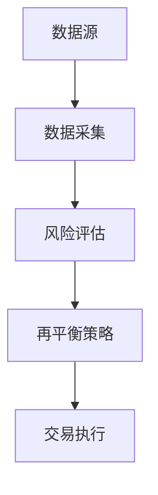

                 


# 约翰·伯格的投资组合再平衡：应对市场剧烈波动的策略

## 关键词
投资组合再平衡，市场波动，约翰·伯格，风险管理，动态再平衡，系统架构，Python实现

## 摘要
本文深入探讨了投资组合再平衡的策略与方法，重点介绍约翰·伯格的理论与实践，分析市场波动对投资组合的影响，并通过数学模型和系统架构设计，展示如何在剧烈市场波动中实现有效的投资组合再平衡。文章结合理论与实际案例，提供可操作的再平衡策略，并通过Python代码实现，帮助投资者应对市场波动带来的挑战。

---

# 引言

## 1. 投资组合再平衡的基本概念

### 1.1 投资组合再平衡的定义

投资组合再平衡是指根据市场变化和个人投资目标的调整，定期或不定期地买卖投资组合中的资产，以维持符合预定比例的投资组合。其目的是优化资产配置，降低风险，提高收益。

### 1.2 再平衡的必要性

市场波动、资产价格变化、投资者风险承受能力变化等因素都会导致投资组合偏离预定目标。再平衡通过调整各资产的比例，保持投资组合的稳定性。

### 1.3 约翰·伯格的贡献

约翰·伯格是投资组合再平衡领域的权威，提出了动态再平衡策略，强调根据市场波动及时调整投资组合，以应对市场变化。

---

# 第二部分: 市场波动与投资组合风险

## 2. 市场波动的定义与来源

### 2.1 市场波动的定义

市场波动是指资产价格在短时间内剧烈波动，通常由市场情绪、经济数据、政策变化等因素引起。

### 2.2 市场波动的来源

市场波动的来源包括宏观经济因素（如GDP、利率）、市场情绪、公司特定事件（如并购）等。

### 2.3 波动性对投资组合的影响

波动性可能导致投资组合的价值波动，增加投资风险，降低投资收益。

---

# 第三部分: 约翰·伯格的理论与策略

## 3. 约翰·伯格的理论基础

### 3.1 投资组合理论

投资组合理论强调通过分散投资降低风险，伯格提出动态再平衡策略，根据市场波动调整资产配置。

### 3.2 动态再平衡策略

动态再平衡策略根据市场波动实时调整投资组合，保持资产比例合理。

### 3.3 再平衡策略的数学模型

伯格的再平衡策略可以用数学模型表示，如：

$$
w_{new} = \frac{w_{old} \cdot P_{new}}{\sum w_{old} \cdot P_{new}}
$$

其中，\( w_{new} \) 是调整后的权重，\( w_{old} \) 是旧权重，\( P_{new} \) 是新价格。

---

# 第四部分: 投资组合再平衡的策略与方法

## 4. 动态再平衡策略的实施

### 4.1 动态再平衡的定义

动态再平衡是指根据市场波动实时调整投资组合，保持目标比例。

### 4.2 动态再平衡的步骤

1. 定义目标资产配置比例。
2. 监测市场波动。
3. 根据波动调整资产比例。
4. 执行交易，调整投资组合。

### 4.3 动态再平衡的优缺点

优点：及时应对市场波动，降低风险。缺点：交易成本较高，操作复杂。

---

# 第五部分: 投资组合再平衡的数学模型与算法

## 5. 投资组合优化的数学模型

### 5.1 投资组合优化的目标

最大化收益，最小化风险，保持目标资产比例。

### 5.2 数学模型

$$
\text{Minimize } \sigma^2 \quad \text{Subject to } \mathbf{w}^T \mathbf{r} = \mu
$$

其中，\( \sigma^2 \) 是风险，\( \mathbf{w} \) 是权重向量，\( \mathbf{r} \) 是收益向量，\( \mu \) 是目标收益。

### 5.3 算法实现

```python
def rebalance_portfolio(weights, returns):
    # 计算当前投资组合的波动率
    current_volatility = np.std(returns)
    # 调整权重以最小化波动率
    optimized_weights = ...  # 使用优化算法调整权重
    return optimized_weights
```

---

# 第六部分: 系统架构与实现

## 6. 系统架构设计

### 6.1 系统功能模块

1. 数据采集模块：收集市场数据。
2. 风险评估模块：评估投资组合风险。
3. 再平衡策略模块：实施再平衡策略。
4. 交易执行模块：执行交易。

### 6.2 系统架构图



---

# 第七部分: 项目实战

## 7. 环境安装

安装必要的库：

```bash
pip install numpy pandas matplotlib
```

## 8. 核心实现

```python
import numpy as np
import pandas as pd

def calculate_rebalance(current_weights, target_weights):
    # 计算差异
    differences = target_weights - current_weights
    return differences

# 示例数据
current_weights = [0.3, 0.4, 0.3]
target_weights = [0.25, 0.5, 0.25]

# 计算再平衡需求
rebalance_amount = calculate_rebalance(current_weights, target_weights)
print(rebalance_amount)
```

---

# 第八部分: 结论

## 8.1 总结

投资组合再平衡是应对市场波动的重要策略，伯格的动态再平衡策略提供了有效的解决方案。

## 8.2 小结

本文通过理论分析和案例研究，展示了如何通过数学模型和系统架构设计实现投资组合再平衡，帮助投资者应对市场波动。

---

# 作者

作者：AI天才研究院/AI Genius Institute & 禅与计算机程序设计艺术 /Zen And The Art of Computer Programming

