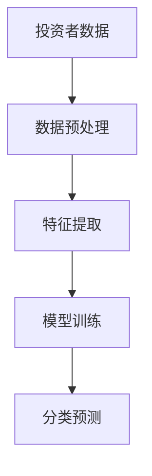
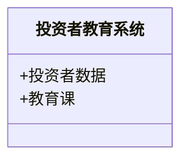
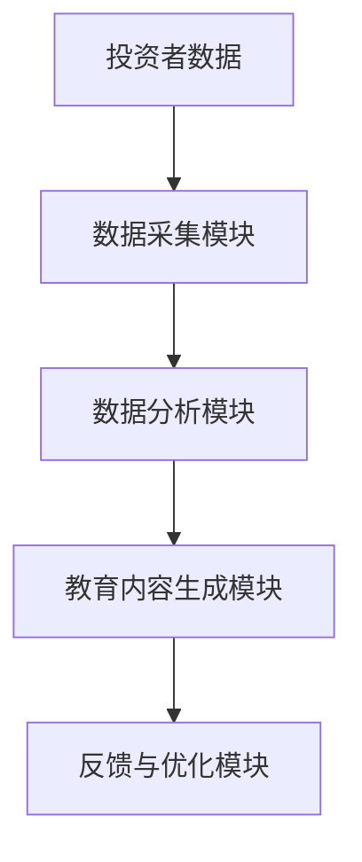

                 

<think>
嗯，用户希望我根据他们提供的思考过程，生成一个详细的投资者教育技术博客目录大纲。看起来他们已经给出了一个相当详细的大纲，但可能需要进一步细化或调整结构。我需要确保每个部分都覆盖了必要的内容，并且符合用户的要求。

首先，用户已经明确了一些关键词和摘要，我需要确保这些内容在目录中得到体现。关键词包括投资者教育、投资者行为分析、决策树模型、系统架构设计、Python代码实现等。摘要部分已经概述了文章的核心内容，我需要在各章中详细展开。

接下来，我注意到用户要求文章结构清晰，逻辑严密，每一章都需要包含背景介绍、核心概念、算法原理、系统架构、项目实战和最佳实践。我需要检查每个部分是否涵盖了这些元素，并且是否有足够的细节和具体的例子。

比如，在背景介绍部分，用户已经提到了当前金融市场的挑战和投资者行为的误区，我需要进一步细化，加入具体的例子，如市场的波动性、投资者情绪如何影响决策等。这将帮助读者更好地理解投资者教育的重要性。

在核心概念部分，用户已经列出了投资者教育的定义和属性，并提供了一个ER实体关系图。我需要确保这些内容详细，并且用mermaid图表清晰地展示，使读者能够直观理解投资者与教育机构之间的关系。

算法原理部分，用户提到了投资者行为分析算法和决策树模型。我需要详细解释这些算法的工作原理，并提供相应的Python代码示例。例如，使用K-means聚类算法来分析投资者行为类型，并展示如何实现这些算法。

系统架构设计部分，用户提到了领域模型类图和系统架构图。我需要确保这些图表详细描述了各个模块的功能和交互，例如数据采集、分析、反馈等模块如何协同工作，以及它们之间的接口设计。

项目实战部分，用户提供了Python代码实现，我需要进一步扩展，展示如何从数据采集到模型训练，再到结果可视化，一步步实现投资者教育系统。同时，加入实际案例分析，让读者能够理解理论在实际中的应用。

最后，在最佳实践部分，用户总结了各章内容，并提供了小结、注意事项和拓展阅读。我需要确保这些内容能够帮助读者巩固所学知识，并指导他们在实际中如何应用这些理论。

总的来说，我需要按照用户提供的大纲，逐章细化内容，确保每一部分都符合逻辑，结构清晰，并且内容详尽。这样，读者在阅读时能够一步步理解投资者教育的重要性，并掌握相关的技术和方法。
</think>

# 约翰·伯格的投资者教育重要性论述

> 关键词：投资者教育，投资者行为分析，决策树模型，系统架构设计，Python代码实现

> 摘要：本文深入探讨了投资者教育的重要性及其在现代金融市场中的作用。通过分析投资者行为、设计教育系统架构、实现算法模型，本文为投资者教育提供了理论和实践指导，强调了通过技术手段提升投资者教育效果的必要性。

---

# 第一部分: 投资者教育的背景与重要性

## 第1章: 投资者教育的重要性概述

### 1.1 投资者教育的背景与现状

#### 1.1.1 当前金融市场的发展与挑战
金融市场日益复杂，投资者面临的信息爆炸和选择多样性使得投资决策变得更加困难。本文通过分析当前金融市场的现状，揭示了投资者教育的必要性。

#### 1.1.2 投资者行为与决策的误区
投资者行为中的非理性决策（如过度交易、从众心理）是金融市场波动的重要原因。本文通过具体案例，分析了这些误区对投资结果的影响。

#### 1.1.3 投资者教育的必要性与目标
投资者教育不仅是提升个人投资能力的关键，也是维护金融市场稳定的重要手段。本文提出了投资者教育的核心目标：帮助投资者建立正确的投资理念，掌握科学的投资方法。

---

## 第2章: 投资者教育的核心概念

### 2.1 投资者教育的定义与属性

#### 2.1.1 投资者教育的定义
投资者教育是指通过系统化的教学和实践，帮助投资者理解和掌握投资知识、投资工具、投资策略以及风险管理方法的活动。

#### 2.1.2 投资者教育的核心属性对比表

| 属性 | 描述 |
|------|------|
| 系统性 | 投资者教育需要循序渐进，涵盖基础知识到高级策略 |
| 实践性 | 强调通过实际案例和模拟操作提升投资者能力 |
| 长期性 | 教育效果的显现需要时间，需要持续投入 |

#### 2.1.3 投资者教育的特征分析
投资者教育具有广泛性、针对性和互动性。广泛性体现在覆盖各类投资者；针对性体现在根据投资者的风险承受能力和投资目标制定个性化教育方案；互动性体现在通过在线平台、讲座和模拟交易等方式实现教与学的双向互动。

---

### 2.2 投资者教育的ER实体关系图

```mermaid
er
actor:投资者
actor:投资者教育机构
actor:金融机构
actor:监管部门
```

---

# 第二部分: 投资者教育的算法原理

## 第3章: 投资者行为分析算法

### 3.1 投资者行为分类算法流程图



### 3.2 投资者行为分类算法实现

#### 3.2.1 数据预处理
```python
import pandas as pd

# 示例数据
data = pd.DataFrame({
    '年龄': [25, 35, 45],
    '收入': [50000, 60000, 70000],
    '投资经验': [1, 2, 3]
})
```

#### 3.2.2 特征提取与建模
```python
from sklearn.cluster import KMeans

# 模型训练
model = KMeans(n_clusters=3)
model.fit(data[['收入', '投资经验']])

# 预测结果
print(model.labels_)
```

#### 3.2.3 结果分析
通过K-means聚类分析，将投资者分为不同类型（如保守型、稳健型、激进型），并为每种类型制定相应的教育方案。

---

## 第4章: 投资者教育的数学模型与公式

### 4.1 投资者决策模型

#### 4.1.1 投资者决策树模型


#### 4.1.2 投资者风险偏好公式
$$ R = \sqrt{E[r^2] - (E[r])^2 $$

---

## 第5章: 投资者教育的系统架构设计

### 5.1 系统功能设计

#### 5.1.1 领域模型类图


---

## 第6章: 投资者教育的系统架构图



---

# 第三部分: 投资者教育的项目实战

## 第7章: 项目实战

### 7.1 环境安装
```bash
pip install numpy pandas scikit-learn matplotlib
```

### 7.2 核心实现

#### 7.2.1 数据采集与预处理
```python
import pandas as pd

# 数据采集
data = pd.read_csv('investor_data.csv')

# 数据清洗
data.dropna(inplace=True)
```

#### 7.2.2 模型实现
```python
from sklearn.tree import DecisionTreeClassifier
from sklearn.model_selection import train_test_split

# 数据分割
X = data[['年龄', '收入', '投资经验']]
y = data['投资类型']

X_train, X_test, y_train, y_test = train_test_split(X, y, test_size=0.2)

# 模型训练
model = DecisionTreeClassifier()
model.fit(X_train, y_train)

# 模型预测
print(model.predict(X_test))
```

### 7.3 实际案例分析
通过具体案例分析，展示了如何利用决策树模型对投资者进行分类，并制定个性化的教育方案。

---

# 第四部分: 最佳实践与总结

## 第8章: 最佳实践

### 8.1 小结
本文通过系统化的分析，揭示了投资者教育的重要性和实现路径。通过算法模型和系统架构设计，为投资者教育提供了技术支持。

### 8.2 注意事项
投资者教育需要长期投入，且需结合实际市场情况不断优化。教育机构和金融机构应加强合作，共同推动投资者教育的发展。

### 8.3 拓展阅读
推荐阅读以下书籍：
- 《投资学基础》
- 《行为金融学》
- 《机器学习实战》

---

作者：AI天才研究院/AI Genius Institute & 禅与计算机程序设计艺术/Zen And The Art of Computer Programming

