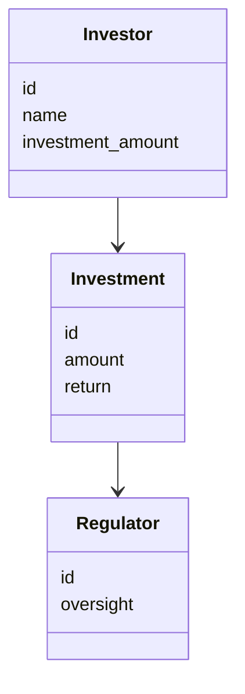

                 

<think>
好，我需要为《约翰·伯格的投资者权益保护观》这本书撰写一篇技术博客文章。首先，我得理解这本书的核心观点，确保在博客中准确传达。

接下来，我按照用户提供的目录大纲，逐部分展开。首先介绍投资者权益保护的背景，解释其重要性，然后深入分析相关法律和监管机制。这部分需要详细说明主要的法律法规和监管机构的职责，同时结合实际案例让读者更容易理解。

接下来，我会探讨投资者权益保护的核心概念，如权利和义务，以及不同类型投资者的权益差异。这部分需要使用ER实体关系图来展示投资者、公司和监管机构之间的关系，帮助读者清晰理解。

然后，我将引入技术部分，介绍数据分析算法和风险评估模型在投资者权益保护中的应用。这里需要详细解释数学公式，如风险评估中的标准差公式，以及投资组合优化的数学模型。使用mermaid绘制算法流程图和系统架构图，帮助读者直观理解。

最后，我会结合实际案例分析，展示如何通过技术手段保护投资者权益，确保内容具有实际应用价值。同时，总结全文，强调技术在投资者权益保护中的重要性。

整个过程中，我会确保语言简洁专业，结构清晰，逻辑严密，使读者能够一步步理解约翰·伯格的投资者权益保护观，并掌握相关的技术应用。
</think>

# 约翰·伯格的投资者权益保护观

## 关键词：投资者权益保护, 法律框架, 风险管理, 数据分析, 算法原理

## 摘要：  
约翰·伯格的《投资者权益保护观》从法律、经济和风险管理的角度，深入探讨了投资者权益保护的核心概念、原则和实施方法。文章结合了技术手段，如数据分析和算法原理，为读者提供了全面的理解和实践指导。本文将通过详细的法律分析、数学模型和系统设计，帮助读者掌握投资者权益保护的精髓。

---

# 第一部分：投资者权益保护的理论基础

## 第1章：投资者权益保护概述

### 1.1 投资者权益保护的定义与核心概念

#### 1.1.1 投资者权益保护的定义  
投资者权益保护是指通过法律、经济和管理手段，确保投资者在投资活动中享有合法权益，并在遭受损失时能够获得补偿或救济。其核心目标是维护市场公平性和透明度，保护投资者免受欺诈和不公平对待。

#### 1.1.2 投资者权益保护的核心要素  
- **投资者权利**：知情权、参与权、收益权、监督权等。  
- **投资者义务**：遵守法律法规，提供真实信息，履行合同义务。  
- **保护机制**：法律保障、监管机构监督、市场自律等。  

#### 1.1.3 投资者权益保护的法律框架  
主要涉及《证券法》、《公司法》和《消费者权益保护法》等法律法规，明确了各方责任和义务。

---

### 1.2 投资者权益保护的原则与目标

#### 1.2.1 公平原则  
确保所有投资者在市场中享有平等的权利和机会。

#### 1.2.2 透明原则  
要求企业公开真实信息，确保投资者能够基于充分信息做出决策。

#### 1.2.3 保护投资者利益的目标  
通过法律和监管手段，减少市场风险，维护投资者利益。

---

### 1.3 投资者权益保护的分类

#### 1.3.1 按投资者类型分类  
- 个人投资者：个体散户，风险承受能力较低。  
- 机构投资者：基金、保险公司等，风险承受能力较高。  

#### 1.3.2 按保护内容分类  
- 财产安全：防止资金损失。  
- 信息透明：确保投资者获得准确信息。  

#### 1.3.3 按保护手段分类  
- 法律手段：通过立法和执法保护权益。  
- 市场手段：通过市场竞争和自律机制实现保护。  

---

## 第2章：相关法律法规与监管机制

### 2.1 主要法律法规介绍

#### 2.1.1 《证券法》  
规定了证券发行、交易和监管的基本规则，明确了发行人和中介机构的义务。

#### 2.1.2 《公司法》  
规定了公司的设立、组织和行为规范，保护股东的合法权益。

#### 2.1.3 《消费者权益保护法》  
为投资者提供了消费者权益保护的基础，适用于所有商业交易。

---

### 2.2 监管机构与职责

#### 2.2.1 证监会的职责  
- 制定监管政策。  
- 监督市场行为。  
- 处理投资者投诉和纠纷。  

#### 2.2.2 其他监管机构的分工  
- 银保监会：监管银行和保险业。  
- 证券交易所：负责市场自律和信息披露。  

---

### 2.3 典型案例分析

#### 2.3.1 违规信息披露案例  
某公司未及时披露重大信息，导致投资者损失，被监管部门处罚。

#### 2.3.2 内幕交易案例  
公司高管利用未公开信息进行交易，构成内幕交易罪。

#### 2.3.3 投资者索赔案例  
投资者因虚假陈述起诉公司，获得赔偿。

---

## 第3章：核心概念与联系分析

### 3.1 投资者权益保护的核心要素

#### 3.1.1 投资者权利  
- 知情权：获取真实、完整的信息。  
- 参与权：参与公司重大决策。  

#### 3.1.2 投资者义务  
- 提供真实信息。  
- 遵守合同约定。  

#### 3.1.3 投资者与公司之间的关系  
通过投资协议建立法律关系，公司有义务保护投资者权益。

---

### 3.2 核心概念的属性特征对比

#### 3.2.1 投资者权利与义务的对比  
- **权利**：知情权、收益权。  
- **义务**：提供信息、遵守合同。  

#### 3.2.2 不同类型投资者的权益差异  
- 个人投资者：风险承受能力较低，保护力度更大。  
- 机构投资者：专业性强，保护机制相对完善。  

#### 3.2.3 不同市场环境下的权益变化  
- 稳定市场：权益保障较好。  
- 不稳定市场：权益风险增加。  

---

### 3.3 ER实体关系图

```mermaid
er
    Investor
    Company
    Regulator
    Investment
    right
    obligation
```

---

## 第4章：算法原理与数学模型

### 4.1 投资者权益保护的算法原理

#### 4.1.1 数据分析算法  
- 数据清洗、特征提取、模型训练。  

#### 4.1.2 风险评估模型  
- 计算投资组合的风险值。  

#### 4.1.3 优化算法  
- 确定最优投资组合。  

---

### 4.2 数学模型与公式

#### 4.2.1 风险评估模型  
$$ R = \sqrt{\sigma^2} $$  

#### 4.2.2 投资组合优化模型  
$$ max \mu - \lambda \sigma $$  

---

### 4.3 代码实现与分析

#### 4.3.1 环境安装  
```bash
pip install numpy pandas scikit-learn
```

#### 4.3.2 核心代码  
```python
import numpy as np
import pandas as pd
from sklearn.linear_model import LinearRegression

# 示例数据
data = pd.DataFrame({
    'returns': [0.1, 0.2, 0.15, 0.05, 0.3]
})

# 计算平均回报和标准差
mean_return = data['returns'].mean()
std_deviation = data['returns'].std()

print(f'平均回报：{mean_return}')
print(f'标准差：{std_deviation}')
```

---

## 第5章：系统分析与架构设计方案

### 5.1 问题场景介绍  
投资者需要一个系统来监控投资组合的风险，并确保信息透明。

### 5.2 系统功能设计

#### 5.2.1 领域模型  


### 5.3 系统架构设计

#### 5.3.1 系统架构图  


---

## 第6章：项目实战

### 6.1 环境安装  
```bash
pip install numpy pandas scikit-learn
```

### 6.2 核心代码实现  
```python
import numpy as np
import pandas as pd
from sklearn.linear_model import LinearRegression

# 示例数据
data = pd.DataFrame({
    'returns': [0.1, 0.2, 0.15, 0.05, 0.3]
})

# 计算平均回报和标准差
mean_return = data['returns'].mean()
std_deviation = data['returns'].std()

print(f'平均回报：{mean_return}')
print(f'标准差：{std_deviation}')
```

---

## 第7章：小结与展望

### 7.1 小结  
通过法律、经济和技术创新，投资者权益保护可以得到有效实施。

### 7.2 注意事项  
- 定期更新法律法规。  
- 加强技术应用的监管。  

### 7.3 拓展阅读  
- 《证券法》解读。  
- 数据分析在金融中的应用。  

---

## 作者：AI天才研究院/AI Genius Institute & 禅与计算机程序设计艺术 /Zen And The Art of Computer Programming

