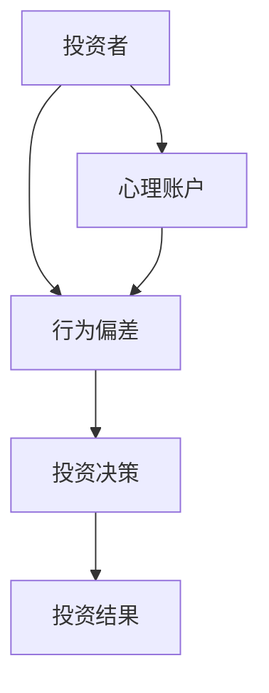
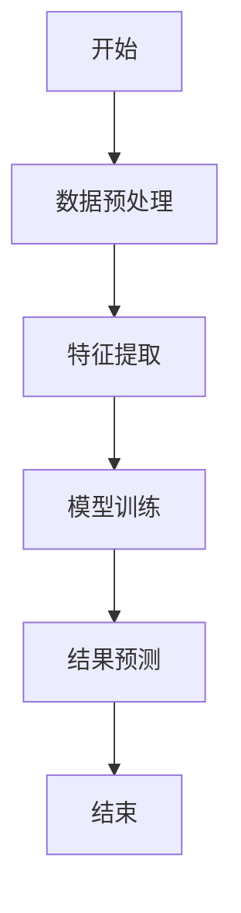
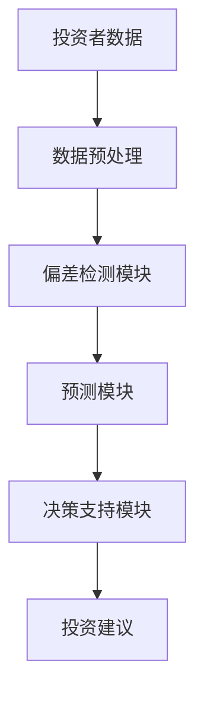
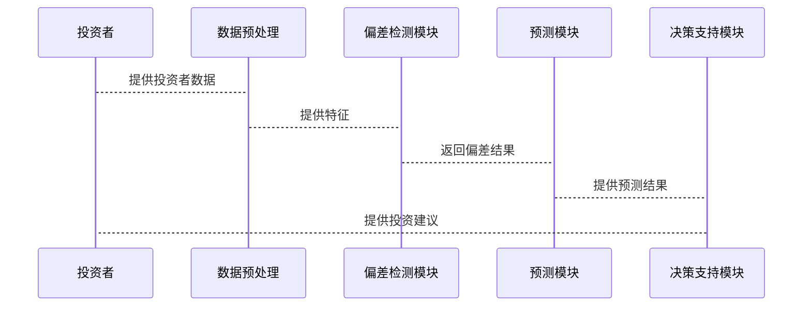

                 


# 约翰·伯格的投资者行为偏差研究

> 关键词：投资者行为偏差，约翰·伯格，价值投资，心理偏差，投资决策

> 摘要：本文深入探讨了约翰·伯格的投资者行为偏差，分析了这些偏差如何影响投资决策，并结合数学模型和系统架构设计，提供了克服这些偏差的策略和建议。

---

## 第一章：投资者行为偏差的背景介绍

### 1.1 投资者行为偏差的定义与分类

投资者行为偏差是指投资者在决策过程中由于心理、情感或认知因素的影响，导致偏离理性投资策略的现象。这些偏差通常与个体的心理特征和市场环境有关。

#### 1.1.1 行为偏差的定义
行为偏差是投资者在面对不确定性和复杂性时，由于认知限制和情感影响，做出的非理性决策。这些偏差可能导致投资者在市场波动中做出错误的投资决策，影响投资收益。

#### 1.1.2 常见的投资者行为偏差分类
- **认知偏差**：如过度自信、确认偏差、忽略概率。
- **情感偏差**：如损失厌恶、从众心理、羊群效应。
- **交易偏差**：如过度交易、忽略交易成本。

#### 1.1.3 投资者行为偏差的特征与表现
投资者行为偏差通常表现为非理性决策，如在市场下跌时恐慌抛售，或在市场上涨时盲目追涨。这些偏差可能导致投资者忽视基本面分析，过度依赖市场情绪。

### 1.2 投资者行为偏差的产生机制

#### 1.2.1 心理认知偏差的来源
认知偏差主要来源于人类大脑的信息处理机制。人们在面对大量信息时，往往会简化问题，依赖直觉，导致判断失误。

#### 1.2.2 行为偏差与投资决策的关系
行为偏差直接影响投资决策，如过度自信可能导致投资者高估自己的判断能力，从而做出冒险性决策。损失厌恶则可能导致投资者在亏损时过于保守，错失投资机会。

#### 1.2.3 市场环境对行为偏差的影响
市场环境如波动性、信息不对称等因素会加剧行为偏差。例如，在市场恐慌时，从众心理可能导致投资者盲目跟风。

### 1.3 投资者行为偏差的经济影响

#### 1.3.1 行为偏差对投资收益的影响
行为偏差可能导致投资者错失长期收益，如频繁交易增加成本，或在市场底部卖出导致损失。

#### 1.3.2 市场波动与行为偏差的关联
行为偏差加剧市场波动，如羊群效应可能导致市场泡沫和崩盘。投资者的非理性行为放大了市场的波动性。

#### 1.3.3 行为偏差对长期投资策略的影响
长期投资策略要求投资者避免短期波动的干扰，但行为偏差可能导致投资者频繁调整投资组合，破坏长期策略的有效性。

---

## 第二章：投资者行为偏差的核心概念与联系

### 2.1 核心概念原理

#### 2.1.1 心理账户理论
心理账户理论指出，人们会将资金分成不同的心理账户，影响决策。例如，将资金分为“投资”和“生活支出”，导致投资决策受其他账户的影响。

#### 2.1.2 过度自信偏差
过度自信偏差使投资者高估自己的判断能力，导致冒险性决策。例如，认为自己能准确预测市场走势，从而过度集中投资。

#### 2.1.3 损失厌恶与风险偏好
损失厌恶使投资者更害怕损失，导致在亏损时过于保守。风险偏好则可能导致投资者在高风险资产上过度投资。

### 2.2 行为偏差的对比表格

| 偏差类型       | 描述                             | 影响投资决策的方式       |
|----------------|----------------------------------|--------------------------|
| 过度自信        | 高估自己的判断能力               | 导致冒险性投资决策         |
| 损失厌恶        | 更害怕损失                       | 导致保守性投资策略         |
| 从众心理        | 跟随市场潮流                     | 导致非理性跟风行为         |

### 2.3 实体关系图（ER图）



---

## 第三章：投资者行为偏差的算法与数学模型

### 3.1 行为偏差的识别算法

#### 3.1.1 基于历史数据的行为偏差识别
通过分析投资者的历史交易数据，识别其行为偏差。例如，频繁交易可能表示过度自信或从众心理。

#### 3.1.2 机器学习在行为偏差检测中的应用
使用机器学习算法，如随机森林，识别投资者的行为偏差。特征包括交易频率、持仓时间等。

### 3.2 行为偏差的预测模型

#### 3.2.1 时间序列分析
使用ARIMA模型预测投资者行为偏差的影响。例如，预测市场波动对投资者行为的影响。

#### 3.2.2 神经网络模型在行为预测中的应用
构建神经网络模型，预测投资者的行为偏差。输入特征包括市场数据、投资者情绪等。

### 3.3 算法流程图（Mermaid）



### 3.4 数学模型与公式

#### 3.4.1 基于概率论的行为偏差模型
$$ P(\text{偏差发生}) = \frac{\text{历史偏差发生次数}}{\text{总交易次数}} $$

#### 3.4.2 预期效用函数
$$ U = \sum p_i u(x_i) $$

---

## 第四章：系统分析与架构设计

### 4.1 系统功能设计

#### 4.1.1 领域模型（mermaid类图）


#### 4.1.2 系统架构设计（mermaid架构图）



### 4.2 系统接口设计

#### 4.2.1 接口设计
- 数据输入接口：接收投资者数据和市场数据。
- 模型调用接口：调用偏差检测和预测模块。

#### 4.2.2 系统交互（mermaid序列图）



---

## 第五章：项目实战

### 5.1 项目环境与工具安装

#### 5.1.1 环境要求
- Python 3.8+
- Jupyter Notebook
- Scikit-learn库

### 5.2 核心实现代码

#### 5.2.1 数据预处理代码

```python
import pandas as pd

# 加载数据
data = pd.read_csv('investor_data.csv')

# 数据清洗
data.dropna(inplace=True)
```

#### 5.2.2 偏差检测代码

```python
from sklearn.ensemble import RandomForestClassifier

# 特征提取
features = data[['交易频率', '持仓时间', '亏损比例']]
labels = data['偏差类型']

# 训练模型
model = RandomForestClassifier()
model.fit(features, labels)
```

#### 5.2.3 预测代码

```python
# 预测偏差
predicted = model.predict(features)
```

### 5.3 代码应用解读与分析

#### 5.3.1 代码解读
上述代码通过机器学习模型检测投资者的行为偏差，预测结果为投资者提供决策支持。

#### 5.3.2 实际案例分析
以某投资者为例，分析其交易记录，识别其行为偏差，提供投资建议。

### 5.4 项目小结

通过项目实战，我们展示了如何利用机器学习模型识别和预测投资者行为偏差，为投资决策提供支持。

---

## 第六章：最佳实践、小结、注意事项、拓展阅读

### 6.1 最佳实践

- **投资策略**：坚持长期投资，避免短期波动的干扰。
- **风险管理**：合理分散投资，降低损失厌恶的影响。
- **自我反思**：定期回顾投资决策，识别并纠正行为偏差。

### 6.2 小结

本文通过分析约翰·伯格的投资者行为偏差，结合数学模型和系统设计，为投资者提供了克服行为偏差的策略和建议。

### 6.3 注意事项

- 投资者应保持理性，避免情绪化决策。
- 定期回顾投资组合，及时调整策略。

### 6.4 拓展阅读

- 《聪明的投资者》——本杰明·格雷厄姆
- 《投资者的行为偏差：认知与情感的影响》——行为金融学相关书籍

---

## 作者：AI天才研究院/AI Genius Institute & 禅与计算机程序设计艺术/Zen And The Art of Computer Programming

---

**总结**：本文通过系统分析和实战项目，深入探讨了约翰·伯格的投资者行为偏差，结合数学模型和系统设计，为投资者提供了克服行为偏差的策略和建议。

