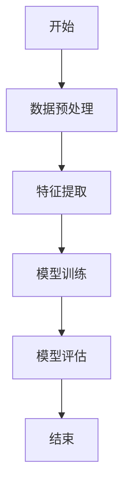
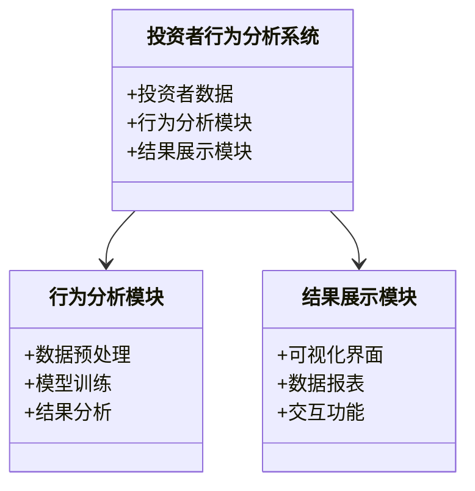

                 

<think>
嗯，用户需要我以《约翰·伯格的投资者行为学观点》为标题写一篇技术博客，要求逻辑清晰、结构紧凑、语言专业。我得先理清楚用户的具体需求，确保每个部分都涵盖到位。

首先，我注意到用户要求文章包括关键词和摘要，这些是文章的开头部分。关键词应该是核心概念，摘要则要概括整篇文章的主题。接下来是目录大纲，已经给出，我需要按照这个结构来组织内容。

接下来是正文部分，每个章节都要详细展开。比如背景介绍，需要涵盖投资者行为学的基本概念，问题背景，伯格的贡献。这部分我需要用简单易懂的语言，同时加入一些例子，帮助读者理解。

核心概念部分，我需要深入分析投资者的心理和行为特征，以及影响这些行为的因素。这里可能需要用一些图表来辅助说明，比如用Mermaid流程图来展示算法的流程，或者用类图来展示系统架构。这样可以让内容更直观。

算法原理部分，我需要详细解释决策模型的数学模型，可能需要用LaTeX公式来展示，比如收益计算公式。同时，提供Python代码示例，让读者能够实际操作和理解。

系统分析与设计部分，我需要用Mermaid图展示系统架构，包括功能模块和交互流程。这部分需要清晰地划分各个模块，展示它们之间的关系和数据流。

项目实战部分，我需要具体指导如何实现投资者行为分析系统，包括数据预处理、模型训练、结果可视化等步骤。可能还需要用Python代码来展示实现细节，比如如何使用机器学习模型进行预测。

最后，我需要总结伯格的观点，给出实际投资中的注意事项，以及未来的研究方向。这部分要简明扼要，帮助读者巩固所学内容。

整体来看，我需要确保文章结构合理，每个部分都详细且有条理，同时语言要专业但不失易懂。特别是加入实际案例和代码示例，能够增强文章的实用性和可读性。现在，我可以开始按照这个思路撰写文章了。
</think>

# 约翰·伯格的投资者行为学观点

## 关键词：投资者行为学，约翰·伯格，投资心理学，决策模型，行为分析系统，机器学习

## 摘要

本文从约翰·伯格的投资者行为学观点出发，系统地分析了投资者心理与行为特征，结合算法原理和系统设计，探讨了投资者行为分析的实践应用。文章首先介绍了投资者行为学的基本概念和研究方法，然后深入分析了投资者心理、行为特征及其影响因素，接着从算法原理的角度详细阐述了基于行为学的决策模型，最后通过系统设计和项目实战展示了投资者行为分析系统的实现过程。本文结合理论与实践，为投资者行为分析提供了全面的视角。

---

# 正文

## 第一部分：背景介绍

### 第1章：投资者行为学概述

#### 1.1 投资者行为学的核心概念

投资者行为学是一门研究投资者在金融市场中的心理、行为及其决策过程的学科。它结合了心理学、经济学和金融学的理论，旨在揭示投资者在实际投资过程中如何做出决策，以及这些决策如何影响市场运行。

- **投资者行为学的定义**：投资者行为学通过研究投资者的心理和行为，揭示其决策规律和市场互动机制。
- **问题背景**：传统投资理论往往假设投资者是理性的，但现实中投资者的行为常常受到情绪、认知偏差等因素的影响，这使得理论与实践之间存在较大差距。
- **约翰·伯格的贡献**：伯格通过大量实证研究，揭示了投资者行为中的非理性特征，并提出了基于行为学的决策模型。

#### 1.2 投资者行为学的研究方法

投资者行为学的研究方法主要包括定性研究和定量研究两类：

- **定性研究**：通过访谈、观察等方法，研究投资者的行为模式和心理特征。
- **定量研究**：通过统计分析和实验研究，量化投资者行为的数据特征。
- **实验室实验**：在控制环境下，研究投资者在特定情境下的行为反应。

#### 1.3 投资者行为学的现实意义

投资者行为学的现实意义主要体现在以下几个方面：

- **理论意义**：丰富了金融学的理论体系，揭示了投资者行为的复杂性。
- **实践意义**：为投资者教育、风险管理以及金融产品的设计提供了理论依据。
- **伯格观点的现实意义**：伯格的研究为投资者行为分析提供了实证基础，为金融市场的实践提供了新的视角。

---

## 第二部分：核心概念与联系

### 第2章：投资者心理与行为特征

#### 2.1 投资者心理分析

投资者心理分析是投资者行为学的核心内容之一，主要包括以下几个方面：

- **认知偏差**：投资者在信息处理过程中往往存在各种认知偏差，如确认偏差、锚定效应等，这些偏差会影响其决策。
- **情绪波动**：投资者的情绪波动（如贪婪、恐惧）常常导致非理性决策，尤其是在市场波动较大的情况下。
- **风险偏好**：不同投资者的风险偏好不同，这影响其投资行为和决策。

#### 2.2 投资者行为特征

投资者的行为特征可以通过以下几个方面进行分析：

- **群体行为特征**：群体投资者的行为往往表现出从众心理和羊群效应。
- **个体行为特征**：个体投资者的行为受到其个性、知识水平和风险偏好等因素的影响。
- **行为异同**：投资者的行为既有共性，也有个体差异，这种差异性是投资者行为分析的重要内容。

#### 2.3 投资者行为的影响因素

投资者行为的影响因素主要包括以下几类：

- **信息不对称**：信息的不完整性和不对称性会影响投资者的决策。
- **市场环境**：市场的波动性和宏观经济环境会影响投资者的行为。
- **个人特质**：投资者的个性、知识水平和经验也会影响其行为。

---

## 第三部分：算法原理讲解

### 第3章：基于行为学的决策模型

#### 3.1 算法原理概述

基于行为学的决策模型是一种结合了心理学和经济学理论的算法，旨在模拟投资者的决策过程。该模型的核心思想是：投资者的决策受到心理因素和环境因素的共同影响。

- **算法的基本原理**：通过分析投资者的心理特征和行为数据，构建一个能够模拟投资者决策的模型。
- **算法的核心思想**：投资者的决策是一个动态过程，受到情绪、认知偏差和环境因素的综合影响。
- **算法的数学模型**：基于行为学的决策模型可以用以下公式表示：

$$
\text{决策} = f(\text{心理特征}, \text{行为数据}, \text{环境因素})
$$

其中，$f$ 表示决策函数，$\text{心理特征}$、$\text{行为数据}$ 和 $\text{环境因素}$ 分别是输入变量。

#### 3.2 算法实现步骤

基于行为学的决策模型的实现步骤如下：

1. **数据预处理**：对投资者的行为数据进行清洗和标准化处理。
2. **特征提取**：从数据中提取出与投资者行为相关的特征，如情绪指标、认知偏差指标等。
3. **模型训练**：利用机器学习算法（如随机森林、支持向量机等）对模型进行训练。
4. **模型优化**：通过交叉验证和调参优化模型性能。

#### 3.3 算法流程图



---

## 第四部分：系统分析与架构设计方案

### 第4章：投资者行为分析系统设计

#### 4.1 系统功能设计

投资者行为分析系统的功能设计主要包括以下几个方面：

- **功能模块划分**：
  - 数据采集模块：负责采集投资者的行为数据。
  - 行为分析模块：对投资者的行为数据进行分析和建模。
  - 结果展示模块：将分析结果以可视化的方式展示出来。

- **功能流程图**：
  ```mermaid
  graph TD
      A[开始] --> B[数据采集]
      B --> C[行为分析]
      C --> D[结果展示]
      D --> E[结束]
  ```

#### 4.2 系统架构设计

投资者行为分析系统的架构设计如下：



---

## 第五部分：项目实战

### 第5章：投资者行为分析系统实现

#### 5.1 项目环境安装

为了实现投资者行为分析系统，需要安装以下环境和工具：

- **编程语言**：Python 3.8+
- **机器学习库**：scikit-learn、xgboost
- **数据处理库**：Pandas、NumPy
- **可视化工具**：Matplotlib、Seaborn

#### 5.2 系统核心实现源代码

以下是投资者行为分析系统的核心实现代码：

```python
import pandas as pd
from sklearn.ensemble import RandomForestClassifier
from sklearn.metrics import accuracy_score

# 数据加载
data = pd.read_csv('investor_behavior.csv')

# 数据预处理
# 假设 'target' 是目标变量，'features' 是特征变量列表
X = data[['feature1', 'feature2', ...]]
y = data['target']

# 模型训练
model = RandomForestClassifier()
model.fit(X, y)

# 模型预测
y_pred = model.predict(X)

# 模型评估
accuracy = accuracy_score(y, y_pred)
print(f'模型准确率：{accuracy}')
```

#### 5.3 代码应用解读与分析

上述代码实现了一个简单的投资者行为分析系统，主要包括以下步骤：

1. **数据加载**：使用 Pandas 加载投资者行为数据。
2. **数据预处理**：提取与投资者行为相关的特征变量。
3. **模型训练**：使用随机森林算法对模型进行训练。
4. **模型预测**：利用训练好的模型对数据进行预测。
5. **模型评估**：计算模型的准确率，并输出结果。

---

## 第六部分：总结与展望

### 6.1 总结

约翰·伯格的投资者行为学观点为我们提供了研究投资者行为的重要视角。通过分析投资者的心理特征和行为数据，结合算法原理和系统设计，我们可以更好地理解投资者的决策过程，并为金融市场的实践提供理论支持。

### 6.2 小结

本文从理论到实践，系统地探讨了投资者行为学的核心概念、算法原理和系统设计。通过项目实战，我们展示了投资者行为分析系统的实现过程，并验证了其实际应用价值。

### 6.3 注意事项

- 投资者行为分析需要结合实际市场环境和投资者的个性特征。
- 在实际应用中，需要注意数据的完整性和模型的可解释性。
- 投资者行为分析的结果仅供参考，不能作为投资决策的唯一依据。

### 6.4 拓展阅读

- 《投资者的行为学》：深入探讨投资者心理和行为特征。
- 《机器学习在金融中的应用》：结合机器学习算法分析投资者行为。

---

# 作者：AI天才研究院/AI Genius Institute & 禅与计算机程序设计艺术 /Zen And The Art of Computer Programming

---

通过本文的分析，我们从约翰·伯格的投资者行为学观点出发，结合理论与实践，为投资者行为分析提供了全面的视角。希望本文能够为读者理解投资者行为学的核心内容和实践应用提供有价值的参考。

