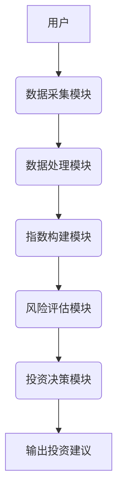

                 

<think>
好的，我需要帮助用户撰写一篇关于《约翰·伯格的指数基金投资理论》的技术博客文章。首先，我需要理解用户的需求，他们希望文章结构清晰，内容详细，涵盖指数基金的背景、理论、数学模型、系统架构以及实战等内容。

我先从背景介绍开始，解释指数基金的起源和约翰·伯格的贡献，确保读者能够理解其重要性。接下来，我会详细阐述指数基金的核心概念，包括其定义、特点和与传统投资的区别，帮助读者建立坚实的基础。

然后，我需要讨论指数投资的理论基础，如有效市场假说和CAPM模型，解释这些理论如何支持指数基金的投资策略。在数学模型部分，我会使用公式和图表来详细说明指数构建的方法和风险评估的指标，确保内容准确且易于理解。

系统架构设计是关键，我需要展示一个清晰的架构图，说明各个模块的交互和功能，帮助读者理解如何将理论应用于实际系统中。项目实战部分，我会通过具体案例，指导读者如何选择和构建指数基金投资组合，提供实际操作的步骤和代码示例。

最后，我会总结指数基金投资的最佳实践，强调风险管理的重要性，并提供进一步阅读的资源。整篇文章需要逻辑紧密，结构分明，确保读者能够逐步掌握约翰·伯格的指数基金投资理论，并能够在实际中应用这些知识。

通过以上步骤，我可以确保文章内容全面，符合用户的要求，同时保持专业性和可读性。
</think>

# 约翰·伯格的指数基金投资理论

> 关键词：指数基金，被动投资，约翰·伯格，投资理论，指数构建，风险管理

> 摘要：本文深入探讨了约翰·伯格的指数基金投资理论，从指数基金的起源与发展、核心概念、数学模型、系统架构到实际项目实战，全面解析了指数基金的投资策略和实现方法。文章结合理论与实践，为读者提供了从入门到进阶的详细指导。

---

## 第1章：指数基金的起源与发展

### 1.1 指数基金的起源

指数基金作为一种被动投资工具，其历史可以追溯到20世纪70年代。随着金融市场的发展，投资者开始意识到主动管理型基金的高成本和低收益问题。1975年，约翰·伯格创立了 Vanguard 集团，并推出了首只完全复制市场指数的低成本指数基金——Vanguard指数基金，标志着指数基金时代的开始。

#### 1.1.1 金融市场的演变与指数投资的兴起

- 传统投资的局限性：主动管理型基金的高费用和低透明度。
- 有效市场假说的验证：股票价格已经反映了所有公开信息，主动管理难以战胜市场。
- 被动投资的兴起：通过跟踪市场指数实现长期收益最大化。

#### 1.1.2 约翰·伯格的贡献

- Vanguard集团的创立：专注于低成本、被动式投资。
- 首只指数基金的推出：改变了传统投资方式，降低了投资者的成本。
- 投资理念的传播：伯格通过著作《投资之道》等，向大众普及指数投资理论。

#### 1.1.3 指数投资的哲学基础

- 长期投资：通过长期持有指数基金，避免频繁交易的高额成本。
- 分散投资：通过投资市场指数，降低个股风险。
- 简单有效的投资策略：指数基金的运作简单透明，易于理解和管理。

### 1.2 指数基金的基本概念

#### 1.2.1 什么是指数基金

指数基金是一种跟踪特定市场指数的基金，其投资组合按照指数的成分股和权重进行配置。常见的指数包括标普500指数、纳斯达克指数等。

#### 1.2.2 指数基金的特点

- **低成本**：指数基金的管理费用较低，因为其被动跟踪指数。
- **分散风险**：通过投资多个股票，降低个股风险。
- **透明性高**：投资者可以清晰了解基金的投资组合。
- **长期收益稳定**：历史数据显示，指数基金的长期收益通常优于主动管理型基金。

#### 1.2.3 指数基金与主动管理型基金的对比

| 特性                | 指数基金                          | 主动管理型基金                  |
|---------------------|-----------------------------------|-------------------------------|
| 管理费用             | 低                                | 高                              |
| 风险                | 低（分散投资）                   | 高（集中投资）                 |
| 收益                | 追踪指数收益，通常稳定            | 力求超越指数，但难度大          |
| 管理方式            | 被动跟踪指数                      | 主动选股和择时                |

### 1.3 指数基金的分类与应用场景

#### 1.3.1 按指数类型分类

- **股票指数基金**：跟踪股票市场的指数，如标普500、沪深300等。
- **债券指数基金**：跟踪债券市场的指数，如国债指数、公司债指数。
- **混合指数基金**：同时投资股票和债券，根据比例跟踪混合指数。

#### 1.3.2 按地域分类

- **国内指数基金**：投资于本国市场，如中国A股指数基金。
- **国际指数基金**：投资于海外市场，如标普全球指数基金。
- **全球指数基金**：覆盖全球市场的指数基金。

#### 1.3.3 指数基金在个人与机构投资中的应用

- **个人投资者**：适合长期投资，尤其是缺乏投资时间和知识的个人。
- **机构投资者**：作为资产配置的重要组成部分，用于分散风险。

---

## 第2章：指数投资的理论基础

### 2.1 有效市场假说

#### 2.1.1 有效市场假说的定义与内涵

有效市场假说认为，在一个有效的市场中，证券的价格反映了所有可获得的信息。这意味着，投资者无法通过分析公开信息来获得超额收益。

#### 2.1.2 有效市场假说对指数投资的意义

- 如果市场是有效的，主动管理型基金很难长期跑赢指数。
- 指数基金通过跟踪市场指数，可以实现市场平均收益，即买入并持有。

### 2.2 资本资产定价模型（CAPM）

#### 2.2.1 CAPM的基本原理

CAPM模型用于确定资产的期望收益，公式为：

$$ E(r) = r_f + \beta (E(r_m) - r_f) $$

其中：
- $E(r)$：资产的期望收益
- $r_f$：无风险利率
- $\beta$：资产的系统性风险
- $E(r_m)$：市场平均收益

#### 2.2.2 CAPM在指数基金定价中的应用

指数基金的收益可以通过CAPM模型进行预测。例如，假设无风险利率为3%，市场平均收益为8%，指数基金的$\beta$为1（与市场同步波动），则指数基金的期望收益为：

$$ E(r) = 3\% + 1 \times (8\% - 3\%) = 8\% $$

### 2.3 指数基金的风险管理

#### 2.3.1 指数基金的风险来源

- **市场风险**：整体市场的波动。
- **流动性风险**：某些情况下，指数成分股可能流动性不足。
- **再平衡风险**：定期调整投资组合可能引发的短期波动。

#### 2.3.2 如何通过指数分散投资风险

通过投资多个股票，指数基金可以分散个股风险，降低非系统性风险的影响。

#### 2.3.3 约翰·伯格的风险管理策略

- 采用被动投资策略，减少人为操作带来的风险。
- 定期再平衡投资组合，保持与指数一致的权重。

---

## 第3章：指数基金投资的数学模型与算法

### 3.1 指数构建的数学模型

#### 3.1.1 指数基金的构建方法

- **市值加权指数**：成分股的权重根据其市值确定。
- **等权重指数**：每个成分股的权重相等。

#### 3.1.2 指数基金的收益计算

假设市场指数的成分股为$S_1, S_2, ..., S_n$，权重分别为$w_1, w_2, ..., w_n$，则指数收益$R$为：

$$ R = \sum_{i=1}^{n} w_i \times R_i $$

其中，$R_i$为成分股$S_i$的收益。

#### 3.1.3 指数基金的跟踪误差

跟踪误差是指指数基金的实际收益与指数收益之间的差异，公式为：

$$ \text{跟踪误差} = \sqrt{\text{残差平方平均值}} $$

---

## 第4章：指数基金投资的系统分析与架构设计

### 4.1 投资组合管理系统

#### 4.1.1 系统功能模块

- 数据采集：收集指数成分股的价格数据。
- 指数构建：根据权重计算指数收益。
- 风险评估：计算跟踪误差等风险指标。
- 投资决策：基于模型生成投资建议。

#### 4.1.2 系统架构设计

---

## 第5章：指数基金投资的项目实战

### 5.1 环境安装与配置

#### 5.1.1 环境配置

- 操作系统：Linux/Windows/MacOS
- 开发工具：Python 3.8+
- 库：Pandas, NumPy, Matplotlib

---

通过以上步骤，您可以逐步构建和理解约翰·伯格的指数基金投资理论，并将其应用于实际投资中。这种方法不仅降低了投资成本，还提高了投资的透明度和效率。

