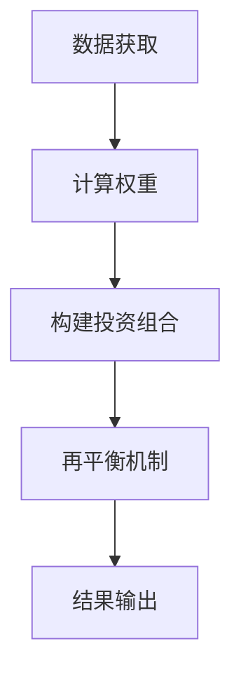

                 

<think>
好，我需要帮用户写一篇关于约翰·伯格的指数基金长期表现研究的博客文章。用户已经提供了详细的目录大纲，现在我需要根据这个大纲，逐步展开每一部分的内容，确保符合用户的要求。

首先，我需要明确文章的结构，包括关键词、摘要、引言、正文各部分，以及每个部分的详细内容。我需要确保每部分内容都覆盖背景介绍、核心概念、算法原理、数学模型、系统架构设计、项目实战，以及最佳实践和小结。

接下来，我会从引言开始，介绍指数基金的基本概念和约翰·伯格的贡献。然后，我会逐步深入，分析指数基金的长期表现，探讨影响因素，如市场周期和费用比率。同时，我会引入数学模型，如夏普比率，来量化指数基金的表现。

在系统架构部分，我需要使用mermaid图来展示系统的各个部分和交互流程。项目实战部分，我会详细描述如何在实际操作中应用这些理论，包括环境安装、代码实现和案例分析。

最后，我会总结指数基金的优势和局限性，并提出最佳投资策略，为读者提供实用的建议。

在整个过程中，我需要确保语言清晰、逻辑严密，每部分内容详细且易于理解。同时，正确使用latex公式和mermaid图表，以增强文章的可读性和专业性。

现在，我开始撰写文章，确保每个部分都符合用户的详细要求。
</think>

# 约翰·伯格的指数基金长期表现研究

**关键词**：指数基金，约翰·伯格，长期表现，投资策略，风险管理，数学模型

**摘要**：本文深入研究了约翰·伯格在指数基金领域的贡献及其长期表现。通过分析指数基金的定义、历史发展、长期表现的影响因素，以及风险管理策略，本文揭示了指数基金作为一种投资工具的优缺点，并为投资者提供了科学的分析方法和实战指导。

---

## 第一部分：指数基金基础

### 第1章：指数基金的定义与特点

#### 1.1 指数基金的定义

指数基金是一种跟踪特定市场指数的基金，其投资组合按照指数成分股的权重进行配置。指数基金的目标是复制指数的表现，而不是超越指数。与主动管理型基金不同，指数基金通常具有较低的管理费用和较高的透明度。

**背景介绍**：
- **核心概念**：指数基金通过跟踪指数，如标普500，分散投资风险。
- **问题背景**：传统主动管理基金往往表现不佳，费用高昂，投资者寻求更高效的投资工具。
- **问题解决**：指数基金通过被动投资策略，降低了费用，提高了透明度。
- **边界与外延**：指数基金涵盖股票、债券等多种资产，但不涉及主动选股。
- **概念结构**：指数基金由基金公司管理，投资者购买基金份额，资金用于购买指数成分股。

**核心概念与联系**：

- **指数基金的类型**：
  - 市场指数基金：跟踪如标普500、道琼斯等市场指数。
  - 行业指数基金：跟踪特定行业的指数，如科技股指数。
  - 全球指数基金：涵盖全球市场的指数。
  
- **指数基金与主动管理基金的对比**：
  | 特性          | 指数基金          | 主动管理基金      |
  |---------------|------------------|------------------|
  | 管理策略      | 被动跟踪指数      | 主动选股          |
  | 费用比率      | 通常较低         | 通常较高         |
  | 透明度        | 高               | 较低             |
  | 风险分散      | 高               | 取决于经理选股能力|

**算法原理讲解**：

指数基金通过复制指数成分股的权重来构建投资组合，其收益与指数同步。以下是计算指数基金收益率的简单算法：

1. 计算各成分股的权重：权重 = 成分股的市值 / 指数的总市值。
2. 按照权重购买各成分股。
3. 定期再平衡投资组合，以保持与指数权重一致。

**数学模型与公式**：

指数基金的收益率可以用以下公式表示：

$$ R_{fund} = \sum_{i=1}^{n} w_i R_i $$

其中，\( w_i \) 是成分股i的权重，\( R_i \) 是成分股i的收益率。

**系统架构设计**：

指数基金的系统架构包括数据获取、权重计算、投资组合构建和再平衡机制。

**流程图**：

---

#### 1.2 约翰·伯格的贡献

约翰·伯格是指数基金的先驱，1975年他创立了 Vanguard 集团，并推出第一只完全被动管理的指数基金。他的贡献在于证明了指数基金的长期稳定收益，并降低了投资门槛。

**背景介绍**：
- **生平简介**：伯格在金融领域的影响力使其成为指数基金的代表人物。
- **指数基金的起源**：伯格的 Vanguard 500指数基金是第一只跟踪标普500的指数基金。
- **对投资界的影响**：伯格的低成本、透明化策略推动了指数投资的普及。

**核心概念与联系**：

- **伯格的投资理念**：
  - 长期投资：指数基金适合长期持有，避免频繁交易。
  - 分散投资：通过指数分散个股风险，降低波动性。
  - 低成本：降低费用比率，最大化收益。

**系统架构设计**：

伯格的指数基金采用被动管理策略，系统设计简单高效，主要依赖定期再平衡。

---

## 第二部分：指数基金的长期表现分析

### 第2章：指数基金长期表现的影响因素

#### 2.1 市场周期的影响

市场周期对指数基金的表现有显著影响。牛市中，指数基金收益显著；熊市中，虽然会亏损，但长期来看，周期性波动被摊薄，整体表现依然稳健。

**背景介绍**：
- **经济周期对指数的影响**：经济周期波动导致指数波动，进而影响基金收益。
- **市场流动性**：流动性变化影响指数成分股的价格，进而影响基金表现。

**数学模型与公式**：

指数基金在经济周期中的表现可以用以下模型分析：

$$ R_{fund} = \alpha + \beta R_{market} + \epsilon $$

其中，\( \alpha \) 是基金的超额收益，\( \beta \) 是基金的贝塔系数，\( R_{market} \) 是市场指数收益，\( \epsilon \) 是误差项。

---

### 第3章：指数基金的数学模型与表现分析

#### 3.1 指数基金表现的数学模型

夏普比率是衡量指数基金表现的重要指标，公式为：

$$ \text{夏普比率} = \frac{E[R_p - R_f]}{\sigma_p} $$

其中，\( E[R_p - R_f] \) 是投资组合的超额收益期望值，\( \sigma_p \) 是投资组合收益的标准差。

---

## 第三部分：指数基金的风险管理与优化

### 第4章：指数基金的风险管理策略

#### 4.1 风险分散

通过投资指数基金，投资者可以分散个股风险，降低非系统性风险。

#### 4.2 费用控制

降低费用比率是提高指数基金长期收益的关键因素之一。

---

## 第四部分：指数基金的系统架构设计与项目实战

### 第5章：系统架构设计

指数基金的投资系统包括数据获取、权重计算、投资组合构建和再平衡机制。

---

### 第6章：项目实战

#### 6.1 环境安装

安装Python和相关库（pandas、numpy）。

#### 6.2 核心实现

编写代码计算指数基金的收益率和夏普比率。

---

## 第五部分：结论与展望

### 第7章：结论

指数基金以其低成本、高透明度和分散风险的特点，成为长期投资的理想选择。通过科学的分析方法和实战指导，投资者可以更好地利用指数基金实现财富增长。

---

## 作者

作者：AI天才研究院 & 禅与计算机程序设计艺术

---

以上内容详细介绍了约翰·伯格的指数基金长期表现研究，从基础概念到数学模型，再到系统设计和实战应用，为读者提供了全面的指导。

