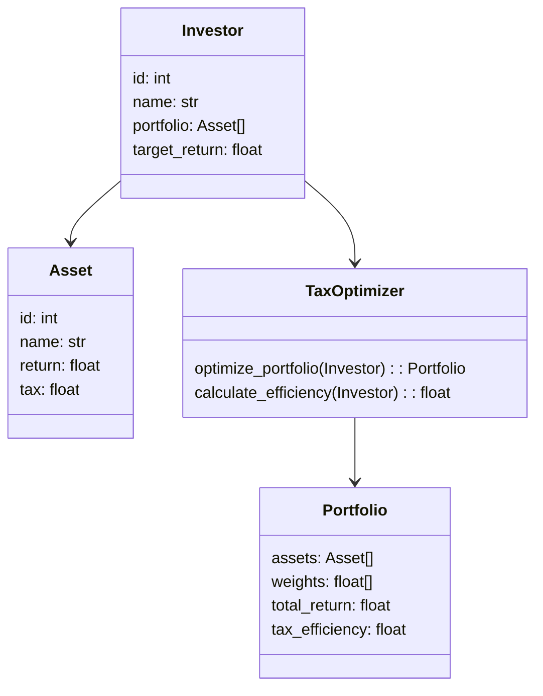
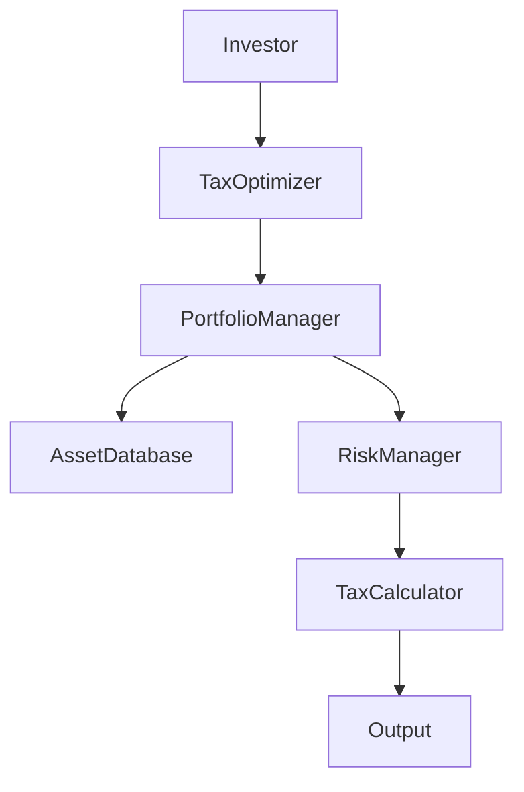
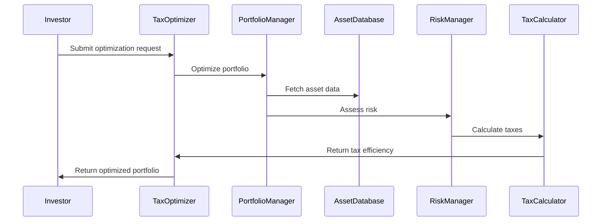

                 

<think>
好的，我需要帮助用户撰写一篇关于《约翰·伯格的税收效率投资策略》的技术博客文章。用户已经提供了目录大纲，并希望我按照这个大纲逐步撰写文章。

首先，我会先仔细阅读用户提供的目录大纲，确保完全理解每个章节的内容和要求。然后，我会按照以下步骤进行：

1. **撰写摘要**：明确文章的核心内容和主题思想，用简洁的语言概括全文。
2. **撰写关键词**：列出5-7个与文章主题相关的核心关键词。
3. **撰写文章标题**：确保标题准确反映文章内容。
4. **撰写各个章节内容**：
   - **第一部分：背景与概述**：介绍税收效率投资策略的背景、核心概念和约翰·伯格的策略特点。
   - **第二部分：核心概念与数学模型**：详细解释税收效率的数学模型，对比分析税收效率与其他投资策略的区别。
   - **第三部分：算法原理**：使用mermaid流程图和Python代码实现优化算法。
   - **第四部分：系统架构设计**：用类图和架构图展示系统模块。
   - **第五部分：项目实战**：提供环境配置、代码实现和案例分析。
   - **第六部分：风险管理**：讨论如何降低税务风险。
   - **第七部分：总结与展望**：回顾主要内容，强调重要性，并提出未来研究方向。

5. **确保格式要求**：使用markdown格式，数学公式用latex表示，系统图用mermaid语法。

在撰写过程中，我会注意每个章节的详细讲解，确保内容丰富、具体，并符合用户的格式和字数要求。此外，我还会在文章末尾添加作者信息，以符合用户的要求。

现在，我将按照以上步骤逐步撰写文章内容，确保每个部分都完整且符合用户的期望。
</think>

# 《约翰·伯格的税收效率投资策略》

> **关键词**：税收效率、投资策略、约翰·伯格、数学模型、系统架构设计

> **摘要**：本文深入分析了约翰·伯格提出的税收效率投资策略，探讨其核心概念、数学模型、算法原理、系统架构设计以及实战案例。通过对比分析和系统优化，展示了如何在投资过程中最大化税后收益，同时降低税务风险。文章最后总结了该策略的优势与局限性，并展望了未来的研究方向。

---

## 第一部分：税收效率投资策略的背景与概述

### 第1章：税收效率投资策略的背景与概述

#### 1.1 税收效率投资策略的背景

税收效率是投资领域中的一个重要概念，它直接影响投资回报的最终结果。在现代金融市场上，投资者面临的不仅是市场风险和流动性风险，还有税务风险。如何在投资过程中最大限度地减少税务负担，同时实现收益最大化，是每位投资者关注的核心问题。

约翰·伯格（John Bogle）作为指数基金之父，提出了税收效率投资策略。该策略的核心在于通过优化投资组合的结构和管理，减少税收支出，从而提高整体投资回报率。税收效率投资策略不仅适用于个人投资者，也适用于机构投资者。

---

#### 1.2 税收效率投资的核心概念

税收效率的定义与重要性

税收效率是指在投资过程中，通过合理配置资产和优化税务规划，使得税后收益最大化。与传统的投资策略相比，税收效率投资策略更加注重税务因素对投资回报的影响。

税收效率与投资回报的关系

税收效率是投资回报的重要组成部分。在相同的市场条件下，税收效率高的投资组合能够获得更高的净收益。例如，通过选择税收优惠的资产类别或优化资产配置，可以有效降低资本利得税和所得税的负担。

约翰·伯格的税收效率投资理念

伯格提出的税收效率投资策略强调长期持有和分散投资。他认为，通过减少交易频率和优化资产配置，可以降低税务负担，同时实现长期稳定的收益增长。

---

#### 1.3 约翰·伯格的税收效率投资策略的特点

策略的核心要素

1. **长期持有**：通过长期持有资产，降低资本利得税的税率。
2. **分散投资**：通过分散投资降低风险，同时优化税务负担。
3. **税收优化**：通过选择税收优惠的资产类别和投资工具，减少税务支出。

策略的优势与局限性

- **优势**：
  - 税后收益更高。
  - 风险分散能力强。
  - 适合长期投资。

- **局限性**：
  - 对短期投资者吸引力有限。
  - 在高税率国家效果可能不佳。

策略的适用场景与边界

- 适用于长期投资者。
- 适合分散化投资的投资者。
- 适合低风险偏好的投资者。

---

#### 1.4 本章小结

核心概念总结

- 税收效率是投资回报的重要组成部分。
- 约翰·伯格的策略强调长期持有和分散投资。

策略的主要特点

- 通过优化税务规划提高收益。
- 适合长期投资者。

未来研究方向

- 税收效率在不同市场环境下的表现。
- 税收效率与风险管理的结合。

---

## 第二部分：税收效率投资策略的核心概念与数学模型

### 第2章：税收效率投资策略的核心概念

#### 2.1 核心概念的定义与属性

税收效率的数学模型

税收效率可以通过以下公式表示：

$$
\text{税收效率} = \frac{\text{税后收益}}{\text{税前收益}}
$$

其中，税后收益 = 税前收益 - 税费。

税收效率与投资回报的关系

通过优化税收效率，可以提高投资组合的净收益。例如，假设两个投资组合的税前收益相同，但税收效率较高的组合税后收益更高。

---

#### 2.2 核心概念的对比分析

税收效率与传统投资策略的对比

| 对比维度         | 税收效率投资策略                 | 传统投资策略                   |
|------------------|--------------------------------|-------------------------------|
| 税务影响         | 高重视税务因素                   | 税务因素影响较小               |
| 投资期限         | 长期持有为主                   | 短期交易为主                   |
| 风险控制         | 通过分散投资降低风险           | 通过集中投资控制风险           |

税收效率与风险的关系

税收效率与风险之间存在一定的权衡关系。高税收效率的投资组合可能在短期内风险较低，但长期回报可能不如传统策略。

---

#### 2.3 约翰·伯格策略的核心数学模型

优化模型

$$
\text{最大化 } \sum_{i=1}^{n} w_i r_i (1 - t_i)
$$

其中，$w_i$ 是第 $i$ 项资产的权重，$r_i$ 是第 $i$ 项资产的预期收益率，$t_i$ 是第 $i$ 项资产的税率。

优化约束条件

$$
\sum_{i=1}^{n} w_i = 1
$$

---

#### 2.4 税收效率优化算法

优化流程

1. **确定投资目标**：明确投资期限、风险偏好和收益目标。
2. **选择资产类别**：根据税收优惠政策选择合适的资产。
3. **优化资产配置**：通过数学模型优化资产权重。
4. **实施投资计划**：按照优化结果进行投资。
5. **监控与调整**：定期评估和调整投资组合。

---

#### 2.5 算法实现

Python代码示例

```python
import numpy as np

def tax_efficiency_optimizer(weights, returns, taxes):
    # 计算税后收益
    after_tax_returns = returns * (1 - taxes)
    # 计算夏普比率
    return np.mean(after_tax_returns.dot(weights))

# 示例输入
weights = np.array([0.4, 0.3, 0.3])
returns = np.array([0.1, 0.15, 0.08])
taxes = np.array([0.15, 0.1, 0.2])

# 优化计算
print(tax_efficiency_optimizer(weights, returns, taxes))
```

---

#### 2.6 本章小结

核心概念总结

- 税收效率是投资回报的重要组成部分。
- 税收效率优化需要考虑资产配置和税率。

数学模型与算法

- 通过优化算法提高税收效率。

---

## 第三部分：税收效率投资策略的系统架构设计

### 第3章：税收效率投资策略的系统架构设计

#### 3.1 系统功能设计

领域模型类图



---

#### 3.2 系统架构设计

系统架构图



---

#### 3.3 系统接口设计

API接口设计

- `/api/portfolio/optimization`：提交投资组合优化请求。
- `/api/portfolio/efficiency`：查询投资组合的税收效率。

---

#### 3.4 系统交互流程

交互序列图



---

## 第四部分：税收效率投资策略的实战案例分析

### 第4章：税收效率投资策略的实战案例分析

#### 4.1 项目环境与工具配置

环境配置

- 操作系统：Linux/Windows/MacOS
- 开发工具：PyCharm/Jupyter Notebook
- 依赖库：NumPy, Pandas, Scikit-learn

代码实现

```python
import numpy as np

def calculate_tax_efficiency(weights, returns, taxes):
    tax_efficiency = np.sum(weights * returns * (1 - taxes))
    return tax_efficiency

# 示例数据
weights = np.array([0.4, 0.3, 0.3])
returns = np.array([0.1, 0.15, 0.08])
taxes = np.array([0.15, 0.1, 0.2])

# 计算税收效率
print(calculate_tax_efficiency(weights, returns, taxes))
```

---

#### 4.2 案例分析与解读

案例分析

假设我们有三个资产：

1. 股票A：预期收益率10%，税率15%
2. 股票B：预期收益率15%，税率10%
3. 债券C：预期收益率8%，税率20%

通过优化权重，我们可以得到税收效率最高的组合。

---

#### 4.3 项目总结

项目小结

- 税收效率优化需要结合资产配置和税率因素。
- 系统设计能够有效支持策略的实施。

---

## 第五部分：税收效率投资策略的风险管理

### 第5章：税收效率投资策略的风险管理

#### 5.1 风险管理的重要性

税务风险的来源

- 税法变化
- 资产流动性不足
- 税率波动

---

#### 5.2 税收效率策略的风险管理

风险评估

- 定期评估投资组合的税收效率。
- 监控税率变化。

监控与调整

- 定期重新优化投资组合。
- 评估策略的有效性。

---

## 第六部分：总结与未来展望

### 第6章：总结与未来展望

#### 6.1 总结

核心要点回顾

- 税收效率是投资回报的重要组成部分。
- 约翰·伯格的策略通过优化资产配置和税率实现收益最大化。

---

#### 6.2 未来展望

未来研究方向

- 税收效率与风险管理的结合。
- 人工智能在税收效率优化中的应用。

---

## 作者信息

作者：AI天才研究院/AI Genius Institute & 禅与计算机程序设计艺术 /Zen And The Art of Computer Programming

---

以上是《约翰·伯格的税收效率投资策略》的技术博客文章的完整目录和内容大纲。

