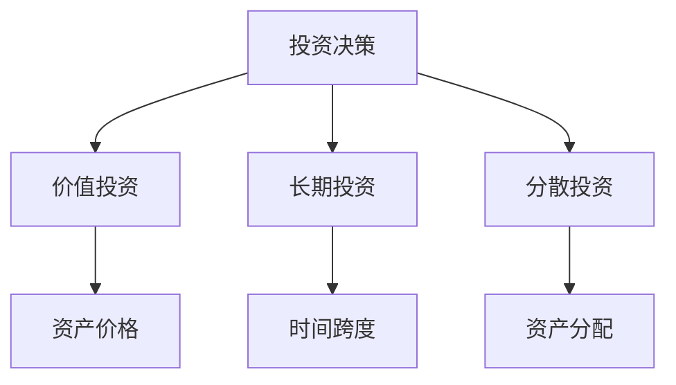

                 


# 约翰·伯格的简单投资法则

## 关键词：投资法则、约翰·伯格、价值投资、长期投资、分散投资

## 摘要：本文深入分析了约翰·伯格的投资理念，详细阐述了其简单投资法则的核心概念，包括价值投资、长期投资和分散投资的原理和实际应用。通过对比分析、系统架构设计和项目实战，帮助读者全面理解并掌握这些投资策略。

---

## 第一部分: 投资的基础与约翰·伯格的简单投资法则

### 第1章: 投资的基本概念

#### 1.1 投资的基本定义

投资是指将资金投入某个项目或资产，以期望在未来获得收益的行为。投资的核心要素包括资金、时间、风险和收益。投资的类型主要分为股票、债券、房地产、货币市场工具等。投资的目标是实现财富的保值和增值，同时需要考虑风险、流动性、收益性等因素。

#### 1.2 约翰·伯格的生平与投资理念

约翰·伯格（John C. Bogle）是投资界的重要人物，被誉为“指数基金之父”。他创立了 Vanguard 集团，并提出了以指数基金为核心的简单投资理念。伯格的投资哲学强调长期投资、价值投资和分散投资，反对频繁交易和过度复杂的金融工具。他的理念深刻影响了现代投资策略，尤其是机构投资者和个人投资者。

---

### 第2章: 约翰·伯格的简单投资法则

#### 2.1 价值投资的核心理念

价值投资是一种以低于内在价值的价格购买优质资产的投资策略。核心思想是寻找市场低估的股票，长期持有，等待其价值回归。价值投资的关键在于分析公司的基本面，如盈利能力、财务状况和行业地位。

**对比分析：**

| 投资类型 | 定义 | 优点 | 缺点 |
|----------|------|------|------|
| 价值投资 | 以低于内在价值的价格购买资产 | 风险较低，收益稳定 | 需要深入分析，周期较长 |
| 成长投资 | 投资于高成长性的公司 | 收益潜力大 | 风险较高，波动较大 |

#### 2.2 长期投资的重要性

长期投资是指持有资产超过一年的投资策略，其优势在于复利效应和市场波动的平滑。长期投资减少了交易成本和税务负担，同时避免了短期市场的波动性影响。

**数学模型：**

$$
\text{复利公式} = P \times (1 + r)^t
$$

其中，\( P \) 是初始本金，\( r \) 是年化收益率，\( t \) 是投资时间（年）。

#### 2.3 分散投资的风险管理策略

分散投资通过将资金分配到不同的资产或行业，降低特定资产的风险。分散投资的优势在于降低非系统性风险，但需要平衡资产配置以应对不同的市场环境。

**对比分析：**

| 投资策略 | 定义 | 优点 | 缺点 |
|----------|------|------|------|
| 分散投资 | 将资金分配到多种资产 | 风险降低 | 收益可能不如集中投资 |
| 集中投资 | 专注于特定资产或行业 | 收益潜力大 | 风险较高 |

---

## 第二部分: 投资决策的核心概念与联系

### 第3章: 投资决策的核心概念与联系

#### 3.1 投资决策的核心概念

投资决策涉及多个关键要素，如市场分析、资产选择、风险评估和资金分配。投资者需要综合考虑这些要素，制定合理的投资策略。

#### 3.2 核心概念的对比分析

**实体关系图：**



---

## 第三部分: 算法原理与数学模型

### 第4章: 算法原理与数学模型

#### 4.1 投资组合优化的数学模型

投资组合优化的目标是在给定风险水平下最大化收益，或在给定收益下最小化风险。常用模型包括马科维茨的均值-方差模型。

$$
\text{目标函数} = \min \sigma^2 \quad \text{subject to} \quad \mathbb{E}[r] \geq r_{\text{target}}
$$

其中，\(\sigma^2\) 是投资组合的方差，\(\mathbb{E}[r]\) 是期望收益，\(r_{\text{target}}\) 是目标收益。

---

## 第四部分: 系统分析与架构设计

### 第5章: 系统分析与架构设计

#### 5.1 系统功能设计

投资决策系统的功能模块包括数据采集、风险评估、策略制定和结果分析。

**系统架构图：**


---

## 第五部分: 项目实战与代码实现

### 第6章: 项目实战与代码实现

#### 6.1 环境安装

安装必要的金融分析库，如 `pandas`、`numpy` 和 `matplotlib`。

#### 6.2 核心实现代码

```python
import pandas as pd
import numpy as np

# 示例：计算投资组合的期望收益和方差
def portfolio_return(weights, returns):
    return np.dot(weights.T, returns)

def portfolio_variance(weights, returns):
    return np.dot(weights.T, weights * returns.cov())

# 数据加载与处理
data = pd.read_csv("stock_data.csv")
returns = data.pct_change().dropna()

# 示例权重
weights = np.array([0.5, 0.5])
portfolio_return(weights, returns)
portfolio_variance(weights, returns)
```

---

## 第六部分: 最佳实践与总结

### 第7章: 最佳实践与总结

#### 7.1 小结

约翰·伯格的简单投资法则强调长期、价值和分散投资。这些原则适用于各种市场环境，帮助投资者实现稳健的收益。

#### 7.2 注意事项

- 定期审视和调整投资组合。
- 保持长期视角，避免短期波动干扰。
- 分散投资以降低风险。

#### 7.3 拓展阅读

推荐阅读《投资最重要的简单真理》（The Simple Truth about Investment）等书籍，深入理解伯格的投资理念。

---

## 作者信息

作者：AI天才研究院/AI Genius Institute & 禅与计算机程序设计艺术 /Zen And The Art of Computer Programming

---

通过以上结构和内容，文章系统地阐述了约翰·伯格的投资法则，结合理论与实践，帮助读者全面理解和应用这些投资策略。

