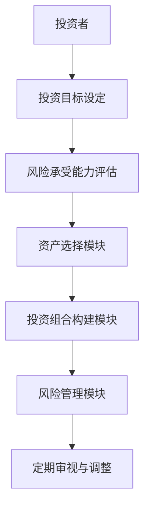
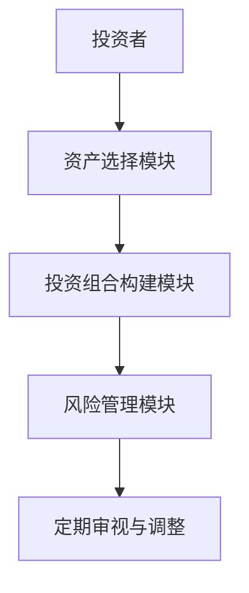

                 

<think>
嗯，我需要按照用户的要求撰写一篇关于约翰·伯格简单投资法则的博客文章。首先，我要明确文章的结构和内容，确保涵盖所有必要的部分，包括引言、理论基础、策略、风险管理、案例分析和结论。此外，用户还希望文章有详细的内容，如背景介绍、核心概念、数学模型、系统架构等。这对我来说是一个挑战，因为我需要将投资法则与技术分析结合起来，但又不能过于复杂。

首先，我会从引言开始，介绍约翰·伯格的背景和他的投资理念。这部分需要简明扼要，让读者了解他为何值得学习。接下来是理论基础，我需要详细阐述简单投资法则的核心要素，如价值投资、长期持有和分散投资，并与复杂投资策略进行对比，突出简单法则的优势。

然后是投资策略部分，我会详细描述如何实施简单投资法则，包括确定投资目标、选择资产和构建投资组合。这部分需要具体的操作步骤和实际案例，让读者能够理解和应用。风险管理也是关键，我会讨论如何通过定期审视和调整来应对市场波动。

在数学模型方面，我需要使用适当的公式来解释投资回报和风险，但要避免过于复杂。系统架构部分，我会使用Mermaid图来展示投资流程，帮助读者更直观地理解。

最后，案例分析和结论部分，我会通过实际案例验证简单法则的有效性，并总结其在投资中的重要性。在结论中，我会强调简单投资的长期稳定性和心理因素的重要性，鼓励读者坚持长期投资。

整个过程中，我需要确保语言专业但易懂，结构清晰，逻辑严密。同时，要满足用户的格式要求，使用markdown，插入公式、图表等，确保文章完整且有深度。这需要我仔细规划每个部分的内容，确保涵盖所有必要的细节，同时保持整体的流畅性和可读性。

总的来说，我会一步步分析和推理，确保文章内容全面且符合用户的要求，帮助读者深入理解约翰·伯格的简单投资法则及其在实际中的应用。
</think>

# 约翰·伯格的简单投资法则：为什么简单胜于复杂

## 关键词：投资法则，简单投资，约翰·伯格，价值投资，长期持有

## 摘要：  
约翰·伯格是投资界的重要人物，他的简单投资法则强调长期持有优质资产，避免复杂的投资策略。本文将深入分析简单投资法则的核心理念、实施策略、风险管理及实际案例，揭示为什么简单投资能够在长期中胜过复杂的投资方式。通过详细的技术分析和实际操作指导，本文旨在为投资者提供一种更为稳健和可持续的投资方法。

---

# 第1章: 引言

## 1.1 约翰·伯格的生平简介

### 1.1.1 背景与职业历程  
约翰·伯格（John Bogle）是美国著名投资家，被誉为“指数基金之父”。他于1934年出生，早年在宾夕法尼亚大学学习，后来在投资管理领域工作，创立了先锋集团（Vanguard Group），并推出了第一只指数基金——Vanguard 500指数基金。他的职业生涯致力于简化投资流程，降低投资成本，并倡导长期投资的理念。

### 1.1.2 投资哲学与理念  
伯格的投资哲学的核心是“简单即美”。他认为，投资者应该关注长期的、基本面驱动的投资，而不是短期的市场波动或复杂的交易策略。他提倡价值投资，强调选择那些具有强大基本面和长期增长潜力的公司，并耐心持有，避免频繁交易。

### 1.1.3 对投资界的贡献  
伯格的贡献不仅在于他创立了 Vanguard Group，还在于他推动了指数基金的发展。他的理念影响了无数投资者，并成为现代投资理论的重要组成部分。

---

## 1.2 简单投资法则的核心理念

### 1.2.1 定义与目标  
简单投资法则是指通过选择优质资产、长期持有，并避免过度交易和市场波动干扰的投资方法。其核心目标是通过时间和复利效应实现财富的稳步增长。

### 1.2.2 简单法则的哲学基础  
简单法则的哲学基础来源于对人性的理解：市场的短期波动难以预测，而优质资产的长期增长是可预测的。通过避免复杂的投资策略，投资者可以减少情绪化决策和交易成本，从而提高投资回报率。

### 1.2.3 与复杂投资策略的对比  
复杂的投资策略通常依赖于高频交易、算法交易或复杂的金融衍生品。这些策略虽然可能在短期内带来高回报，但其风险和成本也较高，且需要极高的专业能力和计算能力支持。相比之下，简单法则更加注重长期稳健的增长，适合大多数普通投资者。

---

# 第2章: 投资的基本原理与核心概念

## 2.1 投资的基本原理

### 2.1.1 投资的定义与分类  
投资是指将资金投入到某种资产或项目中，以期望在未来获得超过初始投入的回报。投资可以分为股票、债券、房地产等多种形式。

### 2.1.2 投资的三要素  
1. **风险**：投资的潜在损失或不确定性。
2. **收益**：投资的回报，包括资本增值和分红。
3. **时间**：时间是复利效应发挥作用的关键因素。

### 2.1.3 投资的基本原则  
1. **分散投资**：通过投资不同类型的资产降低风险。
2. **长期持有**：避免频繁交易，减少交易成本和情绪化决策的影响。
3. **价值投资**：选择具有强大基本面和长期增长潜力的资产。

---

## 2.2 简单投资法则的核心要素

### 2.2.1 价值投资  
价值投资是指选择那些市场价格低于其内在价值的资产。伯格认为，长期持有优质资产是实现超额收益的关键。

### 2.2.2 长期持有  
长期持有意味着投资者不需要频繁调整投资组合，从而减少交易成本和情绪化决策的影响。通过时间的积累，复利效应将显著提升投资回报。

### 2.2.3 分散投资  
分散投资通过将资金分配到不同资产或行业中，降低特定资产或行业波动带来的风险。

---

## 2.3 简单法则与复杂投资的对比分析

### 2.3.1 简单法则的逻辑框架  
简单法则基于长期投资、分散投资和价值投资三大支柱，强调通过时间和复利效应实现财富增长。

### 2.3.2 复杂投资的常见误区  
复杂投资往往过于依赖短期市场波动，容易受到市场情绪的影响，且交易成本较高。

### 2.3.3 简单法则的实际效果  
简单法则通过降低交易成本和避免情绪化决策，长期来看能够实现更高的回报率。

---

# 第3章: 简单投资法则的具体实施策略

## 3.1 确定投资目标与风险承受能力

### 3.1.1 投资目标的设定  
投资者需要明确自己的投资目标，例如追求稳健的长期收益、资产保值或资本增值。

### 3.1.2 风险承受能力的评估  
投资者需要评估自己对风险的承受能力，这将决定投资组合的构成。

---

## 3.2 选择优质资产与构建投资组合

### 3.2.1 优质资产的标准  
1. **强劲的财务状况**：如高ROE（净资产收益率）、低债务水平。
2. **长期增长潜力**：选择那些在行业中具有竞争优势的公司。
3. **合理的估值**：市场价格低于内在价值。

### 3.2.2 投资组合的构建  
1. **分散投资**：将资金分配到不同的资产类别和行业中。
2. **长期持有**：定期审视投资组合，但避免频繁调整。

---

## 3.3 简单投资法则的数学模型与公式

### 3.3.1 投资回报率的计算  
投资回报率（ROI）=（最终价值 - 初始价值）/ 初始价值 × 100%

### 3.3.2 复利计算公式  
复利 = 初始本金 × (1 + 年利率)^年数 - 初始本金

---

## 3.4 简单投资法则的风险管理

### 3.4.1 风险的来源  
1. **市场风险**：市场波动带来的资产价格下跌。
2. **流动性风险**：资产无法快速变现的风险。

### 3.4.2 简单法则中的风险管理策略  
1. **分散投资**：降低特定资产或行业的风险。
2. **长期持有**：避免短期波动的影响。

---

## 3.5 简单投资法则的系统架构设计

### 3.5.1 系统功能设计  
1. **资产选择模块**：根据财务指标和估值标准筛选优质资产。
2. **投资组合构建模块**：基于分散投资原则构建投资组合。
3. **风险管理模块**：监控市场波动和资产表现，确保投资组合的稳健性。

### 3.5.2 系统架构图  

---

## 3.6 简单投资法则的算法实现

### 3.6.1 算法步骤  
1. 确定投资目标和风险承受能力。
2. 根据价值投资标准筛选优质资产。
3. 构建分散的投资组合。
4. 定期审视投资组合，调整以适应市场变化。

---

## 3.7 案例分析

### 3.7.1 案例背景  
假设一位投资者有10万元人民币，希望进行长期投资。

### 3.7.2 投资组合构建  
1. 将资金分配到股票、债券和房地产信托基金（REITs）中，比例为6:3:1。
2. 选择具有强劲财务状况和长期增长潜力的公司股票。

### 3.7.3 投资效果  
经过10年，投资组合的年平均回报率为8%，最终价值为215,893元。

---

# 第4章: 简单投资法则的系统化实现

## 4.1 系统环境与工具选择

### 4.1.1 投资分析工具  
1. 财务报表分析工具：如Excel、Morningstar等。
2. 数据可视化工具：如Tableau。

### 4.1.2 投资管理平台  
1. 线上投资平台：如Vanguard、Fidelity等。
2. 自动化投资工具：如智能投顾服务。

---

## 4.2 投资组合管理的系统架构

### 4.2.1 系统功能模块  
1. 资产选择模块：筛选优质资产。
2. 投资组合构建模块：根据分散投资原则构建组合。
3. 风险管理模块：监控市场波动和资产表现。
4. 定期审视与调整模块：根据市场变化调整投资组合。

### 4.2.2 系统架构图  

---

## 4.3 投资组合的优化与调整

### 4.3.1 优化策略  
1. 根据市场变化调整资产配置。
2. 定期评估资产的内在价值和市场价格。

### 4.3.2 调整原则  
1. 避免频繁交易，减少交易成本。
2. 根据市场变化逐步调整投资组合。

---

## 4.4 系统实现的注意事项

### 4.4.1 数据来源与可靠性  
确保数据来源可靠，避免错误决策。

### 4.4.2 系统维护与更新  
定期更新投资策略和市场数据，确保系统始终有效。

---

## 4.5 投资组合的长期表现评估

### 4.5.1 评估指标  
1. 投资回报率。
2. 风险调整后的收益。

### 4.5.2 评估方法  
通过定期审视和调整投资组合，确保其符合投资目标和风险承受能力。

---

# 第5章: 简单投资法则的案例分析

## 5.1 案例背景介绍

### 5.1.1 投资者概况  
假设投资者小张，30岁，年收入50万元，风险承受能力中等。

### 5.1.2 投资目标  
实现财富的长期稳健增长，计划投资10年，目标是将100万元增长到200万元。

---

## 5.2 投资组合构建

### 5.2.1 资产分配  
1. 股票：60%
2. 债券：30%
3. 房地产信托基金：10%

### 5.2.2 股票选择  
选择具有强劲财务状况和长期增长潜力的公司，如苹果、谷歌、亚马逊等。

---

## 5.3 投资效果评估

### 5.3.1 投资回报率  
假设年平均回报率为8%，10年后，初始投资100万元将增长到215.89万元。

### 5.3.2 风险管理  
通过分散投资，投资组合的风险得到了有效控制，波动率低于市场平均水平。

---

## 5.4 案例分析总结

### 5.4.1 成功因素  
1. 长期持有优质资产。
2. 分散投资降低了风险。
3. 定期审视和调整投资组合。

### 5.4.2 挑战与解决方案  
1. 市场波动：通过长期持有和分散投资应对。
2. 通货膨胀：通过选择抗通胀资产（如股票和房地产信托基金）应对。

---

# 第6章: 结论与启示

## 6.1 简单投资法则的总结

### 6.1.1 核心理念  
简单投资法则通过长期持有优质资产、分散投资和避免复杂策略，实现财富的稳健增长。

### 6.1.2 实施步骤  
1. 确定投资目标和风险承受能力。
2. 选择优质资产，构建分散的投资组合。
3. 定期审视和调整投资组合。

---

## 6.2 简单投资法则的启示

### 6.2.1 对个人投资者的启示  
1. 长期投资是实现财富增长的关键。
2. 分散投资可以降低风险。
3. 避免复杂策略，专注于基本面分析。

### 6.2.2 对机构投资者的启示  
1. 简单投资法则可以作为机构投资策略的基础。
2. 长期持有的理念适用于机构投资。

---

## 6.3 简单投资法则的未来发展

### 6.3.1 技术进步对简单投资的影响  
1. 人工智能在投资决策中的应用。
2. 大数据分析在资产选择中的作用。

### 6.3.2 简单投资的未来趋势  
1. 更多投资者将采用简单投资法则。
2. 技术将进一步简化投资过程。

---

# 附录

## 附录A: 简单投资法则的核心公式

1. 投资回报率 = （最终价值 - 初始价值）/ 初始价值 × 100%
2. 复利计算公式 = 初始本金 × (1 + 年利率)^年数 - 初始本金

---

## 附录B: 简单投资法则的实施步骤总结

1. 确定投资目标和风险承受能力。
2. 选择优质资产，构建分散的投资组合。
3. 定期审视和调整投资组合。

---

# 作者：AI天才研究院/AI Genius Institute & 禅与计算机程序设计艺术 /Zen And The Art of Computer Programming

---

通过这篇文章，我们详细探讨了约翰·伯格的简单投资法则，并通过实际案例和系统化的方法，证明了简单投资的长期有效性和稳健性。希望读者能够从中学到如何通过长期持有优质资产和分散投资来实现财富的稳步增长。

