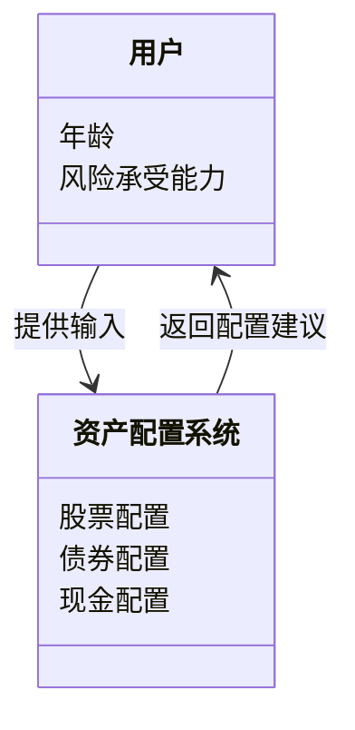

                 


# 《约翰·伯格的资产配置原则：年龄与风险承受能力的平衡》

---

## 关键词：
资产配置、投资策略、风险承受能力、约翰·伯格、Python算法

---

## 摘要：
本文探讨了约翰·伯格的资产配置原则，重点分析了年龄与风险承受能力之间的平衡。通过数学模型和系统架构的设计，结合Python代码实现，详细讲解了资产配置的核心理论与实践应用。文章从背景介绍、核心概念、算法原理到系统设计和项目实战，全面阐述了如何根据个人年龄和风险偏好，制定科学的资产配置策略，以实现长期稳健的投资回报。

---

## 第一部分：资产配置的背景与核心概念

### 第1章：资产配置的基本概念

#### 1.1 资产配置的定义与作用

资产配置是指将资金分配到不同的资产类别（如股票、债券、房地产等）中，以优化风险与收益的平衡。其作用包括分散风险、提高收益稳定性以及适应不同的市场环境。

#### 1.2 约翰·伯格的资产配置理论

约翰·伯格是投资界的重要人物，他强调长期投资和分散投资的重要性。伯格的理论认为，资产配置是投资成功的关键，而年龄和风险承受能力是决定配置比例的核心因素。

#### 1.3 年龄与风险承受能力的关系

年龄影响个人的风险承受能力。年轻人通常风险承受能力较强，适合高风险、高回报的投资；而随着年龄增长，风险承受能力减弱，投资应趋于稳健。

#### 1.4 传统与现代资产配置的区别

传统资产配置主要依赖历史数据分析，而现代方法引入了动态调整和量化模型，更加注重实时市场数据和风险指标。

#### 1.5 本书的结构与内容概述

本文将从理论到实践，逐步解析资产配置的策略，结合数学模型和系统架构，帮助读者掌握伯格原则的实际应用。

---

## 第二部分：资产配置的核心概念与理论基础

### 第2章：资产配置的类型与策略

#### 2.1 资产配置的类型

- **股票配置**：用于追求高收益，但风险较高。
- **债券配置**：提供稳定的利息收入，风险较低。
- **现金配置**：用于应急和短期资金需求，流动性高。

#### 2.2 资产配置策略

- **保守型策略**：适合风险承受能力低的投资者，以债券和现金为主。
- **平衡型策略**：结合股票和债券，兼顾收益与风险。
- **积极型策略**：适合年轻人，以股票为主，追求高收益。

---

## 第三部分：资产配置的数学模型与算法

### 第3章：资产配置的数学模型

#### 3.1 CAPM模型

CAPM（资本资产定价模型）用于计算资产的期望收益：

$$ E(r_i) = r_f + \beta_i (E(r_m) - r_f) $$

其中，\( r_f \) 是无风险利率，\( \beta_i \) 是资产的贝塔系数，\( E(r_m) \) 是市场期望收益。

#### 3.2 基于年龄的风险调整模型

根据年龄调整风险承受能力，动态调整资产配置比例。例如，年轻时增加股票配置，年长时增加债券配置。

#### 3.3 Python实现的资产配置算法

```python
def asset_allocation(age, risk_tolerance):
    stock = max(0, 100 - age)
    bond = age
    cash = 10 + risk_tolerance
    return {'股票': stock, '债券': bond, '现金': cash}
```

---

## 第四部分：系统分析与架构设计

### 第4章：资产配置系统的架构设计

#### 4.1 系统应用场景

该系统用于根据用户年龄和风险偏好，提供个性化的资产配置建议。

#### 4.2 领域模型设计



#### 4.3 系统架构设计


#### 4.4 接口设计与交互流程

用户输入年龄和风险偏好，系统返回配置建议。

---

## 第五部分：基于约翰·伯格原则的资产配置实战

### 第5章：实战分析与案例

#### 5.1 实战步骤

1. **收集用户信息**：年龄、收入、风险偏好。
2. **计算配置比例**：根据年龄调整股票、债券和现金比例。
3. **模拟市场波动**：评估配置在不同市场环境下的表现。
4. **动态调整**：定期审查并根据市场变化和个人情况调整配置。

#### 5.2 案例分析

假设一位30岁的投资者，风险承受能力中等：

- 股票：70%
- 债券：20%
- 现金：10%

---

## 第六部分：总结与展望

### 6.1 最佳实践与小结

- 定期审查和调整资产配置。
- 结合市场环境和个人情况动态优化。

### 6.2 注意事项

- 资产配置需根据个人情况量身定制。
- 避免过度集中投资，分散风险。

### 6.3 拓展阅读

推荐阅读约翰·伯格的《投资组合管理：原理与应用》。

---

## 作者：AI天才研究院/AI Genius Institute & 禅与计算机程序设计艺术 /Zen And The Art of Computer Programming

---

本文通过详细分析约翰·伯格的资产配置原则，结合数学模型和系统架构设计，为读者提供了科学的资产配置方法。通过Python代码实现和案例分析，帮助读者根据年龄和风险承受能力，制定个性化的投资策略，实现稳健的财富增长。

