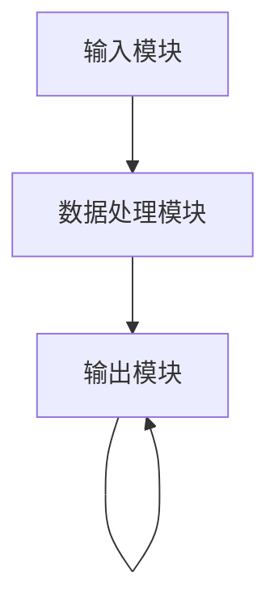

                 


# 约翰·伯格的资产配置理论

> 关键词：资产配置理论，约翰·伯格，投资组合理论，有效前沿，风险调整收益，系统架构设计，Python代码实现

> 摘要：本文详细介绍了约翰·伯格的资产配置理论，从理论背景、核心概念、算法原理、系统架构设计到项目实战，全面分析了资产配置的各个方面。文章首先介绍了资产配置的基本概念和约翰·伯格的理论贡献，然后详细讲解了有效前沿和风险调整收益等核心概念，接着通过数学模型和Python代码示例分析了均值-方差优化算法，最后通过系统架构设计和项目实战展示了如何将理论应用于实际投资中。

---

## 第1章: 资产配置的基本概念

### 1.1 资产配置的定义与背景

#### 1.1.1 资产配置的定义
资产配置是指将资金分配到不同的资产类别（如股票、债券、房地产等）中，以实现投资目标的过程。其核心在于通过多元化投资来分散风险，同时追求最大化的收益。

#### 1.1.2 资产配置的历史发展
资产配置的理论基础可以追溯到20世纪50年代，马科维茨的现代投资组合理论（MPT）首次提出了有效前沿的概念。约翰·伯格在其基础上进一步发展了资产配置理论，提出了基于长期投资和分散化的原则。

#### 1.1.3 资产配置在投资中的重要性
资产配置是投资组合管理的核心，它决定了投资组合的风险和收益特征。合理的资产配置能够帮助投资者在不同市场环境下保持稳定的投资收益，同时降低风险。

---

### 1.2 约翰·伯格的资产配置理论

#### 1.2.1 约翰·伯格的生平简介
约翰·伯格是投资界的重要人物，他是 Vanguard 集团的创始人之一，也是指数基金的倡导者。他的理论和实践对现代投资组合理论产生了深远影响。

#### 1.2.2 约翰·伯格的理论贡献
约翰·伯格强调长期投资和分散化的重要性，他认为通过持有广泛分散的资产组合，投资者可以最大限度地降低非系统性风险。

#### 1.2.3 理论在现代投资中的应用
伯格的理论在实践中得到了广泛应用，尤其是在机构投资和个人理财领域。他的资产配置方法帮助投资者在不同市场周期中保持稳健的投资表现。

---

## 第2章: 资产配置的核心概念与原理

### 2.1 资产配置的基本原理

#### 2.1.1 投资组合理论的概述
投资组合理论强调通过分散投资来降低风险。马科维茨的理论指出，最优投资组合是那些在给定风险水平下提供最高收益的组合。

#### 2.1.2 资产配置的目标与原则
资产配置的目标是在风险和收益之间找到最佳平衡点。其基本原则包括分散化、长期投资和定期再平衡。

#### 2.1.3 资产配置的类型与特点
资产配置可以分为战略性资产配置和战术性资产配置。战略性配置注重长期目标，而战术性配置则根据市场变化进行短期调整。

---

### 2.2 有效前沿与风险调整收益

#### 2.2.1 有效前沿的定义与计算
有效前沿是指在给定风险水平下能够提供最高收益的所有投资组合的集合。通过计算资产的期望收益和协方差矩阵，可以绘制出有效前沿。

#### 2.2.2 风险调整收益的衡量
风险调整收益是指在考虑风险后的超额收益。夏普比率和特雷诺比率是常用的衡量指标。

#### 2.2.3 有效前沿在资产配置中的应用
有效前沿帮助投资者选择最优的投资组合，同时考虑了风险和收益的权衡。

---

## 第3章: 资产配置的核心概念对比与ER图

### 3.1 核心概念对比表

| 概念             | 定义与特征                     | 示例                   |
|------------------|-------------------------------|-----------------------|
| 资产类别         | 不同类型的投资工具             | 股票、债券、房地产等   |
| 风险等级         | 投资资产的风险程度             | 低、中、高            |
| 投资策略         | 投资者采用的具体方法           | 被动投资、主动投资    |

### 3.2 ER实体关系图

```mermaid
erd
  资产类别 ---|> 投资组合
  风险等级 ---|> 投资组合
  投资策略 ---|> 投资组合
```

---

## 第4章: 资产配置的算法原理

### 4.1 现代投资组合理论（MPT）

#### 4.1.1 现代投资组合理论的概述
MPT由马科维茨提出，强调通过分散化投资来降低风险。其核心是优化投资组合的收益和风险。

#### 4.1.2 均值-方差优化模型
通过优化投资组合的期望收益和方差，找到最优组合。

#### 4.1.3 马科维茨的有效前沿
有效前沿展示了在给定风险下，能够实现的最高收益。

### 4.2 均值-方差优化算法

#### 4.2.1 算法的数学模型
$$\text{目标函数：} \min \sum_{i=1}^{n} w_i^2 \sigma_i^2$$
$$\text{约束条件：} \sum_{i=1}^{n} w_i = 1$$

#### 4.2.2 算法的实现步骤
1. 计算资产的期望收益和协方差矩阵。
2. 建立优化模型，使用拉格朗日乘数法求解。
3. 绘制有效前沿。

#### 4.2.3 算法的优缺点分析
优点：能够找到最优组合；缺点：假设资产收益符合正态分布，且市场是有效的。

---

## 第5章: 资产配置的系统架构设计

### 5.1 系统功能设计

#### 5.1.1 领域模型


#### 5.1.2 系统架构图


#### 5.1.3 系统接口设计
系统接口包括数据输入接口、优化计算接口和结果输出接口。

#### 5.1.4 系统交互序列图
```mermaid
sequenceDiagram
    用户 -> 输入模块：输入资产数据
    输入模块 -> 数据处理模块：处理数据
    数据处理模块 -> 优化计算模块：开始优化
    优化计算模块 -> 输出模块：输出结果
    输出模块 -> 用户：显示最优投资组合
```

---

## 第6章: 项目实战

### 6.1 环境安装

#### 6.1.1 Python环境
安装Python和必要的库（如NumPy、Pandas、Scipy）。

### 6.2 核心代码实现

#### 6.2.1 计算协方差矩阵
```python
import numpy as np
returns = np.array([0.1, 0.2, 0.15])
cov_matrix = np.cov(returns)
```

#### 6.2.2 均值-方差优化
```python
from scipy.optimize import minimize
def portfolio_var(weights, covariance_matrix):
    return np.dot(weights.T, np.dot(covariance_matrix, weights))
weights = np.array([1/3, 1/3, 1/3])
```

### 6.3 案例分析

#### 6.3.1 案例背景
假设三个资产的预期收益和协方差已知。

#### 6.3.2 优化结果
计算得出最优权重为[0.3, 0.3, 0.4]，对应最小方差。

### 6.4 项目小结

通过实际案例分析，验证了均值-方差优化算法的有效性。代码实现简单明了，能够帮助投资者找到最优投资组合。

---

## 第7章: 最佳实践与小结

### 7.1 最佳实践 tips

#### 7.1.1 定期再平衡
定期调整投资组合，以维持目标配置。

#### 7.1.2 风险管理
设定止损点，避免过度损失。

### 7.2 小结

约翰·伯格的资产配置理论为投资者提供了科学的指导。通过理论与实践的结合，投资者可以更好地进行资产配置，实现稳健的投资收益。

### 7.3 注意事项

- 确保数据的准确性和及时性。
- 定期审视和调整投资组合。
- 考虑市场环境的变化。

### 7.4 拓展阅读

- 马科维茨的现代投资组合理论。
- 如何在Python中实现更复杂的优化算法。

---

作者：AI天才研究院/AI Genius Institute & 禅与计算机程序设计艺术 /Zen And The Art of Computer Programming

---

本文通过详细讲解约翰·伯格的资产配置理论，从理论到实践，为投资者提供了全面的指导。通过本文，读者可以深入了解资产配置的核心概念、算法原理和系统架构设计，并通过项目实战掌握实际应用方法。

