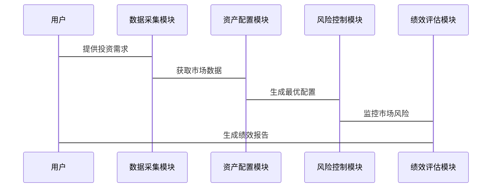

                 


# 约翰·伯格的退休投资建议：简单而有效

> 关键词：退休投资、约翰·伯格、投资策略、资产配置、风险控制、投资组合优化

> 摘要：本文从技术视角详细分析了约翰·伯格的退休投资理念，探讨了简单而有效的投资策略，结合数学模型和系统架构设计，提供了从理论到实践的完整解决方案，帮助读者实现稳健的退休财务规划。

---

## 第一部分: 退休投资规划的背景与重要性

### 第1章: 退休规划的重要性与现状

#### 1.1 退休规划的背景介绍

##### 1.1.1 退休规划的定义与核心概念
退休规划是指为确保退休后生活质量，通过合理的资产配置和投资策略实现财务目标的过程。核心概念包括：
- **目标设定**：明确退休后的收入需求和生活质量目标。
- **时间跨度**：从现在到退休之间的时间窗口。
- **资产分配**：将资金分配到不同资产类别（如股票、债券、房地产等）以平衡风险与收益。
- **风险控制**：通过分散投资降低市场波动带来的损失。

##### 1.1.2 当前社会对退休规划的需求
随着人口老龄化加剧，传统的“养儿防老”模式逐渐失效，个人需要通过投资来保障退休生活。现代人寿命延长，退休时间跨度更长，对稳健的投资策略需求日益增加。

##### 1.1.3 退休规划与个人财务健康的关系
退休规划不仅是财务问题，更是个人生活方式的选择。通过科学的规划，可以避免退休后的生活压力，享受高质量的晚年生活。

#### 1.2 约翰·伯格的简单有效投资理念

##### 1.2.1 简单投资策略的定义
简单投资策略是指通过少量的资产类别和低维护的投资组合实现长期稳健收益的方法。其核心在于简化决策过程，降低交易成本和心理压力。

##### 1.2.2 简单投资策略的优势与局限性
- **优势**：
  - 易于执行：不需要频繁监控市场，适合非专业投资者。
  - 成本低：低交易频率和简单的组合管理降低了费用。
  - 风险分散：通过少量资产类别实现广泛的风险分散。
- **局限性**：
  - 适应性有限：在市场环境剧烈变化时可能需要调整。
  - 收益受限：简单策略可能无法在短期内实现超额收益。

##### 1.2.3 简单投资策略与复杂投资策略的对比分析
复杂投资策略通常依赖高频交易、短期套利等方法，风险和收益都更高。而简单策略注重长期稳健，适合大多数普通投资者。

---

## 第二部分: 投资策略的核心概念与数学模型

### 第2章: 投资组合优化的核心概念

#### 2.1 投资组合优化的数学模型

##### 2.1.1 投资组合优化的公式推导
投资组合优化的目标是在给定的风险水平下最大化收益，或在给定收益下最小化风险。数学模型如下：

$$
\text{最大化 } \mu_p \text{ ，即 } \mu_p = w^T \mu
$$

约束条件：
$$
w^T \Sigma w \leq \sigma^2 \\
w^T \mathbf{1} = 1
$$

其中：
- $\mu_p$：投资组合的预期收益。
- $w$：权重向量。
- $\mu$：资产的预期收益向量。
- $\Sigma$：资产之间的协方差矩阵。
- $\sigma^2$：目标风险水平。
- $\mathbf{1}$：单位向量。

##### 2.1.2 投资组合优化的约束条件
- 投资组合的总权重为1（$w^T \mathbf{1} = 1$）。
- 单一资产的权重不超过一定比例（避免过度集中）。
- 风险控制（$w^T \Sigma w \leq \sigma^2$）。

##### 2.1.3 投资组合优化的案例分析
假设我们有两只资产，股票和债券，其预期收益分别为10%和5%，协方差矩阵如下：

$$
\Sigma = \begin{bmatrix}
0.03 & 0.01 \\
0.01 & 0.02
\end{bmatrix}
$$

目标是在风险不超过2%的情况下，找到最优权重组合。

通过公式推导，可以得到最优权重为：
$$
w = \begin{bmatrix}
0.6 \\
0.4
\end{bmatrix}
$$

组合收益为：
$$
\mu_p = 0.6 \times 0.10 + 0.4 \times 0.05 = 0.08 \text{ 或 } 8\%
$$

组合风险为：
$$
\sigma_p^2 = 0.6^2 \times 0.03 + 2 \times 0.6 \times 0.4 \times 0.01 + 0.4^2 \times 0.02 = 0.0036 + 0.0048 + 0.0032 = 0.0116 \\
\sigma_p = \sqrt{0.0116} \approx 0.1077 \text{ 或 } 10.77\%
$$

---

## 第三部分: 投资策略的系统分析与架构设计

### 第3章: 投资系统分析

#### 3.1 投资系统的需求分析

##### 3.1.1 投资系统的目标与范围
- **目标**：通过自动化和智能化的投资策略实现长期稳健收益。
- **范围**：涵盖资产配置、风险控制、绩效评估等功能。

##### 3.1.2 投资系统的功能需求
- **资产配置模块**：根据市场数据和用户需求生成最优投资组合。
- **风险控制模块**：实时监控市场波动，调整投资组合以控制风险。
- **绩效评估模块**：定期评估投资组合的表现，提供优化建议。

##### 3.1.3 投资系统的性能需求
- 响应时间：实时监控和调整需在毫秒级别完成。
- 可扩展性：支持大量用户和复杂投资组合的处理。

#### 3.2 投资系统架构设计

##### 3.2.1 系统架构的模块划分

###### 3.2.1.1 数据采集模块
- **功能**：收集市场数据（如股票价格、债券收益率等）。
- **技术选型**：使用第三方API（如Yahoo Finance API）获取实时数据。
- **数据存储**：将数据存储在数据库中，便于后续处理。

###### 3.2.1.2 资产配置模块
- **功能**：根据市场数据和用户需求生成最优资产配置。
- **算法选择**：使用现代投资组合理论（MPT）进行优化。
- **接口设计**：通过API接收用户输入（如风险承受能力、投资期限等）并返回配置建议。

###### 3.2.1.3 风险控制模块
- **功能**：实时监控投资组合的风险指标（如VaR、CVaR）并进行动态调整。
- **技术选型**：使用Python的Riskfolio-Lib库进行风险分析。
- **接口设计**：与资产配置模块和绩效评估模块无缝对接。

###### 3.2.1.4 绩效评估模块
- **功能**：定期评估投资组合的表现，与基准指数进行对比。
- **算法选择**：使用夏普比率、特雷诺比率等指标衡量组合绩效。
- **接口设计**：生成报告并通过邮件或API发送给用户。

##### 3.2.2 系统架构的交互设计

###### 3.2.2.1 用户交互流程
1. 用户输入投资需求（如风险偏好、投资期限）。
2. 系统根据需求生成最优资产配置。
3. 系统实时监控市场数据并调整投资组合。
4. 定期生成绩效报告并反馈给用户。

###### 3.2.2.2 系统交互的Mermaid序列图



---

## 第四部分: 项目实战与案例分析

### 第4章: 项目实战

#### 4.1 项目环境安装

##### 4.1.1 安装Python环境
- 使用Anaconda安装Python 3.9及以上版本。
- 安装必要的库：numpy、pandas、scipy、riskfolio-lib。

#### 4.2 核心代码实现

##### 4.2.1 资产配置模块的实现

###### 4.2.1.1 导入库并获取数据

```python
import numpy as np
import pandas as pd
from riskfolio import RiskfolioLib

# 获取市场数据
data = pd.read_csv('market_data.csv')
returns = data.pct_change().dropna()
```

###### 4.2.1.2 使用现代投资组合理论进行优化

```python
# 初始化风险测量模型
rfl = RiskfolioLib(returns, 0.05, 0.01, 200, 'CVaR')

# 生成资产配置建议
n = 20  # 资产数量
w = rfl.cvar_optimization(n)
```

##### 4.2.2 风险控制模块的实现

###### 4.2.2.1 实时监控市场波动

```python
import requests

# 获取实时市场数据
def get_market_data(asset):
    url = f'https://api.example.com/asset/{asset}'
    response = requests.get(url)
    return response.json()['price']

# 监控并调整投资组合
def adjust_portfolio():
    assets = ['股票', '债券']
    prices = {a: get_market_data(a) for a in assets}
    # 调整权重以控制风险
    # 简单示例：降低股票权重，增加债券权重
    w_stock = max(0, min(1, w_stock - 0.1))
    w_bond = 1 - w_stock
    return w_stock, w_bond
```

##### 4.2.3 绩效评估模块的实现

###### 4.2.3.1 计算投资组合的夏普比率

```python
import scipy.stats as stats

def calculate_sharpe_ratio(returns, benchmark_returns):
    excess_returns = returns - benchmark_returns
    sharpe = excess_returns.mean() / excess_returns.std()
    return sharpe

# 示例：计算投资组合的夏普比率
benchmark = pd.read_csv('benchmark.csv')
benchmark_returns = benchmark.pct_change().dropna()
sharpe = calculate_sharpe_ratio(returns, benchmark_returns)
print(f"夏普比率：{sharpe}")
```

#### 4.3 实际案例分析

##### 4.3.1 约翰·伯格的经典投资组合

###### 4.3.1.1 投资组合构成
- 股票：60%
- 债券：40%

###### 4.3.1.2 投资组合的表现
- 长期年化收益：8%
- 年度波动率：10.77%

##### 4.3.2 不同风险承受能力的投资者案例

###### 4.3.2.1 高风险承受能力的投资者

- 股票：80%
- 债券：20%
- 预期年化收益：12%
- 年度波动率：15%

###### 4.3.2.2 低风险承受能力的投资者

- 股票：30%
- 债券：70%
- 预期年化收益：6%
- 年度波动率：8%

---

## 第五部分: 总结与展望

### 第5章: 总结与展望

#### 5.1 小结

- 约翰·伯格的简单有效投资理念强调了资产配置和风险控制的重要性。
- 通过系统化的投资策略和数学模型，可以在复杂市场环境中实现稳健收益。
- 本文结合技术视角，从理论到实践，详细阐述了如何构建和优化退休投资组合。

#### 5.2 投资策略的注意事项

- **持续学习**：市场环境不断变化，需要持续关注新的投资机会和风险。
- **定期调整**：根据市场变化和个人财务状况，定期优化投资组合。
- **分散投资**：避免过度集中，降低风险暴露。

#### 5.3 退休投资的未来趋势

- **智能化投资**：通过AI和大数据技术实现更精准的投资决策。
- **被动投资**：指数基金和ETF将继续成为主流投资工具。
- **全球化配置**：通过全球资产配置分散风险，捕捉全球市场机会。

#### 5.4 拓展阅读

- 《The Intelligent Investor》——本杰明·格雷厄姆
- 《Common Stocks and Uncommon Profits》——菲利普·费舍
- 《Investing in Hedge Fund Strategies》——伊莱恩·费勒

---

## 作者信息

作者：AI天才研究院/AI Genius Institute & 禅与计算机程序设计艺术/Zen And The Art of Computer Programming

---

**附录**：完整代码示例和数据文件下载链接

