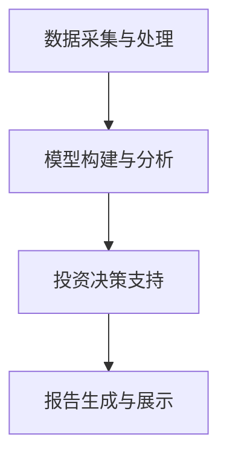

                 


# 约翰·伯格的长期投资回报预期管理

## 关键词：
- 长期投资
- 投资回报预期
- 风险管理
- 数学模型
- 系统架构
- 投资策略

## 摘要：
本文深入探讨了长期投资回报预期管理的核心概念、算法原理、系统架构及实际应用。通过分析投资回报的数学模型、动态调整方法以及系统设计，为读者提供了一个全面的视角来理解长期投资的策略和管理方法。本文结合实际案例，详细讲解了如何在长期投资中实现回报预期的有效管理，并提出了最佳实践建议。

---

# 第一部分: 长期投资回报预期管理概述

## 第1章: 长期投资的基本概念

### 1.1 投资的基本概念
- 1.1.1 投资的定义与特点
  - 投资是将资金投入某一资产或项目以期获得未来收益的行为。
  - 长期投资具有时间跨度长、目标明确、风险与收益并存的特点。
- 1.1.2 长期投资的内涵与外延
  - 长期投资不仅包括金融资产，还包括实物资产。
  - 长期投资的外延涉及个人投资、机构投资、国家投资等多个层面。
- 1.1.3 投资与投机的区别
  - 投资注重长期价值，而投机注重短期价格波动。
  - 长期投资更注重资产的内在价值和成长性。

### 1.2 长期投资的重要性
- 1.2.1 长期投资在个人财务中的作用
  - 通过长期投资实现财富的保值和增值。
  - 降低短期波动对个人财务的影响。
- 1.2.2 长期投资在机构投资中的地位
  - 机构投资者依赖长期投资实现资产的稳定增长。
  - 长期投资是机构投资者规避短期市场波动的重要手段。
- 1.2.3 长期投资与经济周期的关系
  - 长期投资能够熨平经济周期的波动。
  - 在经济衰退期进行长期投资有助于抓住复苏机会。

### 1.3 长期投资回报的特征
- 1.3.1 长期投资回报的时间特性
  - 长期投资需要耐心等待资产增值。
  - 时间越长，复利效应越显著。
- 1.3.2 长期投资回报的波动性
  - 长期投资的回报波动相对较小。
  - 但仍然需要关注市场的周期性波动。
- 1.3.3 长期投资回报的复利效应
  - 复利效应是长期投资回报的重要驱动力。
  - 通过持续投资和再投资放大收益。

---

## 第2章: 投资回报预期管理的核心概念

### 2.1 投资回报预期的定义
- 2.1.1 投资回报预期的构成要素
  - 包括市场预期、资产配置、风险偏好等因素。
  - 预期回报是基于对市场和资产的综合判断。
- 2.1.2 长期投资回报预期的分类
  - 按时间跨度分为短期、中期和长期预期。
  - 按资产类型分为股票、债券、房地产等的预期回报。
- 2.1.3 投资回报预期的形成机制
  - 基于历史数据和市场趋势的分析。
  - 结合宏观经济指标和行业分析。

### 2.2 长期投资回报预期管理的原理
- 2.2.1 长期投资回报预期管理的目标
  - 实现投资回报的最大化。
  - 控制投资风险，确保回报的稳定性。
- 2.2.2 投资回报预期管理的流程
  - 确定投资目标和期限。
  - 进行市场分析和资产配置。
  - 定期评估和调整投资组合。
- 2.2.3 投资回报预期管理的工具与方法
  - 使用财务模型和数据分析工具。
  - 通过情景分析和压力测试评估风险。

### 2.3 长期投资回报预期管理的特点
- 2.3.1 长期性与不确定性
  - 长期投资的时间跨度长，市场环境可能发生变化。
  - 需要应对市场不确定性和不可抗力因素。
- 2.3.2 风险与收益的平衡
  - 长期投资需要在风险和收益之间找到平衡点。
  - 通过分散投资降低风险。
- 2.3.3 投资组合的优化
  - 根据市场变化调整资产配置。
  - 通过动态优化提升投资回报。

---

## 第3章: 长期投资回报预期管理的数学模型

### 3.1 投资回报预期的数学表达
- 3.1.1 投资回报的期望值公式
  $$ E[r] = \sum_{i=1}^{n} p_i r_i $$
  - $E[r]$ 表示预期回报率。
  - $p_i$ 表示第 $i$ 种情况发生的概率。
  - $r_i$ 表示第 $i$ 种情况下的回报率。
- 3.1.2 投资回报的方差与标准差公式
  $$ \sigma^2 = \sum_{i=1}^{n} p_i (r_i - E[r])^2 $$
  $$ \sigma = \sqrt{\sigma^2} $$
  - $\sigma^2$ 表示回报率的方差。
  - $\sigma$ 表示回报率的标准差，反映回报率的波动性。
- 3.1.3 投资回报的夏普比率公式
  $$ Sharpe Ratio = \frac{E[r - r_f]}{\sigma} $$
  - $E[r - r_f]$ 表示投资回报率超过无风险利率的期望值。
  - $\sigma$ 表示超额回报的波动性。
  - 夏普比率衡量单位风险下的超额回报。

### 3.2 长期投资回报预期的模型构建
- 3.2.1 马科维茨投资组合理论
  - 理论基础：通过优化资产配置实现风险与收益的最佳平衡。
  - 优化目标：最大化预期回报，最小化投资风险。
- 3.2.2 CAPM模型在长期投资中的应用
  - CAPM模型用于估计资产的预期回报。
  - 通过市场风险溢价和贝塔系数计算资产的预期回报。
- 3.2.3 风险调整后的回报模型
  - 考虑不同资产的风险调整后的回报。
  - 通过风险调整后的回报进行资产配置。

### 3.3 投资回报预期的动态调整
- 3.3.1 时间序列分析模型
  - 使用ARIMA模型预测未来的回报趋势。
- 3.3.2 非参数回归模型
  - 通过核回归等方法进行非线性预测。
- 3.3.3 蒙特卡洛模拟在长期投资中的应用
  - 通过模拟不同的市场情景，评估投资回报的可能范围。

---

## 第4章: 长期投资回报预期管理的系统架构

### 4.1 系统架构概述
- 4.1.1 系统功能模块划分
  - 数据采集与处理模块：收集市场数据和投资者信息。
  - 模型构建与分析模块：构建数学模型，进行风险评估。
  - 投资决策支持模块：提供优化建议和动态调整方案。
  - 报告生成与展示模块：生成投资报告，展示分析结果。
- 4.1.2 系统架构设计图（Mermaid）



---

## 第5章: 长期投资回报预期管理的项目实战

### 5.1 项目背景与目标
- 分析一个长期投资案例，验证模型的有效性。
- 实现一个长期投资回报预期管理系统。

### 5.2 项目核心实现
- 5.2.1 环境安装
  - 安装Python、Pandas、NumPy等工具。
- 5.2.2 核心代码实现
  ```python
  import pandas as pd
  import numpy as np

  # 数据加载
  data = pd.read_csv('market_data.csv')
  # 计算预期回报
  expected_return = data.mean()
  # 计算方差和标准差
  variance = data.var()
  std_deviation = np.sqrt(variance)
  # 计算夏普比率
  risk_free_rate = 0.02
  excess_return = expected_return - risk_free_rate
  sharpe_ratio = excess_return / std_deviation
  print("预期回报:", expected_return)
  print("标准差:", std_deviation)
  print("夏普比率:", sharpe_ratio)
  ```

### 5.3 案例分析与解读
- 选取某长期投资组合，分析其历史回报和风险表现。
- 验证模型的预测能力。

### 5.4 项目小结
- 总结项目的实现过程和取得的成果。
- 提出改进建议和未来研究方向。

---

## 第6章: 长期投资回报预期管理的最佳实践

### 6.1 风险管理技巧
- 定期评估投资组合的风险。
- 通过分散投资降低风险。

### 6.2 投资组合优化策略
- 根据市场变化动态调整资产配置。
- 选择具有长期增长潜力的资产。

### 6.3 持续监控与调整
- 定期审视投资策略。
- 根据市场变化及时调整投资组合。

### 6.4 注意事项
- 避免过度依赖模型，保持理性判断。
- 保持对市场的敏感性和洞察力。

### 6.5 拓展阅读
- 推荐相关书籍和文献，供读者深入学习。

---

## 总结

长期投资回报预期管理是一项复杂但 rewarding 的任务。通过本文的系统介绍，读者可以全面理解长期投资的核心概念、数学模型和系统架构。实际案例的分析和项目实现过程，帮助读者将理论应用于实践。未来，随着技术的进步和市场的变化，长期投资回报预期管理将不断优化，为投资者提供更有效的工具和方法。

---

## 作者：AI天才研究院/AI Genius Institute & 禅与计算机程序设计艺术 /Zen And The Art of Computer Programming

